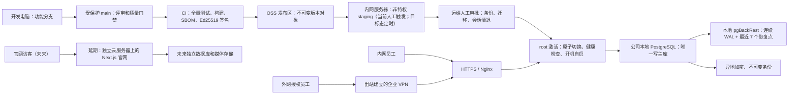

# Uten IMP 生产部署与日常运维手册

> **⚠️ 已归档（2026-09-01，ADR-060）**：现役操作手册是
> [`deploy/simple/RUNBOOK.zh-CN.md`](simple/RUNBOOK.zh-CN.md)。本手册描述的旧链仅作历史参考。

<!-- CURRENT-ERP-TEST-SERVER-SCOPE-20260814 -->
> **本轮执行范围（2026-08-14）**：当前目标主机只用于内部 ERP 测试环境，目标是 PostgreSQL、Spring Boot
> 后端和 Flutter ERP Web/Nginx。企业官网延期到独立云服务器。服务器中的当前数据为测试数据，但重建前
> 仍须先保存清单、回退证据并精确停服。架构决策采用系统 NVMe 的独立 350 GiB LVM/ext4；这不等于
> 已批准当前目标机执行。桌面级 SMR 机械盘退出 ERP 路径但不擦除。旧 resume unit 被受审 NVMe 恢复链替换前，
> 禁止计划重启、重跑 Phase 1 或部署 ERP。当前简明状态和顺序以
> [内部 ERP 测试服务器：当前状态与下一步](current-test-server-status.zh-CN.md)为准。
>
> 未来正式使用后的维护/自检窗口从每天 03:00（Asia/Shanghai）开始；这不表示每天自动重启。当前本地
> full backup 的真实 timer 是 02:17，repo2 03:17 模板与维护窗口冲突且尚未 commissioned，必须继续
> disabled 并在启用前重新排程。
>
> 03:00 只是允许开始维护的最早时间，不是强制打断点。02:17 full 若因 timer 延迟或数据增长仍未结束，
> 维护任务必须因无法取得数据库维护互斥锁而跳过/顺延，禁止 stop/kill pgBackRest。SMART、存储检查、
> backup/expire、apt/dpkg 更新和重启也不得并发。

> 文件命名约定：新增脚本和模板使用小写 ASCII kebab-case；`README.md`、BCP 47 语言标签（如 `zh-CN`）和已停用的中文兼容入口是明确例外。真实主机、账号、IP、审批号及密钥只记录在受控 CMDB/加密交接库或密码管理器中，不进入 Git。
>
> 本手册描述目标方案和操作门禁。源码、模板或本地测试通过，不代表目标服务器已经投产。
> 当前共享工作树含未提交/未跟踪并发改动，不能作为发布证据；只有受保护 tag、签名 manifest 和 CI 绑定的精确提交才定义可部署版本。
> 最近一次目标机事实仍是 2026-08-12 的未刷新只读快照。当前缺少 CMDB 身份、带外 SSH host key、
> 批准网络路径、已验证控制台和双管理员密钥；本文所有命令块均为接口形状，不是当前执行授权。完成新的
> 只读刷新、精确计划/风险/回退复核并取得人工确认前，不得执行目标机写入、enable/start、数据库、激活或 reboot。
>
> GitHub/人员签名/Release 签名的唯一配置入口是
> [GitHub authority 清单](release/GITHUB_SIGNING_AND_PROTECTION_SETUP.zh-CN.md)；目标 CMDB、Host Key、双管理员
> 密钥、VPN/VLAN、控制台和口令轮换的唯一入口是
> [目标服务器 OOB authority 清单](target-host-oob-authority.zh-CN.md)。其他章节只定义后续操作合同，不能替代
> 这两份 authority 的读回证据。
>
> 当前证据层：源码候选正在收口；受审提交/tag、CI 签名、OSS 不可变候选/readback、目标机安装/激活和
> HTTPS/UAT/故障/reboot 验收均未形成。目标机仍 NO-GO，任何前一层成功不得冒充后一层。

## 1. 推荐架构



三条数据流必须分开：

- 代码发布：仓库提供受保护的签名发布工作流；服务器的非特权 staging 当前由管理员人工触发，未来门禁验收后才可定时执行，且永远不会自动获得 root 权限。
- ERP 业务数据：所有内网和外网客户端通过同一套 API 写入同一个本地主库；不得用双数据库、共享文件夹或 OSS 目录自动合并业务数据。
- 企业官网：当前不部署；未来部署到独立云主机，使用独立 Linux 用户、域名、数据库、媒体目录、备份和发布链，不得与 ERP 共用进程、密钥或数据库。

## 2. 为什么不是“上传后立刻自动上线”

目标模式是“自动预下载，人工激活”：

1. 保留策略、磁盘配额和告警验收后，服务器才每 5 分钟读取签名候选版本；当前阶段仅允许管理员按需触发一次无特权 staging。
2. `uten-imp-updater` 无特权账号下载并验证签名、版本序列、文件清单和 Flyway 元数据，只写自己的 staging 目录。
3. 运维确认备份、迁移影响和当前会话后，执行一次显式激活命令。
4. root 激活器重新从不可信 staging 建立 root 私有快照并复验，才原子切换 `current`。
5. Phase 2/3 已独立证明并启用 PostgreSQL meta/instance 的开机恢复；健康检查通过后才开放入口，首次成功只事务化启用后端、Nginx 和 watchdog 的入口开机链。

普通重启不需要人工逐个启动：systemd 固定按 `/data`、PostgreSQL、ERP、readiness、Nginx 顺序恢复，
两个 watchdog timer 随 timers.target 恢复。Nginx 与 ERP 绑定；数据盘、数据库或 ERP 消失时入口关闭。
入口 watchdog 每次健康都必须同时证明静态制品标记和后端 readiness；连续 4 次 readiness 失败才在
operation lock/marker 门禁内停止 Nginx 并确认 inactive，不会重启 JVM。readiness 恢复后，只有相关 unit
仍 enabled 才按有界退避显式 start Nginx。entry oneshot 只保留 `After=nginx.service`，没有会把 Nginx
拉起的依赖，所以仅启动探针不会绕过管理员的 stop/disable 意图。
StartLimit 后仅允许 watchdog 在四类发布/恢复 marker 均不存在、operation lock 空闲、相关 unit 仍 enabled、
`/data` 与数据库门禁通过时自动 `reset-failed`，并按 2/5/15/30 分钟退避。维护窗口必须先 disable/stop
timer，不能仅 stop 服务后任其被 watchdog 拉回。

当前目标的 storage authority 固定为 schema v3 `lvm-linear-nvme`。storage observer unit 对该 authority
必须不含任何 md `DeviceAllow`；旧 schema v2 `/dev/md*` observer 只是历史兼容分支，不得作为这台主机的
正常启动合同。旧 md 仅保留未擦除字节作为短期回退证据，不能重新成为 ERP 数据、附件或唯一备份权威。

开机恢复不是“无条件把所有进程拉起来”。`postgresql@16-main` 在 postmaster 写入任何字节前，必须证明
`/data` 的稳定 LVM mapper 路径、LV/VG/PV/NVMe 身份、文件系统 UUID/type、
`rw,nodev,nosuid,noexec`、容量/inode 余量以及
`pg_conftool 16 main` 的有效 `data_directory=/data/postgresql/16/main` 全部匹配已批准权威文件；ERP
随后还会复验签名 release、`current`/`active.json`/runtime authority、同一 systemd postmaster、
`127.0.0.1:5432` listener PID、数据库 system identifier/timeline 和逐行 Flyway 历史。任一项无法证明时
PostgreSQL/ERP/Nginx 保持关闭并告警，而不是退回根分区、旧库或旧 JAR。首次成功激活后，PostgreSQL、
ERP、Nginx 和两个 watchdog timer 才作为正常开机链自动恢复；migration oneshot、失败证据处置和
未完成生产验收的 updater/retention timer 不得自动执行。

目标态不需要每次手工传 JAR 或网页文件，同时避免一个被盗的 OSS 拉取账号直接控制服务器。仓库已经提供签名发布工作流，但 GitHub 保护规则、环境审批、OIDC、OSS 权限和签名环境逐项验收前，不得声称远端 CI 已可发布。服务器端当前仍是“人工 stage + 人工 activate”，不会每 5 分钟自动拉取。涉及数据库迁移的版本不承诺自动代码回滚；若迁移后健康失败，入口保持关闭，交给受控数据库恢复或前向修复。

## 3. 一次性上线前置条件

以下任一项缺失，状态都是 **NO-GO**：

- 已立即轮换曾在非密码管理器渠道出现过的服务器口令；至少两把独立 SSH 密钥和物理控制台均已实测，之后才执行 `phase1b-ssh-key-only.sh` 关闭 SSH 密码登录。
- 当前测试主机的 schema v3 `lvm-linear-nvme` authority 已精确绑定 LV/VG/PV/NVMe 和 ext4 UUID；
  `/data` 是真实挂载，不是根分区普通目录；旧 md 只保留为未擦除回退证据，不是启动 authority。
- 最终 GitHub owner/repository/plan 已冻结；`main` 要求非作者评审、当前质量检查和签名提交，发布 `v*` tag
  禁止更新/删除/强推；`production-release-publisher` 与 `production-release-bootstrap` Environment 在私有
  仓库上确实提供 required reviewer、禁止自批、no-bypass 并只允许 `v*` tag。当前签名 annotated tag 精确
  指向 `origin/main`，GitHub 显示 `Verified`，第二审核人已保存 `git verify-tag` 结果。
- 独立 Ed25519 发布签名私钥只在受保护 CI/离线签名机；服务器仅保存公钥及核对过的 SHA256 指纹。
- CI 发布身份不能覆盖不可变版本对象；服务器拉取身份只有 `GetObject`，没有写、删、改 ACL 或策略权限。
- updater 的 `oss2` 及全部传递依赖来自 CI 生成、带 SHA-256 lock 和 SBOM 的 root-owned 离线 wheelhouse；禁止 root 在生产机在线执行 `pip install`。
- 内网 ERP 已有固定 DNS 名称、受终端信任的 TLS 证书和准确的办公网/VPN CIDR；不以明文 HTTP 投产。
- 应用附件 OSS 使用两个私有、不同的 Bucket 和 HTTPS Endpoint：upload-only staging 的 Versioning=Off，server-only final 的 Versioning=Enabled；最小权限独立身份、旧附件迁移和对象对账均已验收。
- 未来生产权威数据库的来源、签名 Flyway inventory 和业务所有者已确认；内部测试空库不得冒充另一台
  机器上的权威数据库。
- 未来权威来源到最终签名目标的隔离迁移、财务/库存/附件对账、多岗位 UAT 已通过；这不是本轮内部
  测试空库 onboarding 的前置完成声明。

- **当前测试主机是独立分支**：上面两项属于未来正式数据接管。本轮先由受审 existing-host NVMe
  commissioner 建立固定 350 GiB 新 `/data` 并保留旧 md；再由独立数据库 commissioner 从空 PGDATA
  初始化到同一签名候选声明的完整 Flyway 目标。两个事务都必须消费精确 plan SHA、typed confirmation、root-only receipt，
  不得手工 `dropdb`、删除旧 PGDATA、复制运行中 PGDATA 或重跑 fresh-only Phase 2。测试库只产生
  “内部测试”候选，不能替代未来实际权威来源迁移、对账和生产签字。
- 本地备份、异地加密备份、签名迁移清单、恢复用密钥托管和隔离 PITR 恢复演练均有证据。
- 监控能告警 NVMe/LVM/挂载、磁盘、备份、PostgreSQL、后端、Nginx、watchdog、证书到期和外部可用性。

## 4. 首次安装顺序（通用新主机；当前 existing-host 不适用）

本节 1–9 只描述未来通用新主机合同，**不得用于当前 existing-host**；当前主机必须直接进入 4.1，并在
当前暂停线解除前保持零写入。所有命令都只能从经过审查的同一版本部署包执行。先在管理机核对精确 Git
提交与签名，再把部署包复制成服务器上的 root-owned、全链不可由普通用户写入的快照；root 不得直接执行
普通用户家目录、`/tmp`、聊天、临时网盘或远程发布制品中的脚本。

1. 只读确认硬件、挂载、服务和数据库身份。
2. 在现有防火墙变更单、精确办公网/VPN CIDR、当前 SSH 来源和物理控制台都确认后，运行 `phase1-hardening.sh --help`。脚本必须带两个 CIDR及精确确认短语；它拒绝合并或重置已有 UFW 规则，并会先确认当前 SSH 来源不会被锁在外面。之后以两把独立密钥验收 `phase1b-ssh-key-only.sh`。
3. 只有已经证明“没有任何既有 PostgreSQL cluster、没有权威数据”的全新主机才可执行 `phase2-postgres.sh`；当前服务器已有 cluster，禁止执行它。

> 当前测试主机不走下面的生产权威数据接管路径：先按
> [`setup/EXISTING_TEST_HOST_NVME_COMMISSIONING.zh-CN.md`](setup/EXISTING_TEST_HOST_NVME_COMMISSIONING.zh-CN.md)
> 完成 storage-only 事务，再消费其 `COMMITTED_STORAGE_ONLY` receipt 执行独立干净数据库/内部测试应用
> commissioning。任何工具未评审或 receipt 不完整时停在入口关闭状态，不手工删库或复制旧 PGDATA。

4. 从独立受控渠道取得发布公钥指纹和已审查 `release_guard.py` 的 SHA-256，然后运行 `bootstrap-release-verifier.sh --help`。它只在稳定、独立于 updater 的 `/usr/local/libexec/uten-imp-release` 与 `/etc/uten-imp-release-trust` 安装一份 root-owned 验签器和一把 Ed25519 公钥；不会触碰旧 updater/current/Nginx，也不会安装下载器、凭证、定时器、应用或开机自启。不得用待验证部署包自己打印出来的散列充当独立核验值。
<!-- AUTHORITATIVE-PRODUCTION-MIGRATION-NO-GO -->
5. `harden-existing-postgres-roles.sh` 只接受已经精确处于同一受信签名 head/inventory、且逐条
   `version/script/checksum` 一致的权威数据库。未来正式数据切换必须另有独立恢复、迁移、全量对账、PITR、
   UAT 和切换 Runbook；内部测试空库不得用 hardener 或 Phase 3 伪装成生产权威库。首次 internal-test
   activation 只消费 existing-host commissioner 的精确目标 onboarding，不补迁移任意现存数据库。
6. 使用 `sudoedit` 合并 `server.env.oss-migration.example`。不得覆盖现有 JWT、PGP、HMAC、数据库或引导账号秘密。
7. `phase3-runtime.sh` 只安装运行时和 systemd 模板；它不会启动应用。
8. 准备并验证内网域名、TLS 证书/私钥、批准 CIDR、发布公钥和只读 OSS 拉取身份；不要提前手改 live Nginx。运行 `phase4-updater-nginx.sh --help` 后，由 Phase 4 受控渲染、备份、执行 `nginx -t` 并替换旧入口。它会逐字节复核第 4 步的稳定 guard 和同一公钥，再为非特权 updater 安装独立只读副本；当前版本只安装，始终拒绝启用 staging timer。
9. 完成权威库迁移、对账、隔离恢复和 UAT 后，再按第 6 节激活首版。

当前 Phase 4 会对 `--enable-staging` 保持 fail-closed。仓库虽已提供 root-controlled 保留、真实 project quota 核验和外部告警 receipt 合同，但它们尚未在目标机完成挂载、配额、告警送达和掉电验收；不得手工绕过该门禁去 enable timer。

### 4.0A 发布保留、配额与告警（源码已闭环，生产仍 NO-GO）

<!-- RELEASE-RETENTION-TIMERS-MUST-REMAIN-DISABLED -->
`deploy/setup/install-release-retention.sh` 是独立的 root 安装器，只安装固定路径 helper、policy 示例和 systemd 模板，并在结束时再次停用、核对 `uten-imp-retention.timer` 与 `uten-imp-updater.timer`。它不会分配 project ID、不会设置 quota、不会创建 live `policy.json`、不会安装告警发送器，也没有 enable 路径。安装器要求 Phase 4 的 root-owned updater 已存在、共享 operation lock 精确安全且 updater/retention service 静止；因此不能用它替代真实服务器的只读核验与变更审批。

先只读取得并保存下列证据，不要从示例猜测 project ID 或 hard limit：

```bash
findmnt --json --bytes --output SOURCE,TARGET,FSTYPE,OPTIONS --target /var/lib/uten-imp-updater
findmnt --json --bytes --output SOURCE,TARGET,FSTYPE,OPTIONS --target /opt/uten-imp/releases
stat -c '%d %U:%G %a %n' /var/lib/uten-imp-updater /var/lib/uten-imp-release/retention-quarantine/staging
stat -c '%d %U:%G %a %n' /opt/uten-imp/releases /opt/uten-imp/.retention-quarantine
systemctl is-enabled uten-imp-updater.timer uten-imp-retention.timer
systemctl is-active uten-imp-updater.service uten-imp-retention.service
```

由运维根据真实挂载容量、发布包增长和回退窗口形成 project quota 变更单，分别为 staging 与 installed tree 使用不同的 project ID；目录必须有 `PROJINHERIT`，hard byte limit 必须与最终 root-only `/etc/uten-imp-release-retention/policy.json` 完全一致。配置前说明准确目标、备份/控制台证据、风险和回退；配置后再执行只读审计：

```bash
sudo /usr/local/sbin/uten-imp-retention audit
sudo systemctl is-enabled uten-imp-updater.timer uten-imp-retention.timer
```

审计使用固定 policy、固定 operation lock、`findmnt`、`FS_IOC_FSGETXATTR` 和 `quotactl`，并把容量、quota、签名 inventory、保护集、拟删除集和 plan SHA 写入 root-only JSON receipt。它会保护 `current`、`active.json`、high-water、pending、全部已知 transaction/recovery 引用、最近至少三个已验证 candidate/installed 以及一个已验证 predecessor。未知/损坏 JSON、签名失败、symlink、hard link、特殊文件、owner/mode/project ID 错误、跨设备 quarantine、任一运行中 updater 进程或 transaction/recovery marker 都不会被删除，并产生 NO-GO/告警。

`prune` 是实际删除操作，只能在维护变更已批准、同一份 audit plan 已复核后人工执行；当前不得交给 timer：

```bash
sudo /usr/local/sbin/uten-imp-retention prune
```

删除前会重新做 fd/no-follow 核验，然后先把同一 inode 原子移动到同设备 root-only quarantine，按“目标父目录、源父目录”顺序 fsync，之后才用 fd-relative unlink/rmdir 清理。中断时会保留 in-progress marker、quarantine 和失败 receipt，禁止管理员用 `rm`、`find -delete` 或手工删除 marker“解锁”。必须先按证据判断并补专用恢复流程。

`OnFailure` 调用固定 root-owned `/usr/local/libexec/uten-imp-retention/alert-sink --event-file ... --receipt-file ...`。发送器返回 0 仍不算送达；receipt 必须精确包含 `schemaVersion=1`、同一 `alertId`、`accepted=true`、UTC `deliveredAtUtc` 和 provider `providerMessageId`。pending spool 有固定数量/字节上限，异常 receipt work 会保留并 fail closed。只有真实接收端收到测试告警、receipt 回绑通过且重启后 pending 能继续送达，才可登记告警验收。

源码测试不证明真实 `findmnt`/quota、容量压力、清理时长、外部告警或 VM 断电恢复。上述证据和恢复演练全部完成前，两个 timer 必须保持 disabled，本节仍为生产 **NO-GO**。

### 4.0 SSH 与 UFW 的两阶段切换

这一步只能在以下条件同时满足时执行：泄露过的旧口令已通过私密渠道轮换；两把公钥分别由两名管理员或两个独立设备保管；SSH host key、两把公钥指纹、办公网和 VPN CIDR 已通过带外渠道复核；物理或带外控制台已经实际登录成功并保持打开。脚本只支持 Ubuntu 24.04 的受审 direct `ssh.service` 模式，并要求 SSH 精确监听 TCP/22；若当前使用默认或遗留的 `ssh.socket` 激活、存在 systemd drop-in/非空 `SSHD_OPTS`、端口不是 22、已经有未受管 UFW 规则，或任一值无法证明，立即停止并另开“socket → direct service / 防火墙”迁移变更。当前脚本不会自动改监听模型，也不能临时删门禁绕过。远程执行必须来自未经 `tmux`/`screen`/嵌套 shell 脱离的直接 SSH 会话，并用 `sudo --preserve-env=SSH_CONNECTION` 保留内核连接四元组；物理控制台执行时该变量必须为空。

先安装主机与防火墙基线。下面的 CIDR 都是占位符，必须替换为审批单中的精确 RFC1918/ULA 网段：

```bash
sudo --preserve-env=SSH_CONNECTION bash deploy/setup/phase1-hardening.sh \
  --office-cidr __EXACT_OFFICE_CIDR__ \
  --vpn-cidr 10.20.0.0/24 \
  --confirm-firewall 'ENABLE UFW FOR UTEN IMP' \
  --confirm-physical-console 'TESTED PHYSICAL OR EMERGENCY CONSOLE FOR FIREWALL'
```

在服务器控制台创建一个 root-owned 审批文件；它只能有两行，每行是一把普通 Ed25519 或 FIDO Ed25519 公钥，不允许 key option、空行、注释或第三把密钥。公钥不是密码，但完整 keyset 仍必须保持只读并核对来源：

```bash
sudo install -d -m 0700 -o root -g root /root/trusted-ssh
sudoedit /root/trusted-ssh/admin-authorized-keys
sudo chown root:root /root/trusted-ssh/admin-authorized-keys
sudo chmod 0600 /root/trusted-ssh/admin-authorized-keys
sudo ssh-keygen -lf /root/trusted-ssh/admin-authorized-keys -E sha256
sudo sha256sum /root/trusted-ssh/admin-authorized-keys
```

第一阶段只安装精确 keyset，不关闭密码认证。两个指纹必须分别来自独立受控渠道，不能只相信服务器刚打印的结果：

```bash
sudo --preserve-env=SSH_CONNECTION bash deploy/setup/phase1b-ssh-key-only.sh \
  --stage-keys \
  --admin-user ADMIN \
  --approved-keys /root/trusted-ssh/admin-authorized-keys \
  --expected-key-fingerprint 'SHA256:KEY_A_OUT_OF_BAND' \
  --expected-key-fingerprint 'SHA256:KEY_B_OUT_OF_BAND' \
  --office-cidr __EXACT_OFFICE_CIDR__ \
  --vpn-cidr 10.20.0.0/24 \
  --confirm-password-rotated 'ROTATED DISCLOSED SERVER PASSWORD OUT OF BAND' \
  --confirm-physical-console 'TESTED PHYSICAL OR EMERGENCY CONSOLE'
```

保持原维护会话和控制台不关闭，分别使用 Key A 与 Key B 打开两个全新 SSH 会话；每次都核对服务器 host key，运行只读命令确认账号和 sudo，再退出。只有两把密钥都独立成功后，才用前一步经第二人复核的 keyset SHA-256 提交 key-only：

```bash
sudo --preserve-env=SSH_CONNECTION bash deploy/setup/phase1b-ssh-key-only.sh \
  --commit-key-only \
  --admin-user ADMIN \
  --approved-keys /root/trusted-ssh/admin-authorized-keys \
  --expected-keyset-sha256 REVIEWED_64_LOWERCASE_HEX_DIGEST \
  --office-cidr __EXACT_OFFICE_CIDR__ \
  --vpn-cidr 10.20.0.0/24 \
  --confirm-password-rotated 'ROTATED DISCLOSED SERVER PASSWORD OUT OF BAND' \
  --confirm-physical-console 'TESTED PHYSICAL OR EMERGENCY CONSOLE' \
  --confirm-two-keys-tested 'TESTED BOTH APPROVED SSH KEYS'
```

提交后仍先保留控制台和维护会话：再次用两把密钥新建会话，确认无密钥/密码/keyboard-interactive 登录均被拒绝，检查 `sshd -T`、`journalctl -u ssh`、`last -ai` 与当前会话，最后按审批清退切换前的旧 SSH 会话。脚本若报告回滚、未知配置或持久中断标记，停止并保留控制台；不得手工删除状态文件。

普通用户只能作为上传落点；随后必须由管理员核对散列/签名并复制到新的 root-owned、不可组/全局写目录，再从该快照执行。不要把密码写在命令参数、shell history、日志或文档中。

验签引导的命令形状如下；占位值必须来自两条独立的受控渠道，且命令应从 root-owned 部署快照执行：

```bash
sudo bash deploy/setup/bootstrap-release-verifier.sh \
  --release-public-key /root/trusted-release/release-signing-key.pub \
  --expected-signing-fingerprint 'SHA256:REVIEWED_OUT_OF_BAND_VALUE' \
  --expected-guard-sha256 'REVIEWED_64_LOWERCASE_HEX_DIGEST' \
  --confirm 'INSTALL UTEN RELEASE VERIFIER'
```

### 4.1 当前这台已有旧部署的服务器

这台服务器不是空白主机，但当前没有已验证的实时身份或执行授权。不得从本节或历史 Phase 文档复制命令；
先按[目标服务器 OOB authority 清单](target-host-oob-authority.zh-CN.md)取得 H01–H12：当前 CMDB
环境/资产/IP/FQDN/端口/账号/时间/负责人、从物理/BMC 控制台取得的 SSH Host Key 完整公钥和指纹及轮换
记录、批准 VPN/VLAN/源路由、两把独立管理员公钥、已泄露口令轮换和可用物理/带外控制台。项目专用
`known_hosts` 必须由带外完整公钥预制并使用 `StrictHostKeyChecking=yes`；`ssh-keyscan`、历史 `known_hosts`
和首次连接提示都不能建立信任。随后只做只读刷新并向操作员展示精确计划、风险和回退；未确认前保持零写入。

当前目标机的唯一允许顺序是：

1. **刷新事实，不采用旧快照。** 只读核对 boot ID、时间、LVM/NVMe、旧 md、fstab、监听、PostgreSQL、
   systemd unit/timer/effective properties、旧 Phase evidence、备份和证据目录。任何身份、路由、host key 或
   权限无法带外证明时停止，不尝试连接或猜命令。
2. **先退役旧重启入口。** 旧 `uten-imp-phase1-resume.service` 仍可能在 reboot 时调用旧 helper。它必须由
   已审 NVMe commissioner 在任何存储/服务写入和任何计划 reboot 之前证据化 disable，并证明 live unit/link
   不再可触发；保留原 unit 与 receipts。不得重跑 Phase 1、手工删 unit/marker 或用 reboot 测试猜测结果。
3. **只走 existing-host NVMe 事务。** 以
   [NVMe commissioning 手册](setup/EXISTING_TEST_HOST_NVME_COMMISSIONING.zh-CN.md)的 assess/plan/approval/
   receipt 合同创建 schema v3 `lvm-linear-nvme` authority。旧 md 不 wipe、不 stop，但也不再是 ERP boot
   authority。不得运行 fresh-only `phase2-postgres.sh`，不得用旧 Phase 3 的 `/dev/md*` maintenance
   commissioning，也不得直接执行旧 Phase 4 替换链。
4. **只走受审 internal-test onboarding。** storage terminal 后按
   [existing-host onboarding 手册](setup/EXISTING_TEST_HOST_INTERNAL_TEST_ONBOARDING.zh-CN.md)完成 reviewed host
   preparation、无特权 stage/inspect、PID-1 DB commissioner、一次性本机 full/WAL/check、首次
   `--first-release --enable-on-boot` activation 和 recovery finalizing。过期 onboarding 只能走固定
   `reauthorize-activation`，不重建数据库、不手改 JSON。
5. **每层单独验收。** 源码、提交/tag、CI 签名、OSS readback、目标安装、首次激活和 HTTPS/UAT/故障/
   reboot 必须分别留证。任一 terminal receipt、签名 inventory、live identity、锁/marker 或入口关闭状态不能
   唯一解释时停止；不得用手工 `cp`、`rm`、`systemctl start`、`flyway repair` 或散装 JAR 补救。

## 5. 日常发版

### 5.1 开发电脑

先在功能分支完成测试并通过 PR 合并到受保护 `main`。只从最新远端主分支创建一个从未使用过的新版本号：

```bash
git fetch --prune origin
git switch main
git pull --ff-only origin main
git status --short
git rev-parse HEAD
git rev-parse origin/main
git tag -s vYYYY.MM.DD-N -m "Uten IMP vYYYY.MM.DD-N" "$(git rev-parse origin/main)"
git verify-tag vYYYY.MM.DD-N
git push origin vYYYY.MM.DD-N
```

`git status --short` 必须为空，两个提交 ID 必须一致；签名 key 必须是已登记的人员 Git signing key，不能是
Release 制品签名 key 或服务器登录 key。GitHub tag 页面必须显示 `Verified`，第二审核人保存
`git verify-tag` 输出。当前工作流尚未独立验证 tag-object signature，人工证据在 CI 补齐该门禁前不可省略。
不要从功能分支打 tag，不要创建 lightweight/unsigned annotated tag，不要移动或复用已发布 tag。CI 必须完整
通过后才会签名并更新候选指针；失败时修复源码并使用新版本号。

### 5.2 第一个 OSS 候选指针（只做一次）

空发布 Bucket 没有 `LATEST.txt` 时，普通 tag 发布会按设计 fail-closed。先确认该 tag 已受保护且精确指向当前 `origin/main`，再从具有 `production-release-publisher` 和一次性 `production-release-bootstrap` 审批权限的管理机触发一次初始化工作流：

```bash
VERSION=vYYYY.MM.DD-N
gh workflow run release.yml --ref "$VERSION" \
  -f confirm_initial_bootstrap=CREATE_INITIAL_CANDIDATE_POINTER
```

Windows PowerShell 管理机使用等价写法，不要照抄 Bash 变量语法：

```powershell
$Version = 'vYYYY.MM.DD-N'
gh workflow run release.yml --ref $Version `
  -f confirm_initial_bootstrap=CREATE_INITIAL_CANDIDATE_POINTER
```

在 GitHub Actions 中必须看到 `bootstrap-initial-candidate` 的环境审批、签名复验、create-only 上传和上传后 readback 全部成功。该 job 不允许覆盖任何已有对象；若发生部分上传或失败，保留证据、调查原因并发布一个新的版本号，禁止删除/覆盖对象来重试。首指针成功后，后续版本才使用普通受保护 tag 流程。

### 5.3 服务器 staging

当前自动定时 staging 仍因保留策略、磁盘配额和告警未验收而保持 disabled；先按需人工启动一次无特权 oneshot。它只下载和验签，不激活版本：

```bash
sudo systemctl status uten-imp-updater.timer --no-pager
sudo systemctl start uten-imp-updater.service
sudo journalctl -u uten-imp-updater.service --since today --no-pager
```

日志只应显示版本、提交、验签和 staging 结果，不应显示 AK、SK、token 或业务数据。

用非特权身份复验并读取激活所需的精确值：

```bash
sudo -u uten-imp-updater /opt/uten-imp/updater/venv/bin/python \
  /opt/uten-imp/updater/release_updater.py inspect vYYYY.MM.DD-N
```

## 6. 人工激活

当前源码候选同时支持 existing-host internal-test 的首次精确目标激活，以及已有签名安装的数据库
不变 code-only 更新；两者都必须使用同一已验签 `inspect` 输出，且当前目标机前置身份/网络/控制台/签名
候选尚未齐备，因此下面仍只是接口形状。

首次激活前必须同时存在：DB commissioner 的 terminal onboarding、与其同一 candidate/runtime/storage/live
DB identity 的未过期一次性 first-backup full/WAL/check receipt、入口关闭、无冲突 marker/lock，以及已批准
会话清退。onboarding 过期时只允许固定 commissioner 的 `reauthorize-activation` 短时再授权；它不改库、
不安装 release、不启服务，也不能跳过 first-backup gate。核对后首次激活要求显式：

```bash
sudo /usr/local/sbin/uten-imp-activate vYYYY.MM.DD-N \
  --confirm-version vYYYY.MM.DD-N \
  --confirm-flyway SIGNED_HEAD \
  --confirm-flyway-digest SIGNED_MIGRATION_SET_SHA256 \
  --confirm-session-clearance \
  --first-release \
  --enable-on-boot
```

该路径先以固定 peer/socket/systemd/listener verifier 证明 live `uten_imp` 已精确匹配签名 candidate 的完整
Flyway inventory，再消费 onboarding 与 first-backup authority；它固定 `databaseChanged=false`，不启动
migration unit。不得加入 `--approve-database-change`，不得直跑 migration-only JAR、手改 JSON/`current`
或用 `flyway repair` 补救。中断后只走 evidence-bound recovery/adoption，不直接重跑普通 activate。

已有签名 `current` 的后续 code-only 更新，还必须证明 `active.json`、runtime authority、已归档 first-backup
binding、live DB identity 和完整 Flyway history 与当前签名版本一致，且目标 head/inventory 完全不变；确认命令
不带 `--first-release` 或 `--enable-on-boot`。任何数据库目标变化仍为 hard NO-GO，直到另有受审的
signed-current from-to acceptance producer、当次备份、维护窗复验、恢复和 UAT 证据；
`--approve-database-change` 本身不能授权迁移。

若只读刷新发现 unsigned legacy `current`，先保全现场。只有显式、一次性的 legacy retirement 合同在其
preimage、quiescence、onboarding、first-backup、no-rollback confirmation 和受审 plan 全部通过时才可使用；
不存在“accept legacy”旁路，不得手工删链或伪造 retirement evidence。

激活后验证；下面的 `VERSION` 必须是刚才已签名并激活的精确版本：

```bash
VERSION=vYYYY.MM.DD-N
sudo systemctl is-enabled uten-imp nginx uten-imp-watchdog.timer uten-imp-entry-watchdog.timer
sudo systemctl is-active uten-imp nginx uten-imp-watchdog.timer uten-imp-entry-watchdog.timer
sudo systemctl show uten-imp -p After -p BindsTo -p PartOf \
  -p RestartSteps -p RestartMaxDelayUSec -p StartLimitIntervalUSec -p StartLimitBurst
sudo systemctl show nginx -p After -p BindsTo -p PartOf \
  -p RestartSteps -p RestartMaxDelayUSec -p StartLimitIntervalUSec -p StartLimitBurst

for endpoint in health health/liveness health/readiness; do
  curl --fail --silent "http://127.0.0.1:8080/actuator/$endpoint" \
    | jq -e '.status == "UP"' >/dev/null
done

curl --fail --silent http://127.0.0.1:8081/index.html \
  | grep -F "content=\"$VERSION\"" >/dev/null
curl --fail --silent http://127.0.0.1:8081/version.json \
  | jq -e --arg version "$VERSION" '.version == $version' >/dev/null

test "$(systemctl is-enabled uten-imp-updater.timer)" = disabled
test "$(systemctl is-active uten-imp-migrate.service)" = inactive
sudo systemctl show uten-imp-migrate.service \
  -p Result -p ExecMainStatus -p ActiveState -p SubState
sudo journalctl -u uten-imp-migrate -u uten-imp -u nginx \
  --since "10 minutes ago" --no-pager
```

首次 exact-target 和后续数据库不变 code-only 路径都不得启动迁移器；应证明 unit 保持 inactive、没有
为本次事务生成或消费 migration authorization，也没有新增 migration evidence。只有未来受审 from-to 路径
实际执行 migration unit 时，其终态才必须是 `Result=success`、`ExecMainStatus=0`、`ActiveState=inactive`、
`SubState=dead`。禁止管理员直接执行 `systemctl start uten-imp-migrate.service`：迁移 unit 在 Java 前必须原子消费由同一
`release_updater` 激活事务签发的 120 秒一次性 root 授权。授权同时绑定 boot ID、wall clock、
`CLOCK_BOOTTIME`、activation marker 原字节 SHA、签名 current/manifest/Flyway 摘要、updater PID 与
`/proc` starttime，并证明该 PID 仍持有 operation lock；任一不符都不会启动 Flyway。消费原字节和
systemd 终态会先写入 `/var/lib/uten-imp-release/migration-evidence`，随后才清理 `/run` 副本。若进程被
SIGKILL，或终态证据落盘/清理失败，updater 会保留原 activation marker、关闭并禁用运行入口；使用
`recover interrupted-assess` / `interrupted-apply` 归档证据，禁止手删授权或 marker。
还必须通过真实 HTTPS 域名验证受信证书、错误 Host/SNI 拒绝、`version.json`、登录、权限、查询和一条
<!-- UPDATER-TIMER-MUST-REMAIN-DISABLED -->
受控业务流程；回环健康 200 不能替代业务验收。自动 staging 未验收前，updater timer 任何非 disabled
状态都按故障处理。

## 7. 外网员工上传和数据刷新

服务器位于 CGNAT 后时，不在路由器上直接暴露 SSH、PostgreSQL 或 8080。推荐由公司服务器主动建立到云端网关的企业 VPN，并让授权员工通过 MFA/设备策略进入 VPN 后访问 ERP HTTPS 域名。

- 商品 Excel：客户端调用精确的 `detect`/`commit` API；网关和应用双重限制 10 MiB，并限制 OOXML 展开量、活动内容、行列数、并发和速率，提交时仍在事务内重验。
- 附件：目标方案由后端签发短时、精确大小的 staging POST policy，在本地主库预留配额，扫描后由服务端提升到 final 并固定版本。staging=Off 且禁止覆盖，final=Enabled，两个 Bucket 必须不同；确认成功后 staging 至少保留到 policy 过期，阻断重放窗口。但真实 ClamAV、RAM/CORS、容量、压测、告警、恢复和孤儿清理任一未闭环时，附件生产上传仍保持 **NO-GO**。
- 普通业务数据：上传或保存成功即已提交到唯一主库。其他终端下一次查询或刷新页面会读取新数据；不需要、也不允许在两台数据库之间“实时合并”。
- Web 代码更新：已打开页面只显示“先保存再刷新”的新版本提示，不强制自动刷新，避免丢失正在编辑的表单。
- 断网：公司内网继续使用本地主库；外网写请求失败并明确重试，不在云端缓存后双写。

VPN、云网关、MFA、证书、外部压测以及上述附件安全链未完成前，外网业务访问/附件上传仍是 NO-GO。

## 8. 备份与恢复

目标策略：

- PostgreSQL 连续归档 WAL；安装模板在每天 `02:17` 运行 full backup，timer 为 `Persistent=true`，
  pgBackRest 按成功 full 链保留最近 7 个恢复点并在新备份成功后执行 expire。只有目标机 timer、日志和
  恢复证据都通过时才可把这句话登记为“已运行”。
- 本地数据库和本地 repo1 同在 `/data`，只能应对部分逻辑故障，不能应对 NVMe/主机、勒索或机房故障。
- 至少再有一份不同账号和故障域的加密、版本化或不可变副本；恢复密钥独立密封托管。
- OSS final 附件必须版本化；unversioned staging 与 versioned final 都必须有清单、孤儿对象对账和独立恢复/清理权限。数据库备份不自动包含 OSS 对象内容。
- 每月在独立恢复主机或专用 scratch 盘做随机 PITR，校验签名迁移清单、核心表、财务、库存、附件和审计；记录实际 RTO/RPO。
- 每个异地恢复包同时保留当时的签名 manifest/signature、发布公钥与指纹、密钥轮换/撤销记录、兼容的 root-owned guard 源码及独立审核散列，以及 pgBackRest cipher、应用 PGP/HMAC 等密封恢复材料。密钥被认定泄露后不得盲信旧签名，应按撤销记录建立最小临时信任集。

仓库已提供 [repo2、PITR 与外部告警合同](postgres/backup/README.zh-CN.md)：它能渲染但不安装
secret-bearing repo2 候选，校验 WORM 带外摘要，检查 repo1/repo2 各 7 个不同日期成功 full、每日
新鲜度、WAL 传输新鲜度/两仓最新值不落后于 PostgreSQL `last_archived_wal` 和 canonical Flyway history，并以 durable spool + provider receipt
验证外部告警。inventory min/max 不等于无 gap，连续性只能由指定 backup set + target time 的隔离 PITR 证明。
`backup_acceptance.py` 只有在 repo2 隔离 PITR、七类业务对账、WORM 和告警均有独立证据时，才生成
绑定详细 receipt SHA-256 的 recovery-compatible 窄 backup receipt；它还调用 root-installed release
guard 验签，把当前 `flyway_schema_history` 每一行 version/script/checksum 与签名 manifest 逐行比较，
并绑定实际 restore receipt 的 repo2 backup set/target time。源码和测试通过不表示目标服务器
已安装；真实 repo2/WORM、7 日观察、告警送达和 PITR 全部完成前，本节继续 **NO-GO**。不得重跑
Phase 2，不得手工把候选复制到 `/etc` 后直接启用 timer。

常用只读检查：

```bash
cat /proc/mdstat
findmnt /data
df -h / /data
sudo -u postgres pgbackrest --stanza=uten-imp info
sudo systemctl status uten-pgbackup.timer --no-pager
sudo journalctl -u uten-pgbackup.service --since "8 days ago" --no-pager
```

不要在生产机根分区直接做大库恢复演练。`drill-restore.sh` 必须指向经容量核算的独立 scratch 挂载；没有独立空间时使用另一台隔离恢复主机。下面只是命令形状，所有占位符必须来自同一签名发布和已批准业务基线，不能原样执行：

```bash
sudo bash deploy/setup/drill-restore.sh \
  --restore-base /mnt/uten-restore-scratch \
  --trusted-release-manifest /root/trusted-release/manifest.json \
  --trusted-release-signature /root/trusted-release/manifest.sig \
  --expected-release-version vYYYY.MM.DD-N \
  --target-time 2026-08-11T10:30:00+08:00 \
  --expected-flyway-version SIGNED_NUMERIC_HEAD \
  --expected-migration-count SIGNED_MIGRATION_COUNT \
  --min-users APPROVED_MIN_USERS \
  --min-goods APPROVED_MIN_GOODS \
  --min-sales-orders APPROVED_MIN_SALES_ORDERS \
  --min-stock-movements APPROVED_MIN_STOCK_MOVEMENTS \
  --min-ar-entries APPROVED_MIN_AR_ENTRIES \
  --min-audit-rows APPROVED_MIN_AUDIT_ROWS
```

当前模板的 repo1 与数据库同在 `/data`，不算异地灾备；repo2 源码合同不等于实机配置，独立不可变
副本、外部告警和隔离恢复仍须在批准变更中逐项验收。

## 9. 故障处理边界

<!-- ACTIVATION-FAILED-MARKER-MANUAL-REMOVAL-FORBIDDEN -->

- schema v3 NVMe/LVM identity、ext4 UUID/options 或 `/data` 挂载漂移：停止发布和备份重任务，保持
  PostgreSQL/ERP/入口关闭并先处理存储。旧 md 异常只保全短期回退证据，不得切回为 ERP boot authority。
- 应用失败但数据库迁移集合未变化：激活器可以尝试恢复旧签名版本；仍需复核业务。
- 数据库迁移集合变化后失败：不得盲目启动旧 JAR。保持入口关闭，按变更单选择前向修复或 PITR/备份恢复并对账。
- 出现 `/var/lib/uten-imp-release/activation-failed.json`：应用、迁移器和 Nginx 都应继续拒绝启动。不得手工 `rm` 标记、修改 JSON 或直接重新 enable 服务。先在保持维护窗口和入口关闭的情况下运行只读评估：

```bash
sudo /usr/local/sbin/uten-imp-recover assess
```

评估固定读取 `/var/lib/uten-imp-release`、`/opt/uten-imp`、固定 release 公钥和 operation lock，输出 marker 原字节 SHA-256、严格解析字段、current/active、已验证签名 manifest、unit active/enabled 状态、确定性 `planSha256` 和精确确认短语。未知 marker schema、不安全 symlink/owner/mode、签名或数据库状态无法证明时，apply 必须拒绝。`activation-failed.json` 的归档、失败恢复和最终清除只能由该恢复事务完成；管理员不得手工删除、改名、替换或硬链 marker。

apply 只能执行本次 assess 明确标为 `allowed=true` 的动作：`finish-activation` 仅收尾已持久提交且 current/active/签名目标完全一致的版本；`restore-previous` 仅在签名旧版本仍完整、已按独立 Runbook 把数据库恢复到该版本且实时数据库逐行匹配恢复 receipt 时恢复；`abandon-candidate` 仅处理尚未改库、current/active 仍精确指向签名旧版本的 preparation-only 失败；`remain-contained` 只写耐久处置 receipt，绝不清 marker、改 current 或启动服务。首发、unsigned legacy 或无法证明旧版本时只能保持隔离。`retry-activation` 始终明确拒绝；本 helper 不执行 PITR、迁移或 `flyway repair`。

如果 `activation-in-progress`、`recovery-in-progress` 或孤立/组合的 `boot-enablement-in-progress` 使普通 assess 拒绝，先执行 `recover interrupted-assess`。只有它输出的 `contain.allowed=true`、plan SHA 和逐字确认短语经第二人核对后，才可执行 `recover interrupted-apply --action contain --expected-plan-sha256 ... --confirm ...`。该动作只先持久建立绑定原 marker/一次性启动授权的 failure gate，再停止并禁用入口/应用/watchdog、归档中断证据；不会查询/迁移数据库或启动任何服务。完成 containment receipt 后重新运行普通 assess，禁止手删残留 marker。

<!-- FINISH-ACTIVATION-LIVE-DATABASE-BINDING-REQUIRED -->

数据库备份/恢复系统必须先把 narrow receipt 以单硬链 `root:root 0600` 写入固定目录 `/var/lib/uten-imp-release/database-receipts/NAME.json`。receipt schemaVersion 为 1，且只包含 `receiptType`（`backup`/`restore`）、`successful=true`、`approvalReference`、`targetVersion`、签名目标的 `flywayHeadVersion`/`flywayMigrationSetSha256`、`completedAtUtc` 与 `evidenceReference`。`evidenceReference` 必须逐字采用 `path=/var/lib/uten-imp-backup/acceptance-receipts/DETAIL.json;sha256=...`，指向同样为单硬链 `root:root 0600`、父目录 root-only 的 `backup-acceptance-detail` receipt；任一任意路径、软链、额外硬链、非 root owner、宽松 mode、SHA-256 不一致或未知字段都会拒绝。

detailed receipt 不是自由文本。恢复工具会严格绑定 narrow receipt、审批引用、目标版本、已验签 manifest/signature SHA-256、migration-set SHA-256、数据库 `system_identifier`/timeline、Flyway 成功迁移数量及 canonical row digest，并要求 repo1/repo2 各有至少 7 个已识别恢复点、连续 WAL 身份、异地不可变/外部告警/隔离 repo2 PITR 的独立验收，以及财务、库存、生产、销售、采购、审计、附件七类业务检查均为带证据引用的 `PASS`。该详细 receipt 必须由已安装的 backup acceptance 流程产生，不得手工拼 JSON。

即使两份 receipt 都合法，apply 仍不会只信历史证据。Phase 4 固定安装单硬链 `root:root 0644` 的 `/usr/local/libexec/uten-imp-release/database_recovery_verifier.py`，updater 和安装器都校验其审查过的 SHA-256。恢复事务在启动任何应用、Nginx 或 watchdog 前，以无参数、无任意 SQL/路径的固定命令切换到本机 `postgres` OS 账号，通过 peer 连接 `/var/run/postgresql:5432` 上的 `uten_imp`，在 read-only PGOPTIONS 下读取当前 primary 的 `system_identifier`、timeline 和按 `installed_rank` 排序的 `public.flyway_schema_history` 全部行。helper 还要求查询得到的 postmaster PID 精确等于 `postgresql@16-main.service` 的 MainPID，并通过固定 `/usr/bin/ss` 证明唯一 `127.0.0.1:5432` listener 也由该 PID 持有；因此 socket 查询对象必须与 JVM 使用的 TCP 端点是同一实例。live DB 的每一条 version/description/script/checksum/type/success、数量和 canonical digest 必须同时逐字匹配 detailed receipt 与当前签名 manifest；NULL/repeatable、失败行、重复/未来版本、bool 冒充整数或任何身份/时间线漂移均保持 **NO-GO**。固定 peer 连接、systemd/listener 身份、helper SHA 或只读查询无法执行时，不允许临时注入密码、在线安装依赖或绕过门禁。

由第二名审核人带外核对 narrow/detail 两个 SHA-256 后，逐字使用 assess 对所选 action 输出的 target、plan、marker hash 和确认短语。以下是 `finish-activation` 形状；`restore-previous`/`abandon-candidate` 必须使用 assess 输出的动作名、签名旧版本和对应数据库恢复 receipt，不能照抄候选版本：

```bash
sudo /usr/local/sbin/uten-imp-recover apply \
  --action finish-activation \
  --expected-plan-sha256 PLAN_SHA256 \
  --expected-marker-sha256 MARKER_SHA256 \
  --target-version vYYYY.MM.DD-N \
  --approval-reference CAB-YYYY-NNNN \
  --database-receipt /var/lib/uten-imp-release/database-receipts/NAME.json \
  --expected-database-receipt-sha256 RECEIPT_SHA256 \
  --confirm 'FINISH-ACTIVATION:vYYYY.MM.DD-N:PLAN_SHA256'
```

apply 会把原 marker 原字节原子移入 root-only `recovery-evidence` transaction，写入 recovery/boot commit markers，在 `start uten-imp.service` 前完成上述 live DB 门禁，再重新运行 health、静态入口与 watchdog，最后恢复记录的入口 boot map。PostgreSQL meta/instance 不属于该发布 boot map：它们必须持续 active/enabled，发布事务及失败收容都不得 stop/disable 权威数据库，以保留只读身份/Flyway 核验证据。正式 activation/recovery 固定先取 release operation lock，再非阻塞取得 `/var/lib/uten-imp-db-maintenance/operation.lock`，并持有到成功或失败收容终态，因此不会与 backup/Flyway 数据库维护重叠；只有不查询、不迁移数据库且不改 current 的 interrupted containment 可绕开数据库锁，紧急关闭入口。任一步失败都会停止入口、应用和 watchdog，禁用入口 boot path，恢复原 marker 原字节并保留失败证据；最终 receipt 只记录 identity/digest 摘要，不记录数据库行或凭据。这不替代真实服务器上的 SIGKILL、断电、重启和恢复演练。
- updater 验签、序列或清单失败：不要绕过、不要手工改 high-water；调查 CI、签名密钥、OSS 对象版本和服务器时间。
- watchdog 达到启动限速：它只会在 marker/lock/enablement/mount/database 前置全部通过时自动
  `reset-failed`，随后退避到最多每 30 分钟一次；长期失败必须看外部告警和本机 journal。禁止手工绕过
  marker、在维护期间保持 timer enabled，或另写高频无限重启循环。
- 证书、备份、磁盘或外部可用性告警：即使本地 health 为 UP，也按生产事故处理。

## 10. 企业官网

负责人已明确决定：官网本阶段不放到当前 ERP 服务器，未来再部署到独立云服务器。因此本手册当前不提供
官网安装、激活、timer commissioning 或与 ERP 同机的命令；任何官网文件即使已完成本地构建，也不得复制
到 ERP 主机。官网源码候选、签名链和恢复工具的现状只在 `website/docs/cloud-server-deployment.md` 与
`website/deploy/README.md` 中保留为未来云主机设计证据，生产 cutover 继续 **NO-GO**。

未来恢复该项目时，必须从一台全新的独立云主机做只读资产审计和独立批准，重新核对域名/TLS、云盘身份、
SQLite+media 权威来源、备份、告警、管理员 MFA、负载和业务 UAT；不得继承 ERP 主机的账号、密钥、
数据库、Nginx、备份仓库或已批准状态。

## 11. 永远不要做

- 不在聊天、Git、命令参数、日志或交接文档中写密码、AK/SK、token、JWT/PGP/HMAC 密钥。
- 不运行 `git reset --hard`、不移动已发布 tag、不直接覆盖 `current` 指向目录中的 JAR/Web 文件。
- 不在已有数据库主机上运行 fresh-only `phase2-postgres.sh`，不使用 `flyway repair` 掩盖迁移漂移。
- 不让应用账号读取发布拉取凭证，不让 updater 读取 `server.env`，不从远程制品执行 root watchdog 或安装脚本。
- 不开放公网 SSH、5432、8080、Cockpit 或临时调试端口。
- 不把热备、RAID、OSS 版本控制或“备份文件存在”当作恢复演练成功。
- 不在用户正在编辑时自动刷新浏览器，不对失败的写请求做透明自动重放。
