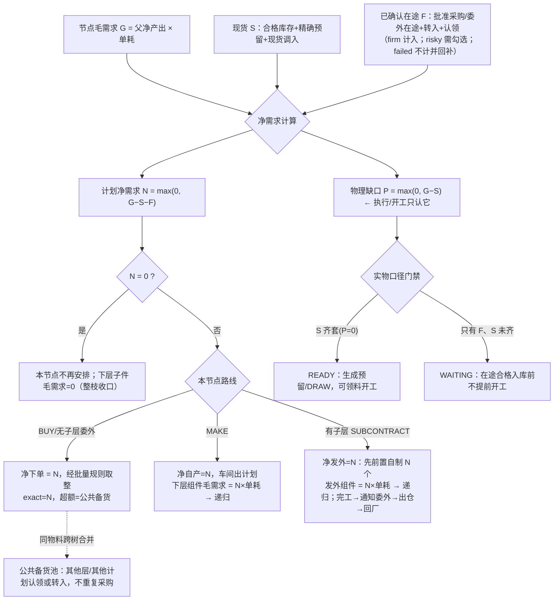

> **状态（2026-09-13 收口）**：本文是净需求模型的推导底稿。最终落地口径以 [ADR-080](../99-决策记录-ADR/ADR-080-跨路线在途调入与子层按计划产出展开.md) 与 [物料调入与子层级供给总纲](../07-业务链路/09-物料调入与子层级供给总纲.md) 为准。

# 物料调拨 × 委外/自制多层子级：净需求与供给组织方案（评审稿）

- 日期：2026-09-13
- 状态：**已被《2026-09-13-物料调拨委外自制-融合定稿方案.md》仲裁吸收并升级，以融合定稿为准**；本文保留为净需求模型的推导底稿（双口径、五量、20 情形矩阵仍有效，实施顺序与 WIP 修复以融合定稿为准）。
- 原状态：方案评审中，未改任何代码 / 未新增迁移 / 未上线。本文只定业务口径与目标链路，作为后续 ADR 与开发的输入。
- 范围：生产物料分析准备页（`/production/material-analysis`）三个下达桶（采购 / 委外 / 车间）里的「物料 / 调拨」模块，重点是**有子层级的委外件、自制件**，以及采购批量备货、在途供给的处理。
- 关联现状文档：
  - [生产物料分析页](../03-页面/生产物料分析页.md)
  - [委外全链路 SOP](../07-业务链路/08-委外全链路-订货出仓回仓重设计.md)
  - [ADR-049 跨分析让料与优先补齐](../99-决策记录-ADR/ADR-049-跨物料分析让料与后续供给优先补齐.md)
  - [ADR-062 委外先自制后通知](../99-决策记录-ADR/ADR-062-委外先自制后通知与分批通知.md)
  - [ADR-065 同批合并下单](../99-决策记录-ADR/ADR-065-备料下达同批合并采购委外申请.md)
  - [ADR-070 超量分账](../99-决策记录-ADR/ADR-070-物料分析分桶详情页与三处学习记忆及超量下单.md)
  - [ADR-071 下达车间原子化](../99-决策记录-ADR/ADR-071-下达车间原子化与计划侧齐套判断下线.md)
  - [V568 让料后自制补供责任](../数据迁移/164-V568让料后的自制补供责任.md)
  - [V569/V571 在途供给归属](../数据迁移/165-V569在途供给归属调整.md)

---

## 0. 给业务的一页结论（先看这里）

1. **你现在的系统骨架是对的**：BOM 逐层算需求、委外有子层先内部自制目标件再发外、采购可以超量买成"公共备货"、在途可以跨计划调入/认领——这些机制都已经存在，方向与 SAP / Oracle / 用友 / 金蝶的标准 MRP、委外加工一致。

2. **真正没考虑周到的是一个口径问题**：现在系统只把"**已经合格入库的货**"用来冲减父件、进而缩减它下面子级的需求；而"**已经下单/已经调入、但还没入库的在途**"只用来减少"建议再下单量"，**不会缩减子级原料需求**。
   - 后果：一个有子层的委外件/自制件，你已经从别的计划调入了一部分**在途成品**，剩下才需要自己做，但系统现在仍按"整件全部自己做"给你展开下层原料——**下层会多备料**。这就是你觉得"委外、自制有子层时理不清"的根源。
   - 标准做法（MRP Netting）：**子件需求 = 父件"净要做/净要发外的数量" × 单耗**，而父件"净要做多少"必须把"库存 + 已确认在途"都扣掉。系统要补的就是这一环。

3. **必须同时守住一条安全线**：在途毕竟没入库，可能晚到、可能质检不合格。所以"用在途冲减计划、缩减下层备料"属于**计划口径**；而"能不能领料、能不能开工、齐不齐套"属于**实物口径**，仍然只认真正合格入库，**绝不能因为有在途就提前开工**。在途一旦失败，被它冲减掉的下层需求要能**自动回补**并报警。两个口径分开，是整套方案的总纲。

4. **"需要 100 却采购 10000 备用"不需要每个子级各买一遍**。正确组织方式是：**同一种料，把整棵树（乃至全部计划）的净需求合并成一次采购**，按供应商起订量/整包装/经济批量放大下单；真正绑定本次需求的是 100（精确账），多出来的 9900 进**公共备货池**，哪个子级、哪个计划要用，就从公共在途里"调入/认领"，而不是重复采购。这套"超量分账 + 公共池 + 认领/转拨"系统已经有了，本方案把它从采购叶子推广到全树、并补上"批量规则主档"。

5. **下层再冒出采购/委外/自制不可怕，它本来就该递归**。规则只有一句话：**父件净要做多少，子件就按多少展开；子件缺了，就按同样的优先级（现货→调入现货→调入在途→公共在途→新下达）再解一次；一直递归到最底层都是采购件为止**。系统自底向上算，计划员只需要在三个桶里处理"未下达"清单，并能看到"是哪一层、因为谁缺料"。

---

## 1. 现状是怎么跑的（代码级事实，作为讨论基线）

### 1.1 一棵 BOM 的需求是怎么展开的

后端 `MaterialAnalysisService.allocateNestedDiagnostics`（约 3496–3604 行）按层遍历：

- **第 1 层（成品的直接子件）**：需求 = 来源净需求 `materialRequirementQty = requested − rootFulfilled`（已扣顶层成品合格交接）× BOM 单耗，**保留毛需求**。
- **第 2 层及以下**：子件需求 = 父件 **`shortageQty`（现货净缺口）** × BOM 单耗；且只有父件有效路线是 `MAKE` 或"未被接管的 `SUBCONTRACT`"时才展开，否则为 0。
- 同一物料在多条路径共享时，公共库存只扣一次，完整套料优先保护（`PriorityCompleteKitAllocator`）。

> 也就是说，**"子件按父件净短缺递归展开"的骨架已经实现**，问题只在于这个"净短缺"目前只扣现货、不扣已确认在途（见 §2）。

### 1.2 三种「调入」分别改了什么

| 调入入口 | 本质 | 落库动作 | 是否减父件物理缺口 `shortageQty` | 是否减"建议再下达量" | **现在是否缩减下层子件需求** |
|---|---|---|---|---|---|
| 从其他计划**已入库**调入（现货让料） | 合格库存**权益转移**（不挪实物） | `preplan_material_reallocations` + 权益事件对（ADR-049） | 是（经现货投影 BorrowTuning） | 是 | **是**（父 shortage↓→子需求↓） |
| 从其他计划**未入库**调入（专属在途转拨） | 已批准采购/委外单的**未来份额**改归属 | `preplan_future_supply_transfers` + 目标侧 `FUTURE_TRANSFER` 行动（V569） | **否**（货没到） | 是 | **否（问题点）** |
| 从**公共在途**调入（认领） | 公共超量采购的未来份额被本计划占用 | `SHARED_FUTURE_CLAIM` 行动（V474/V569） | **否** | 是 | **否（问题点）** |

### 1.3 系统里其实已经并存着两个数量口径

`MaterialRow.toView`（约 7508–7536 行）同时算了：

- **实物/执行口径**：`shortageQty = 毛需求 − 现货分配（含精确预留、现货让料）`，**不扣在途**。它决定齐套、READY、领料、开工。
- **计划口径**：`additionalSupplyRecommendedQty = demandGap − activeFutureCoverage`，即扣掉**有效在途覆盖**（`activeFutureCoverageByMaterial`，含在途转拨、公共认领、委外前置未通知量）后，"还需要新安排多少"。

**矛盾点**：子树递归展开（§1.1）用的是实物口径 `shortageQty`，没有用已经算好的计划口径在途覆盖 `activeFutureCoverage`。于是"建议再下达量"知道在途能顶上，"下层备料"却不知道。

### 1.4 委外有子层 = 一段"内部制造"，与自制同构

按 ADR-062 / ADR-072 / 委外 SOP：

```
有子层委外件 S（净发外量 n）
  → 先按 n 在原分析内做 S 的"前置自制"（SUBCONTRACT_MAKE 锚点，走车间计划/领料/报工/FQC/入库）
     · 前置自制的下层组件 = n × BOM（这层就是会被 §2 问题影响的地方）
  → S 目标件合格入"委外准备专属预留"（不能提前当最终供给）
  → 通知委外 → 委外申请 → 商业订单 → 财务批准
  → 仓库把 n 个目标件出仓给委外商（公司资产、供应商保管）
  → 回厂 → IQC → 仓库实收 → 这才成为本需求的最终合格供给
无子层委外件：没有"前置自制"这段，直接形成委外申请，行为与采购一致。
```

自制件 `MAKE` 与上面"前置自制"那段**共用同一套车间链**，差别只在成品入库后：自制直接成为供给，委外还要再发外→回厂。

---

## 2. 问题精确定位

把你的几个疑问翻译成系统语言，一共四个问题，其中 P1 是核心。

### P1（核心）：父件被"在途"覆盖一部分后，下层仍按整件备料

- 例：委外件 S 需求 100，从别的计划调入 60 个**在途**（对方已下的委外单，下周到），剩 40 个要前置自制再发外。
- **现状**：S 的物理缺口仍是 100（在途不扣），S 的下层组件按 100 套展开 → 多备 60 套原料，积压。
- **期望**：只有 40 个要自己做，下层应按 40 套展开；那 60 个等在途成品到了直接用，不需要它的原料。
- 自制件被"外购同款在途"部分覆盖时，问题完全相同。

### P2：剩余部分继续做，下层又出现采购/委外/自制，怎么收口

- 你担心"再下发个委外单、再给车间下子计划容易，但下面子级不满足、子级里又有采购等乱七八糟的怎么办"。
- 本质是**多层递归净需求 + 逐层下达**缺一个统一的、计划员看得懂的收口视图与操作编排（现在机制分散在三个桶里，靠人逐行找）。

### P3：采购"需 100 采 10000 备用"，是不是每层都要重新下单

- 现状已有 `over_supply` 公共超量分账、安全库存补库（仅 BUY）、公共在途认领、专属在途转拨；但**缺"批量规则主档"和"整树同物料净需求合并"的统一编排**，计划员仍可能在不同子级重复下同一物料。

### P4：在途采购全生命周期怎么纳入

- 在途有多个阶段：已批准未交 → 供应商发货/运输 → 到货待检 → 合格待入库 → 合格入库；以及异常：晚到、质检部分不合格、整批失败、供应商取消。
- 现状：待检/待入库可作未来供给、失败会重开（V554/V569 已有），但**"在途置信度分级 + 失败时自动回补被它净掉的下层需求 + 给计划员行动建议"**没有形成闭环。

---

## 3. 目标模型：双口径分离 + 计划净产出逐层展开

### 3.1 总纲：两个口径严格分离（任何时候不能混）

| 口径 | 回答的问题 | 计入什么 | 用途 | 不计入什么 |
|---|---|---|---|---|
| **计划口径（Planning）** | 还要不要再安排？安排多少？下层按多少备料？ | 合格现货 **+ 已确认在途** | 净需求、下单量、**子件展开**、行动消息 | —— |
| **实物/执行口径（Physical）** | 现在能不能领料、能不能开工、齐没齐套？ | **只计合格入库**（含精确预留、现货调入） | READY/WAITING、DRAW、开工门禁、可发量 | **在途一律不算**，不提前 READY、不提前开工 |

> 关键：**用在途缩减下层备料是"计划口径"动作；在途没合格入库前，实物口径的齐套、开工门禁维持原样**。这样既不积压，又不会"凭一张在途单提前开工结果货没到"。

### 3.1.1 单节点决策总览（一个节点怎么被满足、子树怎么跟着变）



### 3.2 每个节点的五个标准量（全树统一语言）

对任一物料节点，按基本单位、四位小数计算：

```
G  毛需求 Gross          = 父件"计划净产出" × BOM 单耗（顶层 = 销售/手工净需求；含损耗/包装向上取整）
S  现货覆盖 Stock        = 合格可用库存 + 本批精确预留(exact) + 现货让料调入（已入库）
F  已确认在途 FirmFuture = 已财审批准的采购/委外在途 + 专属在途转入 + 公共在途认领（按置信分级，见 3.5）
N  计划净需求 PlanNet    = max(0, G − S − F)   ← 决定"还要安排多少"和"下层按多少展开"
P  物理缺口 PhysicalGap  = max(0, G − S)       ← 决定执行/齐套/开工，等于现 shortageQty，保持不动
```

- 现状的 `shortageQty` 原样保留为 P；新增 N、F 两个投影量（`G、S` 已有对应字段）。
- 页面主表八列里，"齐套缺口"列继续显示物理缺口 P（红/绿），新增/强化"**已确认在途 F**"与"**净需安排 N**"两列（可在列设置里开关，默认显示 N）。计划员一眼分清"实物还缺多少（P）"和"我还要不要再下单（N）"。

### 3.3 逐层展开规则（修正点，回答 P1/P2）

自顶向下传"父件计划净产出"，自底向上算齐套：

1. **采购件 BUY / 无子层委外件**：本节点净下单 = N，再经 §3.6 批量规则得到实际下单量；没有下层。
2. **自制件 MAKE**：
   - 净自产 = N（要车间做多少）；
   - **其每个直接子件的毛需求 = N × 子件单耗**（修正：现状用 P，改用 N）；
   - N=0 时，下层子件毛需求自动为 0，不再产生任何备料/采购。
3. **有子层委外件 SUBCONTRACT**：
   - 净发外 = N（要发给委外商多少个目标件）；
   - "前置自制目标件"数量 = N，**其下层发外组件毛需求 = N × BOM**（与自制同构，同样改用 N）；
   - N=0：不建前置自制、不通知委外、不生成委外申请，下层组件需求归零；
   - 之后的出仓/回厂量也以 N 及其实际完工业绩为准（对齐 SAP 委外：组件按净发外量展开、回厂按实倒扣）。
4. **递归**：子件再按 1–3 处理，直到所有叶子都是采购/无子层委外。任意一层 N=0，其整棵子树需求都为 0（自然收口，不需要人去一层层删）。
5. **多父共用通用件**：同一 `货品+颜色+单位` 在全树出现多次时，毛需求按路径分别保留用于 pegging 追溯，但**净需求/下单按物料维度合并成一次**（§3.6），不重复买。

> 实现层面，`activeFutureCoverageByMaterial` 已经能给出每个物料行的有效在途 F；只需在 `persistAllocationSnapshot → computeAllocationProjection → allocateNestedDiagnostics` 把父产出从 `parent.shortageQty()`（P）换成"父计划净产出 = max(0, 父required − 父现货allocated − 父F)"，并保留 P 供执行侧。属于**小切口改造，不重写引擎**。

### 3.4 每个节点的"供给获取优先级"（回答 P2，统一三桶的解题顺序）

对任一节点的 N，系统按以下顺序给出可执行选项（计划员也可手动改顺序，但默认推荐顺序固定）：

```
P0 已正式预留/本批精确权益        —— 已被本批锁定，保护不动
P1 同主仓公共现货                —— 现货调入（立刻减 P 和 N，子树立即缩减）
P2 其他计划专属现货（让料调入）   —— 调入并给原计划挂"优先待补"（ADR-049）
P3 其他计划专属在途（转拨）       —— 减 N、缩减子树；不减 P；失败自动回补
P4 公共在途（认领）              —— 同 P3
P5 新下达：
     BUY            → 采购申请（可批量/超量，超额进公共池）
     无子层 SUBCONTRACT → 委外申请（成品外协和）
     MAKE / 有子层 SUBCONTRACT → 车间前置自制，并对其下层递归走 P0–P5
```

- 计划员在一个节点上看到的三个调入按钮 + 三个下达桶，本质就是 P1–P5 的入口；方案不新增入口，而是让它们**共用同一套 N/F/P 计算**，并在 UI 上标注每个来源能覆盖多少 N、是否影响下层。
- **缺口上浮**：任一节点 P5 仍无法满足（无供应商、无产能、交期晚于需期），沿 BOM pegging 上浮，最终在成品/销售行显示"齐套风险、卡在哪一层、最早可齐套日期"（ATP/CTP，分阶段做，见 §7）。

### 3.5 在途置信分级（回答 P4，决定 F 能不能计入 N）

不是所有在途都配冲减计划，分三档：

| 档位 | 定义 | 是否计入 F（减 N、缩子树） | 失败/变化处理 |
|---|---|---|---|
| **确定在途 firm** | 已财审批准、交期明确且不晚于本节点需期；来源含已调入的专属/公共在途 | 计入 | 正常推进，合格入库后 F→S，P 随之归零 |
| **风险在途 risky** | 晚于需期、交期不明、已到待检/合格待入库尚未落定 | **默认不计入**，计划员显式"接受晚到/接受待检"才计入（界面黄标，不改计划日期，沿用现有 allowLateSupply） | 一旦确定不能按时，立刻移出 F，N 重开 |
| **失败在途 failed** | IQC 判废且无有效补回、供应商取消、超期确认不交 | 不计入，且**回补**此前被它净掉的下层需求 | 自动重开 N + 行动消息（§3.7），沿 pegging 通知相关父件 |

- 待检/合格待入库：作为风险在途，计划员可选择计入（现状已允许采用，保留）；实物口径仍以仓库实际入库为准。
- **回补闭环（新增能力）**：当一笔在途从 F 变为 failed，系统按"它当初冲减了哪些父件的 N、各多少"反向恢复对应下层毛需求（数据上由转拨/认领行动的分摊谱系支撑，现有 `external_item_id / sourceAllocationId` 已可追溯），保证不会因为在途黄了而"下层没备料、两头空"。

### 3.6 批量规则与公共池（回答 P3：100 与 10000 怎么共存）

**（1）货品主档新增"采购/委外批量策略"（建议字段，落 V574）**

- 批量方法 `lot_sizing_rule`：`L4L` 按需（默认，缺多少下多少）/ `FOQ` 固定批量 / `POQ` 周期合并；
- 最小起订量 `min_order_qty`、订货倍数（整包装）`order_multiple_qty`、经济批量参考 `eoq_qty`（可选）；
- 与已有安全库存 `min_qty` 区分：安全库存是"常备水位"，批量规则是"每次下单怎么取整"。

**（2）一次下单量 = 批量规则(合并净需求)**

```
合并净需求 = 本树所有路径 + （可选）其他计划对该物料的 N，按 货品+颜色+单位+主仓 合并
建议下单量 = LotRule(合并净需求)            // L4L=净需求；FOQ=max(净需求, 起订量) 并向上取整到包装倍数
```

**（3）一张单、三段账（沿用并强化现有分账，不新增账套）**

- **需求精确段（exact）**：= 各分析/各节点的 N 之和，逐 action 锚定、IQC 后精确绑定，可追溯到是哪棵树哪一层要的；
- **公共备货段（public extra）**：= 下单量 − 合并净需求，需 `over_supply` 权限显式确认，进公共池，不绑任何需求；
- **安全补库段（safety）**：仅 BUY，按主仓水位单独成行（ADR-056 现状不变）。

**（4）公共池替代"每层重买"**

- 公共备货一旦批准就是"公共在途"，本树其他子级、其他计划缺同料时，走 P4 认领 / P3 转拨即可，**不再新下采购**；
- 系统在采购桶对"同物料已存在公共在途/公共库存"的行，默认把 N 抵扣到 0，并提示"已有公共在途 X，可认领，无需重复采购"；
- 结论：**10000 只买一次，100 进精确账，9900 进公共池，谁用谁认领**；自制件/有子层委外件不开放"公共超产"（与现状一致，公共超产要另走完整 BOM 备库计划，避免凭空造半成品）。

### 3.7 行动消息（Action Messages）：系统建议、人来决策（不自动改已确认单）

对齐 MRP 标准（SAP MD04 / Oracle Planner Workbench / 金蝶交货调整建议），在"需处理"桶与详情里给出**建议**，已下达/已财审的单子系统绝不自动删改：

| 消息 | 触发 | 建议动作 | 现状对应 |
|---|---|---|---|
| 新建 New | N>0 且无任何在途 | 下采购/委外/车间计划 | 现有"未下达" |
| 取消建议 Cancel | N=0 但存在多余**自己的**在途（被调入覆盖后冗余） | 减量/撤单（走现有撤回/change-qty 守卫） | 部分有，需补建议生成 |
| 提前 Reschedule-in | 在途交期晚于需期但可催 | 催交/改交期 | 晚到提示，需补建议 |
| 延后 Reschedule-out | 在途早于需期、占资金 | 延后交货 | 新增 |
| 增减量 Increase/Decrease | N 随调入/失败变化 | 改量（批准后走 change-qty） | 现有 change-qty |
| 失败回补 Replenish | 在途 failed | 重开 N、回补子树、提示重新下达 | 现有失败重开，需补子树回补 |

---

## 4. 三种「调入」在新模型下的精确定义（含委外/自制子层）

| 调入类型 | 调入对象必须是 | 对父件 N（计划） | 对父件 P（实物） | 对下层子树 | 备注/风险 |
|---|---|---|---|---|---|
| 现货调入（已入库） | 同主仓、同货品/色/单位的**合格最终件**权益 lot | ↓ | ↓ | **立即按净产出缩减** | 给原计划挂优先待补；一节点仅一条未补齐关系（现状） |
| 专属在途转拨（未入库） | **另一计划已批准的 BUY / 无子层 SUBCONTRACT 最终件在途** | ↓（firm 档） | 不变 | **按净产出缩减（新增）** | 在途合格入库才减 P；失败回补子树 |
| 公共在途认领 | 公共超量采购/委外的最终件在途 | ↓ | 不变 | **按净产出缩减（新增）** | 同上；不触发原计划补供 |

**调入对象的硬边界（现在就正确，必须保留）**：

- 只能调入"**最终件**"（采购成品、无子层委外回厂成品、它们的合格库存/在途）。
- **不能**把"自制在制品""委外前置自制半成品（SUBCONTRACT_PREPARE 专属预留）""正在委外商处的料"当成最终件调入——它们还不是可用供给，跨计划调入会凭空制造齐套。现有来源 SQL 限定 `route IN ('BUY','SUBCONTRACT')` 且排除 `SUBCONTRACT_MAKE_TASK`，方向正确，保留并在方案中固化为不变量。
- 一个有子层的委外件 S，若想"不自己做、直接拿现成的"，只能拿**委外最终回厂合格件**或**采购同款**；拿到后 S 的 N 变 0，前置自制与其下层组件全部不再需要。

---

## 5. 复杂情形穷举与处理（你担心的各种"乱七八糟"）

> 记法：某件需求 G，现货 S、在途 F、净需求 N=max(0,G−S−F)；"下层"指它内部制造要用到的组件。

| # | 情形 | 处理规则 |
|---|---|---|
| C1 | 委外**无子层** | 等同采购：N 直接走委外申请；调入成品现货/在途即抵 N，无下层问题 |
| C2 | 委外有子层，**全部**被调入（现货） | N=0，不前置自制、不发外，下层组件需求立即归零；实物到位即供给 |
| C3 | 委外有子层，**全部**被调入（在途最终件） | 计划口径 N=0、下层计划需求归零（不重复备料）；实物口径仍 WAITING，在途合格入库后才齐套；在途失败则回补下层、重新前置自制 |
| C4 | 委外有子层，**部分**调入、部分自制后发外 | 净发外=剩余 N；前置自制做 N 个，下层组件按 N 套展开；组件不足再按 §3.4 递归 |
| C5 | 自制件被"外购同款"部分覆盖（现货/在途） | 净自产=剩余 N，下层按 N 展开；外购部分走 BUY，与自制在同一 action 组多代次并存（现状支持） |
| C6 | **多层嵌套**（如：成品→委外组件 A→自制子件 B→采购原料 C，且 B 里又有委外 D） | 每层只认自己父层的净产出，逐层套 §3.3；任一层被调入致 N=0，其下整棵子树归零；算例见 §6 |
| C7 | 子件是采购，净需 100 但供应商起订 1000/整箱 | 按 FOQ 下 1000：100 进 exact、900 进公共（需 over_supply）；兄弟节点/其他计划认领公共在途，不重复下单 |
| C8 | 多个父件/多棵树共用同一通用件 | pegging 保留各路径需求用于追溯；下单按物料合并一次，exact 按路径分摊，公共部分共享 |
| C9 | 在途**晚到** | 默认风险档不减 N；显式"接受晚到"才减 N 并黄标，不改计划日期；同时给"提前/催交"行动消息；晚到导致父件投料延后时，在时间相抵阶段（P3）提示影响成品日期 |
| C10 | 在途**待检/合格待入库** | 风险档，可选择计入 F；判废则移出 F、重开 N；部分合格按合格切片计入，不合格切片重开（V554 现状） |
| C11 | 在途**失败/供应商取消** | 移出 F，N 重开；**按谱系回补**此前被净掉的下层需求；出"失败回补"消息；原转拨/认领可撤销，专属转拨撤销时按 V571 拆"恢复原计划/释放公共" |
| C12 | 调入后又**撤销调入** | 对称恢复：N 回升、下层需求按比例恢复；已合格入库的历史不可撤（现状守恒） |
| C13 | 已正式预留/已领料/已开工的量 | 最高优先保护，任何调入/净算都不能挤占（P0）；未领料取消才走 RESTORE（ADR-049 现状） |
| C14 | **安全库存** | 只 BUY 走公共安全补库，不进任何分析 exact；MAKE/委外 fail-closed（ADR-056 现状不变） |
| C15 | 委外**发料与回厂倒扣** | 发外组件按净发外 N 备料、出仓；回厂按实际合格量倒扣组件，损耗/超耗独立记账（委外 SOP 现状）；净发外因调入减少时，出仓计划量同步减少 |
| C16 | **跨主仓** | 调入仅限同主仓（V565 现状）；跨主仓必须走真实仓库调拨单，不在本模块做账面调入 |
| C17 | 同件**混合路线**（一部分买、一部分做、一部分委外） | 同一 action 组下多代次供给并存，各自计 F/S，N 为三者仍未覆盖的残量；下层只跟随"要内部制造的那部分 N" |
| C18 | 调入来源后来**自己也缺**（让料方优先待补） | 现货让料保留优先补齐（ADR-049）：让料方下一批合格供给先补它自己；在途转拨无归还义务但失败按 C11 处理 |
| C19 | BOM 变更/单耗变化 | 以当前 BOM 快照重算 G/N（现有 requireCurrentBomSnapshot 漂移闸）；已下达不被静默改，给改量/行动消息 |
| C20 | 委外件既想拿现成、又想保留一部分自己做以控质量 | 拆成两份：调入/外购覆盖一部分（N 下降），剩余走前置自制；系统按数量并存，互不影响 |

---

## 6. 端到端算例（三层，含委外子层、采购批量、在途调入）

产品 P 订单 10 台，主仓 W。BOM：

```
P(自制,10)
├─ A 委外件（有子层，每台用 2，共需 G_A=20）
│   └─ C 原料（每做 1 个 A 用 3，自制 A 时需要）
└─ B 采购件（每台用 1，G_B=10），供应商起订 50、整包 50
```

**第 1 步：A 的供给**
- A 毛需求 20。从另一计划**调入 12 个 A 的委外在途**（对方已批准、交期来得及，firm 档）；现货 0。
- A：N_A = 20 − 0 − 12 = **8**（只需前置自制 8 个再发外）；P_A 实物缺口仍 20（在途没到，不能开工发外）。
- 下层 C：毛需求 = N_A × 3 = **24**（而不是现状的 20×3=60）。若 C 现货/在途为 0，则采购 C 净需 24。

**第 2 步：B 的供给（批量）**
- B 净需 10，FOQ 起订/整包 50 → 下单 50：exact 10、公共 40（over_supply 确认）。
- 若同树别处或另一计划还要 B 30，直接认领这 40 公共在途里的 30，不再采购。

**第 3 步：执行（实物口径）**
- A 的前置自制段：需要 C 24 套齐套才能 READY 开工做那 8 个 A；调入的 12 个 A 在途**不参与**这段齐套（它们是成品，不是做 A 的原料），只在最终 A 齐套时计入。
- C 24 合格入库 → 前置自制做 8 个 A → 入委外准备专属预留 → 通知委外 → 出仓 8 个 → 回厂。
- 调入的 12 个 A 合格回厂入库（F→S），加上自制发外回来的 8 个，A 共 20 齐套，P 的 A 缺口归零。

**第 4 步：异常**
- 若调入的 12 个 A 在途供应商黄了（failed）：F 清零，N_A 回到 20，**C 的需求自动从 24 回补到 60**，出"失败回补、需追加采购 C 36、追加前置自制 A 12"消息——不会出现"以为有 12 个结果没有、C 也没买"的断料。

> 对照现状：第 1 步 C 现在会按 60 备（多备 36）；第 4 步现状不会自动回补（因为从没减过，也就没有"回补"概念，但代价是常态多备）。新方案用"计划净算 + 失败回补"同时做到不积压、不断料。

---

## 7. 分阶段落地路线（先确认方案，再动代码）

> 原则：引擎不大改，前向新增、双口径并存、可灰度回退；每一阶段都配迁移、测试矩阵、性能基线与文档更新。当前最新迁移 V573，新迁移从 **V574** 起。

### P0（核心修正）：计划净需求口径 + 子树按净产出展开
- 节点投影新增 `firm_future_qty(F)、planning_net_qty(N)`，`shortage_qty` 保留为 P。
- `allocateNestedDiagnostics` 父产出改用"计划净产出"（接入已有 `activeFutureCoverageByMaterial`）；执行侧 READY/DRAW/开工仍只用 P。
- 在途失败/撤销时按谱系回补下层 N（复用转拨/认领分摊）。
- 主表/桶详情增加 F、N 列与"在途覆盖将减少下层 X 项原料需求"的影响提示。
- 迁移 V574：节点投影列 + 货品批量策略占位字段；老分析不批量改写，**刷新即进入新口径**，历史单据字节不动；提供"计划口径是否用在途净算子树"的全局开关用于灰度。
- 测试矩阵：§5 的 C1–C20 全量 + 现有 FullChain/Postgres 回归；性能沿用 5000 产品/10000 节点基线，新增在途抵扣只做**批量查询**，不引入逐行 SQL。

### P1：批量规则主档化 + 整树同物料合并下单
- 货品主档批量策略（L4L/FOQ/POQ、起订量、订货倍数）；采购/委外下单按合并净需求取整，三段账（exact/公共/安全）在 UI 明示。
- 采购桶对已有公共库存/公共在途的行默认抵扣并引导认领，杜绝重复采购。

### P2：行动消息中心（需处理桶增强）
- 新建/取消建议/提前/延后/改量/失败回补六类消息，按 pegging 定位到层；已确认单只建议、不自动改，走既有撤回与 change-qty。

### P3：时间相抵与齐套承诺（ATP/CTP）
- 把提前期、在途交期纳入，给出每层与成品的"最早齐套/可开工/可发货日期"，晚到沿 pegging 上浮影响；这是性能与复杂度最高的一块，最后做。

### 配套工程项（与你提到的整体诉求对齐，单列、不在本次方案展开实现）
- 性能：坚持"事件驱动增量净算"（入库/在途变化只唤醒受影响分析，复用 `MaterialAnalysisSupplyWakeupService`）+ 投影化 + `(analysis, node/material/action_group)` 索引 + 分页/共享投影，保证十年级数据不做全量 MRP 重扫。
- UI 组件化、页面独立、权限（页面权限 + 工作台总权限）梳理、死代码清理：在 P0–P2 落地时按既有组件规范与[权限体系总设计](../05-架构/权限体系总设计.md)同步进行，另出执行清单。

---

## 8. 不变量（落地时必须用数据库守卫/测试锁死）

1. **实物口径不认在途**：在途未合格入库，绝不能生成正式预留、DRAW，不能把 WAITING 提升 READY，不能允许开工。
2. **子件需求只跟随父件"计划净产出"**：父 N=0 则子毛需求=0；父 N 增加/回补，子按单耗同步；单耗/包装按 `MaterialConsumptionMath` 向上取整。
3. **只能调入最终件**：自制在制、委外前置半成品、委外商处料不得作为跨计划调入供给。
4. **数量守恒**：现货让料 OUT=IN、优先补齐不超额；在途转拨受让量 ≤ 来源未实收量、≤ 目标 N；撤销拆分恢复/公共之和=撤销量（沿用 V569/V571）。
5. **exact 与公共分账**：需求精确量不被公共备货稀释，公共备货不绑定具体需求；MAKE/有子层委外不开放公共超产。
6. **已确认单据不被静默改写**：BOM 漂移、净需求变化只产生行动消息，改单走 change-qty/撤回等受控命令并保留历史。
7. **同主仓边界**：跨计划调入限同主仓；跨主仓走真实调拨。
8. **失败必回补**：任何曾被计入 F 并净减了下层需求的在途，在转为 failed 时必须恢复对应下层 N，且有审计与消息。

---

## 9. 待你拍板的决策点

1. **在途默认是否净算子树**：建议"确定档自动计入、风险档（晚到/待检）需勾选"。是否同意？还是更保守——所有在途都要计划员逐笔勾选才减下层？
2. **整树合并采购是否跨分析**：P1 的"同物料合并净需求"是只在**单次分析内**合并（稳妥，推荐先做），还是允许把**其他未下单分析**的需求也合并进一张采购单（更省运费但耦合强，建议 P3 再议）？
3. **委外是否允许"部分拿现成 + 部分自做"成为常态**（C20）：建议允许并在同一节点清晰拆分两部分数量与进度。
4. **批量规则维护责任**：起订量/整包装倍数由采购维护在货品主档，是否需要供应商维度不同值（同一料不同供应商起订量不同）？若需要，字段放供应商-货品关系而非货品主档。
5. **P3 时间相抵/ATP 是否本期必须**：它直接影响"能不能回答客户准确交期"，但工作量最大；建议先上 P0–P2，ATP 单独立项。

---

## 10. 与现有文档/ADR 的后续关系（确认方案后再做）

- 新增 ADR：`双口径计划净需求与子树净产出展开`（取代/修订本文为正式决策）、`货品批量规则与整树合并下单`、`在途置信分级与失败回补`。
- 修订：[生产物料分析页](../03-页面/生产物料分析页.md) §3/§4/§5 的数量口径与列定义、[委外全链路 SOP](../07-业务链路/08-委外全链路-订货出仓回仓重设计.md) §2 的"净发外量展开组件"表述、[ADR-070](../99-决策记录-ADR/ADR-070-物料分析分桶详情页与三处学习记忆及超量下单.md) §2.7 公共超量适用范围。
- 迁移：V574 起，前向新增、不改历史字节，老分析刷新进入新口径，配套 `business_data_reset()` 白名单与审计触发器。
- 本文在 ADR 落地后标注"已被 ADR-xxx 取代"，保留评审轨迹。
