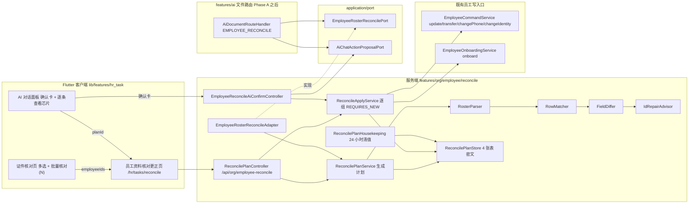
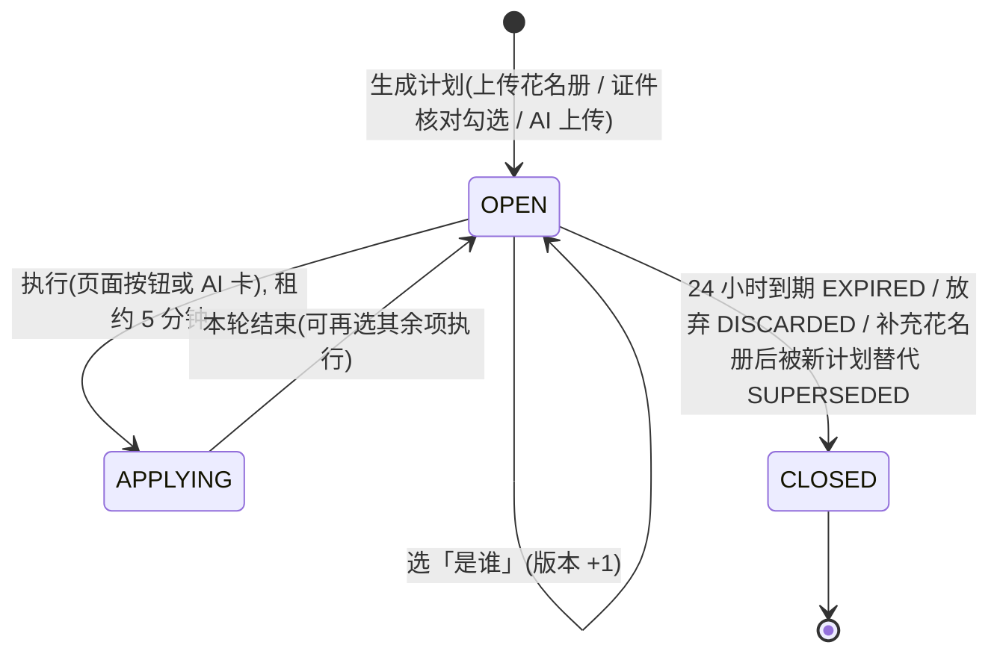
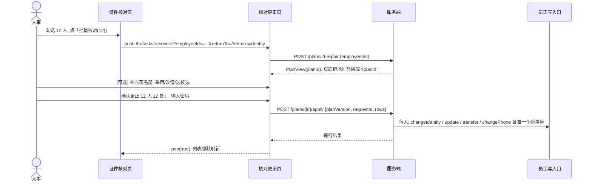

# 人事花名册核对与证件批量更正方案

- 日期：2026-10-05 用户提出，2026-10-06 成稿。
- 状态：部分实施：证件核对入口全链已实施(ADR-160, V810)；花名册上传(§四/§五上传态)与 AI 接入(§六)待后续。用户原话「你出了方案 我以后执行」。本文不含代码改动；代码基线 main `afab122bc`，迁移头 V809/735，最新 ADR-157。
- 前置：「AI 文件理解」Phase A 正在实施(工作笔记 `.local-tmp/hr-reconcile/SPEC-ai-file-understanding.md`)。本文第六节依赖 Phase A 合入，其余各节不依赖。
- 编号：迁移号与 ADR 号在实施时取当时的下一个空号(今天是 V810、ADR-158)，本文用 `V8xx`、`ADR-15x` 指代，写进代码和文档时注明「临时号」。
- 相关规范：[ADR-154 证件核对](../99-决策记录-ADR/ADR-154-证件号问题不阻塞开号与证件核对任务.md)、[ADR-150 AI 确认卡](../99-决策记录-ADR/ADR-150-AI助手页面上下文有据作答与确认后执行.md)、[ADR-153 AI 范围闸门](../99-决策记录-ADR/ADR-153-AI助手范围闸门与平台知识检索.md)、ADR-017(跨 feature 只经 `application.port`)、ADR-021(HR 任务软认领)、ADR-110(再认证)；页面 [HR任务中心](../03-页面/HR任务中心.md)、[重新提交审批差异展示](../03-页面/重新提交审批差异展示.md)；组件 [MasterDataTableView](../02-组件库/MasterDataTableView.md)、[UtenRevisionTable](../02-组件库/UtenRevisionTable.md)。
- 行号是 2026-10-05 阅读时的位置，并行修改可能移动；实施前以 `git grep` 重新定位。

## 一、用户要求(原话)

2026-10-05，用户上传「花名册.xls」给 AI 助手时说：

> 这是最新的人事统计出来的人员信息 你看看信息 对照系统里的 不对的补充 缺少的添加

> 应该他自己扫描 对比 确认有多少有问题 然后 我们确认执行 他直接能够去更改数据 啥的 有操作记录啥的

关于人事任务列表「证件核对」页签(列：工号/姓名/原因/部门/岗位/入职日/认领)：

> 表格最前面有个多选框 能够批量处理 右下角有个按钮 ui应该和其他页面的一致 ... 自己有个算法 或者牛逼的思考 就是 多选后 直接进入到新的页面 然后就是跟销售 编辑后 财务那里再次审批的销售一样 就是 一行是旧消息 划去对应的信息 显示新的内容啥的 就是 表格样式的展示 ... ui弄得好看 算法厉害

> 人事批量处理那里得 你先出个方案就行 ... 你出了方案 我以后执行

> ai那里也是要权限 就是 上传得内容 需要处理得 得有对应的权限才行

拆成可验收的要求：

| 编号 | 要求 | 本方案落点 |
|---|---|---|
| R1 | 系统自己扫描、对比，先说清「多少人、哪里有问题」，不先改 | 第四节核对引擎生成「核对计划」，页面和 AI 卡都先展示统计 |
| R2 | 人确认后执行，执行直接改数据 | 第五节「确认更正 N 人 M 处」；第六节 AI 卡「确认执行」 |
| R3 | 不对的补充、缺少的添加 | 修改已有员工(含补空)+新增名册里有、系统里没有的人 |
| R4 | 有操作记录 | 第九节：计划与每处更正的旧值/新值/依据/结果永久留存，另有业务审计事件 |
| R5 | 证件核对页最前面多选框，右下角按钮，和其他页面一致 | 第五节 5.1，沿用 `MasterDataTableView` 多选与右下角浮动批量条 |
| R6 | 多选后进新页面，表格样式，旧值划掉、显示新值，跟销售改单财务复审一致 | 第五节 5.2，一人一行，改动格上旧下新 |
| R7 | 算法要厉害：能推出证件号该是什么，说清依据和把握，拿不准不乱填 | 第四节 4.4 证件号修复建议，四档把握 |
| R8 | UI 好看 | 第五节版式、配色与状态全集 |
| R9 | AI 处理上传内容也要有对应权限 | 第六、八节：每一项都按该项的写入权限过滤，缺的权限用中文名说明 |
| R10 | 先出方案，以后执行 | 本文；第十二节拆包 |

## 二、现状与问题(证据)

| # | 现状 | 证据 | 影响 |
|---|---|---|---|
| 1 | AI 收到花名册判为「未知用途」，给出销售订货单/报价单/报销申请三张无关确认卡；点「确认执行」页面不出现 | 本机库 `ai_jobs d6994a7e…` 结果 `documentType=UNKNOWN`；`AiDocumentClassifier.java:33-34` 没有花名册标题，`:62` 表头规则要求同时有姓名与工资列；`AiDocumentRouteHandler.java:204-205` 每个用途一张卡；`main_shell_page.dart:164-165` 主 Tab 冻结 `matchedLocation` | Phase A 修(一份文件最多一张卡、用途选择改芯片、壳层按叶子路径判断)。本方案在 Phase A 之上接入「员工核对」用途 |
| 2 | 系统没有任何员工批量导入或核对入口 | `features/**/*ImportController.java` 只有货品、BOM、成本导入 | 需要新的核对引擎和页面 |
| 3 | 证件核对页不开多选 | `lib/features/hr_task/pages/hr_task_list_page.dart:233-237` `HrTaskType.identity => false`；测试 `test/features/hr_task/hr_task_list_page_test.dart:270-271` 断言「证件核对逐人修改，不开多选」；文档 `docs/03-页面/HR任务中心.md:65,196` | 要改页面、测试与文档 |
| 4 | 员工写入口分散，每个都有自己的校验和副作用 | `EmployeeCommandService.update` `:87-134`(拒绝改部门/岗位/状态/转正日 `:686-716`)；`transfer` `:274-314`(写任职记录、调部门清空所任部门负责人)；`changePhone` `:459-485`(改登录账号并吊销该员工全部会话)；`changeIdentity` `:492-525`(严格校验、查重、身份证重推性别与生日、绑定超管 403)；`EmployeeOnboardingService.onboard` `:81-266`(必填项、建号、初始密码) | 批量更正只能逐项调用这些既有入口，不能自写 SQL；`ArchitectureBoundaryTest.java:482-515` 也锁住了证件密文和校验结果的唯一写入者 |
| 5 | 入职日期、已有转正日期、工号、休假状态没有任何更正入口 | `UpdateEmployeeRequest` 无 `hireDate`；`confirm` 对已有转正日 409 `:426-428`；状态只能经转正/离职/复职 | 第一期这些差异只做提示，见第十三节待确认 |
| 6 | 员工没有乐观锁入参 | `Employee.java:104-105` `version` 手工 +1，接口不收期望版本 | 计划要记下每人版本，执行时自己比对 |
| 7 | 命令方法都是 `@Transactional(REQUIRED)` | `EmployeeCommandService` 全部方法 | 在一个外层事务里循环调用，第一处报错就把整批标成只能回滚；必须每组一个 `REQUIRES_NEW` 事务 |
| 8 | 可以不解密就认人 | `employee_sensitive.id_card_hash`(唯一部分索引 `V10__id_card_hash.sql:6-8`)、`phone_hash`(不唯一)、`id_card_last4`(明文)、`employee_phones.phone_hash`；`TxSessionVars.hmac` `:399-413` 纯 Java | 匹配用哈希；只对少数需要的人批量解密。注意老库导入用 `hmac(BTRIM(raw))`(`migrate_hr_roster.sql:160-161`)，重复证号残档哈希为空 |
| 9 | 证件核对列表不带问题码，也不带号码 | `HrTaskSummary.Item` 只有 `note` 原因文字(`HrTaskService.java:51-65`)；客户端 `HrTaskItem` 无证件字段 | 新页面要自己的数据源，由服务端解密并计算 |
| 10 | 部门名称不唯一，岗位按部门区分 | `V02__departments_positions.sql`；`PositionRepository.findFirstActiveByNormalizedName` `:24-35` | 名称落到 id 要有消歧与人工选择 |
| 11 | Excel 读数的两个坑 | `SpreadsheetGridReader.java:59,550` 数值按 15 位有效数字取整(18 位证号存成数字后三位变 000)；`docs/数据迁移/53-人事正式名录迁移.md:49` 「2018.1」可能是 10 月丢了末尾 0 | 解析器要识别并拒绝把这类值写入 |
| 12 | AI 任务结果是永久明文 | `ai_jobs.result` jsonb，`V778` 禁止删除与清空 | 结果里只放统计和计划 id，不放姓名、证件、手机 |
| 13 | AI 确认卡的库表约束 | `V805__ai_chat_action_proposals.sql:13-14` `action_type` 只有三种；`args`、`summary` 各 ≤4096 字节；10 分钟有效 | 新卡型要迁移扩 CHECK；计划存自己的表，卡里只放 id |
| 14 | 员工写入目前没有显式业务审计 | 只有请求级语义事件和数据库行审计；`fn_audit_redact_row`(`V670:37-104`) 按列名脱敏，`id_card_last4` 不脱敏 | 本方案为每处更正补显式事件，敏感字段只记「已修改」 |
| 15 | 现成的对照表组件不支持勾选和编辑 | `UtenCellRevisionTable` 构造只收 `columns/rows`，`embedded: true`，新值是只读文字 | 页面用非嵌入的 `MasterDataTableView`，抽一个共用的「单元格内旧新对照」小组件 |
| 16 | 页面里不许新增权限字面量 | `test/page_permission_literal_baseline_test.dart:44` 基线 677，只降不升 | 页面能做什么由服务端随计划下发 |
| 17 | HR 页面内容从不发给 AI | `AiChatPageSnapshot.java:64` `CONTENT_WITHHELD_ROUTES` 含 `/hr`、`/employee` | 新页面放在 `/hr/...` 下；AI 执行只能走服务端确认卡 |

## 三、总体方案

### 3.1 一句话

服务端一个「员工资料核对引擎」把花名册(或证件核对勾选的人)算成一份**加密保存的核对计划**；人事在「员工资料核对更正」页逐格确认，或在 AI 助手里一键执行其中把握高的部分；执行时每人逐项走既有的员工写入口；计划本身连同每处的旧值、新值、依据、结果就是操作记录。

### 3.2 设计原则

1. **只在服务端算一次**。匹配、比对、证件号建议都在服务端；客户端只显示，手工改值时用 `IdCardUtils.problemOf` 做即时校验。
2. **先预演后提交**(同行共识：Odoo Test、Workday Validate、飞书错误文件)。生成计划不改任何业务数据。
3. **空白不覆盖**(钉钉、Salesforce、企业微信增量更新)。花名册空格不清空系统内容；文件里没有的列不比较。
4. **文件里没有的人不动**。名册里没有的在职员工只列出，**绝不自动办离职**。
5. **建议不强改**。证件号修复只给建议和把握；落库仍走 `changeIdentity` 的严格校验和查重。
6. **只走既有写入口**：`EmployeeCommandService.update/transfer/changePhone/changeIdentity`、`EmployeeOnboardingService.onboard`，各自的 `@PreAuthorize` 原样生效。
7. **一个人失败不连累别人**；同一人的不同写入口也互不连累(第七节 7.6)。
8. **有旧值守卫**。计划生成后系统值被别人改过，这一处跳过并说清原因。
9. **个人信息不出服务器、不进 AI**。花名册处理是本地确定性规则，不调模型；计划里的值只以 pgp 密文存放；AI 任务结果只有统计。
10. **零新增权限码**。复用 `employee:view/edit/transfer/create/pii:view/pii:edit` 与 `ai:use`。

### 3.3 架构



依赖方向全部合规：`features/ai` 只经 `application/port` 调 HR(ADR-017)；`features/org` 只经 `AiChatActionProposalPort` 消费确认卡，不 import `features/ai`；端口不 import 任何 feature。

### 3.4 服务端组成(全部在 `server/src/main/java/com/uten/imp/features/org/employee/reconcile/`)

| 类 | 职责 | 是否纯函数 |
|---|---|---|
| `RosterHeaderCatalog` | 表头同义词、排除词、字段编码(4.1.1) | 常量 |
| `RosterParser` | `DocumentGrid` → `RosterTable`：定位表头、两行表头合并、合并格向下填充、跳过合计/签字行、按列规范化值 | 是 |
| `RosterValueNormalizer` | 姓名、性别、日期(含月精度与「1 月或 10 月」)、手机拆分、证号精度保护、枚举映射 | 是 |
| `MatchIndexLoader` | 按哈希、工号、姓名把候选员工一次读出(4.2.1) | 读库 |
| `RowMatcher` | 证据打分、互为最优、冲突与重名判定 | 是(输入为已读出的索引) |
| `OrgReferenceResolver` | 部门、岗位按名称落到 id，带消歧 | 读库 |
| `FieldDiffer` | 逐字段规范化比较，生成计划项，标出写入口和所需权限 | 是 |
| `IdRepairAdvisor` + `IdRepairScoring` | 证件号候选生成、打分、分级(4.4) | 是(哈希冲突集合由调用方传入) |
| `ReconcilePlanService` | 编排：解析 → 读索引 → 匹配 → 比对 → 修复建议 → 加密落库；也负责「选是谁」后重算单行 | 事务内 |
| `ReconcilePlanStore` | 4 张表的 JDBC 读写、批量加解密、加锁 | 读写库 |
| `ReconcilePlanQueryService` | 组装 `PlanView`，按 `employee:pii:view` 打码 | 只读 |
| `ReconcilePermissionGate` | 按当前用户展开后的权限集合算出每个写入口能不能执行，并取权限中文名 | 是 |
| `ReconcileApplyService` | 执行：按人、按写入口分组，逐组 `REQUIRES_NEW`，旧值守卫，记录结果与审计 | 无类级事务 |
| `ReconcilePlanController` | `/api/org/employee-reconcile/**` 页面接口 | |
| `EmployeeRosterReconcileAdapter` | 实现 `application/port/EmployeeRosterReconcilePort`，供 AI 文件路由调用；自己再查一次权限 | |
| `EmployeeReconcileAiConfirmController/Service` | `/api/ai/chat/employee-reconcile/confirm`，消费确认卡并调用同一个执行服务 | |
| `ReconcilePlanHousekeeping` | `@Scheduled` 每 10 分钟清理过期未执行的值；登记 `ScheduledTaskCatalog` | |
| `ReconcileNotice` | 仅提示、跳过、失败原因的代码与中文文案(服务端渲染，不含号码) | 常量 |

需要的小改动：`EmployeeSensitiveRepository.findAllByIdCardHashIn/findAllByPhoneHashIn`、`EmployeePhoneRepository.findAllByPhoneHashIn`；`TxSessionVars.encryptAll(List<String>)`(照 `decryptAll` `:346-393` 一次 `unnest` 批量加密，避免每个值一次往返)。

### 3.5 客户端组成(全部在 `lib/features/hr_task/`，已允许依赖 `employee`、`basic_data`、`notice`)

| 文件 | 内容 |
|---|---|
| `pages/hr_reconcile_page.dart` | 核对更正页(上传态、计划态、执行后) |
| `widgets/hr_reconcile_columns.dart` | 列定义：身份列、动态变更列、依据、把握、说明/结果 |
| `widgets/hr_reconcile_cells.dart` | 把握徽标、依据胶囊、证件号差异位高亮、候选选择、选「是谁」面板 |
| `widgets/hr_reconcile_upload_panel.dart` | 拖放/选择文件、格式说明 |
| `widgets/hr_reconcile_history_sheet.dart` | 核对记录列表 |
| `models/hr_reconcile_plan.dart` | `PlanView` 严格解析 |
| `repositories/hr_reconcile_repository.dart` + provider | 接口调用；执行与上传用 `ApiClient.postLongRunning`(`api_client.dart:159-176`) |
| `lib/components/data_display/uten_revision_cell.dart` | **新共用组件** `UtenRevisionCell`：单元格内上旧(红色删除线)下新(绿色)，复用 `utenRevisionForeground/Background`(`uten_revision_table.dart:36-56`) |

部门、岗位下拉的选项由服务端随计划下发或经现有接口取，**不 import `features/department`**(`test/architecture_boundaries_test.dart` 没有 `hr_task->department` 边)。

### 3.6 核对计划的生命周期



- 到期或放弃时，清空**未执行**项与行的密文，只留统计；**已执行**项的旧值、新值永久保留作操作记录。
- 只有计划创建人能执行；其他持 `employee:edit` 的人可在「核对记录」里只读查看。
- 一个计划可以分多轮执行(先确认把握高的，再慢慢处理其余)；每轮一条执行记录。

### 3.7 两条入口的数据流



花名册入口相同，只是第一步是 `POST /plans/roster`(上传原始字节)；AI 入口见第六节。

## 四、算法

### 4.1 花名册解析(RosterParser)

输入：`SpreadsheetGridReader.read(bytes, kind)` 得到的 `DocumentGrid`(隐藏表/行/列已跳过；≤8 张可见表、每表 ≤5000 行、单格 ≤8192 字；`DocumentParseGate` 全进程同一时刻只解析一个、60 秒上限)。必须按 `Row.cells` 的 `col0` 取值，不能用 `joinedText()`(会丢列)。

#### 4.1.1 表头同义词

匹配前对表头文字做 NFKC、去全部空白、去 `*`、冒号和「(必填)」；最长同义词优先；超过 20 字的格、数值格、日期格不当表头。

| 字段编码 | 同义词 | 排除 |
|---|---|---|
| `fullName` 姓名 | 姓名, 员工姓名, 职工姓名, 人员姓名, 真实姓名, 名字 | 花名(钉钉昵称), 紧急联系人姓名 |
| `code` 工号 | 工号, 员工工号, 员工编号, 员工编码, 人员编号, 人员编码, 职工编号, 编号 | 序号, 考勤号, 卡号 |
| `gender` 性别 | 性别 | |
| `department` 部门 | 部门, 所属部门, 部门名称, 主部门, 部门全路径, 一级部门, 二级部门, 三级部门, 所在管理中心, 一级主管部门, 二级分管部门, 中心, 事业部, 车间, 班组 | |
| `position` 岗位 | 岗位, 职位, 职务, 岗位名称, 职位名称, 岗位职务, 工种 | 职称；「职级」单列为 `rank` 只读 |
| `hireDate` 入职日期 | 入职日期, 入职时间, 入司日期, 进厂日期, 到岗日期, 报到日期 | 参加工作时间, 首次参加工作日期, 工龄, 司龄 |
| `confirmedAt` 转正日期 | 转正日期, 转正时间, 实际转正日期 | 计划转正日期 |
| `status` 员工状态 | 员工状态, 在职状态, 人员状态, 状态, 是否在职 | |
| `employmentType` 用工类型 | 员工类型, 用工类型, 用工形式, 聘用形式, 雇佣类型, 人员类别 | 合同类型 |
| `phone` 手机 | 手机, 手机号, 手机号码, 移动电话, 联系电话, 联系方式, 电话 | 紧急联系人电话；办公电话、座机另归 `officePhone` |
| `idNumber` 证件号 | 身份证, 身份证号, 身份证号码, 证件号, 证件号码, 公民身份号码 | 证件有效期, 证件地址；「证件类型」单列为 `idType` |
| `birthDate` 出生日期 | 出生日期, 出生年月, 生日 | 年龄 |
| 其他 | 民族 `ethnicity`；政治面貌 `politicalStatus`；婚姻状况/婚否 `maritalStatus`；户籍地址/户口所在地/身份证地址 `hujiAddress`；现住址/现居住地址/居住地址/家庭住址 `residenceAddress`；邮箱 `email`；学历/最高学历/文化程度、籍贯、紧急联系人/紧急联系人电话/关系(只读提示) | 银行卡号、开户行、薪资类列一律不进本流程 |

#### 4.1.2 表头定位

```
for sheet in 可见表:
  for row in 前 15 个非空行:
    hits = {col: field}                 // 最长同义词命中
    looksData = 行内出现合法证号/手机/日期值
    score = distinct(fields) + 2*[姓名] + [证件号] + [手机] + [工号] - (looksData ? 5 : 0)
  合格: 含姓名 且 distinct >= 3; 取最高分, 同分取靠上
  标题行(单格有值, 或横向合并 >= 50% 列, 如「XX公司职工信息表」「制表日期」)不参与
  两行表头: 下一行 >= 2 个命中且不像数据 -> 合并, 子行覆盖父行同列; 父行横向合并的「部门」让位给子行的「一级/二级部门」
  数据起点 = 表头行 + 表头行数
  多张表头一致的表(如「在职」「离职」)都读; 表名含「离职」 -> 本表行带状态上下文 resigned
找不到合格表头 -> 报错「没找到表头: 需要有姓名列, 并至少再有部门、手机、身份证号、入职日期、工号中的两列」
```

页面和 AI 回复都会说明识别结果，例如「识别到的列：姓名、性别、部门(一级+二级)、岗位职务→岗位、联系电话→手机、身份证号、入职时间→入职日期；未使用：序号、工龄、籍贯」，让人一眼看出有没有认错列。

#### 4.1.3 行与值规范化

- **跳过的行**：姓名格空且整行匹配 `^(合计|总计|小计|共计|总人数)` 或 `共\s*\d+\s*人`；含「制表/审核/填表/签字」；每页重复的表头行；姓名含数字或少于 2 个字。
- **部门合并格**：只在 `mergeAt` 合并范围内向下填充；非合并的空白就是「没填」(空白不覆盖)。多级部门列取最深的非空层，祖先层留作消歧证据。
- **日期**：DATE 格直接用；NUMBER 格 10959..55153(1930-01-01..2050-12-31)按 Excel 序号换算(尊重 1904 标志)；8 位数字按 yyyyMMdd；文本 `^(\d{4})[.\-/年](\d{1,2})[.\-/月](\d{1,2})日?(\s+0?0:00(:00)?)?$`；只到月的 `yyyy.M` 记**月精度**(与系统同年同月即视为一致)；**NUMBER 格 `yyyy.1` 记为「1 月或 10 月」**，系统落在其一即无差异，否则仅提示；两位年份不自动用。
- **证件号**：见 4.1.4。
- **手机**：`ChinaMobileNumber.normalize`(`ChinaMobileNumber.java:23-44`，接受 +86/0086/86/空格/横线)；一格多号按 `[,/;、\s]+` 拆，第一个合法号为主号，其余记「还有 N 个备用号码未导入」提示。
- **姓名**：NFKC，删全部空白(含全角对齐空格)，去尾部括注如「(离职)」「(试用)」和 `*`，间隔号统一为 `·`。
- **性别**：男/男性/M/1 → `male`，女/女性/F/2 → `female`(1/2 同老库 `migrate_hr_workers.sql:85`)。
- **状态**：在职/正式 → `active`，试用(期) → `probation`，停薪留职/待岗 → `onLeave`，离职/辞职/退休 → `resigned`，待离职 → `active` 加提示。
- **用工类型**：全职/正式/劳动合同 → `regular`，(劳务)派遣 → `dispatch`，实习 → `intern`，外包 → `outsource`；兼职/返聘/临时不映射，只提示(取值域 `V03__employees.sql:19-20`)。
- **民族**：比较时去掉末尾「族」(「汉」与「汉族」相同)，写入用花名册原文补全「族」。
- **工龄/司龄**：只做一致性检查，与入职日期相差超过半年提示。

#### 4.1.4 精度保护(先于一切使用)

1. 证号单元格是 NUMBER 且 ≥16 位，或文本形如 `4.42E+17` → `PRECISION_LOST`：**永不用作新值**，前 15 位只作匹配旁证；整列汇总成一句提示「第 5、8、12 行身份证号被 Excel 存成数字，后 3 位已丢失；请把该列设为文本后重新导出」。
2. NUMBER 且 ≤15 位按整数原样转文本(老 15 位证)。
3. X 校验码只可能出现在文本格。
4. 手机 11 位存成数字不受影响；座机前导 0 会丢，座机不参与匹配。

#### 4.1.5 输出

```java
record RosterTable(List<SheetInfo> sheets, List<RosterRow> rows, List<ReconcileNotice> fileNotices) {}
record SheetInfo(String name, int headerRow1, int dataRows, List<ColumnMapping> columns, List<String> unusedLabels) {}
record RosterRow(int sheetIndex, int sourceRow1, String sheetStatusContext,
                 Map<FieldCode, RosterValue> values) {}
record RosterValue(String raw, String normalized, Precision precision /*DAY|MONTH|MONTH_1_OR_10|EXACT*/,
                   boolean precisionLost, List<String> problems) {}
```

`SheetInfo` 只含表名、列名和行数，标签里 ≥3 位的数字串打码，可以进 `ai_jobs.result`；`RosterRow` 只在服务端内存和加密列里出现。

### 4.2 人员匹配(RowMatcher)

#### 4.2.1 不解密取证

1. 花名册证号经 `IdCardUtil.normalize` 后 `tx.hmac`；另算两种老库变体(仅去首尾空白不转大写、末位小写 x)，三者一起 `id_card_hash IN (...)`。
2. 手机经 `ChinaMobileNumber.normalize` 后 `tx.hmac`，查 `employee_sensitive.phone_hash` 和 `employee_phones.phone_hash`(手机哈希不唯一，用新加的 `findAllBy…In`)。
3. 工号 `employees.code IN (...)`(`LEGACY-W-` 开头的残档只作旁证)。
4. 一条 SQL 读出全部未删除员工的 `id, code, full_name, department_id, position_id, hire_date, status, gender, birth_month_day, id_card_last4, version`，在内存按规范化姓名建哈希表。
5. 只对两类人批量解密(`decryptAll`，失败时逐个 `tryDecrypt`)：证号不合法或哈希为空的人(用于「规范化后原样相等」和修复建议)，以及重名候选的出生日期。

#### 4.2.2 证据打分

| 证据 | 分 | 取得方式 |
|---|---|---|
| 身份证合法且哈希相等 | 100 | `id_card_hash` |
| 证号规范化后原样相等(两边都不合法，或残档无哈希) | 90 | 只解密 4.2.1 第 5 类 |
| 手机哈希相等(主号或备用号) | 80 | `phone_hash` |
| 工号相等(非 `LEGACY-W-`) | 70 | 工号可能被复用，必须配姓名 |
| 姓名规范化后相等 | 40 | |
| 证号与档案编辑距离 ≤2 / 前 15 位相等(截断) / 后四位相等 | 45 / 45 / 25 | 后四位不解密 |
| 出生日期相等 / 入职日期相等(月精度给一半) | 20 / 20 | |
| 部门叶子相等 / 部门路径包含 | 15 / 8 | |
| 性别相等 / 不等 | 3 / -10 | |
| 员工已离职 / `LEGACY-W` 残档 | -15 / -10 | 只在并列时起作用 |

#### 4.2.3 判定与冲突

```
edges = 所有 (行, 员工) 且 (强键命中 或 姓名相等)
确定:     强键(>=70) 且 姓名相等, 且没有别的员工也命中强键
很可能:   姓名相等 + >=2 项旁证(生日/入职/部门/证号近似/后四位), 且该姓名下唯一满足者
自动采用: (确定 或 很可能) 且 分数>=100 且 比第二名高>=30 且 互为最优(该员工的最优行也是这一行)
冲突:     强键相等但姓名不同(家人代用手机/工号复用/改名) -> 需选择, 不自动
重名:     两个同名 -> 按旁证排序; 仍不能自动采用 -> 需选择, 列出 部门/工号/入职日期/证件后四位/状态
一行对多人: 常见 UT 正式档 + LEGACY-W 残档 -> 选在职且非残档, 另报「疑似同一人有两份档案」, 不合并
多行对一人: 字段全同 -> 合并; 有不同 -> 各字段按冲突提示
未匹配:   -> 新增候选(入职仍严格校验证件, ADR-154 §3.3)
系统有、名册无的在职员工 -> 仅提示「花名册里没有」, 绝不自动离职
离职表里的行 -> 匹配到在职员工时仅提示「花名册显示已离职, 请到离职办理」; 匹配不到不新增
```

每行带「匹配依据」(如「证件号+手机+姓名」「姓名+部门+入职日期」)和分数；人工「选是谁」的结果写回计划(计划版本 +1)。

#### 4.2.4 例子(姓名与号码均为编造)

| 花名册行 | 系统候选 | 打分 | 结论 |
|---|---|---|---|
| 第 5 行 张三，证号 `44200019900307123X`，手机 13800001234，部门 PMC运营仓储部，入职 2015.3 | UT0012 张三：证号哈希相等、手机哈希相等、入职 2015-03-01 | 100+80+40+10(月精度) = 230，第二名 0 | 确定，自动采用 → 比对出「部门：仓储部 → PMC运营仓储部」 |
| 第 9 行 李桃秀，无证号，手机系统里没有，部门 装配第一车间 | UT0031 李桃秀(装配第一车间，2019-05-06)；UT0102 李桃秀(五金铜铸车间，2023-02-01) | 40+15 = 55 对 40，差 15 < 30 | 需选择是谁：两人并列，显示部门/工号/入职日/后四位/状态 |
| 第 12 行 王五，证号 `450322198511122646`，手机相等 | UT0050 王五，档案证号 `450322198521122646`(出生日期不对，哈希不等) | 80+40+45(编辑距离 1) = 165 | 确定 → 证件号修复，花名册号是合法号且距离 1，依据「花名册第 12 行」，把握高 |
| 第 20 行 赵六，证号与手机系统里都没有 | 无 | - | 新增候选 |
| 第 33 行 陈七，手机与 UT0077 刘八相同 | UT0077 刘八 | 强键 80，但姓名不同 | 冲突 → 需选择：「手机号与系统里另一位员工相同，可能是家人代用的号码」 |

### 4.3 字段比对(FieldDiffer)

#### 4.3.1 字段目录

只比较文件里出现的列。「写入口」是执行时调用的既有方法；「默认把握」是匹配为「确定/很可能」时的档位，匹配只靠姓名加旁证时一律最高到「中」。

| 字段 | 规范化后比较 | 写入口(权限) | 默认把握 | 说明 |
|---|---|---|---|---|
| 姓名 | 4.1.3 姓名规则 | `update.fullName`(employee:edit) | 中 | 只会在证件号或手机强键命中、姓名却不同时出现；要人看一眼是改名还是录错 |
| 性别 | 枚举 | `update.gender`(employee:edit) | 高 | 档案是合法身份证时**不出修改项**(以证件为准，`IdCardUtil.gender`)；花名册性别与证件矛盾只作证件修复证据并提示 |
| 出生日期 | 日 | `update.birthDate`(employee:edit) | 高 | 同上，合法身份证由证件推出，不单改 |
| 民族、政治面貌、婚姻状况 | 去「族」后比较 / 原文 | `update.*`(employee:edit) | 高 | 后两者读旧值要 `employee:pii:view`，否则只显示「已填写」 |
| 户籍地址、现住址 | 去空白与标点后比较 | `update.*`(employee:edit) | 补空高，改值中 | 地址写法差异大，改值不预选 |
| 邮箱、办公电话 | 小写/数字串 | `update.*`(employee:edit) | 高 | |
| 用工类型 | 枚举 | `update.employmentType`(employee:edit) | 高 | 映射不了的值仅提示 |
| 部门 | 名称 → id(4.3.3) | `transfer`(employee:transfer) | 高；名称有歧义为需人工 | 生效日=执行当天，任职记录备注「按花名册核对更正」；此人是某部门负责人时提示「调部门后负责人会被清空」(`clearManagedDepartments`) |
| 岗位 | 在目标部门内按 `lower(btrim(name))` 找 | `transfer`(employee:transfer) | 高；找不到为需人工 | `transfer` 不自动建岗位：给下拉选该部门已有岗位或「不设岗位」；只改部门且旧岗位不属于新部门时，自动生成一个需人工的岗位项 |
| 手机 | 哈希 | `changePhone`(employee:pii:edit) | 高 | 改登录账号并让此人重新登录(`EmployeeLoginAccountSync`)，页面与卡片都写明；号码已被别人使用 → 仅提示；**操作人自己的手机号不在批量里改** |
| 证件类型 + 证件号 | 哈希 / 4.4 | `changeIdentity`(employee:pii:edit) | 见 4.4 | 两项同一次调用；目标绑定超管账号不可改 |
| 入职日期、转正日期、员工状态、工号、学历、紧急联系人、备用手机 | - | 无 | 仅提示 | 系统现在没有更正入口(第二节 #5)，见第十三节待确认 |

#### 4.3.2 公共规则

- **空白不覆盖**：花名册空格不产生修改项；系统空、花名册有 → 「补空」，依据显示「补空」。
- **同一个人的多项**按写入口分组执行：证件 → 基本资料(一次 `update` 带全部字段) → 调岗 → 手机(最后，因为会吊销会话)。
- **由证件推出的值**：证件号这次会被改成合法身份证时，同行的性别、出生日期项不单独生成；若花名册性别/生日与新证件矛盾，证件项降为「中」并提示「花名册性别与证件号不符」。
- **可批量编辑与不可批量编辑**(平台口径「勾选多行后改任一勾选行的单元格 = 对全部勾选行生效」)：部门、岗位、用工类型、新增人员的入职状态可批量；**证件号、手机、姓名、出生日期每人唯一，永不批量**。
- **原因只说位置，不说数字**：问题码沿用 `IdCardProblem` 文案(ADR-154 §3.4)，审计和日志里不出现号码。

#### 4.3.3 部门、岗位按名称落到 id

```
deps = 全部未删除部门(findByDeletedFalseOrderBySortOrderAscNameAsc), 带路径名
key(x) = NFKC + 去空白 + 小写
leaf = 花名册最深一层部门名, ancestors = 更上层的名字
c = deps.filter(key(name) == key(leaf))
if |c| == 1 -> 命中
if |c| > 1  -> 用 ancestors 过滤路径; 剩 1 个 -> 命中; 否则 -> 需人工(下拉给出这几个, 显示完整路径)
if |c| == 0 -> 仅提示「部门 X 系统里没有」, 页面允许手工选部门
命中但 DepartmentLevelPolicy.canHostEmployees 为假 -> 当作没有
同一份计划内, 同一段花名册部门文字只解析一次; 人工为一行选了部门, 提示「同名的 N 行一起用这个部门」
```

不自动建部门，不自动建岗位(调岗路径)；新增人员沿用入职接口现有行为：岗位名在部门内找不到时由 `onboard` 自动建(`EmployeeOnboardingService.java:398-443`)，页面在该行说明「岗位 X 系统里没有，入职时会自动新建」。

#### 4.3.4 新增人员的请求组装

`OnboardingRequest` 必填项(`EmployeeOnboardingService.java:88-93`)：姓名、证件类型、证件号、手机、部门、入职日期、用工类型、状态；状态为在职时还要转正日期。

| 项 | 来源 | 缺失时 |
|---|---|---|
| 证件类型 | 花名册「证件类型」列，否则 `身份证` | - |
| 证件号 | 花名册，必须通过严格校验且哈希不属于任何员工 | 不合法 → 该行「需人工」，页面可改号；精度丢失 → 仅提示 |
| 手机 | 规范化后的 11 位，同时作登录账号(入职接口默认用未规范化原文，这里显式传规范化值) | 缺 → 仅提示「缺手机号，无法新增」 |
| 部门/岗位 | 4.3.3 | 部门缺或有歧义 → 需人工 |
| 入职日期 | 花名册，日精度且不晚于今天 | 只到月 → 需人工补全日 |
| 用工类型 | 花名册映射，否则 `regular` | - |
| 状态/转正日期 | 入职 3 个月内为 `probation`(`HrTaskService.PROBATION_MONTHS=3`)；否则 `active`，转正日取花名册或「入职日 + 3 个月」且不晚于今天 | - |
| 性别/生日 | 合法身份证自动推出 | - |

初始密码沿用入职规则：证件号后 6 位(`EmployeeOnboardingService.idSuffixPassword` `:346-353`)，首次登录必须修改。因为新增前证件号一定通过了严格校验，**每个新增的人初始密码都是确定的**，不会出现执行了却没人知道密码的情况；页面和 AI 回复都只说规则，不显示密码。

### 4.4 证件号修复建议(IdRepairAdvisor，只在服务端)

#### 4.4.1 关键数学性质

- GB 11643 MOD 11-2 的 17 个权重 `7 9 10 5 8 4 2 1 6 3 7 9 10 5 8 4 2` 都不是 11 的倍数，相邻权重差也都不是 → **前 17 位任一处替换、任一对相邻对调必被校验码发现**；多一位或少一位不受校验码保护。
- **擦除可解**：已知位置的单个未知字符由校验式唯一解出。反过来，凡是「用校验式解出来」的字符，校验码对它**没有验证作用**(构造即通过)。由外部证据决定的改动(生日锚点、花名册号码、确定性字符映射、删除重复、相邻对调)才被校验码真正验证，偶然通过的概率只有 1/11。
- 因此每个候选带一个标志 `verified`：操作是 NORMALIZE / UPGRADE15 / ANCHOR_BIRTH / ROSTER(距离 ≤2) / DEL / SWAP 为真；SUB / INS / 擦除求解为假。**只有 `verified` 的候选才可能被评为「高」并默认勾选。**
- 错误先验(Verhoeff 1969，12112 条邮政实录)：单字替换 79.05%、相邻对调 10.21%、孪生 0.55%、跳位对调 0.82%；增删一位 10-20%。

#### 4.4.2 保护规则(先于生成)

1. 号码含 `*` → 无候选「号码已脱敏」。
2. 花名册格 `PRECISION_LOST`(4.1.4) → 不用；系统存量号形如 `^\d{15}000$` 且校验不过 → 无候选「疑似被 Excel 截断，后三位已丢」。
3. 首字符是字母且整体像护照(E/G/P + 8 位)、港澳通行证(H/M + 8 或 10 位)、台胞证(8 位数字) → 不修数字，建议「证件类型可能是 护照/港澳台通行证」，把握中；首位 `9` 的 18 位号是 2023 版外国人永居证(`check()` 判合法但省级码不合法) → 提示类型。
4. 候选的哈希已属于其他员工 → 剔除；员工绑定超管账号 → 不出建议(ADR-154 §3.6)。

#### 4.4.3 候选生成

「单步邻域」：18 位做 17×9 替换 + 第 18 位 10 选 + 16 个相邻对调；17 位做 18 个插入位 ×(10 或 11) 字符；19 位做 19 个删除。再经 `check()==null`、省级码 ∈ {11-15, 21-23, 31-37, 41-46, 50-54, 61-65, 71, 81, 82, 83}、出生年 1940..(今年-16)、入职时 16-70 岁过滤。

| 问题码 | 主要成因 | 候选来源 | 平均候选数 | 单一且正确(无证据 / 有生日性别证据) |
|---|---|---|---|---|
| `check_digit` | 任一位录错/对调；X 录成 1/0；Excel 截断 | 单步邻域 + 生日锚点 + 花名册号 | 10.9 | 错在生日段 100%；地区段 13%；顺序/校验位 0% |
| `length:17` | 丢末位 X；漏一位 | 插入 + 生日对齐 + 补 X | 3.2 (2.2) | 漏在生日段 97%，其他 10-33% |
| `length:19` | 双击重复一位；多打分隔符 | 先去分隔符，再删一位 | 1.19 (1.1) | 85-90% |
| `length:15` | 1999 年前老证 | 第 6 位后插「19」再算校验码(GB 11643 升位) | 1 | 确定 |
| 其他 `length:n` | 空格/横线/引号/两个号粘一格 | 清洗后重判；否则无候选 | - | - |
| `character:n` | ×/Х/Χ→X，O→0，I/L/\|→1，`*` 打码，字母开头 | 确定性映射；单个未知字符擦除求解；打码 → 无候选；字母开头 → 建议改证件类型 | 1-2 | 映射类确定 |
| `birth_date` | 月/日某位错；日月对调 | 生日锚点 + 单步邻域 | 1.11 | 有证据 100%，无证据 95%(但属「解出」) |
| `birth_future` / `birth_too_early` | 世纪位错 2990/1790 | 同上 | 1.00 | 100% |
| `region_code` | 占位/脱敏 000000 | 6 位未知 | ∞ | 只能靠花名册号 |
| `sequence_code` | 截断/占位 000 | 3 位未知：90 种过校验，45 种性别一致 | 45 | 只能靠花名册号 |
| `empty` / `unchecked` / `unreadable` | 缺号/历史导入/密文坏 | 只有花名册号 | - | - |

统计来自本机蒙特卡洛模拟(2 万个随机合法号，按 Verhoeff 比例注入单处错误)。结论：格式类、升位、生日段错误和重复按键能「算出来」；**地区段、顺序段、校验位本身的单字错误，没有花名册号码时数学上不可能唯一确定**(约 8 个同等候选)，界面必须如实说「请对照证件」，只提示可能出错的位置。

#### 4.4.4 证据与独立性

- **花名册**的出生日期、性别、证件号是主要独立证据。
- **档案**里的出生日期、性别不一定独立：正式名录导入时「身份证可解析就以身份证为准」(`build_hr_roster.py:186-200`)，改证件时又按证件重推(ADR-154 §3.9)。判定规则：档案生日**与从现存证号生日段解析出的日期不同，或现存证号生日段根本解析不出**时，档案生日才算独立证据；性别同理(看第 17 位奇偶)。
- 花名册生日与独立的档案生日矛盾 → 证据冲突，最高只给「中」，提示「花名册生日与档案生日不同」。
- 入职日期总可用，做 16-70 岁窗口过滤。
- 哈希冲突集合 `takenHashes`：对全部候选算 `tx.hmac`，一次 `id_card_hash IN (...)` 查出属于别人的。

#### 4.4.5 打分常量(log10 似然，Java 常量类 `IdRepairScoring` 一份)

```
BASE:  SUB=-2.31  (log10(.79/18/9))     SWAP=-2.23 (log10(.10/17))
       INS=-3.26  (log10(.10/180))      DEL=-2.28  (log10(.10/19))
       NORMALIZE=0  UPGRADE15=0  ANCHOR_BIRTH=-1.0
       ROSTER = (dl(档案号, 花名册号) <= 2 ? 0 : -1.5)          // dl = Damerau-Levenshtein
BONUS: DEL 删掉的字符与相邻相同(双击) +0.5
       INS 在第 18 位补 'X' +0.7
       SUB (旧,新) 属 CONFUSABLE +0.3
       CONFUSABLE = 键盘/字形易混 {17,38,56,60,08,49,27,69,14,25,36,47,58,12,23,45,78,89,02}
EVIDENCE: 证据生日 != 候选生日 -2.0;  证据性别 != 候选第 17 位奇偶 -1.7;  候选 == 花名册号 +3.0
OTHER = -3.3        (多处错误/模型外)
p_i = 10^s_i / (Σ_j 10^s_j + 10^OTHER)
```

模拟校准：有独立证据时 `p >= 0.9` 的建议精度 100%(单错误世界)；覆盖率 `birth_*` 96-100%、`length:19` 88%、`check_digit` 11%。

#### 4.4.6 分级与页面表现

| 档位 | 条件 | 页面 |
|---|---|---|
| **高** | `p_top >= 0.90` 且 `verified`，且与独立生日、性别不矛盾，且哈希不冲突 | 新值直接填好，**默认采用并勾选** |
| **中** | `p_top >= 0.60` 且 ≥3 倍于第二名，但改动是解出来的(SUB/INS/擦除)或缺证据；或花名册号与档案号都合法但不同；或花名册号与档案号距离 >2 | 显示「建议」，不预选，点一下采用；距离 >2 时提示「两个号码差别很大，请确认是同一人」 |
| **需人工** | 2 个以上可比候选 | 候选 ≤3：列出号码，差异位高亮；>3：只列「可能出错的位置：第 2-6、15-18 位」(取与证据一致的候选的改动位置并集)，给输入框 |
| **无候选** | 4.4.2 命中、`region_code`、`sequence_code`、多处错误 | 只显示原因和输入框 |

#### 4.4.7 伪代码

```
suggest(stored, ev):   // ev: birth?, birthIndependent, gender?, hireDate?, rosterId?, takenHashes, superAdminBound
  if ev.superAdminBound -> NONE("绑定超级管理员账号")
  s = IdCardUtil.normalize(stored); if s == null -> return rosterOnly(ev)
  if guardHit(s) -> NONE(reason)                                         // 4.4.2
  out = []
  t = removeAll(s, [\s\-_.'"]); t = mapAt(t, {× Х Χ -> X 仅第 18 位; O -> 0; I L | -> 1})
  if t != s && check(t) == null: out += (t, NORMALIZE, verified)
  if t ~ ^\d{15}$: u = t[0:6] + "19" + t[6:15]; u += C[Σ u[i]*W[i] % 11]; if check(u) == null: out += (u, UPGRADE15, verified)
  if ev.birth && ev.birthIndependent && len(t) in 17..19 && t[0:6] 全是数字:
      k = 8 + len(t) - 18; seg = t[6:6+k]; E = yyyyMMdd(ev.birth)
      if seg != E && levenshtein(seg, E) <= 2: a = t[0:6] + E + t[6+k:]; if check(a) == null: out += (a, ANCHOR_BIRTH, verified)
  if ev.rosterId && check(ev.rosterId) == null && ev.rosterId != t: out += (ev.rosterId, ROSTER, verified = dl <= 2)
  for c in neighbourhood(t):        // 18 位: SUB + SWAP; 17 位: INS; 19 位: DEL; 非数字位: 擦除求解
      if check(c) == null: out += c
  out = dedupe(out, 同一号码保留得分最高的操作)
  out = [c for c in out if province(c) && 1940 <= year(c) <= 今年-16 && (!ev.hireDate || 16 <= age(c, hire) <= 70)
                          && hmac(c) ∉ ev.takenHashes]
  score(4.4.5); 降序; softmax10(含 OTHER); 分级(4.4.6)
  return {tier, candidates[:3], suspectPositions(与证据一致的候选改动位置并集, 仅当候选 > 3)}
```

复杂度：每人 ≤198 个串 × 18 次乘加 + 一次哈希查询；150 人毫秒级。号码只在服务端内存，不写日志(ADR-154 §5)。

#### 4.4.8 例子(全部编造，校验码已按 GB 11643 核算)

基准号：F1 = `44200019900307123X`(男，也是 15 位 `442000900307123` 的升位结果)；F2 = `450322198511122646`(女)；FX = `45032219880516012X`(女)。标准原文示例 `11010519491231002X`、`340524800101001` → `34052419800101001X` 复核通过。

| 档案里的号 | 问题码 | 证据 | 候选数 | 首选(p) | 档位 |
|---|---|---|---|---|---|
| `442000 19900307 123X` | length:20 | - | 清洗 | F1 | 高(去分隔符) |
| `45032219880516012×` | character:18 | - | 映射 | FX | 高(字符纠正) |
| `4420001990O307123X` | character:11 | - | 映射 | F1 | 高(字符纠正) |
| `442000900307123` | length:15 | 生日 1990-03-07 | 升位 | F1 | 高(升位) |
| `442000199900307123X` | length:19 | 生日/男 | 1 | F1 (0.995，生日对齐与删重复 9 指向同一号) | 高 |
| `450322198521122646` | birth_date | 花名册生日 1985-11-12 | 1 | F2 (0.995) | 高(生日对齐)；无证据时同一候选 p=0.95 但属解出 → 中 |
| `44200029900307123X` / `44200017900307123X` | birth_future / birth_too_early | 生日 | 1 | F1 | 高(生日对齐) |
| `44200019900703123X` | check_digit(日月对调，两处改动单步找不到) | 生日 1990-03-07 | 1 | F1 | 高(生日对齐) |
| `45032219851122646` | length:17(生日段漏 1) | 生日 | 6 | 锚点补位 → F2 | 高 |
| `45032219880516012` | length:17(丢 X) | 生日 1988-05-16/女 | 4 | FX (0.72) | 中(补 X 属解出) |
| `442000199003071231` | check_digit(X 录成 1) | 生日/男 | 14 | 真值排第 9，首选 0.16 | 需人工：可能出错的位置 第 2-6、15-18 位 |
| `44200019900307213X` | check_digit(第 15/16 位对调) | 生日/男 | 13 | 真值排第 4 | 需人工：第 1-5、15-18 位 |
| 同上 + 花名册给 F1 | check_digit | 花名册号距离 1 | 13 | F1 (0.99) | 高(花名册第 N 行) |
| `442000199003071000` | check_digit(Excel 截断) | - | 规则 4.4.2 | - | 无候选「疑似被 Excel 截断」 |
| `44200019900307000X` | sequence_code | - | 90/45 | - | 无候选「顺序码是 000，请对照证件」 |

**算一遍「丢 X」这一例**(档案 `45032219880516012`，花名册生日 1988-05-16、女，入职 2015-03-01)：过滤后剩 4 个候选。

| 候选 | 操作 | 得分 s | p |
|---|---|---|---|
| `45032219880516012X` | INS 第 18 位补 X：-3.26 + 0.7 | -2.56 | 0.722 |
| `450322198805160162` | INS | -3.26 | 0.144 |
| `450322198805160912` | INS，性别不符 -1.7 | -4.96 | 0.003 |
| `450322198805186012` | INS，生日与性别都不符 | -6.96 | 0.000 |
| (OTHER) | | -3.3 | 0.131 |

`p_top = 0.722 >= 0.60`，是第二名的 5 倍，但「补 X」是解出来的 → **中**：页面显示「建议 45032219880516012X(补末位 X)」，不预选；人点「采用」才计入。

#### 4.4.9 输出

```java
record IdSuggestion(Tier tier, String basisCode /*NORMALIZE|UPGRADE15|BIRTH_ANCHOR|ROSTER_ROW|DEL_REPEAT|SWAP|CHECK_SOLVED|INS_X|TYPE_HINT*/,
                    List<IdCandidate> candidates /*<=3*/, List<Integer> suspectPositions, String reasonCode) {}
record IdCandidate(String value, String op, double score, double p, List<Integer> diffPositions, boolean verified) {}
```

依据中文：去分隔符 / 字符纠正 / 15 位升 18 位 / 生日对齐 / 花名册第 N 行 / 删除重复数字 / 相邻对调 / 校验码推算 / 补末位 X / 可能是其他证件。

### 4.5 行类型、预选与「可直接执行」

| 行类型(页面标签) | 产生条件 | 行勾选框 | 格内预选 |
|---|---|---|---|
| 修改 | 匹配自动采用，且至少一处差异 | 有「高」项时默认勾上 | 高 → 采用；中 → 不采用；需人工/无候选 → 等人处理 |
| 新增 | 未匹配且不是离职表的行 | 必填项齐全、证件合法且不冲突、部门已落 id 时默认勾上 | - |
| 需选择是谁 | 重名并列、强键与姓名冲突 | 选定之前不可勾选 | 选定后按「修改」或「新增」重算 |
| 仅提示 | 4.3.1 无写入口的差异、名册无此人、疑似重复档案、他人认领中、绑定超管、精度丢失等 | 不可勾选 | - |
| 一致 | 匹配上且无差异 | 不可勾选 | - |

**可直接执行**(AI 卡和页面「只确认把握高的」快捷按钮用)= 行为「修改」且匹配为自动采用，项为「高」且有权限；或行为「新增」且默认勾上且有新增权限。其他一律留在页面上逐条处理。

### 4.6 性能预算

| 阶段 | 目标(300 行花名册) | 做法 |
|---|---|---|
| 解析 | < 2 秒 | 已有读取器；`DocumentParseGate` 排队 |
| 取证 | 4-6 条 SQL | 哈希 `IN`、工号 `IN`、全员一次读出；`decryptAll` 按密钥版本一条 |
| 修复建议 | 毫秒级 | 纯计算 + 一次哈希查询 |
| 落库 | < 1 秒 | 批量插入；`encryptAll` 每 500 个值一条 SQL |
| 执行 | 150 人约 15-25 秒 | 每组约 10-30 条语句；`update` 末尾会读一次 `detail`(12-18 次解密)，是主要开销；客户端用 `postLongRunning`(接收超时 3 分钟)；先实测，超过 10 秒再议(第十三节) |

单个计划上限 2000 行；单次执行上限 300 人。

## 五、页面与交互

### 5.1 证件核对页改多选

改 `hr_task_list_page.dart`：

- `showBatch` 对 `HrTaskType.identity` 为真(路由已要求 `employee:pii:edit`)。
- `idOf: (item) => _type == HrTaskType.identity && item.claimedByOther ? null : item.employeeId`；被他人认领的行不可勾选，`unselectableLeadingBuilder` 画锁并提示「某某处理中」(与「被他人认领时不出修改证件信息」同口径，`hr_task_widgets.dart:97-98`)。
- `_batchActions` 对 identity 返回一个按钮：`UtenButton(key: Key('hr-task-batch-identity-review'), type: danger, size: large, icon: Icons.fact_check_outlined, child: Text('批量核对(N)'))`；没勾选时 `onDisabledTap` 提示「请先勾选要核对的员工」。按钮是否出现用 `locationAllowedFor(perms, isSuperAdmin, RouteName.hrReconcile)`(工作台已在用的办法)，不新增 `Perm.` 字面量。
- 点按钮：`context.push<bool>(RoutePath.hrReconcile(employeeIds: ids..sort(), returnTo: '/hr/tasks/identity'))`；返回 `true` 时清空勾选并 `reloadSilently()`。
- 「已选 N 项」只由表格自带的 `UtenSelectionSummaryPill` 显示，按钮浮在表格右下角(`MasterDataTableView` 的 `PositionedDirectional(end:16, bottom:16)`)，与转正、生日页完全一致。

```
+-- 证件核对 ---------------------------------------------- [刷新] [权限设置] --+
|                                                       [表头设置] [全屏]      |
| [ ] | 工号   | 姓名 | 原因                           | 部门       | 岗位 | 入职日     | 认领          |
| [v] | UT0050 | 王五 | 身份证号第11-14位不是有效的日期 | 装配第一车间 | 装配工 | 2016-04-02 |               |
| [v] | UT0061 | 孙九 | 身份证号应为18位，当前为17位     | 注塑车间     | 操作工 | 2019-08-12 | 我处理中      |
| 锁  | UT0077 | 刘八 | 身份证号最后一位校验码不对       | 五金铜铸车间 | 操作工 | 2021-01-05 | 王某处理中    |
|                                                                              |
|                                       +-------------+ +------------------+  |
|                                       | 已选 2 项 x | |  批量核对(2)      |  |
|                                       +-------------+ +------------------+  |
+------------------------------------------------------------------------------+
```

### 5.2 员工资料核对更正页

#### 5.2.1 路由与入口

- 路由 `/hr/tasks/reconcile`，声明在 `/hr/tasks` 的 `:type` 子路由**之前**(`app_router.dart:1881-1891`)；`RouteName.hrReconcile`，`RoutePath.hrReconcile({List<String>? employeeIds, String? planId, String? returnTo})`。查询参数只放员工 UUID 或计划 UUID，**绝不放证件号**。
- 守卫：`requiredAnyPermFor` 在 `/hr/tasks` 前缀规则之前加一条，此路由要求 `employee:edit` 或 `employee:pii:edit` 之一；`requiredAllPermsFor` 要求 `employee:view`。补 `test/router_access_policy_test.dart` 与 `test/page_route_permission_dependency_test.dart`。
- 三个入口：
  1. 证件核对多选 → `?employeeIds=a,b,c&returnTo=/hr/tasks/identity`：页面 `POST /plans/id-repair`，拿到计划后用 `replace` 把地址换成 `?planId=...`(网页刷新时读同一份计划，不重算)。
  2. 人事工作台「事务办理」新增入口卡「花名册核对」(不挂数量徽章，属工具入口)，或页面无参数打开 → 上传态。
  3. AI 对话的「逐条查看」芯片 → `?planId=...`。

#### 5.2.2 宽屏布局

```
+-- < 员工资料核对更正 ----------------------------- [核对记录] [补充花名册] [刷新] [权限设置] --+
| 花名册.xls · 第 1 张表「在职人员」86 人 · 2026-10-06 09:12 生成 · 24 小时内有效                |
| 识别到的列: 姓名 性别 部门(一级+二级) 岗位职务->岗位 联系电话->手机 身份证号 入职时间->入职日期 民族 |
| 未使用: 序号 工龄 籍贯                                                                       |
| (i) 只改你勾选、采用的格子。花名册空着的格子不会清空系统内容; 名册里没有的在职员工只列出, 不办离职。 |
|     比对只在公司服务器内完成, 不发给 AI 服务商。 图例: 旧值=红色删除线  新值=绿色  [采用]=计入本次  |
| 共 86 人   需更正(23)  新增(3)  需选择(2)  仅提示(9)  一致(49)  已处理(0)        [搜索 工号/姓名] |
+----+------+--------+------+-----------------+----------------------+---------------+---------------+------+----------------+
| [] | 类型 | 工号   | 姓名 | 部门            | 证件号码             | 手机          | 依据          | 把握 | 说明 / 结果    |
+----+------+--------+------+-----------------+----------------------+---------------+---------------+------+----------------+
|[v] | 修改 | UT0012 | 张三 | -仓储部-        |                      |               | 花名册第5行   | 高   |                |
|    |      |        |      | PMC运营仓储部 [v]|                      |               | 证件号+手机   |      |                |
+----+------+--------+------+-----------------+----------------------+---------------+---------------+------+----------------+
|[v] | 修改 | UT0050 | 王五 | 装配第一车间    | -450322198521122646- |               | 花名册第12行  | 高   |                |
|    |      |        |      |                 | 4503221985{1}1122646 |               | 生日对齐      |      |                |
|    |      |        |      |                 |              [v]     |               |               |      |                |
+----+------+--------+------+-----------------+----------------------+---------------+---------------+------+----------------+
|[v] | 修改 | UT0019 | 周一 | 注塑车间        |                      | -138****1234- | 花名册第7行   | 中   | 改手机后此人需 |
|    |      |        |      |                 |                      | 13900005678   | 证件号+姓名   |      | 重新登录       |
|    |      |        |      |                 |                      |   [ 采用 ]    |               |      |                |
+----+------+--------+------+-----------------+----------------------+---------------+---------------+------+----------------+
|[ ] | 修改 | UT0061 | 孙九 | 注塑车间        | -442000199003071231- |               | 校验码推算    | 需人工| 请对照证件     |
|    |      |        |      |                 | 可能出错: 第2-6、15-18位 |            |               |      |                |
|    |      |        |      |                 | [ 输入正确号码      ] |               |               |      |                |
+----+------+--------+------+-----------------+----------------------+---------------+---------------+------+----------------+
| -  | 需选择| -     | 李桃秀| 装配第一车间   | 是谁? ( ) UT0031 装配第一车间 2019-05-06 后四位 2646 在职   | 姓名+部门  |      |                |
|    |      |        |      |                 |       ( ) UT0102 五金铜铸车间 2023-02-01 后四位 0815 在职   |            |      |                |
|    |      |        |      |                 |       ( ) 都不是, 作为新员工   ( ) 忽略这一行                |            |      |                |
+----+------+--------+------+-----------------+----------------------+---------------+---------------+------+----------------+
|[v] | 新增 | (新)   | 赵六 | 装配第一车间    | 44200019900307123X   | 13700002468   | 花名册第20行  | 高   | 入职 2026-08-03 |
|    |      |        |      |                 |                      |               |               |      | 试用           |
+----+------+--------+------+-----------------+----------------------+---------------+---------------+------+----------------+
| i  | 仅提示| UT0088| 吴二 | 仓储部          |                      |               | 花名册第41行  |      | 入职日期不同(系统 |
|    |      |        |      |                 |                      |               |               |      | 2015-03-01, 名册 |
|    |      |        |      |                 |                      |               |               |      | 2015-03-15), 系统 |
|    |      |        |      |                 |                      |               |               |      | 暂不支持批量更正 |
+----+------+--------+------+-----------------+----------------------+---------------+---------------+------+----------------+
                                                       +------------+ +---------------------------+
                                                       | 已选 3 人 x | |  确认更正 3 人 3 处, 新增 1 人 |
                                                       +------------+ +---------------------------+
```

图中 `-旧值-` 表示红色删除线，`{1}` 表示新号码里实际改动的字符(加粗、带下划线，红色)，`[v]` 是「已采用」，`[ 采用 ]` 是未采用的建议。

#### 5.2.3 列

| 顺序 | 列 | 说明 |
|---|---|---|
| 1 | 勾选 | `MasterDataTableView(selectable: true)` 自带，横向滚动时冻结；表头三态全选只选可勾选行 |
| 2 | 类型 | 修改 / 新增 / 需选择 / 仅提示 / 一致；文字标签，不只靠颜色 |
| 3-5 | 工号、姓名、部门 | 身份列，始终显示；部门有改动时本列就是对照格 |
| 6.. | 变更列 | 只为本计划里**至少一行有差异**的字段建列，顺序固定：证件号码、证件类型、手机、岗位、用工类型、姓名(改名)、性别、民族、出生日期、政治面貌、婚姻状况、户籍地址、现住址、邮箱、办公电话；证件核对入口另加「原因」列(当前问题原文) |
| 倒 3 | 依据 | 行级：「花名册第 N 行」或「证件核对」+ 匹配依据；格级依据(生日对齐、补空等)显示在新值下方小字 |
| 倒 2 | 把握 | 行内最低一档的徽标：高(成功色)、中(警示色)、需人工(错误色描边)、无候选(中性灰) |
| 倒 1 | 说明 / 结果 | 执行前放提示(改手机要重登、调部门会清空负责人、他人认领中等)；执行后放结果 |

证件号、手机、地址列 `aiSensitive: true`(页面快照只发列名)；`tableKey` 按约定 `features.hr_task.pages.hr_reconcile_page.HrReconcilePageState._table.1`。

#### 5.2.4 单元格画法(`UtenRevisionCell`)

- 未改动的格：普通文字，与平台表格一致。
- 改动的格：两行。上行旧值，`utenRevisionForeground(removed)` 红色 + 删除线；下行新值，`utenRevisionForeground(added)` 绿色加粗，浅绿底(`utenRevisionBackground(added)`)，暗色主题自动用 `errorOnDark/successOnDark`。证件号、手机的新值里**实际改动的字符**再用红色加粗下划线标出(与 `UtenRevisionFields`「新值里实际变更文本红色加粗」一致)。
- 补空：上行显示灰色「(空)」，下行新值。
- 未采用的建议：新值用描边样式 + 小按钮「采用」；已采用：新值右侧一个对勾，可点回「不采用」。
- 无权限：新值灰色 + 锁，悬停「需要「员工证件与联系方式修改」权限」。
- 无 `employee:pii:view` 时，证件号、手机、V282 字段的旧值、新值、候选都打码(`****123X`、`138****1234`)，也不画差异位；需人工的证件项只给输入框。
- 读屏文案：「证件号码，原值 …，改为 …，依据生日对齐，把握高，已采用」。

#### 5.2.5 需人工与需选择

- **证件号需人工**：候选 ≤3 时列成可点的胶囊，每个带 p 和差异位高亮(`4420001990030712{3X}` 这类)，点一个即采用；>3 时显示「可能出错的位置：第 2-6、15-18 位，请对照证件」+ 输入框。
- **无候选**：红字原因(如「疑似被 Excel 截断，后三位已丢」)+ 输入框。
- **需选择是谁**：本行的变更区换成候选人单选列表(工号、部门、入职日、证件后四位、状态、匹配依据)，外加「都不是，作为新员工」「忽略这一行」；选定即 `POST /plans/{id}/rows/{rowNo}/match`，服务端重算这一行并返回，计划版本 +1。

#### 5.2.6 勾选、采用与编辑

- **行勾选 = 这个人这次要执行**；**格「采用」= 这一处要执行**。M = 已勾选行里已采用格的数量。
- 初始：有「高」项的修改行、齐全的新增行默认勾选；「高」格默认采用。
- 点新值或编辑图标进入格内编辑(宽屏)：证件号用 `ChinaInputFormatters.residentId` + `IdCardUtils.problemOf` 即时红字；手机用 `InputValidators.phone`；部门/岗位/用工类型用下拉；日期用 `UtenDateField`。编辑即视为采用；不合法时该格自动取消采用、红框，批量条数量随之减少，点批量条时提示「孙九的证件号还不对：校验码不对」。
- 输入控件的 controller 放在页面 State(与 `finance_quote_review_page.dart:1501-1535` 一致)，切换分段、滚动不丢。
- 批量编辑：勾选了多行，在其中一行改部门/岗位/用工类型/新增人员状态 → 对全部勾选且适用的行生效，悬停先说明「本行已勾选：会一并设置 N 行」；证件号、手机、姓名、出生日期只改本行。
- 切换分段不丢勾选；批量条数字包含所有分段里的勾选，确认框里按类型列出明细，做到「看到的勾选 = 提交的内容」。
- 有未执行的改动时离开页面：`PopScope` 拦截，问「放弃这些改动吗？计划会保留 24 小时，可从核对记录回来」。

#### 5.2.7 右下角批量条与确认

- 浮动批量条与平台一致：`batchActionsBuilder` → `UtenFloatingActionGroup[UtenSelectionSummaryPill, 主按钮]`；主按钮 `UtenButtonType.danger` + `UtenButtonSize.large`，文字「确认更正 N 人 M 处」，有新增时「确认更正 N 人 M 处，新增 K 人」。不另画 Scaffold FAB(免去 `floatingActionButtonAnimator` 闸门)。
- 第二个按钮(次要)「只选把握高的」：一键把勾选与采用重置为 4.5「可直接执行」集合。
- 点主按钮 → `UtenDialog.show` 确认框：

```
确认更正员工资料
  更正 18 人 27 处: 部门 9、岗位 6、证件号 5、手机 4、民族 3
  新增员工 3 人: 登录账号为手机号, 初始密码为证件号后 6 位, 首次登录须修改
  改了手机号的 4 人需要重新登录
  其中有 3 人不在当前分段里
  会留下操作记录, 需要输入登录密码确认
                                   [取消]  [确认更正]
```

- 确认后服务端要求再认证，`StepUpInterceptor` 弹密码框并重放一次请求(客户端无需额外代码)；执行期间 `UtenBusyOverlay(title: '正在更正员工资料…')`，`PopScope(canPop: false)`，弹框前先关忙碌遮罩(平台已知坑)。
- 请求带 `requestId`(由计划 id + 版本 + 选择内容指纹算出)，网络重试不重复执行。

#### 5.2.8 执行后

- 每行「说明 / 结果」列显示：`已更正 3 处`(成功色)；`跳过 1 处：计划生成后此项已被他人修改`(警示色)；`失败：该手机号已被其他员工使用`(错误色)；新增行显示「已新增 UT0153」。部分成功的行列出每处结果。
- 已执行的格保持旧新对照并加「已更正」标记，不可再勾选；分段「已处理」计数增加。
- 顶部 toast：「已更正 18 人 27 处，新增 3 人；2 人未完成，原因见结果列」。
- 返回证件核对页时 `pop(true)`，列表静默刷新；同时把 `hrTaskSummaryProvider` 的自动刷新正则扩到执行接口路径(`hr_task_summary_provider.dart:22-35`)，生成计划、选是谁这类只算不改的接口加入 `_automaticWritePaths`(`data_write_revision.dart:19-46`)，避免别的页面无谓刷新。

#### 5.2.9 状态全集

| 状态 | 表现 |
|---|---|
| 上传态(无参数) | 居中卡片：`UtenDropTarget`「把人事花名册拖到这里，或 选择文件」，支持 xls/xlsx/csv、≤15 MB；提示「身份证号列请设为文本格式再导出，否则后 3 位会丢」「只在公司服务器内比对，不发给 AI 服务商」；下方「核对记录」链接 |
| 读取中 | `UtenBusyOverlay`「正在读取花名册并与系统比对…」 |
| 解析失败 | `UtenEmpty.error`，原因具体到哪张表哪一行：没找到表头、文件有密码、超过 2000 行、有被截断的表、文件实际不是表格；按钮「重新选择」 |
| 全部一致 | `UtenEmpty`「花名册与系统一致，没有需要更正的地方」；若有仅提示，下方仍列出 |
| 证件核对入口里的人已无问题 | 该行仅提示「证件号已通过校验，无需核对」 |
| 计划过期 | 「这次核对已超过 24 小时，未执行的内容已清除」；按钮「重新核对」(证件核对入口)或「重新上传」(花名册入口) |
| 409 计划已变化 | 「这份核对已在别的窗口或 AI 助手里改过/执行过」，自动重新读取计划，保留本页未提交的编辑 |
| 正在执行中(另一处) | 「这份核对正在执行，请稍候刷新」 |
| 部分无权限 | 分段「无权限」计数；相关格灰锁；顶部提示条列出缺的权限中文名 |
| 他人认领 | 行不可勾选，锁图标「王某处理中(认领至 10-07 14:30)」 |
| 只读(非创建人打开) | 隐藏勾选与批量条，顶部说明「这是 某某 的核对，只能查看」 |
| 网络失败 | `context.appApiError`；编辑保留 |

#### 5.2.10 窄屏(<600 宽)

> 2026-10-09 更新：`compactCards` 卡片形态已全站退役，窄屏与宽屏同一张表格（横向滚动）。
> 以下卡片稿仅作历史存档。

原方案（存档）：`MasterDataTableView(compactCards: true)` 自动转卡片；一人一张卡：

```
+-------------------------------------------+
| [v] 王五   UT0050 · 装配第一车间      [高] |
| 修改 · 花名册第 12 行 · 手机+姓名          |
| 证件号  -4503…2646-                        |
|         4503…{1}…2646  生日对齐   [v]      |
| 手机    -138****1234-                      |
|         139****5678            [ 采用 ]    |
|                          [ 逐项确认 ]      |
+-------------------------------------------+
           +-----------+ +------------------+
           | 已选 3 人 x| | 确认更正 3 人 4 处 |
           +-----------+ +------------------+
```

- 卡片标题=姓名(`cardRole: title`)、副标题=工号·部门、右上把握徽标；变更以「字段名 + 旧(划线) + 新」逐行列出，号码中间省略只露改动附近。
- 编辑在底部弹层「逐项确认」里做，每项一个编辑器和「采用」开关；需选择是谁也在弹层里选。
- 分段收成「分类」下拉(组件自带)；批量条在胶囊导航遮挡之上(`bottomContentPadding = max(32, 胶囊遮挡)`)。
- 平板(600-1100)：表格横向滚动，勾选列冻结；「表头设置」可隐藏不需要的变更列。

#### 5.2.11 文案与国际化

所有界面文字进 `app_zh.arb`/`app_en.arb`/`app_ko.arb` 同键(前缀 `hrReconcile`)，再 `flutter gen-l10n` 并提交生成文件(ADR-154 先例)；行级原因、提示、失败原因由服务端 `ReconcileNotice` 渲染成中文下发。括号一律 ASCII。

### 5.3 核对记录

页面右上「核对记录」打开侧边/底部面板：按时间倒序列出计划(生成时间、谁、来源 页面/AI/证件核对、文件名、人数统计、执行轮次、状态)。点开进入同一页面的只读视图(结果列完整)。服务端分页，`employee:view` + `employee:edit` 可见。

## 六、AI 助手接入(Phase A 合入后)

### 6.1 依赖 Phase A 的什么

- 文件识别：`documentType = EMPLOYEE_ROSTER`(HR 族)，意图 `RECONCILE` / `IMPORT`(用户原话「对照系统里的 不对的补充 缺少的添加」)。
- 一份文件最多一张确认卡；用途不明时只给芯片；`pages`、`blocked` 字段；`AiDocumentDestinations` 一行一个页面的目录格式。
- Phase A 对「花名册 + 核对意图」先如实回答「暂不支持批量更正」并给员工档案/证件核对芯片(SPEC D7)；本节把这句话换成真正的核对。2026-10-06 在本工作区看到的 Phase A 在途代码(`AiDocumentDestinations.java`)里，花名册相关的是：`USES` 的 `employee`/`hr_identity`/`employee_onboarding` 三个页面用途、`CAN` 的「暂时还不能按它自动批量更正或补录员工资料」、`STEPS` 的三条权限步骤(标签「员工档案编辑」「员工证件与联系方式修改」「办理员工入职」)、`LIMITS` 的 RECONCILE/IMPORT 两条「暂时还不能」。P6 要把 `CAN` 与两条 `LIMITS` 换成真实能力，`USES` 加上核对更正页，`STEPS` 的「新增缺少的员工」补上 `employee:pii:edit`(入职接口实际要求，`EmployeeSensitiveWritePolicy.java:40-50`)，并加一条调岗步骤。以 Phase A 合入时的实际代码为准。

### 6.2 流程

```mermaid
sequenceDiagram
    actor U as 人事
    participant C as AI 对话面板
    participant R as AiDocumentRouteHandler(ai)
    participant P as EmployeeRosterReconcilePort
    participant O as reconcile 引擎(org)
    participant X as 确认卡接口(org)
    U->>C: 上传 花名册.xls + 「对照系统里的 不对的补充 缺少的添加」
    C->>R: ERP_DOCUMENT_ROUTE 任务
    R->>R: 本地规则识别 EMPLOYEE_ROSTER / RECONCILE; 检查 EMPLOYEE_RECONCILE 可用
    R->>P: buildPlan(文件字节, 来源任务 id)
    P->>O: 适配器再查一次权限, 解析/匹配/比对/建议, 加密落库
    O-->>R: PlanSummary(planId, version, 统计, 缺的权限)
    R-->>C: 回复(只有统计) + 1 张 SERVER 卡 EMPLOYEE_RECONCILE_APPLY + 芯片「逐条查看」
    U->>C: 点「确认执行」, 输入密码
    C->>X: POST /api/ai/chat/employee-reconcile/confirm {proposalId}
    X->>O: 消费卡片 -> 执行「可直接执行」集合 -> 记录结果
    X-->>C: 「已更正 18 人 27 处, 新增 3 人, 跳过 2 人(原因见明细)」
    U->>C: 点「逐条查看」 -> /hr/tasks/reconcile?planId=...
```

- **全程不调模型**：`process()` 里不对花名册内容调用 `ctx.completeJson`；Phase A 的模型兜底只用于仍然 UNKNOWN 的文件，且只给打码后的结构。花名册一旦被规则认出就不会进模型。
- `process()` 没有事务，端口实现自己用 `TransactionTemplate` 写计划；工作线程已还原提交人身份，适配器照 `InvoicePrefillAdapter` 再校验一次操作人和权限。

### 6.3 可用性与权限(满足 R9)

| 条件 | 结果 |
|---|---|
| 任何能用 AI 对话的员工上传花名册 | 能识别「这是员工花名册」(Phase A D5) |
| 有 `employee:view` + `employee:edit`(或超管) | `EMPLOYEE_RECONCILE` 出现在可用用途里，生成计划、出确认卡 |
| 缺 `employee:pii:edit` | 证件号、手机项不进卡；`blocked` 列「更正证件号和手机号：需要「员工证件与联系方式修改」权限，请联系管理员开通」 |
| 缺 `employee:create` 或 `employee:pii:edit` | 新增不进卡；`blocked` 列「新增员工：需要「办理员工入职」和「员工证件与联系方式修改」权限」 |
| 缺 `employee:transfer` | 部门/岗位不进卡；`blocked` 列「办理员工调岗」 |
| 只有 `employee:view` | 不出卡；回复「这是员工花名册。核对更正员工资料需要「员工档案编辑」权限，你可以去员工档案查看。」并给员工档案芯片 |
| 没有员工权限 | 只说文件是什么，不给任何 HR 芯片 |

权限中文说明沿用 Phase A `STEPS` 里的标签写法(「员工档案编辑」「员工证件与联系方式修改」「办理员工入职」，调岗新增「办理员工调岗」)，与文件路由其他类型的说明一致；客户端 `_workflowAllowed` 与服务端同口径。

### 6.4 结果 JSON 的增量(进 `ai_jobs.result`，永久明文，所以只有统计)

```json
{
  "documentType": "EMPLOYEE_ROSTER", "typeSource": "RULES", "intent": "RECONCILE",
  "workflow": "EMPLOYEE_RECONCILE",
  "reconcile": {
    "planId": "uuid", "planVersion": 1,
    "counts": {"rows": 86, "same": 49, "updatePeople": 23, "updateItems": 41, "create": 3, "pick": 2, "info": 9,
               "directPeople": 18, "directItems": 27, "directCreate": 3, "notInRoster": 7}
  },
  "pages": [{"key": "employee_reconcile", "title": "逐条查看", "route": "/hr/tasks/reconcile"}],
  "blocked": [{"title": "更正证件号和手机号", "reason": "需要「员工证件与联系方式修改」权限，请联系管理员开通"}],
  "actions": ["<至多 1 张 EMPLOYEE_RECONCILE_APPLY 卡>"]
}
```

芯片地址由客户端用 `reconcile.planId`(校验是 UUID)拼 `RoutePath.hrReconcile(planId: ...)`，服务端不下发带参数的地址；`AiDocumentDestinations.CATALOG` 新增一行 `new Destination("employee_reconcile", "员工资料核对更正", "/hr/tasks/reconcile", List.of("employee:view", "employee:edit"), "员工档案查看和编辑"),`。客户端契约测试 `ai_document_destinations_contract_test.dart` 照常对齐守卫：路由的 `requiredAllPermsFor` 是 `employee:view`(在列表里)，`requiredAnyPermFor` 是 `employee:edit` 或 `employee:pii:edit`(列表含其一)。

### 6.5 卡片文案示例

- 标题(≤80)：**按花名册更正员工资料**
- 摘要行(≤16 行，每行 ≤240 字，整体 ≤4096 字节；只放数字，不放姓名和号码)：
  1. 「花名册.xls」第 1 张表「在职人员」：认出 86 人(按证件号、手机号、工号和姓名对上系统里的人)。
  2. 与系统一致：49 人。
  3. 确认后直接更正 18 人 27 处(只含把握高的)：部门 9、岗位 6、证件号 5、手机 4、民族 3。
  4. 确认后新增员工 3 人：登录账号为手机号，初始密码为证件号后 6 位，首次登录须修改。
  5. 需要你逐条看的(这次不执行)：需选择是谁 2 人，把握不高 6 处，只做提示 9 项。
  6. 名册里没有的在职员工 7 人：只列出，不会办离职。
  7. 改了手机号的 4 人需要重新登录。
- 风险：HIGH；风险说明「会修改员工档案并留下操作记录，需要输入密码确认。」；`requiresStepUp = true`。
- 确认后的回复(≤500)：「已更正 18 人 27 处，新增 3 人，跳过 2 人(原因见明细)。」+ 芯片「逐条查看」(有跳过时文字为「查看跳过原因」)。
- 没有可直接执行的项：不出卡，回复「认出 86 人，有 11 处需要你逐条确认，没有可以直接更正的项。」+ 芯片「逐条查看」。
- 失败文案：计划已在页面改过 →「这份核对已在页面上修改，请到页面上确认」；过期 →「这次核对已过期，请重新上传花名册」；取消输入密码 → 卡片保持待确认。

### 6.6 确认接口

`POST /api/ai/chat/employee-reconcile/confirm {proposalId}`，控制器放在 org(照 `AiPermissionGrantController` 放在 admin)，类级 `@PreAuthorize("hasAuthority('ai:use') and hasAuthority('employee:view') and hasAuthority('employee:edit')")`，方法 `@RequiresStepUp`。路径不在 `/api/admin` 下。

```
事务 A(短):
  consumed = proposals.consumeServerAction(id, EMPLOYEE_RECONCILE_APPLY)   // 加锁、置 CONFIRMED、审计 ai_action.confirm
  plan = store.lockPlan(consumed.args.planId)                                // FOR UPDATE
  要求 plan.actor == 当前用户, status == OPEN, version == consumed.targetVersion, 未过期
  apply = store.beginApply(plan, origin=AI, proposalId, requestId="ai:"+id)   // APPLYING + 5 分钟租约
提交 A
selection = store.directApplicable(planId)                                  // 4.5
result = applyService.run(apply, selection)                                 // 逐组 REQUIRES_NEW
事务 C: store.finishApply(apply, result); proposals.completeServerAction(id, reply)
A 提交前任何业务拒绝 -> proposals.failServerAction(id, code, message) 后原样抛出
A 提交后中断 -> 执行记录标 INTERRUPTED; 卡片显示已确认 + 查看结果; 已完成的项有结果, 其余回页面继续
```

`completeServerAction` 只要求状态为 CONFIRMED 且尚未记结果(`AiChatActionProposalService.java:202-211`)，所以可以放在独立的事务 C 里。卡片：`actionType = EMPLOYEE_RECONCILE_APPLY`(正好 24 字符)，`execution = SERVER`，`targetType = AI_JOB`、`targetRef = jobId`、`targetVersion = planVersion`，`args = {workflow, planId, planVersion}`。

### 6.7 其余服务端与客户端改动

- 服务端：`AiChatActionProposalPort` 加常量；`AiChatActionProposalService.TYPES` 加入；`AiDocumentWorkflows.available()` 加 `EMPLOYEE_RECONCILE`；`AiDocumentRouteHandler.filterResultForReader` 对该卡型按「读者现在是否仍可用 `EMPLOYEE_RECONCILE`」保留(现在只认 `args.workflow`，SERVER 卡公开视图不带 args，会被误删，`AiDocumentRouteHandler.java:78-79`)；`AiChatPageGuideCatalog` 登记新页面，纯文字问「帮我核对员工资料」时指路「上传花名册，或到 人事工作台 → 花名册核对」。
- 客户端：`ai_chat_models.dart` 白名单加卡型；`ai_chat_overlay.dart` 文件任务的卡片过滤放行该卡型；`_confirmCard` 加分支 `_executeReconcileCard`(照 `_executeGrantCard`，不调 CLIENT 的 consume/receipt)；`AiChatRepository.confirmEmployeeReconcile(proposalId)`(照 `confirmPermissionGrant` 校验 UUID、白名单 status)，测试替身同步实现；卡片图标 `Icons.fact_check_outlined`。
- ADR-150 加修订行：文件路由可以出 SERVER 卡；ADR-15x 写明花名册只在本地处理。

## 七、接口与数据

### 7.1 接口

| 方法 | 路径 | 权限(服务端) | 说明 |
|---|---|---|---|
| POST | `/api/org/employee-reconcile/plans/roster` | employee:view + employee:edit | 原始字节上传(头 `X-Uten-File-Name` 百分号编码)，照货品导入 `readBounded` 写法与单槽限流；返回 `PlanView` |
| POST | `/api/org/employee-reconcile/plans/id-repair` | employee:view + employee:pii:edit | `{employeeIds: [≤200]}`；只取 active/probation 未删员工 |
| POST | `/api/org/employee-reconcile/plans/{id}/roster` | 同第一行，且为创建人 | 给证件核对计划补充花名册证据：生成新计划(范围仍是原来的人)，旧计划 CLOSED/SUPERSEDED |
| GET | `/api/org/employee-reconcile/plans/{id}` | employee:view + (创建人或 employee:edit) | `PlanView`；明文按 pii:view |
| GET | `/api/org/employee-reconcile/plans?page=&size=` | employee:view + employee:edit | 核对记录列表 |
| POST | `/api/org/employee-reconcile/plans/{id}/rows/{rowNo}/match` | 创建人 | `{planVersion, action: EMPLOYEE\|CREATE\|IGNORE, employeeId?}` → 重算该行，返回 `RowView` 与新版本 |
| POST | `/api/org/employee-reconcile/plans/{id}/apply` | 创建人 + `@RequiresStepUp`；各项再由既有命令的 `@PreAuthorize` 把关 | `ApplyRequest` → `ApplyResult` |
| POST | `/api/org/employee-reconcile/plans/{id}/discard` | 创建人 | 立即关闭并清值 |
| POST | `/api/ai/chat/employee-reconcile/confirm` | ai:use + employee:view + employee:edit + `@RequiresStepUp` | 第六节 |

没找到/不是本人的计划一律 404(不暴露存在性)；过期计划读取返回 410 风格的业务码 `RECONCILE_PLAN_EXPIRED`；版本不符 409 `RECONCILE_PLAN_CHANGED`；执行中 409 `RECONCILE_PLAN_BUSY`。错误码放 `fieldErrors(field="errorCode")`。

### 7.2 DTO(示意)

```java
record IdRepairPlanRequest(@NotNull @Size(min = 1, max = 200) List<UUID> employeeIds) {}
record MatchPickRequest(@NotNull Integer planVersion, @NotBlank String action, UUID employeeId) {}
record ApplyRequest(@NotNull Integer planVersion, @NotBlank @Size(max = 64) String requestId,
                    @NotNull @Size(min = 1, max = 300) List<RowSelection> rows) {
    record RowSelection(@NotNull Integer rowNo, @NotNull @Size(max = 24) List<ItemSelection> items, CreateOverrides create) {}
    record ItemSelection(@NotNull Integer itemNo, Integer candidateIndex, @Size(max = 200) String value) {}  // value=手工改的新值, 只在本次请求里出现
    record CreateOverrides(UUID departmentId, UUID positionId, LocalDate hireDate, String employmentType,
                           String status, LocalDate confirmedAt) {}
}
record PlanView(UUID id, int version, String status, String closedReason, String source, String origin,
                String fileName, OffsetDateTime createdAt, OffsetDateTime expiresAt, String actorName,
                boolean canApply, Capabilities capabilities, Counts counts, List<SheetInfo> sheets,
                List<FieldColumn> fields, List<RowView> rows, Options options) {}
record Capabilities(boolean viewPii, boolean edit, boolean piiEdit, boolean transfer, boolean create) {}
record Counts(int rows, int same, int update, int updateItems, int create, int pick, int info,
              int noPermission, int applied, int skipped, int failed, int notInRoster) {}
record FieldColumn(String code, String label, String writePath, boolean permitted, String permissionLabel) {}
record RowView(int rowNo, String kind, SourceRef source, EmployeeRef employee, String rosterName,
               String matchBasis, int matchScore, List<PickCandidate> candidates, List<ItemView> items,
               List<Notice> notices, ClaimRef claim, RowResult result) {}
record ItemView(int itemNo, String field, String label, String writePath, String oldValue, String newValue,
                List<Integer> diffPositions, Basis basis, String tier, Double probability, boolean preselected,
                boolean permitted, String permissionLabel, List<CandidateView> candidates,
                List<Integer> suspectPositions, List<Notice> notes, ItemOutcome outcome) {}
record ApplyResult(int planVersion, int round, Counts counts, List<RowResultView> rows, String summary) {}
```

`Options`：本计划涉及的可挂员工部门(id、名称、完整路径)与这些部门下的启用岗位；其他部门的岗位由页面经现有接口按需取。

### 7.3 表结构(迁移 `V8xx__employee_reconcile_plans.sql`)

```sql
-- 不对 AI 表建外键: 清空业务数据若对 AI 表 TRUNCATE CASCADE, 不能连带本表
CREATE TABLE employee_reconcile_plans (
    id                uuid PRIMARY KEY,
    source            varchar(12) NOT NULL CHECK (source IN ('ROSTER', 'ID_REPAIR')),
    origin            varchar(8)  NOT NULL CHECK (origin IN ('PAGE', 'AI')),
    has_roster        boolean NOT NULL,
    actor_user_id     uuid NOT NULL REFERENCES users(id),
    actor_employee_id uuid REFERENCES employees(id),
    source_job_id     uuid,                                   -- ai_jobs.id, 不建外键
    source_file_name  varchar(255),
    source_sha256     char(64),
    sheet_profile     jsonb NOT NULL DEFAULT '[]'::jsonb,    -- 表名/列名/行数, 不含单元格值
    counts            jsonb NOT NULL DEFAULT '{}'::jsonb,
    status            varchar(12) NOT NULL DEFAULT 'OPEN' CHECK (status IN ('OPEN', 'APPLYING', 'CLOSED')),
    closed_reason     varchar(12) CHECK (closed_reason IN ('EXPIRED', 'DISCARDED', 'SUPERSEDED')),
    version           integer NOT NULL DEFAULT 1,
    applying_until    timestamptz,
    created_at        timestamptz NOT NULL DEFAULT now(),
    expires_at        timestamptz NOT NULL,
    last_applied_at   timestamptz,
    purged_at         timestamptz,
    CONSTRAINT ck_erp_expiry   CHECK (expires_at > created_at AND expires_at <= created_at + interval '24 hours'),
    CONSTRAINT ck_erp_closed   CHECK ((status = 'CLOSED') = (closed_reason IS NOT NULL)),
    CONSTRAINT ck_erp_applying CHECK ((status = 'APPLYING') = (applying_until IS NOT NULL)),
    CONSTRAINT ck_erp_profile  CHECK (octet_length(sheet_profile::text) <= 16384 AND sheet_profile::text !~ '[0-9]{6,}'),
    CONSTRAINT ck_erp_counts   CHECK (octet_length(counts::text) <= 4096)
);
CREATE INDEX idx_erp_actor_created ON employee_reconcile_plans (actor_user_id, created_at DESC);
CREATE INDEX idx_erp_open_expiry   ON employee_reconcile_plans (expires_at) WHERE status <> 'CLOSED';
CREATE INDEX idx_erp_source_job    ON employee_reconcile_plans (source_job_id) WHERE source_job_id IS NOT NULL;

CREATE TABLE employee_reconcile_plan_rows (
    plan_id                uuid NOT NULL REFERENCES employee_reconcile_plans(id),
    row_no                 integer NOT NULL CHECK (row_no > 0),
    sort_key               integer NOT NULL,
    sheet_index            smallint,
    source_row             integer,                           -- 花名册第几行(从 1 起); 证件核对来源为空
    kind                   varchar(8) NOT NULL CHECK (kind IN ('UPDATE', 'CREATE', 'PICK', 'INFO', 'SAME')),
    employee_id            uuid REFERENCES employees(id),
    employee_version       integer,                           -- 生成或上一次成功执行后的版本, 执行时比对
    match_code             varchar(48),
    match_score            smallint,
    candidate_employee_ids uuid[] NOT NULL DEFAULT '{}',
    notice_codes           varchar(48)[] NOT NULL DEFAULT '{}',
    roster_payload_enc     text,                              -- 本行规范化花名册值(含姓名/证件/手机)的 pgp 密文
    created_employee_id    uuid REFERENCES employees(id),
    result                 varchar(8) CHECK (result IN ('APPLIED', 'PARTIAL', 'SKIPPED', 'FAILED')),
    PRIMARY KEY (plan_id, row_no),
    CONSTRAINT ck_erpr_employee CHECK (kind NOT IN ('UPDATE', 'SAME') OR employee_id IS NOT NULL),
    CONSTRAINT ck_erpr_pick     CHECK (cardinality(candidate_employee_ids) <= 5)
);
CREATE INDEX idx_erpr_employee ON employee_reconcile_plan_rows (employee_id) WHERE employee_id IS NOT NULL;

CREATE TABLE employee_reconcile_applies (
    id            uuid PRIMARY KEY,
    plan_id       uuid NOT NULL REFERENCES employee_reconcile_plans(id),
    round_no      smallint NOT NULL,
    request_id    varchar(64) NOT NULL,
    origin        varchar(8) NOT NULL CHECK (origin IN ('PAGE', 'AI')),
    proposal_id   uuid,                                       -- ai_chat_action_proposals.id, 不建外键
    actor_user_id uuid NOT NULL REFERENCES users(id),
    status        varchar(12) NOT NULL CHECK (status IN ('RUNNING', 'FINISHED', 'INTERRUPTED')),
    counts        jsonb NOT NULL DEFAULT '{}'::jsonb CHECK (octet_length(counts::text) <= 4096),
    started_at    timestamptz NOT NULL DEFAULT now(),
    finished_at   timestamptz,
    UNIQUE (plan_id, request_id),
    UNIQUE (plan_id, round_no)
);

CREATE TABLE employee_reconcile_plan_items (
    plan_id           uuid NOT NULL,
    row_no            integer NOT NULL,
    item_no           smallint NOT NULL CHECK (item_no > 0),
    field_code        varchar(24) NOT NULL CHECK (field_code IN (
                          'fullName', 'gender', 'ethnicity', 'birthDate', 'department', 'position',
                          'employmentType', 'phone', 'idType', 'idNumber', 'politicalStatus', 'maritalStatus',
                          'hujiAddress', 'residenceAddress', 'email', 'officePhone',
                          'hireDate', 'confirmedAt', 'status', 'code', 'education', 'emergencyContact', 'backupPhone')),
    write_path        varchar(16) NOT NULL CHECK (write_path IN
                          ('UPDATE', 'TRANSFER', 'CHANGE_PHONE', 'CHANGE_IDENTITY', 'ONBOARD', 'NONE')),
    required_permissions varchar(48)[] NOT NULL DEFAULT '{}',
    old_value_enc     text,                                   -- 名称沿用全局脱敏列名
    new_value_enc     text,
    candidates_enc    text,                                   -- 需人工时至多 3 个候选的 JSON 密文
    value_encoding    varchar(16) NOT NULL DEFAULT 'PGP_TEXT_V1',
    diff_positions    smallint[] NOT NULL DEFAULT '{}',       -- 只记位置, 不记数字
    suspect_positions smallint[] NOT NULL DEFAULT '{}',
    basis_code        varchar(24) NOT NULL,
    tier              varchar(8) NOT NULL CHECK (tier IN ('HIGH', 'MEDIUM', 'MANUAL', 'NONE', 'INFO')),
    probability       numeric(4, 3),
    preselected       boolean NOT NULL DEFAULT false,
    note_codes        varchar(48)[] NOT NULL DEFAULT '{}',
    applied_origin    varchar(12) CHECK (applied_origin IN ('SUGGESTED', 'CANDIDATE', 'EDITED')),
    outcome           varchar(8) CHECK (outcome IN ('APPLIED', 'SKIPPED', 'FAILED')),
    outcome_code      varchar(48),
    outcome_message   varchar(240),
    apply_id          uuid REFERENCES employee_reconcile_applies(id),
    applied_at        timestamptz,
    PRIMARY KEY (plan_id, row_no, item_no),
    FOREIGN KEY (plan_id, row_no) REFERENCES employee_reconcile_plan_rows (plan_id, row_no),
    CONSTRAINT ck_erpi_outcome   CHECK ((outcome IS NULL) = (applied_at IS NULL) AND (outcome IS NULL) = (apply_id IS NULL)),
    CONSTRAINT ck_erpi_no_digits CHECK (outcome_message IS NULL OR outcome_message !~ '[0-9]{6,}')
);
```

另有 `ai_chat_action_proposals` 的 `action_type` CHECK 扩展：先在 `pg_constraint` 里按定义找到 V805 自动命名的那条(找不到或多于一条就报错停止)，删掉后重建为 `IN ('PAGE_ACTION','OPEN_GUIDED_FORM','PERMISSION_GRANT','EMPLOYEE_RECONCILE_APPLY')`。`target_type` 不动(用 `AI_JOB`)。

### 7.4 加密

- 写：`ReconcilePlanStore` 收集一个计划的全部明文值，`TxSessionVars.encryptAll` 一批一条 SQL 得到 `<keyVersion>:<base64>`；空值不加密(存 NULL)。
- 读：`decryptAll`，失败时逐个 `tryDecrypt`；读出的明文只在内存里组装 `PlanView`。
- 打码：无 `employee:pii:view` 时证件号 `****` + 后 4 位、手机 `前3****后4`(沿用 `EmployeeQueryService:256-293` 的写法)、V282 字段只给「已填写/未填写」，并且不返回 `diffPositions`、`candidates`。
- 手工改的新值只在执行请求体里出现，执行成功后加密写回 `new_value_enc`，`applied_origin = EDITED`。
- Flyway 不接触密钥；密钥轮换沿用 `TxSessionVars` 的版本前缀。

### 7.5 保留与清理

- `expires_at = created_at + 24h`。`ReconcilePlanHousekeeping.purge` 每 10 分钟：对未关闭且已到期的计划，同一事务里置 `CLOSED/EXPIRED`，把**未执行**的项和行的 `old_value_enc/new_value_enc/candidates_enc/roster_payload_enc` 置空，写 `purged_at`；已执行的项保留。放弃同样处理，只是立即执行。
- 执行租约到期(进程中断)由同一任务把 `APPLYING` 收回 `OPEN`，执行记录标 `INTERRUPTED`。
- `ScheduledTaskCatalog` 登记：`ReconcilePlanHousekeeping.purge` →「员工核对清理」「每 10 分钟清除超过 24 小时未执行的员工资料核对内容，已执行的更正记录继续保留。」(`ScheduledTaskCatalogTest` 双向对账)。

### 7.6 执行服务(ReconcileApplyService)

```
run(apply, selection):                         // 本方法无事务
  for person in selection 按行号:
    if 行被他人认领(identity 类型且未过期) -> 整行 SKIPPED CLAIMED_BY_OTHER
    for group in [CHANGE_IDENTITY, UPDATE, TRANSFER, CHANGE_PHONE] 中本行有被采用项的:
      if 有项缺权限 -> 这些项 SKIPPED NO_PERMISSION, 其余照做
      try newTx(REQUIRES_NEW):
        v = SELECT version FROM employees WHERE id=? FOR UPDATE
        if v != row.employee_version -> SKIPPED STALE_VERSION「计划生成后此人档案被修改过, 请刷新核对」
        逐项旧值守卫: 当前值(证件/手机比哈希, 其他敏感字段解密, 普通字段直接比) != 计划旧值 -> 该项 SKIPPED STALE_VALUE
        调既有命令(经 Spring 代理, @PreAuthorize 生效):
          CHANGE_IDENTITY -> changeIdentity(id, 最终类型, 最终号码)
          UPDATE          -> update(id, 只填被采用字段的 UpdateEmployeeRequest)
          TRANSFER        -> transfer(id, TransferRequest(部门, 岗位, null, 今天, "按花名册核对更正"))
          CHANGE_PHONE    -> changePhone(id, 新号)
        项 outcome=APPLIED, 写回 new_value_enc, applied_origin; 行 employee_version = 新版本
        audit.logCommittedChange(...)                 // 第九节
      catch ApiException / AccessDeniedException e:
        newTx: 该组各项 FAILED, outcome_code=errorCode, outcome_message=e 的中文消息(不含号码)
  CREATE 行: newTx: onboard(组装的请求) -> 行 created_employee_id, 项 APPLIED; 失败同上
  行 result = APPLIED / PARTIAL / SKIPPED / FAILED
  成功更正证件的人, 释放操作人自己在该人上的 identity 认领(HrTaskClaimService.release, 同属 org)
```

- **一个组一个新事务**：同一人的证件失败不影响他的部门调整；一个人失败不影响别人。
- 顺序固定：证件先(会重推性别生日)，手机最后(会吊销该员工会话)。
- 操作人自己的手机项在生成计划时就转为仅提示，避免执行中途把自己登出。
- 超管绑定的员工、他人认领中的员工在生成和执行时都检查。

## 八、权限与安全

### 8.1 权限矩阵(零新增权限码)

| 动作 | 服务端检查 | 客户端 |
|---|---|---|
| 打开核对更正页 | - | 路由：employee:view 且(employee:edit 或 employee:pii:edit) |
| 上传花名册生成计划 | employee:view + employee:edit | 上传区；无权限时服务端 403 并说明缺哪个 |
| 证件核对勾选生成计划 | employee:view + employee:pii:edit | 证件核对页本身已要求 pii:edit |
| 查看计划 | employee:view + (创建人或 employee:edit) | 非创建人只读 |
| 看证件号、手机、V282 字段明文 | employee:pii:view | 无则打码 |
| 选「是谁」、放弃、执行 | 创建人 | |
| 执行：姓名/性别/民族/出生/用工类型/政治面貌/婚姻/地址/邮箱/办公电话 | employee:edit(`update` 的 `@PreAuthorize` + `EmployeeSensitiveWritePolicy`) | 无权限的格灰锁 |
| 执行：部门/岗位 | employee:transfer(employee:edit 已隐含，V328:975) | 同上 |
| 执行：手机、证件 | employee:pii:edit；目标绑定超管不可改 | 同上 |
| 执行：新增员工 | employee:create + employee:pii:edit | 同上 |
| 执行整体 | 创建人 + 再认证(5 分钟、一次性) | 密码框 |
| AI：识别花名册 | 能用 AI 对话 | |
| AI：生成计划、出卡 | employee:view + employee:edit；各项再按上面过滤 | `blocked` 中文说明 |
| AI：确认卡执行 | ai:use + employee:view + employee:edit + 再认证 + 卡未过期且身份未变 + 各项权限 | |
| 核对记录 | employee:view + employee:edit | |

权限按 `user.getPermissions()` 展开后的集合判断(与 `EmployeeSensitiveWritePolicy` 一致)，超管视为全有。

### 8.2 个人信息保护

- 花名册内容、证件号、手机号**不发给 AI 服务商**；不进 `ai_jobs.result`、不进卡片摘要、不进日志、不进 URL。
- 计划里的值只以 pgp 密文存放；未执行的 24 小时后清空。
- 审计事件对证件、手机、姓名、性别、民族、地址、生日、银行只记「已修改」，部门、岗位、用工类型、日期等非敏感字段记旧新值(第九节)。
- 新表登记审计 NONE(不复制整行)，避免密文列被行审计再存一份；人的操作由显式业务事件记录。
- `outcome_message`、`sheet_profile` 有数据库 CHECK 拒绝 6 位以上连续数字。

### 8.3 再认证

页面执行与 AI 卡确认都 `@RequiresStepUp`。理由：一次可改上百人的证件和登录手机号，风险高于逐人修改(逐人接口现在不要求再认证)。是否保留见第十三节。

### 8.4 其他威胁

| 威胁 | 处理 |
|---|---|
| 认错人把别人的号写进来 | 强键 + 姓名 + 互为最优才自动；只靠姓名的最高「中」；证件号距离 >2 只给「中」并警示；需选择的行不进 AI 卡 |
| 计划生成后别人改了档案 | 版本 + 逐项旧值守卫，跳过并说明 |
| 同一计划被页面和 AI 卡同时执行 | 计划行 `FOR UPDATE` + `APPLYING` 租约，第二个 409 |
| 网络重试重复执行 | `requestId` 唯一，重放返回上次结果 |
| 猜计划 id 看别人的计划 | 非创建人且无 employee:edit → 404 |
| 超大/恶意文件 | 15 MB 上限、`ZipSafety`、解析 60 秒、全进程单槽、密码与宏工作簿拒收、公式只取缓存值 |
| 越权调用写入口 | 每个命令自己的 `@PreAuthorize`；`ArchitectureBoundaryTest` 锁住证件密文与校验结果只由 `EmployeePiiWriter` 写 |
| 改手机号顺带改了登录账号 | 页面、确认框、AI 卡都明示「需要重新登录」 |

## 九、操作记录

| 记什么 | 存在哪 | 谁能看 | 保留 |
|---|---|---|---|
| 一次核对：谁、何时、来源(页面/证件核对/AI)、文件名、sha256、表名列名、人数统计、状态 | `employee_reconcile_plans` | 「核对记录」(employee:view + employee:edit) | 永久(只有统计，不含个人信息) |
| 每一处：字段、旧值、新值(密文)、依据、把握、是否手工改过、结果、原因、哪一轮 | `employee_reconcile_plan_items` | 计划只读视图；明文要 pii:view | 已执行项永久；未执行项 24 小时后清值 |
| 每一轮执行：谁、何时、页面还是 AI 卡、哪张卡、各类数量 | `employee_reconcile_applies` | 计划只读视图顶部 | 永久 |
| 业务审计事件 | `audit_log`(business)：`employee_reconcile.plan_created`(计划，摘要只有数量)、`employee_reconcile.apply`(每人每组一条，`after` 为 `{planId, round, origin, proposalId?, fields:[{field:"department", before:"仓储部", after:"PMC运营仓储部"}, {field:"idNumber", changed:true, basis:"BIRTH_ANCHOR"}]}`)、`employee_reconcile.onboard`(新增)、`employee_reconcile.applied`(本轮汇总)、`employee_reconcile.discarded` | 审计中心(audit_log:view) | 审计保留策略 |
| 请求级语义事件与数据库行审计 | `audit_log`，与业务事件同 `request_id` | 审计中心 | 同上 |
| 调岗任职记录 | `employment_history`(`transfer`，备注「按花名册核对更正」) | 员工详情「任职记录」 | 永久 |
| 新增员工的入职记录 | `employment_history`(`onboard`) | 员工详情 | 永久 |
| AI：卡片提出、确认、结果 | `ai_chat_action_proposals`；`ai_jobs.result`(只有统计和 planId) | AI 使用审计 | 按 AI 平台规则 |

- 显式事件用 `AuditService.logCommittedChange(actor, account, action, "employees", empId, 摘要, change)`，在每组的业务事务里写(与业务同生共死)。
- 在 `AuditActionNames.VERB_LABELS` 登记中文：生成花名册核对、按核对更正员工资料、核对新增员工、执行核对更正、放弃核对；`AuditEventInterpreter` 增加目标标签「员工资料核对」并把 `fields` 渲染成「部门：仓储部 → PMC运营仓储部；证件号：已修改(内容不记录)」；客户端 `audit_field_labels.dart` 同步。
- **人事事后怎么找**：人事工作台 → 花名册核对 → 右上「核对记录」→ 按时间找到那次 → 点开看每人每处的旧新值与结果；调岗也能在员工详情「任职记录」看到；审计人员在审计中心按操作「按核对更正员工资料」或按员工筛选。

## 十、测试计划

按项目规则：开发中只跑相关的定向测试，全量交给上传后的 CI；必须用真实链路和切换账号验证，不能只靠 mock。

### 10.1 服务端单元测试

| 测试类 | 覆盖 |
|---|---|
| `RosterParserTest` | 标题行、两行表头、部门横向合并让位、部门竖向合并填充、隐藏表、离职表、合计/签字行、数值型证号精度丢失、文本日期各写法、Excel 序号日期与 1904、`yyyy.1` 记「1 月或 10 月」、只到月、CSV GB18030、找不到表头的报错文字 |
| `RowMatcherTest` | 证件哈希、老库哈希两种变体、手机主号与备用号、工号+姓名、重名并列、强键与姓名冲突、UT 与 LEGACY-W 一行对多人、名册重复行、互为最优、未匹配、名册无此人、离职表 |
| `FieldDifferTest` | 空白不覆盖、补空、枚举映射与不可映射、民族去「族」、合法身份证不单出性别生日、部门同名消歧/找不到/不可挂员工、岗位找不到、只改部门时岗位项、操作人自己的手机、绑定超管、他人认领 |
| `IdRepairAdvisorTest` | 4.4.8 表格每一行做黄金用例(号码、档位、首选、p 保留两位)；4.4.2 每条保护规则；哈希冲突剔除；证据独立性规则；「丢 X」算例的四个得分；固定种子 2000 个随机合法号单错注入：有独立证据时 `p >= 0.9` 的建议全部正确 |
| `ReconcileApplyServiceTest` | 分组顺序、每组新事务、某组失败其他组照做、旧值与版本守卫、缺权限跳过、`requestId` 重放、租约 |
| `TxSessionVarsEncryptAllTest` | 与逐个 `encrypt` 等价、空值、批量上限 |
| `ArchitectureBoundaryTest` | reconcile 包不写证件密文/校验结果；ai 只经端口；端口不 import feature |

### 10.2 Postgres 端到端(`UTEN_RUN_DB_TESTS=true`，基类 `AuthSessionPostgresTestSupport`，模板 `EmployeeIdentityReviewPostgresTest`)

`EmployeeRosterReconcilePostgresTest`：超管建数据(含证件号出错的人、老库哈希变体、LEGACY-W 残档、同名两人、某部门负责人)，测试里用 POI 生成花名册 xlsx，然后切换账号：

1. 人事(全套员工权限)上传 → 计划统计正确；GET 计划明文可见。
2. 人事但无 pii:view → 证件、手机打码，无差异位和候选。
3. 人事但无 pii:edit → 证件、手机项 `permitted=false`，执行时跳过「无权限」，其他项成功。
4. 总经办(只有 employee:view) → 生成计划 403，文案点名缺「员工档案编辑」。
5. 销售账号 → 403。
6. 执行：数据库值改对，`id_card_check` 变 `valid`，证件核对列表变短；调岗写了任职记录与备注；改手机后登录账号改名、该员工会话吊销；新增的人工号 `UT…`、账号为手机号。
7. 审计：每组一条 `employee_reconcile.apply`，`before/after` 文本里没有 6 位以上连续数字。
8. 并发：生成计划后另一账号改了某人部门 → 该项 STALE，其余成功。
9. 隔离：一个人的手机与别人重复 → 该组失败，同人的证件、别人的项都成功。
10. 重放同一 `requestId` → 返回上次结果，不重复写。
11. 过期：把 `expires_at` 改到过去，跑清理 → 未执行项密文为空、已执行项保留、读取返回过期码。
12. 非创建人执行 → 404；同时两次执行 → 第二次 409。

外加迁移契约组：`BusinessDataResetSqlContractTest`、`LegacyMigrationSafetyContractTest`、`ForwardMigrationSequenceContractTest`、`AuditTriggerCoverageMigrationContractTest`，以及 `BusinessDataResetCatalogPostgresTest`、`AuditTriggerCoveragePostgresTest`、`ScheduledTaskCatalogTest`。

### 10.3 安全测试

`EmployeeReconcileControllerSecurityTest`、`EmployeeReconcileAiConfirmControllerSecurityTest`(照 `AiPermissionGrantControllerSecurityTest`)：未登录 401、缺权限 403、缺再认证 403、步骤顺序(先校验再认证)。

### 10.4 Flutter 测试

| 测试 | 断言 |
|---|---|
| `hr_task_list_page_test.dart` 改 | 证件核对 `selectable` 为真、他人认领行 `idOf` 为空、按钮文字「批量核对(N)」、点击后 push 的地址只含 UUID(用 GoRouter 夹具，照 `hr_workbench_page_test.dart:70-100`) |
| `hr_reconcile_page_test.dart` 新 | 旧值红色删除线、新值绿色；高项默认采用并勾选、中项不采用；需人工显示候选与差异位高亮、>3 候选只显示位置；证件号输入不合法时红字并自动取消采用、批量条数量减少；唯一字段不批量、部门批量对勾选行生效；批量条文字「确认更正 N 人 M 处」；确认框列出隐藏分段里的勾选；执行结果逐行显示；409 自动重读；过期态；上传态；无 pii:view 打码；窄屏卡片与「逐项确认」弹层；离开拦截 |
| `uten_revision_cell_test.dart` 新(组件) | 亮/暗主题配色、删除线、差异位高亮、读屏文案 |
| `router_access_policy_test.dart`、`page_route_permission_dependency_test.dart` | 新路由守卫 |
| `ai_chat_test.dart` | 新卡型被解析并显示、确认只调一次新接口、「逐条查看」芯片地址由 planId 拼成、无可用用途时不显示卡 |
| `ai_document_destinations_contract_test.dart` | 新目录行与守卫对齐 |

### 10.5 AI 黄金问题(`AiDocumentRoutePostgresTest`、`AiDocumentRouteHandlerTest`、`AiDocumentClassifierTest`)

| 输入 | 期望 |
|---|---|
| 花名册.xls + 「这是最新的人事统计出来的人员信息 你看看信息 对照系统里的 不对的补充 缺少的添加」(人事账号) | EMPLOYEE_ROSTER / RECONCILE；一张 SERVER 卡；摘要只有数字；`ai_call_logs` 对该任务 0 次调用 |
| 同一文件，不带文字 | 认出花名册；用途芯片「核对更正员工资料」「员工档案」；不出卡 |
| 同一文件，选芯片「核对更正」重新提交 | 一张卡 |
| 同一文件，销售账号 | 只说是员工花名册；`blocked` 写明需要「员工档案编辑」权限；无卡无芯片 |
| 同一文件，只有 employee:view | 无卡，员工档案芯片，说明缺「员工档案编辑」 |
| 同一文件，有 edit 无 pii:edit | 卡里没有证件号、手机项；`blocked` 写明缺「员工证件与联系方式修改」 |
| 工资表 | 不是花名册 |
| 「帮我核对员工资料」(无文件) | 指路上传花名册或到人事工作台花名册核对 |
| 卡片确认 → 再确认同一张卡 | 第一次执行，第二次 409 |
| 生成卡后在页面选了「是谁」再点卡 | 失败「这份核对已在页面上修改，请到页面上确认」 |

### 10.6 用真实花名册人工验收

在**本机克隆库**(`pg_dump` 克隆，绝不连服务器库)上，用用户提供的原始「花名册.xls」跑一遍：核对统计与人事口头核对一致；抽查 10 个「高」项；需人工项能顺利手工完成；执行后切人事、总经办、普通员工账号各看一遍页面与员工详情。

### 10.7 命令

- 后端：`C:/tools/apache-maven-3.9.16/bin/mvn -o -q -Dtest='RosterParserTest,RowMatcherTest,FieldDifferTest,IdRepairAdvisorTest,ReconcileApplyServiceTest,ArchitectureBoundaryTest' test`(在 `server/`，开着开发服务器时加 `-Duten.build.directory=target-fast`)；DB 测试加 `UTEN_RUN_DB_TESTS=true`。
- 前端：`D:/Software/Flutter/flutter/bin/flutter test test/features/hr_task test/components/data_display/uten_revision_cell_test.dart test/router_access_policy_test.dart`；`dart format` 之后再 `flutter analyze --no-pub`。

## 十一、文档同步清单

| 文档 | 改什么 |
|---|---|
| `docs/99-决策记录-ADR/ADR-15x-花名册核对与证件批量更正.md`(新) | 按 ADR-156 的结构：用户原话、决策、计算口径(只在服务端算一次)、算法常量、不变量、守卫、用例清单、已知限制、文档同步与合并改号；写明花名册只在本地处理 |
| `docs/99-决策记录-ADR/README.md` | 「最新」段与表格加一行 |
| ADR-150、ADR-154 | 修订行：文件路由可出 SERVER 卡；证件核对改多选 + 批量页 |
| `docs/数据迁移/V8xx-员工资料核对计划.md`(新) | 按 V807 文档模板；迁移头登记、验证、合并时重编号要同步的地方 |
| `docs/数据迁移/README.md` | 头行 `当前源码目录：V8xx/7xx`；表格加一行 |
| `docs/03-页面/人事花名册核对与员工资料更正页.md`(新) | 定位/入口与导航/响应式布局/涉及组件/功能点/功能链路图/数据实体/权限要求/边界情况；文件名含「人事」「花名册」以便 AI 知识库归入 HR |
| `docs/03-页面/页面总览.md` | Phase 2 人事端表加一行 |
| `docs/03-页面/HR任务中心.md` | `:65` 批量表改为「证件核对 | 批量核对(N) | 进核对更正页」；§八 `:196` 改写子页表格说明；主页事务办理加「花名册核对」入口；页脚更新 |
| `docs/03-页面/员工详情页.md` §十 | 指向批量核对与修复建议 |
| `docs/02-组件库/UtenRevisionTable.md` | 增「单元格内旧新对照 UtenRevisionCell」一节 |
| `docs/05-架构/AI平台接入指南.md` | §8.5 卡型、§8.6 接口、§8.7 文件路由、§8.8、§五 清单、§三 新端口 |
| `docs/02-组件库/AiChatOverlay.md`、`AiPageContext.md` | 新卡型与芯片 |
| `docs/05-架构/数据保护与加密分级.md` | 新表的密文列、24 小时清值 |
| `docs/05-架构/后端公共工具.md` | `TxSessionVars.encryptAll` |
| `docs/99-项目治理/中国大陆部署与兼容性.md` §2.3.1 | 写明花名册在本地处理，没有新增对外发送字段 |
| `docs/04-数据模型/实体字典.md` | 顶部加日期小节 |
| `docs/05-架构/人事端代码总结.md` | §一 模块边界、§十 列表与批量约定 |
| `docs/99-项目治理/platform_table_inventory.json` | `python scripts/audit_platform_tables.py --write` 重新生成 |

## 十二、实施拆包与顺序

| 包 | 内容 | 端 | 规模(约) | 依赖 | 可并行 |
|---|---|---|---|---|---|
| P1 引擎算法 | `RosterHeaderCatalog`、`RosterParser`、`RosterValueNormalizer`、`RowMatcher`、`FieldDiffer`(纯函数部分)、`IdRepairAdvisor`、`IdRepairScoring`、`ReconcileNotice` + 10.1 前四个测试 | 服务端 | 实现 1500 行，测试 1200 行 | 无 | 与 P2、P4 并行 |
| P2 迁移与存储 | `V8xx` 迁移(4 表、CHECK 扩展、审计登记、清空登记、自检)、迁移文档与 README、契约测试登记、`TxSessionVars.encryptAll`、`ReconcilePlanStore`、清理任务与任务目录 | 服务端 + 文档 | 实现 600 行，SQL 300 行 | 无 | 与 P1、P4 并行 |
| P3 服务与接口 | `MatchIndexLoader`、`OrgReferenceResolver`、`ReconcilePlanService`、`ReconcilePlanQueryService`、`ReconcilePermissionGate`、`ReconcileApplyService`、控制器、审计标签 + 10.2、10.3 | 服务端 | 实现 1800 行，测试 1000 行 | P1、P2 | - |
| P4 核对更正页 | 路由与守卫、仓库与模型、页面、单元格、上传、核对记录、`UtenRevisionCell`、ARB 三语 + 10.4 页面测试；先接假仓库，P3 完成后联调 | 客户端 | 实现 2200 行，测试 900 行 | 第七节接口契约 | 与 P1-P3 并行 |
| P5 证件核对多选与入口 | 证件核对页多选与批量按钮、工作台入口卡、自动刷新正则 + 测试 + HR任务中心.md | 客户端 + 文档 | 300 行 | P4 的路由 | 与 P6 并行 |
| P6 AI 接入 | 端口、适配器、文件路由用途、卡型与读者过滤、确认接口、客户端卡片与芯片 + 10.5 | 两端 | 实现 900 行，测试 600 行 | Phase A 合入、P3 | 与 P5 并行 |
| P7 收口 | ADR、页面文档、其余第十一节文档、真实花名册人工验收(10.6) | 文档 | - | 全部 | - |

顺序：P1 ∥ P2 ∥ P4(假数据) → P3 → P5 ∥ P6 → P7。P1-P5 不依赖 Phase A，可以先上线「页面 + 证件核对多选」，AI 卡等 Phase A 合入后再接。

**迁移编号规则**：开 P2 时在 main 和所有在途工作区确认当前迁移头(`ls server/src/main/resources/db/migration | sort -V | tail -3`，再看 `git worktree list` 与各工作区未提交的迁移)，取头号 +1，文件头写「(临时号, 合并时按 main 迁移头重排)」；只占一个号，不预占。合并前若 main 已前进：改文件名，同步 `docs/数据迁移/README.md` 头行与表格行、迁移文档、ADR、`BusinessDataResetSqlContractTest` 映射里的版本数字、代码注释里提到的编号；`target/classes` 里的旧文件先 `mvn clean`。服务器库现在留有 V795-V797，新号从当前头之后取即可。ADR 号同样按当时空号。清空登记的锚点取迁移头那一版最后登记的那一行(今天是 `('subcontract_application_kit_notice_marks', 'CLEAR'),`)。

**提交与交付**：分支 `feat/hr-roster-reconcile-…`；提交信息 `feat(hr): 花名册核对与证件批量更正(ADR-15x, V8xx)`，正文先写用户原话，再列迁移/守卫/测试/文档，末尾「迁移头 V8xx/7xx」。交付顺序沿用「先发布更新服务器，再把 CI 修到全绿」。

## 十三、风险与待确认

### 13.1 风险

| 风险 | 影响 | 缓解 |
|---|---|---|
| 认错人 | 把别人的资料写进来 | 第 4.2 节强键+互为最优；只靠姓名的不自动；需选择不进 AI 卡；证件号距离 >2 警示 |
| 花名册本身错 | 把系统里对的改错 | 只预选「高」；合法证件不被花名册里的不合法号覆盖；两个合法号不同只给「中」 |
| Excel 精度与日期 | 后三位 000、10 月变 1 月 | 4.1.4 精度保护、「1 月或 10 月」 |
| 部门名称漂移 | 落不到 id | 名称+路径消歧、人工选择、同名行一起套用 |
| 改手机吊销会话 | 员工被迫重登 | 明示；操作人自己不在批量里改 |
| 执行耗时 | 150 人 15-25 秒 | 长请求超时 3 分钟、忙碌遮罩；实测后再议 13.2 第 10 条 |
| 调部门触发权限代理与 `auth_version` 触发器 | 被调的人令牌刷新 | 属既有行为，确认框说明 |
| 并发与重复执行 | 重复写或覆盖他人修改 | 租约、`requestId`、版本与旧值守卫 |
| 个人信息外泄 | 违反加密分级 | 密文、打码、24 小时清值、审计只记字段名、数字串 CHECK、AI 0 调用断言 |
| Phase A 字段名变动 | P6 返工 | P6 排在 Phase A 合入之后，届时按实际契约调整 |

### 13.2 待确认(含与编排决定不同的建议)

1. **对照样式**。编排决定「一人一行，改动格上旧下新」；用户原话「一行是旧消息 划去对应的信息 显示新的内容」和平台统一规则(`重新提交审批差异展示.md`：旧整行红底划线，下一行绿色新整行)更接近「每人两行」。本方案按编排做单行两层(一个勾选框管一个人，更紧凑)，视觉上仍是「上旧下新」；若用户要严格两行，可改用 `UtenRevisionTable` 的旧行/新行，勾选框放在旧行、两行一起选中。另：新值本方案用绿字加粗、浅绿底，实际改动的字符红色加粗，与 `UtenRevisionFields` 的「绿底 + 红色加粗变更文本」一致，请确认。
2. **清空业务数据的分类**。编排决定 CLEAR；但同类人事记录 `profile_change_requests`、`employment_history` 都是 PRESERVE(`V462__system_test_business_data_reset.sql:319,352`)，员工主档也保留。建议本方案 4 张表改登 PRESERVE，让更正记录随员工档案一起保留。迁移写法相同(换到 `PRESERVE_RESET_EXTENSIONS`)。
3. **入职日期、转正日期、员工状态的更正**。现有写入口做不到(第二节 #5)，本方案第一期只提示。可选：加 `EmployeeCommandService.correctHireDate`(employee:edit；不晚于今天、不晚于最早任职事件、转正日不早于入职日、同步改 `onboard` 任职记录日期)；试用 → 转正可直接走现有 `confirm`(employee:confirm)。
4. **事务粒度**。本方案「每人每个写入口一个事务」(证件失败不影响同一人的部门调整)；也可「每人一个事务，全成或全不成」，结果更好懂但一处失败整人不改。
5. **页面执行要不要再认证**。本方案要；逐人接口现在不要。
6. **计划的可见与执行**。本方案只有创建人能执行，其他持 employee:edit 的人只读。
7. **岗位不存在**。调岗路径不自动建(要人选)；新增人员沿用入职接口自动建。是否统一？
8. **AI 卡直接新增员工**。本方案允许(只限齐全且「高」的行)，初始密码按证件号后 6 位规则确定，不会丢失。
9. **疑似重复档案(UT 与 LEGACY-W)**。只提示，不合并；合并是否另做工具？
10. **执行性能**。`update` 结尾的 `detail()` 是主要开销；若实测超过 10 秒，是否允许给 `update` 加一个不回读详情的内部重载(同一写入口，不是新路径)。
11. **地址、姓名等自由文本**。本方案改值只给「中」不预选，补空给「高」；若人事认为花名册永远最新，可把地址改值也设为「高」。
12. **调岗生效日**。本方案固定为执行当天并加备注；是否要允许人事填日期。
13. **花名册原件**。本方案不保存原文件(只存 sha256 与规范化后的密文值)，所以花名册计划不能「重新核对」，只能重新上传；是否需要保存原件(要另定加密与保留规则)。
14. **释放认领**。执行成功后自动释放操作人自己在这些人上的证件核对认领；是否同意。
15. **编号**。迁移号、ADR 号按实施当天的空号；Phase A 若先占用 ADR-158，本方案顺延。

**最后更新**：2026-10-06 · **状态**：方案，待用户确认后按第十二节拆包实施
