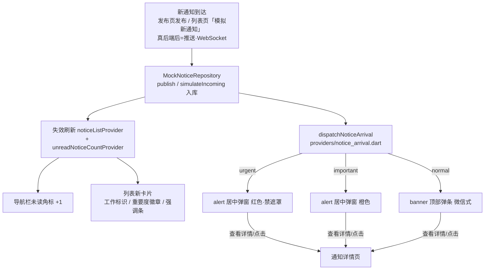

# UtenNotify（统一通知门面）

> **本项目通知系统的唯一调用入口。**
> 所有「通知 / 提醒 / 弹窗」一律通过 `UtenNotify`（或 `context.notify...` 扩展）调用，
> **禁止**业务代码直接 `showDialog` / `showSnackBar` / 操作 `Overlay`。
>
> 底层组件：
> - 顶部弹条 → [`lib/core/ui/app_notification.dart`](../../lib/core/ui/app_notification.dart)（[AppNotification.md](AppNotification.md)）
> - 居中弹窗 → [`lib/components/feedback/uten_center_alert.dart`](../../lib/components/feedback/uten_center_alert.dart)
> - 门面 → [`lib/core/ui/uten_notify.dart`](../../lib/core/ui/uten_notify.dart)

---

## 一、两条通道

| 通道 | 形态 | 类比 | 适用 | 阻塞性 |
|---|---|---|---|---|
| **`banner`** 顶部消息弹条 | 从屏幕顶部滑入一条消息，几秒自动消失 | 微信来消息弹窗 | 日常通知、操作反馈、状态变更 | 不阻塞，可滑走/点击 |
| **`alert`** 屏幕正中弹窗 | 居中模态弹窗，用户必须处理 | 系统强提醒 | 重要通知、需确认事项、紧急告警 | 阻塞，遮罩锁定 |

### 选型规则

| 场景 | 调用 |
|---|---|
| 操作反馈（保存成功 / 提交失败） | `UtenNotify.success / error / warning / info` |
| API 抛 `ApiException` | `UtenNotify.apiError(context, e)` |
| 来新消息、审批状态变更、日常提醒（可点进详情） | `UtenNotify.banner(..., onTap: 跳详情)` |
| 重要公告、需要用户阅读确认 | `UtenNotify.alert(..., level: normal / important)` |
| 紧急故障、强提醒、不容许错过 | `UtenNotify.alert(..., level: urgent)` 或 `UtenNotify.urgentAlert(...)` |
| 删除等破坏性二次确认 | 仍用 `UtenDialog`（确认对话框，不属于通知） |

### 居中弹窗三档紧急度（`UtenAlertLevel`）

| 级别 | 语义 | 配色/图标 | 遮罩点击关闭 | 确认按钮 |
|---|---|---|---|---|
| `normal` | 一般（不紧急） | 蓝 info / 铃铛 | ✅ 允许 | 青绿「确认」 |
| `important` | 重要 | 橙 warning / 感叹号圆 | ✅ 允许 | 青绿「确认」 |
| `urgent` | 紧急 | 红 error / 双感叹号 + 红描边 | ❌ **默认禁止** | 红「已知悉」 |

> urgent 默认 `barrierDismissible=false`，用户必须点按钮显式确认，保证强提醒不会丢失。
> 特殊场景可传 `barrierDismissible: true` 覆盖。

## 二、API

### 2.1 通道一：顶部弹条

```dart
// 语义快捷方式（操作反馈最常用）
UtenNotify.success(context, '员工入职成功');
UtenNotify.error(context, '工号已存在');
UtenNotify.warning(context, '库存不足');
UtenNotify.info(context, '已生成工资条 PDF');
UtenNotify.apiError(context, e, fallback: '提交失败'); // ApiException 自动展开

// 通用消息弹条（微信式：可自定义图标 + 点击跳详情）
UtenNotify.banner(
  context,
  title: '审批通知',
  message: '张经理 通过了你的请假申请',
  kind: AppNotificationKind.info,   // success/error/warning/info
  icon: Icons.approval_rounded,      // 可选，null 用 kind 语义图标
  duration: const Duration(seconds: 4),
  onTap: () => context.push('/notice/123'), // 点击跳详情并自动关闭弹条
);

// context 扩展（等价）
context.notifyBanner('张经理 通过了你的请假申请', onTap: () => context.push('/notice/123'));
```

| 参数 | 类型 | 默认值 | 说明 |
|---|---|---|---|
| `message` | `String` | 必填 | 正文 |
| `title` | `String?` | null | 可选标题（加粗一行） |
| `kind` | `AppNotificationKind` | `info` | 语义级别，决定配色 |
| `icon` | `IconData?` | null | 自定义左侧图标 |
| `onTap` | `VoidCallback?` | null | 点击动作，执行后自动关闭；null 时点击仅关闭 |
| `duration` | `Duration?` | 3.2s（error 5s） | 自动消失时长 |

底层行为（AppNotificationService 提供）：队列上限 3 条 FIFO、600ms 同 kind+message 合并去重、跨路由切换不丢失、左/右滑可关闭。

### 2.2 通道二：居中弹窗

```dart
// 一般提醒
await UtenNotify.alert(
  context,
  title: '新制度发布',
  message: '《考勤管理制度 V3》已生效，请查收。',
  level: UtenAlertLevel.normal,
);

// 重要提醒（橙色）
await UtenNotify.alert(context,
  title: '审批被驳回',
  message: '报销单 BX-2026-018 被驳回：发票信息不完整。',
  level: UtenAlertLevel.important,
);

// 紧急提醒（红色 + 禁止遮罩关闭）
final ok = await UtenNotify.alert(
  context,
  title: '设备故障',
  message: 'A 区 3 号产线已停机，请立即处理。',
  level: UtenAlertLevel.urgent,
  confirmLabel: '立即处理',
  onConfirm: () => context.push('/maintenance/42'),
);
// 紧急快捷方式
await UtenNotify.urgentAlert(context, title: '设备故障', message: '...');

// context 扩展（等价）
await context.notifyAlert(title: '...', message: '...', level: UtenAlertLevel.urgent);
```

| 参数 | 类型 | 默认值 | 说明 |
|---|---|---|---|
| `title` | `String` | 必填 | 标题 |
| `message` | `String?` | null | 纯文本正文（与 `content` 二选一） |
| `content` | `Widget?` | null | 自定义正文（富文本/列表等扩展场景） |
| `level` | `UtenAlertLevel` | `normal` | 紧急度三档 |
| `confirmLabel` | `String?` | 确认 / 紧急时「已知悉」 | 确认按钮文案 |
| `cancelLabel` | `String?` | null | 传文案则显示取消按钮（双按钮） |
| `barrierDismissible` | `bool?` | urgent 外为 true | 点遮罩是否关闭 |
| `icon` | `IconData?` | null | 自定义级别图标 |
| `onConfirm / onCancel` | `VoidCallback?` | null | 按钮回调 |

返回值：`true`=确认、`false`=取消、`null`=遮罩/返回键关闭。

## 三、视觉规范

- **顶部弹条**：status bar 下方 8dp，全宽左右各留 16dp；背景/文字/图标取 `colorScheme`（success=primary、error=error、warning=tertiary、info=surfaceContainerHighest）；滑入 220ms easeOutCubic，可滑动关闭。
- **居中弹窗**：最大宽 400dp、最大高 520dp，圆角 16；56dp 圆形级别图标居中置顶；内容超长可滚动；urgent 带 1.5dp 红色描边 + 加深遮罩（55%）。

## 四、响应式 / 性能档 / 主题与 i18n

- **响应式**：两条通道都挂在 `MaterialApp.builder` 之上，三档断点表现一致；弹窗 `maxWidth=400` 保证窄屏不超宽。
- **性能档**：居中弹窗进场时长按 `PerformanceTier.durationFactor` 缩放（lite 档 140ms / 其他 280ms）；弹条动画沿用 AppNotification 规则（lite 不开模糊/长动画）。
- **主题**：全部走 `colorScheme` / `UtenColors` 语义 token，深色模式自动适配。
- **i18n**：业务文案走 `AppLocalizations`；组件默认按钮文案（确认/已知悉）与 `UtenDialog` 一致为中文兜底。

## 五、挂载结构

```
MaterialApp.builder
└── Stack
    ├── child（路由页面）
    └── AppNotificationHost        ← 顶部弹条渲染层（全局 Provider 队列驱动）

UtenNotify.alert → showGeneralDialog → _CenterAlertDialog  ← 居中弹窗（按需 push）
```

## 六、扩展方式

新增通知形态（底部弹条、常驻横幅、声音/震动联动等）**只在 `UtenNotify` 加静态方法**，
底层可复用 AppNotificationService 队列或 UtenCenterAlert 样式，业务侧调用方式不变。

## 七、通知模块全链路（features/notice）

通知模块（导航栏「通知」）是两条通道的第一个完整消费者，链路已打通：



- **分派规则**：`Notice.priority`（normal/important/urgent）决定弹哪条通道——见 `lib/features/notice/providers/notice_arrival.dart`。
- **工作标识**：`NoticeType.task/approval/workflow`（任务下发/审批结果/上游完成）属于工作类，`type.isWork=true`，卡片带「工作」描边小签，与公告广播一眼可辨。
- **已接入的业务事件**：访客审批流转（`lib/features/visitor_approval/providers/visitor_notice_bridge.dart`）——HR 批准/驳回/转接待人、被访人确认/拒绝，都会自动生成工作通知并按上述规则弹提醒（驳回=important 居中弹窗，其余 normal 顶部弹条）。其他模块（报销审批、任务系统）要发通知，照此模式：造一条 `Notice` → 入库 → `dispatchNoticeArrival`。
- **接真后端**：推送/WebSocket 收到一条 Notice 后 → 仓储入库 → 列表/角标失效刷新 → 调 `dispatchNoticeArrival`。业务方不需要碰弹窗细节。

## 八、避坑

1. **不要用 `ScaffoldMessenger.showSnackBar`**——跟最近 Scaffold 绑定，跨页面 pop 后消息丢失；本项目 Phase 1.0+ 已全面废除。
2. **`UtenToast`（底部轻提示）仅存量兼容**，新功能一律走 `UtenNotify`。
3. **async 后用 context 先判 `mounted`**：
   ```dart
   await someAsync();
   if (!context.mounted) return;
   UtenNotify.success(context, '完成');
   ```
4. **urgent 弹窗不要连发**：强提醒会打断操作，连发多条等于没有提醒；批量紧急事件请合并成一条。

---

**最后更新**：2026-07-28 · **门面**：`lib/core/ui/uten_notify.dart` · **组件**：`lib/components/feedback/uten_center_alert.dart`、`lib/core/ui/app_notification.dart`
