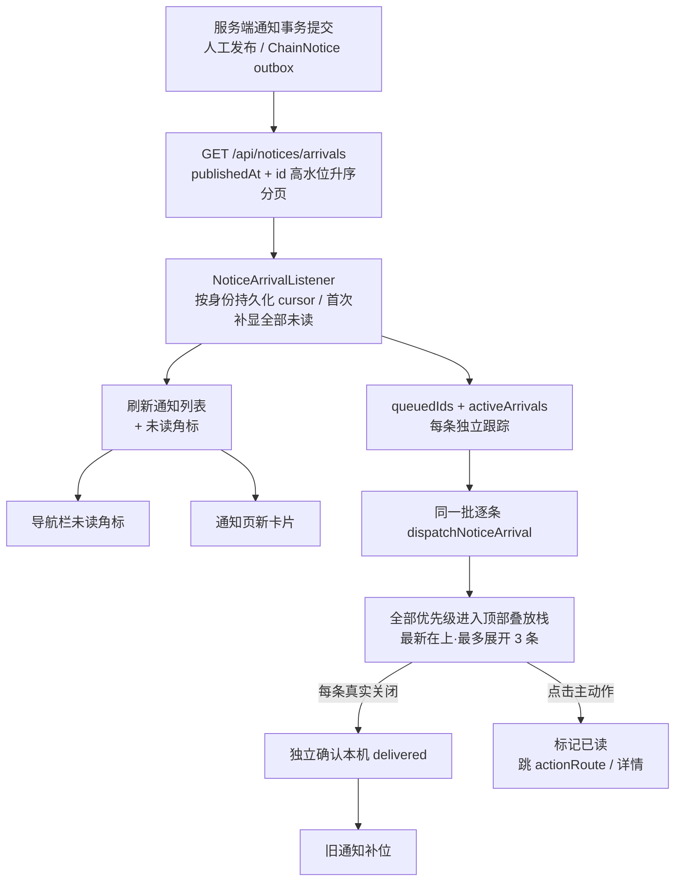

# UtenNotify（统一通知门面）

> **本项目通知系统的唯一调用入口。**
> 所有「通知 / 提醒 / 弹窗」一律通过 `UtenNotify`（或 `context.notify...` 扩展）调用，
> **禁止**业务代码直接 `showDialog` / `showSnackBar` / 操作 `Overlay`。
>
> 底层组件：
> - 顶部弹条 → [`lib/core/ui/app_notification.dart`](../../lib/core/ui/app_notification.dart)（[AppNotification.md](AppNotification.md)）
> - 居中弹窗 → [`lib/components/feedback/uten_center_alert.dart`](../../lib/components/feedback/uten_center_alert.dart)
> - 门面 → [`lib/core/ui/uten_notify.dart`](../../lib/core/ui/uten_notify.dart)

---

## 一、两条通道

| 通道 | 形态 | 类比 | 适用 | 阻塞性 |
|---|---|---|---|---|
| **`banner`** 顶部消息弹条 | 从屏幕顶部滑入一条消息，几秒自动消失 | 微信来消息弹窗 | 日常通知、操作反馈、状态变更 | 不阻塞，可滑走/点击 |
| **`alert`** 屏幕正中弹窗 | 居中模态弹窗，用户必须处理 | 系统强提醒 | 重要通知、需确认事项、紧急告警 | 阻塞，遮罩锁定 |

### 选型规则

| 场景 | 调用 |
|---|---|
| 操作反馈（保存成功 / 提交失败） | `UtenNotify.success / error / warning / info` |
| API 抛 `ApiException` | `UtenNotify.apiError(context, e)` |
| 来新消息、审批状态变更、日常提醒（可点进详情） | `UtenNotify.banner(..., onTap: 跳详情)` |
| 重要公告、需要用户阅读确认 | `UtenNotify.alert(..., level: normal / important)` |
| 紧急故障、强提醒、不容许错过 | `UtenNotify.alert(..., level: urgent)` 或 `UtenNotify.urgentAlert(...)` |
| 删除等破坏性二次确认 | 仍用 `UtenDialog`（确认对话框，不属于通知） |

> **业务到达提醒统一走通知中心 + 顶部非阻塞叠放。** 服务端标为
> `important/urgent` 的事件只提升语义颜色、标题前缀、停留时间与栈内优先级，
> 不再由默认到达链弹出居中模态窗。通用 `UtenNotify.alert` 仍可用于当前页面明确发起、
> 必须立即确认且不属于通知到达的交互。该后置决策见
> [ADR-059](../99-决策记录-ADR/ADR-059-委外目标件出仓与前置自制准备.md)。

### 居中弹窗三档紧急度（`UtenAlertLevel`）

| 级别 | 语义 | 配色/图标 | 遮罩点击关闭 | 确认按钮 |
|---|---|---|---|---|
| `normal` | 一般（不紧急） | 蓝 info / 铃铛 | ✅ 允许 | 青绿「确认」 |
| `important` | 重要 | 橙 warning / 感叹号圆 | ✅ 允许 | 青绿「确认」 |
| `urgent` | 紧急 | 红 error / 双感叹号 + 红描边 | ❌ **默认禁止** | 红「已知悉」 |

> urgent 默认 `barrierDismissible=false`，用户必须点按钮显式确认，保证强提醒不会丢失。
> 通用 `important` 仍允许页面业务主动选择遮罩关闭；通知到达链不调用本模态 API。
> 特殊的页面内即时提示可传 `barrierDismissible: true`，但不得用于服务端关键事件到达。

## 二、API

### 2.1 通道一：顶部弹条

```dart
// 语义快捷方式（操作反馈最常用）
UtenNotify.success(context, '员工入职成功');
UtenNotify.error(context, '工号已存在');
UtenNotify.warning(context, '库存不足');
UtenNotify.info(context, '已生成工资条 PDF');
UtenNotify.apiError(context, e, fallback: '提交失败'); // ApiException 自动展开

// 通用消息弹条（微信式：可自定义图标 + 点击跳详情）
UtenNotify.banner(
  context,
  title: '审批通知',
  message: '张经理 通过了你的请假申请',
  kind: AppNotificationKind.info,   // success/error/warning/info
  icon: Icons.approval_rounded,      // 可选，null 用 kind 语义图标
  duration: const Duration(seconds: 4),
  onTap: () => context.push('/notice/123'), // 点击跳详情并自动关闭弹条
  onDismissed: () => recordDelivered(),    // 真正显示并关闭后调用；clear/未轮到不调用
);

// context 扩展（等价）
context.notifyBanner('张经理 通过了你的请假申请', onTap: () => context.push('/notice/123'));
```

| 参数 | 类型 | 默认值 | 说明 |
|---|---|---|---|
| `message` | `String` | 必填 | 正文 |
| `title` | `String?` | null | 可选标题（加粗一行） |
| `kind` | `AppNotificationKind` | `info` | 语义级别，决定配色 |
| `icon` | `IconData?` | null | 自定义左侧图标 |
| `onTap` | `VoidCallback?` | null | 点击动作，执行后自动关闭；null 时点击仅关闭 |
| `onDismissed` | `VoidCallback?` | null | 本条实际显示并完成关闭后调用一次；排队未显示、宿主销毁或 `clear()` 不调用 |
| `duration` | `Duration?` | 3.2s（error 5s） | 自动消失时长（默认值随文案长度/字段错误自动延长，鼠标悬停时暂停） |

底层行为（AppNotificationService 提供）：最新通知叠在旧通知上，默认收拢，可展开最近 3 条；超过展示上限的通知继续保留在队列中，上层关闭后自动补位，不做 FIFO 丢弃。600ms 内同 kind+message 合并去重（`force: true` 可绕过，见 [AppNotification](AppNotification.md)），跨路由切换不丢失，可左/右滑关闭。
**停留时长**（适老化）：默认 info/success/warning 3.2s、error 5s；文案每多约 12 字自动 +0.6s，带字段错误再 +1.5s，确保操作人员读得完。**桌面端鼠标悬停在弹条上时暂停倒计时**，移开重新计时；触摸端无此行为。

### 2.2 通道二：居中弹窗

```dart
// 一般提醒
await UtenNotify.alert(
  context,
  title: '新制度发布',
  message: '《考勤管理制度 V3》已生效，请查收。',
  level: UtenAlertLevel.normal,
);

// 重要提醒（橙色）
await UtenNotify.alert(context,
  title: '审批被驳回',
  message: '报销单 BX-2026-018 被驳回：发票信息不完整。',
  level: UtenAlertLevel.important,
);

// 紧急提醒（红色 + 禁止遮罩关闭）
final ok = await UtenNotify.alert(
  context,
  title: '设备故障',
  message: 'A 区 3 号产线已停机，请立即处理。',
  level: UtenAlertLevel.urgent,
  confirmLabel: '立即处理',
  onConfirm: () => context.push('/maintenance/42'),
);
// 紧急快捷方式
await UtenNotify.urgentAlert(context, title: '设备故障', message: '...');

// context 扩展（等价）
await context.notifyAlert(title: '...', message: '...', level: UtenAlertLevel.urgent);
```

| 参数 | 类型 | 默认值 | 说明 |
|---|---|---|---|
| `title` | `String` | 必填 | 标题 |
| `message` | `String?` | null | 纯文本正文（与 `content` 二选一） |
| `content` | `Widget?` | null | 自定义正文（富文本/列表等扩展场景） |
| `level` | `UtenAlertLevel` | `normal` | 紧急度三档 |
| `confirmLabel` | `String?` | 确认 / 紧急时「已知悉」 | 确认按钮文案 |
| `cancelLabel` | `String?` | null | 传文案则显示取消按钮（双按钮） |
| `barrierDismissible` | `bool?` | urgent 外为 true | 点遮罩是否关闭 |
| `blockSystemBack` | `bool` | false | 是否禁止系统返回键/Escape 静默关闭；业务强提醒固定 true |
| `interruptSignal` | `Listenable?` | null | 登录账号/模拟身份退出时精确移除本弹窗，不写 popup ack |
| `icon` | `IconData?` | null | 自定义级别图标 |
| `maxWidth / maxHeight` | `double` | 400 / 520 | 业务富内容弹窗可受控放宽；仍受屏幕 inset 和滚动约束 |
| `onConfirm / onCancel` | `VoidCallback?` | null | 按钮回调 |

返回值：`true`=确认、`false`=取消、`null`=遮罩/返回键关闭。

## 三、统一操作反馈（guardAction，写操作首选）

> [`lib/core/ui/action_feedback.dart`](../../lib/core/ui/action_feedback.dart)
> 一行调用自带「成功 / 业务失败 / 网络失败」顶部通知，消灭每个页面重复的
> `try / on ApiException / catch` 三段样板，并杜绝"点了按钮毫无反馈"的静默失败。

```dart
// 写操作（保存/审核/红冲/删除/提交）：成功弹 success，失败自动弹错误条并返回 null
final detail = await context.guardAction(
  () => repo.approve(id),
  success: '已审核',
);
if (detail == null) return; // 失败已弹通知（含后端 message + fieldErrors）

// 读操作（加载列表/详情/报表）：成功不打扰，失败弹错误条
final rows = await context.guardLoad(() => repo.list());

// 只关心成败的 void 操作（bool 回调场景）
final ok = await context.guardRun(
  () => repo.delete(id),
  success: '已删除',
);
```

错误映射（全部走 AppNotificationService 顶部弹条）：
`ApiException` → 后端 `message` + `fieldErrors`（网络断连 `NetworkException` 自带
「网络连接失败，请检查后重试」；5xx「服务器繁忙」；401/403/429 各有语义文案）；
其它异常 → `errorFallback`（默认「操作失败，请稍后重试」）。

## 四、视觉规范

- **顶部弹条**：与「连接恢复横幅」共用 [`UtenTopBannerCard`](../../lib/core/ui/uten_top_banner_card.dart) ——居中、最大宽 720、圆角 14、elevation 4、柔和 `*Container` 容器色（success=`primaryContainer`、error=`errorContainer`、warning=`tertiaryContainer`、info=浅蓝 `UtenColors.infoContainer`）。**卡片按内容收缩到 ≤720**（短文案 → 小卡，长文案 → 720 处换行），不是恒为 720 满宽。
  > 本主题 `primary/secondary/tertiaryContainer` 同为 teal，故 **success 与 warning 同底色，靠语义图标区分**（✓ / ⚠）；error 浅红、info 浅灰各自独立。这是主题决定、非 bug。滑入 220ms easeOutCubic，可左/右滑关闭。
  >
  > **只占卡片宽度，两侧点击放行**：`UtenTopBannerCard` 是纯卡片（不含 `SafeArea`/`Center`，按内容收缩到 ≤720），居中与状态栏留白由宿主层（透明的 `Center`/`Column`）负责。透明居中层无手势监听，故**弹条两侧的空白不会拦截下方页面的点击**——只有卡片像素可交互（点、滑、关闭）。悬停/点按反馈用前景色低透明叠加，而非 Material 默认灰高亮（避免把绿/红卡片刷成灰条）。
- **居中弹窗**：最大宽 400dp、最大高 520dp，圆角 16；56dp 圆形级别图标居中置顶；内容超长可滚动；urgent 带 1.5dp 红色描边 + 加深遮罩（55%）。

## 四、响应式 / 性能档 / 主题与 i18n

- **响应式**：两条通道都挂在 `MaterialApp.builder` 之上，三档断点表现一致；弹窗 `maxWidth=400` 保证窄屏不超宽。
- **性能档**：居中弹窗进场时长按 `PerformanceTier.durationFactor` 缩放（lite 档 140ms / 其他 280ms）；弹条动画沿用 AppNotification 规则（lite 不开模糊/长动画）。
- **主题**：全部走 `colorScheme` / `UtenColors` 语义 token，深色模式自动适配。
- **i18n**：业务文案走 `AppLocalizations`；组件默认按钮文案（确认/已知悉）与 `UtenDialog` 一致为中文兜底。

## 五、挂载结构

```
MaterialApp.builder
└── Stack
    ├── child（路由页面）
    ├── ConnectionRecoveryBanner   ← 连接状态横幅（断网/重连/恢复）
    └── AppNotificationHost        ← 顶部弹条渲染层（全局 Provider 队列驱动）

两者视觉外壳同出 UtenTopBannerCard（居中 / maxWidth 720 / 圆角 14 / elevation 4）。

UtenNotify.alert → showGeneralDialog → _CenterAlertDialog  ← 居中弹窗（按需 push）
```

## 六、扩展方式

新增通知形态（底部弹条、常驻横幅、声音/震动联动等）**只在 `UtenNotify` 加静态方法**，
底层可复用 AppNotificationService 队列或 UtenCenterAlert 样式，业务侧调用方式不变。

## 七、通知模块全链路（features/notice）

通知模块（导航栏「通知」）已同时接通通知箱、未读角标和员工端顶部非阻塞到达提醒。
接收端先用轻量轮询可靠补齐；后续替换为 SSE/WebSocket 时继续复用同一分派入口：



- **接收规则**：`NoticeArrivalListener` 挂在 `MaterialApp.builder` 内的已登录员工根层，并要求当前有效用户拥有 `notice:read`；跳转使用 `appNavigatorKey.currentContext`，所以访问权限拒绝页/404 页时接收器也不会卸载。cursor 与本机 deliveredIds 按账号/模拟身份持久化；首次从纪元分页全部未读且本机未展示的通知。之后每 10s 按 `(publishedAt,id)` 严格高水位升序拉取，每页最多 100 条并循环到 `hasMore=false`；每分钟从纪元全量对账，补回晚提交事件。既有 `popup_acknowledged_at` / popup-ack API 只保留历史兼容，默认 Flutter 到达链不再写入。
- **分派规则**：同一轮拉到的 normal / important / urgent 全部交给顶部栈，不等待上一条关闭。低优先级先入栈、important / urgent 后入栈，因此最高优先级位于视觉最上层；级别同时决定 info / warning / error 配色和 4s / 6s / 8s 停留时间。
- **点击行为**：任意优先级顶部条点击均先标注已读，再跳 `notice.actionRoute`（附 `returnTo=/notice`）；空路由或历史脏路由回退通知详情弹层。顶部关闭只确认本设备已真实展示，不清通知未读，不冒充业务完成。
- **排队、确认与恢复**：每个 active notice ID 独立持有 `onDismissed`；只有真实关闭才加入 deliveredIds 并持久化，重复回调幂等忽略。超过 3 条只限制同时完整展示，队列不删除；`clear()`、身份切换、宿主销毁或进程中断不会误确认，重启/全量对账只重放未关闭项。
- **业务事件覆盖**：到达 feed 面向当前员工全部可见 Notice；业务模块只负责可靠落库/outbox、接收人、`source_event`、priority、业务操作者/时间/原因和 actionRoute，不直接操作 Flutter 弹层。角标另读真实任务状态；通知未读不能冒充未解决业务。
- **V459 审核待办卡（ADR-063）**：`source_event` 在服务端 `ReviewNoticeCatalog` 注册的通知
  （DTO `interactive=true`）不走普通顶部条，改走 `dispatchReviewCard`：带【去审核（filled）/
  稍后再看】操作按钮区与动态状态行（`statusLine` ValueNotifier），停留 20s（悬停暂停）。
  弹前先调 `GET /notices/pending-review-status` 真态校验（已办结不弹）；停留期间每 30s 心跳：
  他人认领 → 状态行「XX 正在审核」，办结 → 自动收卡 + 「已由他人处理」轻提示。两按钮均
  标注已读（R6）；稍后再看 = 服务端 `snoozed_until` 15 分钟（跨设备一致，到点未办结重弹）。
  `banner()` 新增 `actions`/`statusLine` 参数并返回卡片 id（办结收卡用）。arrivals 服务端
  排除已办结（resolved_at 非空）与未到期 snooze 的通知。
- **V459 第二轮（居中审核弹窗）**：同一事件三形态并存——通知中心条目 + 顶部条 +
  **居中审核弹窗**（[`ReviewPendingDialog`](ReviewPendingDialog.md)，主交互：认领状态
  实时/去审核/稍后再看/办结自关）。**每次登录检查**：`ReviewPendingLoginGate` 登录后 3s
  拉 `GET /notices/pending-reviews`（未办结+未稍后）有则弹；snooze 是唯一静默途径，
  X 关闭下次登录仍提醒。弹窗单例防叠窗。

## 八、避坑

1. **不要用 `ScaffoldMessenger.showSnackBar`**——跟最近 Scaffold 绑定，跨页面 pop 后消息丢失；本项目 Phase 1.0+ 已全面废除（2026-07-29 清完最后 5 处残留：生产调度/订单列表/批量发货面板/采购报表/委外枢纽）。
2. **`UtenToast` 已改为适配层**（2026-07-29）：内部转发到 AppNotificationService，存量调用不用改；新代码一律 `context.appSuccess/Error` 或 `context.guardAction(...)`。
3. **async 后用 context 先判 `mounted`**：
   ```dart
   await someAsync();
   if (!context.mounted) return;
   UtenNotify.success(context, '完成');
   ```
4. **业务通知不要直接操作 Overlay/弹窗**：统一落库后由到达 feed 和 `dispatchNoticeArrival` 分派；批量到达一次进入顶部叠放层，每条关闭、已读和业务完成仍是独立事实。业务动作完成后可用 `markNoticesReadByRoute(container, routes)`（`POST /api/notices/read-by-route`，action_route 精确匹配）把指向对应单据的通知自动置已读——只是已读，不冒充业务完成。

---

**最后更新**：2026-08-30（ADR-059：全部到达提醒顶部非阻塞叠放、批次并发派发、逐条 delivered、默认链不写 popup ack） · **门面**：`lib/core/ui/uten_notify.dart` · **操作反馈**：`lib/core/ui/action_feedback.dart`（guardAction/guardLoad/guardRun） · **组件**：`lib/core/ui/app_notification.dart`、`lib/core/ui/app_notification_stack.dart`、`lib/core/ui/uten_top_banner_card.dart` · **通知模块**：`/api/notices` + `/api/notices/arrivals`
