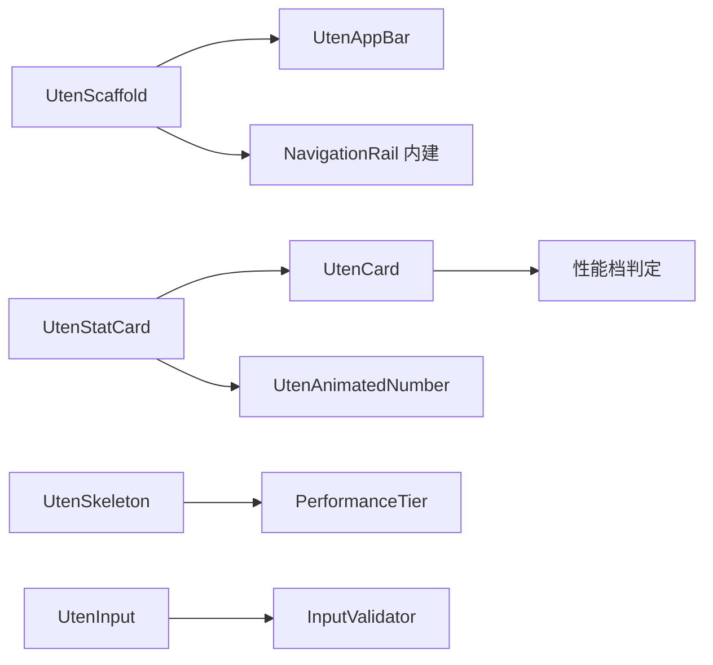

# 组件库总览

> 本档列出 Uten IMP 组件库的所有组件，按分类组织。
> 每个组件在 `02-组件库/` 下有独立的详细文档（格式见末尾模板）。
> 使用规范见 [../00-项目准则/09-组件库使用规范.md](../00-项目准则/09-组件库使用规范.md)。

---

## 一、组件库原则

1. **业务代码必须用组件库**：禁止直接堆 `Container/SizedBox/Padding/Card/Button`
2. **组件复用而非复制**：3 处以上重复的 UI 抽成组件
3. **响应式内建**：组件内部处理三档断点，业务无感
4. **性能档内建**：组件读取 PerformanceProvider 决定是否启用 blur/动画
5. **主题/语言自适应**：组件用 token，不硬编码颜色/字号/文案
6. **前缀统一 `Uten`**：所有组件类名 `Uten` 开头

---

## 二、组件分类与清单

### 2.1 Buttons（按钮）— `components/buttons/`

| 组件 | 用途 | Phase |
|---|---|---|
| `UtenButton` | 主按钮（primary/secondary/ghost/danger） + loading + 三尺寸 | 0 |
| `UtenIconButton` | 图标按钮 | 1 |

### 2.2 Cards（卡片）— `components/cards/`

| 组件 | 用途 | Phase |
|---|---|---|
| `UtenCard` | 通用卡片（玻璃/实心/轮廓，性能档决定 blur） | 0 |
| `UtenStatCard` | 数据统计卡（数值 + 趋势 + 图标 + 标题） | 0 |
| `UtenInfoCard` | 信息展示卡（标题 + 多行内容 + 操作） | 1 |
| `UtenPersonCard` | 人物/实体卡片（头像+标题+副标题+尾部，业务无关，复用于员工/审批人/联系人） | 2 |

### 2.3 Inputs（输入）— `components/inputs/`

| 组件 | 用途 | Phase |
|---|---|---|
| `UtenInput` | 文本/密码/搜索输入框 + 客户端校验 | 0 |
| `UtenSelect` | 下拉选择（匹配 UtenInput 视觉：label/outline/prefixIcon） | 2 |
| `UtenDropdown` | 下拉选择 | 1 |
| `UtenDatePicker` | 日期选择 | 1 |
| `UtenSearchField` | 搜索框（带清除按钮 + 防抖） | 1 |
| `UtenSwitch` | 开关 | 1 |

### 2.4 Feedback（反馈）— `components/feedback/`

| 组件 | 用途 | Phase |
|---|---|---|
| `UtenEmpty` | 空状态（图标 + 文案 + 可选动作按钮） | 0 |
| `UtenSkeleton` | 骨架屏（性能档决定闪烁） | 0 |
| `UtenToast` | 轻提示（success/warning/error/info） | 0 |
| `UtenLoading` | 加载指示器（菊花/点） | 0 |
| `UtenConfirmDialog` | 确认对话框 | 1 |
| `UtenDialog` | 确认对话框（UtenButton 动作 + 主题适配，静态 show 方法） | 2 |

### 2.5 Layout（布局）— `components/layout/`

| 组件 | 用途 | Phase |
|---|---|---|
| `UtenScaffold` | 响应式外壳（手机底部 Tab / 平板侧边 NavRail 自动切） | 0 |
| `UtenAppBar` | 自适应顶栏（手机紧凑 / 大屏带搜索） | 0 |
| `UtenResponsiveGrid` | Wrap 瀑布流网格，列数基于 LayoutBuilder **容器宽度**自动算（非屏幕宽度）；`itemBuilder(context, index, itemWidth)` 第三参为单格宽度 | 0 |
| `UtenMasterDetail` | 列表-详情双栏（手机端切换、平板+左右分栏） | 1 |
| `UtenSectionHeader` | 区块标题（标题 + 可选图标 + 可选尾部操作 + `subdued` 弱化态）✅ | 1 |
| `UtenBottomActionBar` | 底部固定操作栏（内容滚动、主操作按钮吸底、多按钮同一行排布）✅ | 1 |
| `UtenContentWidth` | 限制最大宽度居中（大屏避免内容过宽） | 0 |

### 2.6 Data Display（数据展示）— `components/data_display/`

| 组件 | 用途 | Phase |
|---|---|---|
| `UtenAnimatedNumber` | 数字滚动动画（rich 档才动，lite 档直接显示） | 0 |
| `UtenDataTable` | 响应式表格（窄屏转卡片列表） | 1 |
| `UtenTag` | 标签（status/category） | 1 |
| `UtenAvatar` | 头像（图片/文字 fallback） | 1 |
| `UtenTimeline` | 时间线（审批流/进度） | 2 |
| `UtenChartPlaceholder` | 图表占位（Phase 5 选定图表库后替换） | 5 |

### 2.7 Settings（设置类）— `components/settings/`

| 组件 | 用途 | Phase |
|---|---|---|
| `UtenThemeSwitcher` | 主题切换 UI（浅色/深色/跟随系统） | 0 |
| `UtenLocaleSwitcher` | 语言切换 UI（中/英） | 0 |
| `UtenFontScaler` | 字号调节 UI（小/中/大/超大） | 0 |
| `UtenPerformanceTierSwitcher` | 性能档切换 UI（自动/省电/标准/极致） | 0 |

---

## 三、Phase 0 核心组件（必须先实现）

| # | 组件 | 文件 | 文档 |
|---|---|---|---|
| 1 | UtenButton | `buttons/uten_button.dart` | [UtenButton.md](UtenButton.md) ⏳ |
| 2 | UtenCard | `cards/uten_card.dart` | [UtenCard.md](UtenCard.md) ⏳ |
| 3 | UtenInput | `inputs/uten_input.dart` | [UtenInput.md](UtenInput.md) ⏳ |
| 4 | UtenStatCard | `cards/uten_stat_card.dart` | [UtenStatCard.md](UtenStatCard.md) ⏳ |
| 5 | UtenScaffold | `layout/uten_scaffold.dart` | [UtenScaffold.md](UtenScaffold.md) ⏳ |
| 6 | UtenAppBar | `layout/uten_app_bar.dart` | [UtenAppBar.md](UtenAppBar.md) ⏳ |
| 7 | UtenEmpty | `feedback/uten_empty.dart` | [UtenEmpty.md](UtenEmpty.md) ⏳ |
| 8 | UtenSkeleton | `feedback/uten_skeleton.dart` | [UtenSkeleton.md](UtenSkeleton.md) ⏳ |
| 9 | UtenAnimatedNumber | `data_display/uten_animated_number.dart` | [UtenAnimatedNumber.md](UtenAnimatedNumber.md) ⏳ |
| 10 | UtenThemeSwitcher | `settings/uten_theme_switcher.dart` | [UtenThemeSwitcher.md](UtenThemeSwitcher.md) ⏳ |
| 11 | UtenLocaleSwitcher | `settings/uten_locale_switcher.dart` | [UtenLocaleSwitcher.md](UtenLocaleSwitcher.md) ⏳ |
| 12 | UtenFontScaler | `settings/uten_font_scaler.dart` | [UtenFontScaler.md](UtenFontScaler.md) ⏳ |

> 另外还有辅助组件 `UtenLoading`、`UtenToast`、`UtenContentWidth`、`UtenResponsiveGrid`、`UtenPerformanceTierSwitcher` 也在 Phase 0 实现（地基必需）。

文档在 Phase 0.3 实现组件时同步创建，替换上表的 ⏳ 链接。

---

## 四、新增组件流程

1. **判断是否需要新组件**：满足以下任一
   - 3 处以上重复 UI
   - 有响应式/性能档需求
   - 复杂交互值得封装
2. **先写文档**：在 `02-组件库/` 下新建 `UtenXxx.md`，按模板（见末尾）写完
3. **实现组件**：在 `lib/components/<分类>/uten_xxx.dart` 实现
4. **加到本总览**：本文档对应分类下加一行
5. **更新 barrel**：`lib/components/index.dart` 导出
6. **写示例**：在 `lib/components/_showcase/` 下加 demo 页（用于联调）

---

## 五、组件文档标准模板

```markdown
# UtenXxx

## 一、用途
解决什么问题 / 何时用 / 何时不用

## 二、API（参数表）
| 参数 | 类型 | 默认值 | 说明 |
|---|---|---|---|

## 三、响应式行为
compact / medium / expanded 三档下的表现

## 四、性能档行为
lite / standard / rich 三档下的表现（哪些动画/模糊会被禁用）

## 五、主题与国际化适配
颜色取自哪个 token、字号如何走 textTheme、文案是否需要 i18n

## 六、示例代码
Dart 代码示例（至少 2 个：最简用法 + 完整用法）

## 七、实现要点
关键实现细节、注意事项、避坑
```

---

## 六、组件依赖关系



避免循环依赖，组件只能向下依赖（基础组件不依赖业务组件）。

---

## 七、参考资源

- [Material 3 Components](https://m3.material.io/components)
- [Flutter Material Library](https://api.flutter.dev/flutter/material/material-library.html)

---

**最后更新**：2026-07-22 · **Phase 0 组件进度**：0 / 12
