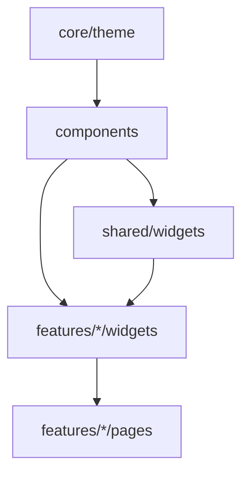

# 组件库总览

> 本文只登记当前源码中真实存在的公共 UI。以 `lib/components/` 为基础组件层，`lib/shared/widgets/` 为跨模块业务组合层；模块私有组件仍放在各自 `features/<module>/` 下。
>
> 使用约束见[组件库使用规范](../00-项目准则/09-组件库使用规范.md)。最后核对：2026-08-14。

---

## 一、分层原则

1. 基础组件不得依赖具体业务模块、接口模型或权限模型。
2. 两个及以上模块稳定复用、且包含业务语义的组合组件放在 `lib/shared/widgets/`；仅一个模块使用的组件留在该模块内。
3. 页面优先组合已有组件；只有重复交互已经稳定时才继续抽象，避免为“看起来统一”制造过度封装。
4. 颜色、字号、圆角、阴影和动效取自 `lib/core/theme/`；业务页面不得新增裸 `Color(0x...)`。
5. 公共交互必须覆盖 loading、disabled、empty、error、键盘、焦点、窄屏和权限拒绝状态。
6. 项目当前没有 `lib/components/index.dart` barrel；调用方直接导入所需文件，避免无关依赖扩散。

---

## 二、基础组件清单

### 2.1 品牌与按钮

| 源码 | 对外能力 | 适用范围 |
|---|---|---|
| [`uten_brand_mascot.dart`](../../lib/components/brand/uten_brand_mascot.dart) | `UtenBrandMascot` | 品牌吉祥物 |
| [`uten_wordmark_logo.dart`](../../lib/components/brand/uten_wordmark_logo.dart) | `UtenWordmarkLogo` | 品牌文字标识 |
| [`celebration_particles.dart`](../../lib/components/effects/celebration_particles.dart) | `CelebrationParticleField` | 庆典彩屑粒子场（CustomPainter+AnimationController，`animated` 由调用方按性能档传入，控制器 dispose） |
| [`uten_button.dart`](../../lib/components/buttons/uten_button.dart) | `UtenButton`，primary/secondary/tonal/ghost/danger，三种尺寸，loading/disabled，可选 `onDisabledTap`（禁用态点击出提示） | 常规动作 |
| [`click_guard.dart`](../../lib/components/buttons/click_guard.dart) | `ClickGuard`、`UtenActionButton` | 异步防连点和动作状态 |
| [`uten_back_button.dart`](../../lib/components/buttons/uten_back_button.dart) | `UtenBackButton` | 统一返回 |
| [`uten_export_button.dart`](../../lib/components/buttons/uten_export_button.dart) | `UtenExportButton` | 表格导出（可选密码保护） |
| [`uten_import_button.dart`](../../lib/components/buttons/uten_import_button.dart) | `UtenImportButton` | 文件导入入口 |

### 2.2 卡片与数据展示

| 源码 | 对外能力 | 适用范围 |
|---|---|---|
| [`uten_card.dart`](../../lib/components/cards/uten_card.dart) | `UtenCard`，solid/glass/outlined | 通用容器 |
| [`uten_hub_card.dart`](../../lib/components/cards/uten_hub_card.dart) | `UtenHubCard`，图标+标题+副标题+右上角徽章浮层，支持 enabled/未启用 | 二级模块页入口卡片 |
| [`uten_person_card.dart`](../../lib/components/cards/uten_person_card.dart) | `UtenPersonCard` | 人员或实体摘要 |
| [`uten_info_row.dart`](../../lib/components/data_display/uten_info_row.dart) | `UtenInfoRow` | 标签—值信息行 |
| [`uten_status_badge.dart`](../../lib/components/data_display/uten_status_badge.dart) | `UtenStatusBadge` | 语义化状态 |
| [`uten_user_avatar.dart`](../../lib/components/data_display/uten_user_avatar.dart) | `UtenUserAvatar` | 图片/姓名回退头像 |

统计 KPI 当前由页面业务卡或 [`DocKpiBar`](../../lib/shared/widgets/doc_kpi_bar.dart) 组合实现。项目中没有 `UtenStatCard`、`UtenAnimatedNumber`、`UtenDataTable`、`UtenTimeline` 或 `UtenChartPlaceholder`，文档和新代码不得把这些名字当成已实现 API。

### 2.3 输入与表单

| 源码 | 对外能力 | 适用范围 |
|---|---|---|
| [`uten_input.dart`](../../lib/components/inputs/uten_input.dart) | `UtenInput` | 文本、数字、密码等输入 |
| [`uten_search_bar.dart`](../../lib/components/inputs/uten_search_bar.dart) | `UtenSearchBar` | 清空 + 300ms 防抖；`onInputChanged` 可在按键当下使旧请求失效，uncontrolled `initialValue` 支持响应式双位置文本同步 |
| [`uten_dropdown_field.dart`](../../lib/components/inputs/uten_dropdown_field.dart) | `UtenDropdownField`、`UtenDropdownItem` | 标准下拉选择 |
| [`uten_date_field.dart`](../../lib/components/inputs/uten_date_field.dart) | `UtenDateField` | 日期选择 |
| [`uten_employee_picker.dart`](../../lib/components/inputs/uten_employee_picker.dart) | `UtenEmployeePicker` | 异步员工选择 |
| [`maker_audit_fields.dart`](../../lib/components/forms/maker_audit_fields.dart) | `utenMakerAuditCells` | 制单/审计只读字段 |
| [`link_quantity_validator.dart`](../../lib/components/forms/link_quantity_validator.dart) | `validateLinkQuantity`、`LatestLinkRequestGuard` | 关联数量校验与竞态防护 |

不存在独立的 `UtenSelect`、`UtenDropdown`、`UtenDatePicker` 或 `UtenSwitch`。对应场景分别使用 `UtenDropdownField`、`UtenDateField`；开关使用 Material `Switch` 并遵循主题。

### 2.4 反馈与通知

| 源码 | 对外能力 | 适用范围 |
|---|---|---|
| [`uten_empty.dart`](../../lib/components/feedback/uten_empty.dart) | `UtenEmpty` | 空状态 |
| [`uten_skeleton.dart`](../../lib/components/feedback/uten_skeleton.dart) | `UtenSkeleton`、`UtenSkeletonList` | 加载骨架 |
| [`uten_dialog.dart`](../../lib/components/feedback/uten_dialog.dart) | `UtenDialog` | 主题化确认对话框 |
| [`uten_center_alert.dart`](../../lib/components/feedback/uten_center_alert.dart) | `UtenAlertLevel` 与居中告警实现 | 重要/紧急提醒；统一通过 `UtenNotify.alert` 调用 |
| [`uten_notification_badge.dart`](../../lib/components/feedback/uten_notification_badge.dart) | `UtenNotificationBadge` | 未读数徽标 |
| [`uten_toast.dart`](../../lib/components/feedback/uten_toast.dart) | `UtenToast` | 兼容入口；内部转发统一通知队列 |
| [`uten_context_menu.dart`](../../lib/components/feedback/uten_context_menu.dart) | `UtenContextMenuRegion`、`UtenMenuItem`、`showUtenContextMenu` | 行级右键/长按操作菜单（三端一致），见 [UtenContextMenu.md](UtenContextMenu.md) |

新代码统一使用 [`UtenNotify`](../../lib/core/ui/uten_notify.dart)；全局排队、去重和展示由 [`app_notification.dart`](../../lib/core/ui/app_notification.dart) 负责。顶部弹条与连接恢复横幅的视觉外壳（居中 / 最大宽 720 / 圆角 14 / elevation 4 / 柔和容器色）统一由 [`uten_top_banner_card.dart`](../../lib/core/ui/uten_top_banner_card.dart) 的 `UtenTopBannerCard` 提供，两者同款。通用错误反馈规则见 [`action_feedback.dart`](../../lib/core/ui/action_feedback.dart)。

### 2.5 布局

| 源码 | 对外能力 | 适用范围 |
|---|---|---|
| [`uten_app_bar.dart`](../../lib/components/layout/uten_app_bar.dart) | `UtenAppBar` | 页面顶栏 |
| [`uten_content_container.dart`](../../lib/components/layout/uten_content_container.dart) | `UtenContentContainer` | 内容最大宽度与边距 |
| [`uten_adaptive_panel.dart`](../../lib/components/layout/uten_adaptive_panel.dart) | `showUtenAdaptivePanel<T>` | compact 底部抽屉 / medium+ 右侧面板展示壳 |
| [`uten_bottom_action_bar.dart`](../../lib/components/layout/uten_bottom_action_bar.dart) | `UtenBottomActionBar` | 底部固定动作区 |
| [`uten_section_header.dart`](../../lib/components/layout/uten_section_header.dart) | `UtenSectionHeader` | 区块标题 |
| [`uten_collapsible_section.dart`](../../lib/components/layout/uten_collapsible_section.dart) | `UtenCollapsibleSection` | 可折叠区块 |
| [`uten_collapsing_header_scroll_view.dart`](../../lib/components/layout/uten_collapsing_header_scroll_view.dart) | `UtenCollapsingHeaderScrollView` | 顶部可折叠 + 表格吸顶内滚联动（大屏列表页顶部卡上滑收起、表格内滚），见 [UtenCollapsingHeaderScrollView.md](UtenCollapsingHeaderScrollView.md) |
| [`uten_form_grid.dart`](../../lib/components/layout/uten_form_grid.dart) | `UtenFormGrid` | 响应式表单网格 |
| [`uten_responsive_grid.dart`](../../lib/components/layout/uten_responsive_grid.dart) | `UtenResponsiveGrid`、`UtenResponsiveColumns` | 自适应卡片网格 |
| [`uten_paged_grid.dart`](../../lib/components/layout/uten_paged_grid.dart) | `UtenPagedGrid`、`UtenGridPager` | 服务端分页卡片网格 |
| [`uten_list_two_pane.dart`](../../lib/components/layout/uten_list_two_pane.dart) | `UtenListTwoPane` | 列表—详情双栏 |
| [`uten_split_view.dart`](../../lib/components/layout/uten_split_view.dart) | `UtenSplitView` | 左树/列表 + 右详情可拖分栏（分割线拖动调宽、双击复位、宽度本地记忆），见 [UtenSplitView.md](UtenSplitView.md) |
| [`uten_filter_pane.dart`](../../lib/components/layout/uten_filter_pane.dart) | `UtenFilterPane` | 筛选面板 |
| [`uten_segmented_filter.dart`](../../lib/components/layout/uten_segmented_filter.dart) | `UtenSegmentedFilter` | 分段筛选 |
| [`uten_editable_grid.dart`](../../lib/components/layout/uten_editable_grid.dart) | `UtenEditableGrid` 及控制器/列定义 | 可编辑明细表 |

应用外壳位于 `lib/features/shell/`，没有独立 `UtenScaffold`。公共双栏 API 有两个：`UtenListTwoPane`（筛选 + 表格，断点驱动垂直堆叠回退）与 `UtenSplitView`（树/列表 + 详情，分割线可拖动调宽）；没有 `UtenMasterDetail`。

### 2.6 设置与打印

| 源码 | 对外能力 |
|---|---|
| [`uten_theme_switcher.dart`](../../lib/components/settings/uten_theme_switcher.dart) | `UtenThemeSwitcher` |
| [`uten_locale_switcher.dart`](../../lib/components/settings/uten_locale_switcher.dart) | `UtenLocaleSwitcher` |
| [`uten_font_scaler.dart`](../../lib/components/settings/uten_font_scaler.dart) | `UtenFontScaler` |
| [`uten_performance_switcher.dart`](../../lib/components/settings/uten_performance_switcher.dart) | `UtenPerformanceTierSwitcher` |
| [`uten_print_preview.dart`](../../lib/components/print/uten_print_preview.dart) | `UtenPrintPreviewButton`、`showUtenPrintPreview` |

---

## 三、跨模块组合与模块组件

| 层级 | 源码 | 能力 |
|---|---|---|
| 跨模块组合 | [`master_detail_card.dart`](../../lib/shared/widgets/master_detail_card.dart) | `MasterDetailCard`，统一主数据详情卡 |
| 跨模块组合 | [`uten_location_field.dart`](../../lib/shared/widgets/uten_location_field.dart) | `UtenLocationField`、`showUtenPickerSheet` |
| 跨模块组合 | [`doc_kpi_bar.dart`](../../lib/shared/widgets/doc_kpi_bar.dart) | 单据 KPI 汇总栏 |
| 基础资料模块 | [`master_data_table_view.dart`](../../lib/features/basic_data/widgets/master_data_table_view.dart) | `MasterDataTableView`，排序、筛选、分页、列配置 |
| 基础资料模块 | [`category_tree_search.dart`](../../lib/features/basic_data/widgets/category_tree_search.dart) | 分类/部门与具体内容的关联搜索解析、完整分页位置汇总、祖先展开、树外 ID 失败关闭和分支判定；见 [UtenHierarchySearch](UtenHierarchySearch.md) |
| 基础资料模块 | [`uten_category_tree_view.dart`](../../lib/features/basic_data/widgets/uten_category_tree_view.dart) | 分类树；支持内部名称/编号搜索及 `visibleFilterIds`、外部查询/loading/error 受控状态 |
| 基础资料模块 | [`uten_goods_picker.dart`](../../lib/features/basic_data/widgets/uten_goods_picker.dart) | `showUtenGoodsPicker`；见 [UtenGoodsPicker](UtenGoodsPicker.md) |
| 基础资料模块 | [`uten_client_picker.dart`](../../lib/features/basic_data/widgets/uten_client_picker.dart) | `showUtenClientPicker` / `UtenClientPickerField`；见 [UtenClientPicker](UtenClientPicker.md) |
| 基础资料模块 | [`master_edit_dialog.dart`](../../lib/features/basic_data/widgets/master_edit_dialog.dart) | 主数据编辑弹窗 |
| 基础资料模块 | [`master_detail_sheet.dart`](../../lib/features/basic_data/widgets/master_detail_sheet.dart) | 主数据详情抽屉/面板 |
| 部门模块 | [`uten_department_tree_view.dart`](../../lib/features/department/widgets/uten_department_tree_view.dart) | 组织树；支持名称/编号和页面级外部关联搜索状态 |
| 员工模块 | [`department_employee_picker.dart`](../../lib/features/employee/widgets/department_employee_picker.dart) | 最小权限部门树 + 全分页员工选择；见 [UtenDepartmentEmployeePicker](UtenDepartmentEmployeePicker.md) |
| 通知模块 | [`celebration_mascot.dart`](../../lib/features/notice/widgets/celebration_mascot.dart) | `CelebrationMascot`，按 `NoticeType` 取「小优」庆典美术，缺失回落 `UtenBrandMascot`（ADR-026） |

`MasterDataTableView`、分类搜索辅助和主档选择器虽然被多个业务调用，仍依赖基础资料/组织模型，因此暂留各自模块；不得下沉到纯基础组件层。业务 API 由页面/选择器注入，树组件本身不读取货品、客户或员工仓库。

---

## 四、新增或调整组件的流程

1. 先用 `rg` 确认是否已有同类能力和真实调用方。
2. 明确放置层级：纯 UI → `components`；跨模块业务组合 → `shared/widgets`；单模块 → `features/<module>/widgets`。
3. 使用主题 token，覆盖 loading/disabled/error/empty、响应式、键盘与可访问语义。
4. 为有状态、权限相关或容易回归的交互增加 widget 测试。
5. 同步本文及对应独立文档；没有独立文档时直接链接源码，不创建空壳文档。
6. 运行 `flutter analyze`、相关测试，并检查是否出现新的业务裸色或重复组件。

---

## 五、已清理的旧名称

2026-07-30 静态可达性核对后，删除了无调用的 `UtenListItem`、`UtenStatCard`、`UtenAnimatedNumber`、`UtenSelect`、旧主题包装文件、未使用的 theme barrel、`AppLogger` 和下拉辅助文件。以下规则长期适用：

- 不得重新引用已删除的类名或文件路径。
- 规划文档若讨论尚未实现的组件，必须明确标注“目标设计”，不能列入当前组件清单。
- 删除公共组件前先跑全仓调用检索；删除后同步本文、使用规范和页面文档。

---

## 六、依赖方向

依赖只能沿图向下；`components` 和 `shared/widgets` 不得反向导入页面。
