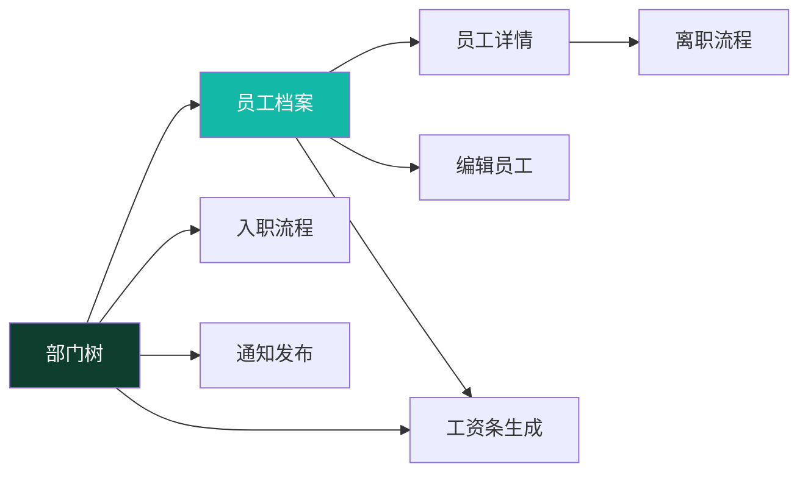

# Phase 2 — 人事端总览

> **⚠️ 2026-07-24 权限模型重构**：角色体系已下线（[ADR-011](../99-决策记录-ADR/ADR-011-工作台部门分区与动态权限配置.md)）。本文中"按角色分权/角色端"的表述仅作历史参考——现行权限 = 全员基础 ∪ 部门配置（含上级部门）± 个人覆盖，由超管在权限管理页按部门配置。

> 本档是 **人事功能域（Phase 2）** 的总纲，串联 8 个人事页面。
> 员工 / 部门是全平台的数据依赖根，本组页面也作为后续业务功能域的组件与权限样板。
>
> 全局机制（权限 / 视角选择器 / 审批流）见 [全局机制](../05-架构/全局机制.md)。
> 页面模板见 [页面总览 §六](页面总览.md)。
>
> 📍 **现状（2026-08-01）**：部门树、员工档案/入离职、公司/部门人员概况和权限深链使用真实后端；
> 员工域旧 Mock 已删除，入职使用服务端高熵一次性临时密码。负责人设置与调岗/离职联动、领导优先
> 分页及任职日期守卫已接入。工资前端已切 Dio，工资批次、工资条和生成/提交/审核/发布 API 及服务端
> 分页已有源码实现；变量输入入口、长周期容量压测、职责分离和生产 E2E 尚未完成。因此本组不能描述为
> “8 页生产验收完成”。

---

## 一、定位

人事功能域在**桌面端为主**管理“人”的全生命周期：组织架构、员工档案、入离职、人员统计、薪酬生成和通知发布；具体能力由权限点决定。

---

## 二、8 个页面清单与依赖

| # | 页面 | 路由 | 文档 | 依赖 |
|---|---|---|---|---|
| 1 | 部门树 | `/department` | [部门管理页.md](部门管理页.md) | 基础数据，最先有 |
| 2 | 员工档案列表 | `/employee` | [员工列表页.md](员工列表页.md) | 部门 |
| 3 | 员工详情 | `/employee/:id` | [员工详情页.md](员工详情页.md) | 员工 |
| 4 | 编辑员工 | `/employee/:id/edit` | [员工编辑页.md](员工编辑页.md) | 员工详情 + 部门 |
| 5 | 入职流程 | `/employee/onboarding` | [入职流程页.md](入职流程页.md) | 部门 + 岗位 |
| 6 | 离职流程 | `/employee/:id/offboarding` | [离职流程页.md](离职流程页.md) | 员工详情 |
| 7 | 工资条生成 | `/payroll/generate` | [工资条生成页.md](工资条生成页.md) | 员工 + 部门 + 薪酬项 |
| 8 | 通知发布 | `/notice/publish` | [通知发布页.md](通知发布页.md) | 部门（发布范围）|

**依赖图**：

---

## 三、权限

现行系统不按 `hr/manager/admin` 角色名授权。有效权限 =
全员基础 ∪ 所属部门及上级部门配置 ± 个人覆盖；超级管理员拥有完整权限目录。

| 能力 | 权限点 |
|---|---|
| 员工档案 | `employee:view/create/edit/delete` |
| 敏感读取 | `employee:pii:view`、`employee:compensation:view` |
| 敏感写入 | `employee:pii:edit`、`employee:compensation:edit` |
| 部门维护 | `department:view/edit` |
| 工资批次 | `payroll:generate/review/publish` |
| 通知发布 | `notice:publish` |
| 公司/部门人员概况 | `department:view` + `employee:view` |
| 部门/个人权限深链 | `authorization:manage` + 超级管理员 |

V141 起普通 `employee:create/edit` 不再隐含敏感字段写权。入职因证件号和手机号必填，必须额外具备
`employee:pii:edit`；提交薪资还须 `employee:compensation:edit`。页面显隐只是交互层，后端按请求
字段再次 fail closed。默认部门授权和个人覆盖详见
[全局机制 §1.2](../05-架构/全局机制.md#12-权限点常量节选)。

---

## 四、数据范围

旧 `ViewContextProvider` / `UtenViewContextSelector` 提案未采用。当前：

- **员工档案列表**：工号/姓名搜索、状态筛选和服务端加载更多；Repository 支持部门参数，但页面没有全局视角或部门选择器。列表在数据库分页前按负责人、领导层、班组管理、普通员工、工号排序。
- **部门管理**：选中节点就是当前统计范围；人员概况和员工列表包含所选节点及全部下级，直属人数仅计算所选节点直属员工。
- **工资条生成/审核**：各页面把年月、部门等筛选直接传给服务端；后端数据范围是权威。
- **部门树 / 入离职 / 通知发布**：不跟随全局视角。
- 页面是否可见只按权限点判断，不再按 employee/hr/manager 角色名判断。

---

## 五、统一布局模式

| 页面类型 | 布局 | 说明 |
|---|---|---|
| 员工列表 | **卡片列表 + 加载更多** | 全断点 `UtenPersonCard`；服务端每页 20 条，搜索/状态变化回第 1 页；当前没有 master-detail/DataTable |
| 部门管理 | **响应式树 + 详情/概况/员工卡片** | compact/medium 从组织树抽屉选节点；仅 expanded 左树右详情；右侧统一滚动 |
| 入职 | **单页分组表单** | `UtenSectionHeader + UtenCard`，原子提交后只展示一次服务端临时密码；不是 `UtenWizard` |
| 离职 | **单页交接表单** | 提交离职日期/原因/交接信息，由服务端状态机处理 |
| 工资条生成 | **页面内步骤 + 服务端预览** | 选期间/部门 → 创建草稿 → 预览服务端金额 → 提交审核；前端不计算工资 |
| 通知发布 | **表单 + 范围选择** | 富文本正文 + 可见范围（部门/工种/全员）|

---

## 六、当前实际组件

| 组件 | 用途 | 用在 |
|---|---|---|
| `UtenPersonCard` / `EmployeeStatusBadge` / `EmployeeLeadershipBadge` | 员工摘要、状态与领导标识 | 员工列表、部门员工列表 |
| `UtenSearchBar` / `FilterChip` | 搜索与多状态筛选 | 员工列表 |
| `UtenDepartmentTreeView` / `DepartmentOverviewPane` / `MasterDetailCard` | 部门树、统一滚动详情 | 部门管理 |
| `OrganizationWorkforceOverviewCard` | 可收起的当前人员、流动、提醒和质量指标 | 部门管理 |
| `UtenDepartmentPicker` / `UtenPositionPicker` | 部门、岗位选择 | 入职和调岗；普通员工编辑页部门只读 |
| `UtenSectionHeader` / `UtenCard` / `UtenContentContainer` | 分组表单与宽度收敛 | 入职、通知发布等 |
| `UtenBottomActionBar` / `UtenButton` | 固定操作区、防重复提交 | 工资生成、通知发布 |
| 状态徽章 + 时间字段 | 当前工资批次状态 | 工资条审核；现阶段没有通用审批轨迹组件或 `ApprovalRecord` |

---

## 七、涉及的数据实体

> 下列实体的当前落库状态与字段以 [实体字典](../04-数据模型/实体字典.md) 和 Flyway 为准：

- `Employee`（员工档案）— 字段最多、最核心
- `Department`（部门，含父子树）
- `Position`（岗位）
- `EmploymentHistory`（任职记录：入职/调岗/离职/复职 `rehire`）
- `PayrollBatch`（工资批次，工资条生成产物）
- `Notice`（通知，复用 Phase 1，加发布范围字段）
- `WorkforceOverview`（公司/部门人员概况查询读模型，非数据库表）

---

## 八、推进顺序

1. **部门树**（基础数据，先有组织才能挂人）
2. **员工档案** 列表 → 详情 → 编辑（CRUD 样板）
3. **入职 / 离职**（依赖员工编辑 + 详情）
4. **工资条生成**（依赖员工 + 部门 + 薪酬项，含审批流）
5. **通知发布**（依赖部门发布范围）

---

## 九、对照清单（落地情况）

- [x] Employee / Department / Position / EmploymentHistory 实体已落库（PostgreSQL，Flyway V1–V40+）
- [x] 当前页面使用真实组件：`UtenPersonCard`、`DepartmentOverviewPane`、部门树/选择器、
  `OrganizationWorkforceOverviewCard`、`UtenSectionHeader`、`UtenCard`、`UtenContentContainer`；
  不存在旧规划中的 `UtenDataTable`、`UtenMasterDetail`、`UtenTreeView`、`UtenWizard`
- [x] 路由 `/employee` `/department` `/payroll/generate` `/notice/publish` 接入 + 权限点守卫（[ADR-011](../99-决策记录-ADR/ADR-011-工作台部门分区与动态权限配置.md)）
- [x] 工资条生成/审核/发布已有 Dio→真实 API→V133 的源码链路
- [x] V141 拆分员工 PII/薪酬写权限，更新与入职均由后端字段级策略强制校验
- [ ] 工资变量输入、长周期容量压测、职责分离、权限矩阵和 E2E 验收
- [ ] 本组全部上线功能完成权限、审计与端到端安全验收（见[生产就绪审计报告](../99-项目治理/2026-07-30-生产就绪审计报告.md)）
- [x] 旧全局视角选择器提案未采用；各模块数据范围由后端接口与对象策略实施
- [x] 公司/部门人员概况、历史覆盖质量标记和 V170 查询索引已接入；历史不完整时离职率显示 `—`
- [x] 部门负责人合法性、清空与调岗/离职/归档联动已闭环；普通编辑不能绕过调岗改部门
- [x] 部门/个人权限深链、领导文字标识和数据库分页前稳定排序已接入

---

## 十、人员概况与任职完整性

- `GET /api/org/departments/{id}/workforce-overview` 以所选节点及全部下级为范围，要求同时具备
  `department:view` 和 `employee:view`。
- 当前人数只含未软删的 `active/probation/onLeave`；近 12 个月统计入职、复职、离职、净变化和跨范围
  调入/调出，范围内部调岗在父组织口径抵消。
- 离职率使用 `离职事件数 ÷ ((期初在册 + 期末在册) / 2)`；任职事件缺失或反推期初异常时返回空比率，
  页面显示 `—`。历史部门归属按当前组织树重述，组织调整会影响历史归属。
- 普通员工编辑不能改变部门；调岗、离职生效日不得晚于今天、早于入职日或早于最新任职事件。在册员工
  不能直接归档，避免人员数变化却缺少离职事件。
- 负责人必须是本部门直属在册员工并可显式清空；负责人调岗、离职或归档时自动解除。
- 部门和个人权限入口沿用权限管理页，只对超级管理员且具备 `authorization:manage` 的账号开放。

---

**最后更新**：2026-08-01 · **状态**：组织人员概况、权限深链、负责人闭环、领导标识和任职完整性守卫已接入；生产验收未完成。
