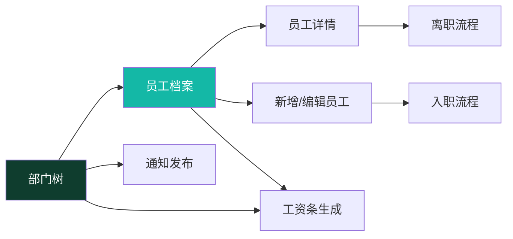

# Phase 2 — 人事端总览

> **⚠️ 2026-07-24 权限模型重构**：角色体系已下线（[ADR-011](../99-决策记录-ADR/ADR-011-工作台部门分区与动态权限配置.md)）。本文中"按角色分权/角色端"的表述仅作历史参考——现行权限 = 全员基础 ∪ 部门配置（含上级部门）± 个人覆盖，由超管在权限管理页按部门配置。

> 本档是 **hr 角色端（Phase 2）** 的总纲，串联 8 个人事页面。
> 员工 / 部门是全平台的数据依赖根，本组页面也作为 Phase 3-5 角色端的**样板**。
>
> 全局机制（权限 / 视角选择器 / 审批流）见 [全局机制](../05-架构/全局机制.md)。
> 页面模板见 [页面总览 §六](页面总览.md)。
>
> 📍 **现状（2026-07-27）**：本组 8 页**全链路接真实后端**（Spring Boot 3 + PostgreSQL + Flyway）——部门树 CRUD、员工入职/列表/详情/编辑、入离职向导、工资条生成、通知发布均落地，详见 [README](../../README.md)「项目当前阶段」。下方"对照清单"中**绝大部分项已完成**。

---

## 一、定位

hr 在**桌面端为主**管理"人"的全生命周期：组织架构、员工档案、入离职、薪酬生成、通知发布。手机端只做轻量审批/查阅。

---

## 二、8 个页面清单与依赖

| # | 页面 | 路由 | 文档 | 依赖 |
|---|---|---|---|---|
| 1 | 部门树 | `/department` | [部门管理页.md](部门管理页.md) | 基础数据，最先有 |
| 2 | 员工档案列表 | `/employee` | [员工列表页.md](员工列表页.md) | 部门 |
| 3 | 员工详情 | `/employee/:id` | [员工详情页.md](员工详情页.md) | 员工 |
| 4 | 新增/编辑员工 | `/employee/new`、`/employee/:id/edit` | [员工编辑页.md](员工编辑页.md) | 部门 + 岗位 |
| 5 | 入职流程 | `/employee/onboarding` | [入职流程页.md](入职流程页.md) | 员工编辑 + 部门 |
| 6 | 离职流程 | `/employee/:id/offboarding` | [离职流程页.md](离职流程页.md) | 员工详情 |
| 7 | 工资条生成 | `/payroll/generate` | [工资条生成页.md](工资条生成页.md) | 员工 + 部门 + 薪酬项 |
| 8 | 通知发布 | `/notice/publish` | [通知发布页.md](通知发布页.md) | 部门（发布范围）|

**依赖图**：

---

## 三、角色权限

| 页面 | hr | manager | admin | employee/其他 |
|---|---|---|---|---|
| 部门树 | ✅ 读写 | ✅ 只读 | ✅ | ❌ hide |
| 员工档案 | ✅ 读写 | ✅ 只读 | ✅ | ❌ hide |
| 入职/离职 | ✅ | ❌ | ✅ | ❌ |
| 工资条生成 | ✅ 生成 | ✅ 只读 | ✅ | ❌ |
| 工资条审核 | ❌（hr 提交审核）| ✅ 只读 | ✅ | ❌ → 见 [全局机制审批流](../05-架构/全局机制.md#34-工资条审批流payrollslip--payrollbatch) |
| 通知发布 | ✅ | ❌ | ✅ | ❌ |

> 权限点：`employee:view/create/edit/delete`、`department:view/edit`、`payroll:generate/publish`、`notice:publish`（见 [全局机制 §1.2](../05-架构/全局机制.md#12-角色与权限点)）。

---

## 四、视角选择器跟随

- **员工档案列表 / 工资条生成**：跟随 `ViewContextProvider`，hr/manager 可切「某部门 / 某员工 / 全公司」。
- **部门树 / 入离职 / 通知发布**：不跟随（部门树本身就是组织全貌）。
- employee 角色全程不可见本组页面。

---

## 五、统一布局模式

| 页面类型 | 布局 | 说明 |
|---|---|---|
| 员工档案 | **master-detail** | 桌面 `UtenMasterDetail`（左列表右详情），手机单栏切换 |
| 员工列表 | **DataTable** | 桌面 `UtenDataTable`（锁定首列、排序、分页），手机转卡片 |
| 部门树 | **左树右表** | 左 `UtenTreeView` 部门树，右该部门员工列表 |
| 入离职 | **向导（Wizard）** | 多步骤 `UtenWizard`，每步一个表单页 |
| 工资条生成 | **向导 + 预览** | 选范围 → 配置项 → 预览计算 → 提交审核 |
| 通知发布 | **表单 + 范围选择** | 富文本正文 + 可见范围（部门/工种/全员）|

---

## 六、依赖的待建组件（→ 设计系统补全，Task 4）

本组页面触发一批新组件需求，列入设计系统补全清单：

| 组件 | 用途 | 用在 |
|---|---|---|
| `UtenDataTable` | 响应式表格（桌面表格 / 手机卡片） | 员工列表、工资条生成预览 |
| `UtenMasterDetail` | 列表-详情分栏 | 员工档案 |
| `UtenTreeView` | 部门树 | 部门管理 |
| `UtenWizard` / `UtenStepper` | 多步骤流程 | 入职、离职、工资条生成 |
| `UtenForm` | 多字段表单容器 | 员工编辑、通知发布 |
| `UtenDropdown` | 下拉选择 | 部门/岗位/用工性质 |
| `UtenDatePicker` | 日期选择 | 入职日期、合同起止 |
| `UtenSwitch` | 开关 | 通知置顶、试用/正式 |
| `UtenConfirmDialog` | 确认对话框 | 删除员工、发布通知 |
| `UtenTimeline` | 审批轨迹 | 工资条审核（复用全局机制）|

---

## 七、涉及的数据实体

> 本组页面启动前，需先在 [实体字典](../04-数据模型/实体字典.md) 细化以下实体（当前 ⏳ 待补）：

- `Employee`（员工档案）— 字段最多、最核心
- `Department`（部门，含父子树）
- `Position`（岗位）
- `EmploymentHistory`（任职记录：入职/调岗/离职）
- `PayrollBatch`（工资批次，工资条生成产物）
- `Notice`（通知，复用 Phase 1，加发布范围字段）

---

## 八、推进顺序

1. **部门树**（基础数据，先有组织才能挂人）
2. **员工档案** 列表 → 详情 → 编辑（CRUD 样板）
3. **入职 / 离职**（依赖员工编辑 + 详情）
4. **工资条生成**（依赖员工 + 部门 + 薪酬项，含审批流）
5. **通知发布**（依赖部门发布范围）

---

## 九、对照清单（落地情况）

- [x] Employee / Department / Position / EmploymentHistory 实体已落库（PostgreSQL，Flyway V1–V40+）
- [x] `UtenDataTable` / `UtenMasterDetail` / `UtenTreeView` / `UtenWizard` 已实现（Uten 组件库）
- [x] 路由 `/employee` `/department` `/payroll/generate` `/notice/publish` 接入 + 权限点守卫（[ADR-011](../99-决策记录-ADR/ADR-011-工作台部门分区与动态权限配置.md)）
- [x] 工资条生成接入审批流（提交 → 财务审核 → 发布）
- [x] **全链路真实后端**：Argon2id 密码、JWT 轮换、pgcrypto 字段加密、触发器审计、按权限点脱敏（[10-安全准则](../00-项目准则/10-安全准则.md)）
- [ ] 视角选择器（`ViewContextProvider`）随业务页落地铺开

---

**最后更新**：2026-07-27 · **状态**：8 页全链路接真实后端，UX 总览作为页面文档索引保留
