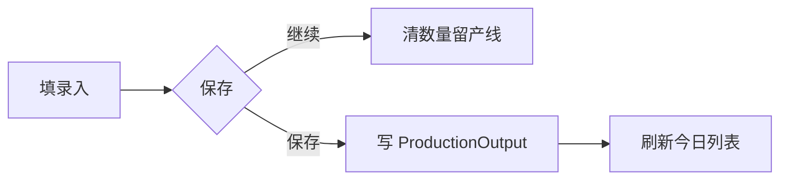

# 产量录入页

> 路由：`/production/output/entry`（计划：`lib/features/production/pages/production_output_entry_page.dart`）· Phase 4
> 上层：[Phase4-生产实验室总览](Phase4-生产实验室总览.md)

## 一、定位

车间班长按班次/产线/产品快速录入当班产量，是 [产量统计页](产量统计页.md) 的数据来源。现场多用平板/手机，强调录入效率。

## 二、入口与导航
- 进入：production 主导航「产量录入」；流水线看板快捷入口。
- 离开：提交 → 留本页（连续录入）或跳统计。

## 三、响应式布局
- compact：单列快速录入表单 + 最近录入列表。
- expanded：左录入表单，右当日已录入列表。

```
┌────────────────────────┐
│ ← 产量录入              │
├────────────────────────┤
│ 日期[2026-07-22] 班次[白班▼]│
│ 产线[一号线▼] 产品[A产品▼] │
│ 合格数* [____] 不良 [__] │
│ 备注 [____]             │
│ [保存并继续]  [保存]     │  ← 大按钮，便于现场操作
├────────────────────────┤
│ 今日已录入              │
│  一号线 A产品 1280 ✅ 09:30│
│  二号线 B产品  640 ✅ 09:45│
└────────────────────────┘
```

## 四、涉及的 Uten 组件
`UtenAppBar` / `UtenForm` / `UtenDropdown`（产线/产品/班次）/ `UtenDatePicker` / `UtenInput`（数字键盘）/ `UtenButton`（大尺寸 primary）/ `UtenList` 或 `UtenListItem`（已录入）/ `UtenToast` / `UtenEmpty`。

## 五、功能点
1. **快速录入**：日期默认今天、班次默认当前、选产线+产品+合格数+不良数。
2. **「保存并继续」**：保留产线/产品/班次，清空数量，连续录入。
3. **校验**：合格数>0；不良数≤合格数（或单独统计）。
4. **今日已录入**：本设备/本人今日记录，支持撤销最近一条（2 分钟内）。
5. 提交 → 写 `ProductionOutput`。

## 六、功能链路图


## 七、涉及的数据实体
`ProductionOutput`（产量：产线/产品/班次/合格/不良/录入人）/ `ProductionLine` / `Product` / `ProductionShift`。

## 八、权限要求
- production / admin。`production:view` + 录入。
- 仅本人可撤销自己的最近录入（2 分钟内）。

## 九、边界情况
- 重复录入：同产线+产品+班次+时段查重提示。
- 网络：离线录入排队，恢复同步（全局机制 §4）。
- 性能档 lite：去按钮动画。
- 撤销超时：禁用撤销，提示联系管理员。

---

**最后更新**：2026-07-22 · **状态**：需求定稿
