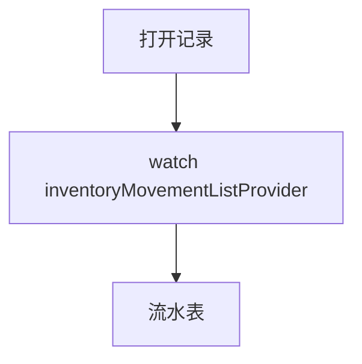

# 出入库记录页

> 路由：`/inventory/movement`（计划：`lib/features/inventory/pages/inventory_movement_page.dart`）· Phase 4
> 上层：[Phase4-生产实验室总览](Phase4-生产实验室总览.md)

## 一、定位

查看物料出入库流水（入库/出库/调拨），可按物料/仓库/类型/日期筛选。可从 [库存查询页](库存列表页.md) 点某物料带筛选进入。

## 二、入口与导航
- 进入：production 主导航「出入库记录」；库存查询点物料。
- 离开：返回；新增出入库（Phase 4+ 录入）。

## 三、响应式布局
DataTable（桌面）/ 卡片（手机），按时间倒序。

- expanded：
```
┌──────────────────────────────────────────────┐
│ 出入库记录  类型[全部▼] 仓库[▼] 日期[本周▼] 🔍 │
├──────────────────────────────────────────────┤
│ 时间       物料   类型  数量   仓库  经手人     │
│ 07-22 09:00 钢材A 入库 +5吨  1号库 王五       │  ← UtenDataTable
│ 07-22 08:30 螺丝B 出库 -500  1号库 王五       │
└──────────────────────────────────────────────┘
```

## 四、涉及的 Uten 组件
`UtenAppBar`（类型/仓库/日期筛选+搜索）/ `UtenDataTable` / `UtenResponsiveGrid`+`UtenCard` / `UtenStatusBadge`（入库 success/出库 info/调拨 neutral）/ `UtenSegmentedFilter`（全部/入库/出库）/ `UtenEmpty` / `UtenSkeletonList`。

## 五、功能点
1. **筛选**：类型（入库/出库/调拨）、仓库、日期范围、物料（从库存页带入）。
2. **搜索**：物料编码/名称/经手人。
3. **排序**：时间倒序。
4. 每条：时间+物料+类型+数量(±)+仓库+经手人+关联单据（采购单/工单）。
5. Phase 4+ 新增出入库录入入口。

## 六、功能链路图


## 七、涉及的数据实体
`InventoryMovement`（流水：物料/仓库/类型/数量/经手人/关联单据/时间）/ `Material` / `Warehouse` / `Employee`（经手人）。

## 八、权限要求
- production / manager 只读 / admin。`inventory:view`。录入（Phase 4+）需额外权限。

## 九、边界情况
- 无记录：`UtenEmpty`「暂无出入库记录」。
- 性能档 lite：表格去动画、分页改加载更多。
- 网络：缓存上次流水。

---

**最后更新**：2026-07-22 · **状态**：需求定稿
