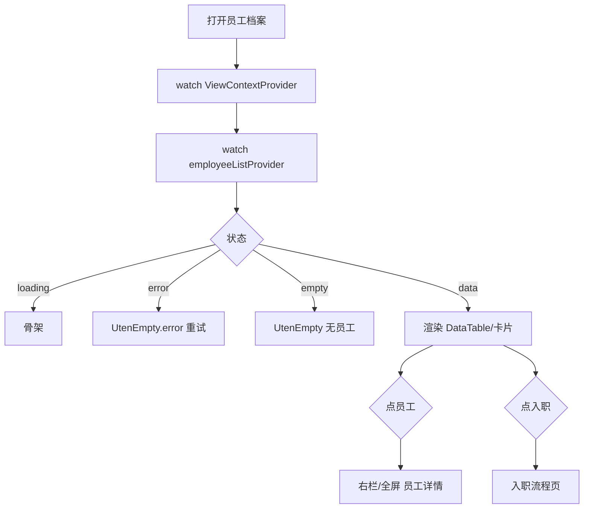

# 员工档案列表页

> 路由：`/employee`（计划实现：`lib/features/employee/pages/employee_list_page.dart`）· Phase 2
> 上层：[Phase2-人事端总览](Phase2-人事端总览.md)

## 一、定位

hr 管理全员档案的入口，是 [员工详情页](员工详情页.md) / [员工编辑页](员工编辑页.md) / [入职流程页](入职流程页.md) 的枢纽。

- 解决的问题：按部门/状态/关键字快速找人，进入详情或发起入离职。
- 产品位置：hr 主导航「人事管理」第一项。

## 二、入口与导航

- 进入路径：hr 主导航「员工档案」；[工作台](工作台首页.md)（hr 视角）快捷入口。
- 在导航中的位置：**hr 主导航**（manager 只读可见，其他角色 hide）。
- 离开去向：点员工 → [员工详情页](员工详情页.md)；「新增员工」→ [入职流程页](入职流程页.md)。

## 三、响应式布局

**核心模式：master-detail + DataTable**。跟随 `ViewContextProvider`（hr/manager 可切部门/员工/全公司）。

- compact（手机，< 600dp）：
  ```
  ┌────────────────────────┐
  │ ← 员工档案 [全公司▼] 🔍  │  ← 视角选择器 + 搜索
  ├────────────────────────┤
  │ [在职][试用][离职]       │  ← 状态筛选 chips
  │ ┌────────────────────┐ │
  │ │ 👤 张三  E001        │ │  ← 员工卡片（手机转卡片）
  │ │ 生产部 · 操作工 · 在职│ │
  │ └────────────────────┘ │
  │ …                      │
  │                ┌──────┐│
  │                │+入职 ││  ← FAB
  │                └──────┘│
  └────────────────────────┘
  ```
  说明：单栏卡片列表 + 搜索 + 状态筛选 + 入职 FAB；点击全屏切到详情。

- medium（平板，600-840dp）：`UtenMasterDetail` 窄分栏，左列表 40% / 右详情 60%。

- expanded（桌面，> 840dp）：**`UtenMasterDetail` + `UtenDataTable`**：
  ```
  ┌──────────────────────────────────────────────┐
  │ 员工档案                      [全公司▼] 🔍 +入职│
  ├────────────┬─────────────────────────────────┤
  │ 工号 姓名   │  张三的详情（员工详情页内容）      │
  │ E001 张三 ● │                                 │
  │ E002 李四   │                                 │
  │ E003 王五   │                                 │
  │ …          │                                 │
  │ 共 128 人   │                                 │
  │ ◀ 分页 ▶   │                                 │
  └────────────┴─────────────────────────────────┘
  ```
  说明：左 master 表格（锁定工号+姓名列、可排序、分页），右 detail 选中员工详情。空选中时右侧占位「请选择左侧员工」。

## 四、涉及的 Uten 组件

- `UtenAppBar`（带视角选择器 `UtenViewContextSelector` + 搜索入口）
- `UtenMasterDetail`（桌面分栏，手机单栏切换）
- `UtenDataTable`（桌面表格：工号/姓名/部门/岗位/状态/入职日期，可排序分页，窄屏自动转卡片）
- `UtenSegmentedFilter` 或 `ChoiceChip`（状态筛选：在职/试用/休假/离职）
- `UtenSearchBar`（关键字搜工号/姓名）
- `UtenEmpty`（空态 / error）
- `UtenSkeleton`（加载）
- `UtenStatusBadge`（员工状态徽章）
- `UtenButton` / `FloatingActionButton`（入职入口）

## 五、功能点

1. **视角跟随**：列表数据按 `ViewContextProvider`（self/department/employee/company）过滤；hr 默认全公司、manager 可切部门。
2. **搜索**：按工号 / 姓名 / 拼音模糊匹配，`UtenSearchBar` 带防抖。
3. **状态筛选**：在职 / 试用 / 休假 / 离职，多选 chips。
4. **部门筛选**（桌面）：点左侧部门树（来自 [部门管理页](部门管理页.md)）联动过滤；或顶部下拉选部门。
5. **表格**（桌面）：列可排序（工号/姓名/入职日期），分页（默认 20/页），锁定工号+姓名列；行点击 → 右侧详情。
6. **新增**：FAB「+入职」→ [入职流程页](入职流程页.md)（不是直接新建，走入职向导）。
7. **批量操作**（Phase 2+ 可选）：多选 → 批量调岗/导出。
8. `AsyncValue.when` 三态：loading 骨架 / error 重试 / data 列表或空态。

## 六、功能链路图



## 七、涉及的数据实体

→ 见 [实体字典](../04-数据模型/实体字典.md)
- `Employee`：列表主实体（id / code / fullName / departmentId / positionName / status / hireDate）
- `Department`：部门筛选与展示
- `EmployeeStatus`：枚举（active 在职 / probation 试用 / onLeave 休假 / resigned 离职）

## 八、权限要求

- **可见角色**：`hr`（读写）/ `manager`（只读）/ `admin`（全部）。其余 hide。
- 数据范围：跟随视角选择器；后端按角色 + 视角二次过滤。
- 关键操作权限点：`employee:view`（本页）/ `employee:create`（入职入口）。

## 九、边界情况

- 无数据时：`UtenEmpty`（people_outlined +「暂无员工」+ 入职按钮）。
- 加载失败时：`UtenEmpty.error` + 重试（`ref.invalidate(employeeListProvider)`）。
- 性能档 = lite 下：`UtenDataTable` 退化为纯文本行、去掉排序动画、分页改为「加载更多」。
- 网络断开时：列表缓存上次结果 + 顶部「离线缓存」提示（见 [全局机制 §4](../05-架构/全局机制.md#四离线与乐观更新规范)）。
- 权限：非 hr/manager/admin 访问 `/employee` → 路由守卫 redirect 工作台 + Toast（见 [全局机制 §1.5](../05-架构/全局机制.md#15-三层校验)）。

---

**最后更新**：2026-07-22 · **状态**：需求定稿，待 Phase 2 实现
