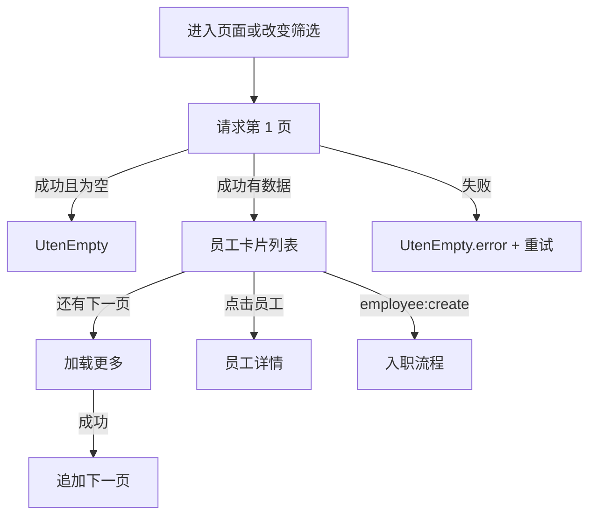

# 员工档案列表页

> 路由：`/employee`
> 实现：`lib/features/employee/pages/employee_list_page.dart`
> 上层：[页面总览](页面总览.md)

## 一、当前定位

员工档案列表使用真实后端，是进入[员工详情页](员工详情页.md)和[入职流程页](入职流程页.md)的入口。
页面按权限点开放，不再用 `hr/manager/admin` 角色名决定能力。

- 查看页面：`employee:view`
- 发起入职：`employee:create`
- 点击员工：进入 `/employee/:id`
- 入职完成返回：重新加载第 1 页

## 二、当前布局

当前所有断点均为单列卡片列表，不是旧稿中的 master-detail/DataTable。

```text
┌────────────────────────────┐
│ ← 员工档案                 │
├────────────────────────────┤
│ [搜索工号/姓名/车牌        ] │
│ [在职] [试用] [休假] [离职]│
│ ┌────────────────────────┐ │
│ │ 头像 [负责人] 张三 · E001│ │
│ │ 生产部 · 操作工 · 在职  │ │
│ └────────────────────────┘ │
│ …                          │
│          [加载更多]         │
│                  [+ 入职]   │
└────────────────────────────┘
```

- compact 断点由 `UtenContentContainer` 收敛内容宽度；medium/expanded 由主外壳统一收敛。
- `ListView.builder` 只构建可见卡片；每页默认 20 条。
- 当前页数据追加到本地列表，“加载更多”请求下一服务端页；搜索或状态变化会清空旧数据并回到第 1 页。
- 当前没有部门树、列排序、桌面右侧详情、全局视角选择器或批量操作。
- 搜索、状态筛选、重新加载和加载更多共享请求代次；旧筛选响应会被丢弃，不会覆盖或混入新结果。
- 从员工详情返回后重新加载当前筛选，及时反映调岗、离职、复职或负责人变化。

## 三、真实组件

| 组件 | 用途 |
|---|---|
| `UtenAppBar` | 标题和返回 |
| `UtenSearchBar` | 工号/姓名/**车牌**搜索（2026-08-05，ADR-021：按车牌找人，命中行显示 `matchedPlates` 车牌），组件内 300ms 防抖 |
| `FilterChip` | `active/probation/onLeave/resigned` 多状态筛选 |
| `UtenPersonCard` | 员工摘要卡，点击进入详情；副标题为「工号 · 部门 · 岗位 · 工龄」（工龄由 `work_years.dart` 按入职日期动态计算，随日期变化） |
| `EmployeeStatusBadge` | 员工状态展示 |
| `EmployeeLeadershipBadge` | 姓名前的“负责人 / 领导 / 班组管理”文字标识 |
| `UtenEmpty` / `UtenEmpty.error` | 空态、首屏失败与重试 |
| `FloatingActionButton.extended` | 入职入口；只有 `employee:create` 才渲染 |

加载首屏使用居中的 `CircularProgressIndicator`；当前未使用旧文档所写的 `UtenSkeleton`、
`UtenMasterDetail`、`UtenDataTable` 或 `AsyncValue.when`。

## 四、请求与分页契约

```http
GET /api/org/employees?page=1&size=20&search=&statuses=
```

后端返回：

```json
{
  "items": [],
  "page": 1,
  "size": 20,
  "total": 0,
  "totalPages": 0
}
```

- 列表项除基础字段外返回 `positionLevel`、`departmentManager`、`leaderRank`；rank 依次为
  `0=部门负责人`、`1=领导层`、`2=班组管理`、`3=普通员工`，供前端显示文字标识。
- 排序和 rank 都由后端基于当前部门负责人及岗位 level 计算，前端不得自行重排分页结果。
- `search` 在后端对工号和姓名做不区分大小写的模糊查询。
- `statuses` 为多值状态集合。
- Repository 还支持 `departmentId/includeSubtree`，但当前页面没有部门筛选控件。
- 后端在分页前按“部门负责人 → 领导层 → 班组管理 → 普通员工 → 工号”稳定排序，负责人不会落到
  后续分页；页面以 `totalPages` 判断是否显示“加载更多”。
- 列表 DTO 不包含身份证、手机、银行和薪酬等敏感字段；详情由后端按
  `employee:pii:view` / `employee:compensation:view` 和对象范围脱敏。

## 五、状态与错误



- 首屏错误会显示可重试错误态。
- 下一页失败会恢复按钮并显示错误消息，不会把失败页当成列表末页。
- 当前没有离线缓存；网络失败不会回退 Mock 或旧数据。

## 六、权限与安全

- 路由守卫要求 `employee:view`；后端列表接口再次执行授权。
- 入职 FAB 按 `employee:create` 隐藏；即使绕过前端，`POST /api/org/employees` 仍由后端强制校验。
- 前端搜索/状态参数只缩小结果，不能扩大后端数据范围。
- 详情 URL 必须继续由后端执行对象范围与敏感字段脱敏，不能把列表可见等同于全部 PII 可见。

## 七、生产验收

- [ ] `employee:view` 无 `employee:create` 的账号看不到入职 FAB，直接调用创建 API 返回拒绝。
- [ ] 搜索、四状态组合、空页、末页和连续加载更多无重复/漏项。
- [ ] 下一页失败有可理解反馈，重试不重复追加。
- [ ] 大员工量下验证 count、查询计划、列表 P95/P99 和前端内存。
- [ ] 详情 PII/薪酬按权限点正反向测试，不在列表、日志或错误中泄漏。

---

**最后更新**：2026-08-01 · **状态**：真实 API + 服务端领导优先分页 + 请求竞态保护。
