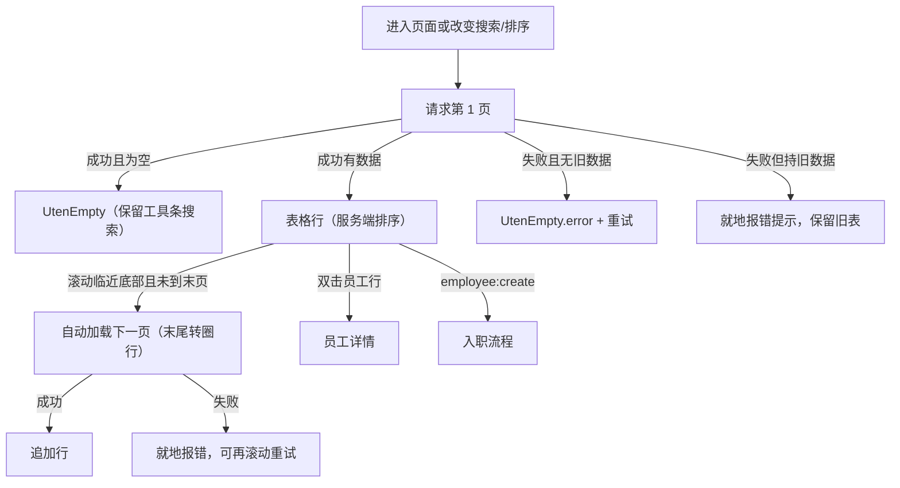

# 员工档案列表页

> 路由：`/employee`
> 实现：`lib/features/employee/pages/employee_list_page.dart`
> 上层：[页面总览](页面总览.md)

## 一、当前定位

员工档案列表使用真实后端，是进入[员工详情页](员工详情页.md)和[入职流程页](入职流程页.md)的入口。
页面按权限点开放，不再用 `hr/manager/admin` 角色名决定能力。

- 查看页面：`employee:view`
- 发起入职：`employee:create`（FAB 另需 `employee:pii:edit`，与入职流程的敏感信息写入一致）
- 双击员工行：进入 `/employee/:id`
- 入职完成返回：重新加载第 1 页

## 二、当前布局（2026-09-10 交互改版）

2026-09-09 由卡片列表改为 `MasterDataTableView` 表格；2026-09-10 删顶部状态
FilterChip 与「加载更多」按钮、搜索框移入表格工具条。

```text
┌──────────────────────────────────────────────┐
│ ← 员工档案                                    │
├──────────────────────────────────────────────┤
│ [表头设置][全屏][搜索工号/姓名/车牌(限宽260)]  │
│ 工号▼ 姓名│部门│岗位│状态│入职日期│工龄│车牌命中│
│  UT0001  张三 · 生产部 · 操作工 · …           │
│  …（滚动临近底部自动加载下一页，末尾转圈行）   │
│                                    [+ 入职]   │
└──────────────────────────────────────────────┘
```

- **状态筛选**：顶部 FilterChip 已下线，由「状态」列表头 autofilter 承担（前端聚合已加载
  行的桶值 + 前端裁剪显示）。列表请求不再带 `statuses` 预筛——**全部状态（含离职）默认
  加载可见**，需要时从表头筛掉；配合禁止删除（离职员工永久留存可查）。
- **搜索框**：驻表格工具条「全屏」按钮右侧（`toolbarLeadingActions` 限宽 260），全屏路由
  里同款渲染；控制器页面持有，进出全屏不丢关键字。`UtenSearchBar` 自带 300ms 防抖 +
  清除按钮，服务端模糊匹配工号/姓名/车牌（ADR-021 按车牌找人）。
- **分页**：底部「加载更多」按钮已下线，改 `MasterDataTableView.onLoadMore`——表体竖向
  滚动临近底部（距底约 200px）自动请求下一页并追加（`loadingMore` 末尾转圈行反馈）；
  是否还有更多页由页面按 `totalPages` 守卫，末页后滚动不再请求。
- **排序**：工号 / 入职日期 / 工龄 三列表头可排序（`sortable`，菜单文案按列 type：
  日期=从远到近/从近到远、工号/工龄=从小到大/从大到小），排序变化带 `sort`/`order`
  重新请求服务端；取消排序回到默认「负责人优先 + 工号」。工龄排序由后端映射到
  `hire_date` 且方向翻转（工龄从小到大 ⇔ 入职日期从新到远）。
- compact 断点由 `UtenContentContainer` 收敛内容宽度；medium/expanded 由主外壳统一收敛；
  窄屏表格横向滚动。
- 加载/错误/空态交给 `MasterDataTableView` 自绘：刷新时若仍持旧数据，表格原地保留
  （工具条搜索框不卸载、焦点不丢）；无数据失败才显示错误占位 + 重试。
- 从员工详情返回后重新加载，及时反映调岗、离职、复职或负责人变化；搜索、排序、
  自动加载共享请求代次，旧响应会被丢弃。

## 三、真实组件

| 组件 | 用途 |
|---|---|
| `UtenAppBar` | 标题和返回 |
| `MasterDataTableView` | 表格主体：表头 autofilter（部门/状态/岗位）+ 排序列 + 自动加载 + 全屏 |
| `UtenSearchBar` | 工号/姓名/**车牌**搜索（工具条内，ADR-021：命中行显示 `matchedPlates` 车牌） |
| `EmployeeStatusBadge` | 状态列徽章 |
| `EmployeeLeadershipBadge` | 姓名列「负责人 / 领导 / 班组管理」标识 |
| `UtenEmpty` / `UtenEmpty.error` | 空态、首屏失败与重试（表格内置） |
| `FloatingActionButton.extended` | 入职入口；`employee:create` + `employee:pii:edit` 才渲染 |

## 四、请求与分页契约

```http
GET /api/org/employees?page=1&size=20&search=&sort=code&order=asc
```

后端返回：

```json
{
  "items": [],
  "page": 1,
  "size": 20,
  "total": 0,
  "totalPages": 0
}
```

- 列表项除基础字段外返回 `positionLevel`、`departmentManager`、`leaderRank`；rank 依次为
  `0=部门负责人`、`1=领导层`、`2=班组管理`、`3=普通员工`，供姓名列文字标识。
- **排序**（2026-09-10）：`sort` 白名单由后端 `EmployeeListQuery#orderBy` 锁定——
  `code`（工号，UT+4 位零填充，文本序=数值序）/ `hireDate` / `workYears`（映射
  `hire_date` 方向翻转）；`order` 取 `asc|desc`。显式排序时不叠加负责人优先，
  工号作稳定并列序，`hire_date` 两方向 `NULLS LAST`。其余/缺省回落默认
  「负责人优先 + 工号」——前端不得自行重排分页结果。
- `search` 在后端对工号和姓名做不区分大小写的模糊查询，并模糊命中车牌。
- `statuses` 参数仍受 Repository/后端支持（picker、模拟登录等在用），但本页已不再传。
- Repository 还支持 `departmentId/includeSubtree`，但当前页面没有部门筛选控件。
- 页面以 `totalPages` 守卫自动加载：`page >= totalPages` 时滚动触发为 no-op。
- 列表 DTO 不包含身份证、手机、银行和薪酬等敏感字段；详情由后端按
  `employee:pii:view` / `employee:compensation:view` 和对象范围脱敏。

## 五、状态与错误



- 首屏错误显示可重试错误态；刷新失败但仍有旧数据时就地提示、不白屏。
- 自动加载失败会恢复并显示错误消息，不会把失败页当成列表末页。
- 当前没有离线缓存；网络失败不会回退 Mock 或旧数据。

## 六、权限与安全

- 路由守卫要求 `employee:view`；后端列表接口再次执行授权。
- 入职 FAB 按 `employee:create` 隐藏；即使绕过前端，`POST /api/org/employees` 仍由后端强制校验。
- 前端搜索/排序/表头筛选参数只影响展示与排序，不能扩大后端数据范围。
- 详情 URL 必须继续由后端执行对象范围与敏感字段脱敏，不能把列表可见等同于全部 PII 可见。

## 七、生产验收

- [ ] `employee:view` 无 `employee:create` 的账号看不到入职 FAB，直接调用创建 API 返回拒绝。
- [ ] 搜索、表头状态/部门/岗位筛选、空页、末页和连续自动加载无重复/漏项。
- [ ] 自动加载失败有可理解反馈，再滚动可重试、不重复追加。
- [ ] 工号/入职日期/工龄三列升/降序结果与后端一致（工龄方向翻转正确），取消排序回默认。
- [ ] 大员工量下验证 count、查询计划、列表 P95/P99 和前端内存。
- [ ] 详情 PII/薪酬按权限点正反向测试，不在列表、日志或错误中泄漏。

---

**最后更新**：2026-09-10 · **状态**：真实 API + 服务端排序/负责人优先分页 + 表头筛选 +
滚动自动加载 + 请求竞态保护。
