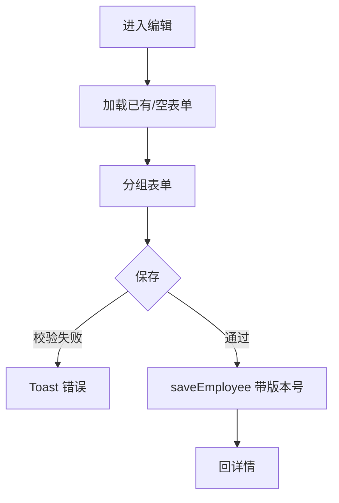

# 员工编辑页（新增 / 编辑）

> 路由：`/employee/new`、`/employee/:id/edit`（计划：`lib/features/employee/pages/employee_edit_page.dart`）· Phase 2
> 上层：[Phase2-人事端总览](Phase2-人事端总览.md)

## 一、定位

hr 录入或修改员工档案的大表单页。**新增员工建议走 [入职流程页](入职流程页.md) 向导**；本页用于编辑已有员工的单字段。

## 二、入口与导航
- 进入：员工详情「编辑」；或入职向导跳转续填。
- 离开：保存 → 回员工详情；取消 → 回详情/列表。

## 三、响应式布局
- compact：单列滚动分组表单 + 底部保存栏。
- medium / expanded：内容居中 ≤720dp；expanded 可双栏（左基本信息/联系，右组织/合同/薪资）。

```
┌────────────────────────┐
│ ← 编辑员工              │
├────────────────────────┤
│ 基本信息               │
│  姓名* [____] 工号* [__]│
│  性别 [▼]  出生日期[__]│
│  身份证号* [__________]│
│ 联系信息               │
│  手机* [____] 邮箱 [__]│
│  紧急联系人 [__] 电话[__]│
│ 组织信息               │
│  部门 [▼]  岗位 [▼]    │
│  直属主管 [▼] 用工性质[▼]│
│  入职日期 [📅]         │
│ 合同信息               │
│  合同类型[▼] 起[__] 止[__]│
│ 薪资信息 🔒            │
│  基本工资 [____]       │
│  银行开户行[__] 账号[__]│
├────────────────────────┤
│              [保存]     │  ← 底部固定
└────────────────────────┘
```

## 四、涉及的 Uten 组件
`UtenAppBar` / `UtenForm`（分组表单容器）/ `UtenInput`（文本/数字）/ `UtenDropdown`（性别/部门/岗位/用工性质/合同类型）/ `UtenDatePicker`（出生/入职/合同起止）/ `UtenSectionHeader` / `UtenButton` / `UtenToast` / `UtenBottomActionBar`。

## 五、功能点
1. **分组表单**：基本信息 / 联系信息 / 组织信息 / 合同信息 / 薪资信息（每组 `UtenSectionHeader`）。
2. **必填校验**：姓名、工号（唯一）、身份证号（唯一+格式）、手机（格式）、部门、入职日期。
3. **联动**：选部门 → 岗位下拉按部门过滤；用工性质=派遣/实习 → 隐藏「合同」组。
4. **薪资组仅 hr/admin 可编辑**，其他角色不渲染。
5. **工号/身份证唯一性**：失焦时查重，冲突就地报错。
6. **保存**：调 `saveEmployee`，Toast 成功 → 回详情；编辑模式带版本号防并发。
7. **未保存离开**：返回时二次确认（`UtenConfirmDialog`）。

## 六、功能链路图


## 七、涉及的数据实体
`Employee`（全字段写）/ `Department`、`Position`（下拉源）/ `User`（开通账号，入职向导里）。

## 八、权限要求
- 可见/可编辑：`hr` / `admin`（薪资字段仅此两者）。manager 不可进本页。
- 权限点：`employee:create`（新增）/ `employee:edit`（编辑）。

## 九、边界情况
- 无数据（编辑模式）：`UtenEmpty`「员工不存在」。
- 校验失败：字段下方红色提示，不阻塞其他字段。
- 并发冲突（版本号不匹配）：Toast「该员工已被他人修改，请刷新」。
- 性能档 lite：表单字段去聚焦动画。
- 网络：保存失败保留已填内容；支持草稿本地暂存（全局机制 §4）。

---

**最后更新**：2026-07-22 · **状态**：需求定稿
