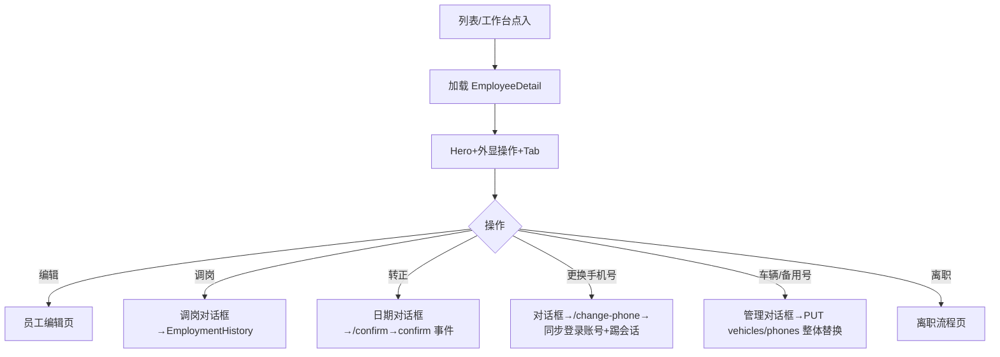

# 员工详情页

> 路由：`/employee/:id` · 实现：`lib/features/employee/pages/employee_detail_page.dart` · Phase 2
> 上层：[Phase2-人事端总览](Phase2-人事端总览.md) · 前置：[员工列表页](员工列表页.md)
> 最后更新：2026-08-05 · **v2 重构（ADR-021 §六）**：常用操作外显 + Tab 分组 +
> 联系与车辆（更换手机号/备用手机号/车辆管理）；转正可选日期并写任职轨迹

## 一、定位

持相应权限的用户查看员工档案；有动作权限者可发起编辑、调岗、转正、离职等操作。
v2 对齐大厂 People 详情范式（飞书/钉钉人事档案）：**操作外显、信息按 Tab 分组**，
解决 v1「按钮全埋 ⋯ 菜单、信息一长串找不到」的问题。

## 二、入口与导航

- 进入：员工列表点行；HR 工作台子页点行；入职/调岗完成后跳入。
- 位置：业务详情子页。
- 离开：编辑 → [员工编辑页](员工编辑页.md)；发起离职 → [离职流程页](离职流程页.md)。

## 三、响应式布局

全断点 `UtenContentContainer.narrow`（1120dp）居中收敛；结构为
**头部身份卡 + 预警区 + TabBar + TabBarView（每 Tab 独立滚动 + 下拉刷新）**：

```
┌────────────────────────────┐
│ ← 员工详情      [权限][↻][⋯] │  ← 权限图标仅 superAdmin+authorization:manage
├────────────────────────────┤
│ 👤 [负责人] 张三 [在职]       │  ← Hero：头像/徽章/姓名/状态/工号部门岗位/入职工龄
│ E001 · 生产部 · 操作工        │
│ 入职 2023-03-01 · 工龄 3 年 5 个月│
│ ────────────────────────── │
│ [编辑] [调岗] [办理转正] [办理离职]│  ← 常用操作外显（按权限+状态渲染）
├────────────────────────────┤
│ ⚠ 待我审的修改申请 (N)        │  ← 条件区块（profile:review）
│ ⚠ 试用期/合同到期预警          │  ← 条件横幅
├────────────────────────────┤
│ 概览│组织与合同│联系与车辆│薪酬│任职记录│  ← TabBar
├────────────────────────────┤
│ （当前 Tab 内容，独立滚动）     │
└────────────────────────────┘
```

| Tab | 内容 |
|---|---|
| 概览 | 基本信息（工号/姓名/性别/证件/出生/民族/政治面貌/婚姻）+ 户籍与住址 |
| 组织与合同 | 部门/岗位/直属主管/入职/工龄/**转正日期**/状态/账号状态/用工性质/工作地点/工位 + 当前合同与续签 |
| 联系与车辆 | 主手机（+「更换手机号」`employee:pii:edit`）/办公电话/邮箱/**备用手机号**（+管理）/**车辆信息**（+管理 `employee:edit`）/紧急联系人 |
| 薪酬 | 基本/绩效工资、社保公积金基数、银行（仅 `employee:compensation:view`；无权限显锁占位） |
| 任职记录 | 入职/调岗/**转正（confirm）**/离职/复职时间线（按事件类型区分图标） |

## 四、涉及的 Uten 组件

`UtenAppBar` / `UtenCard` / `UtenInfoRow`（valueWidget 承载状态徽章与「更换手机号」按钮）/
`UtenStatusBadge` / `EmployeeLeadershipBadge` / `UtenContentContainer` / `UtenEmpty` /
`TabBar+TabBarView` / `FilledButton(.tonal)`。
新增：`employee_contact_edit_dialog.dart`（更换手机号 / 车辆管理 / 备用手机号管理对话框）。

## 五、功能点（v2 差异）

1. **操作外显**：编辑/调岗/办理转正（仅试用，可选日期默认今天）/办理离职（在职）或复职（离职）
   以按钮排在 Hero 卡内；开通账号、归档删除保留在 AppBar ⋯；权限设置图标仅
   `superAdmin + authorization:manage` 显示（**人事无权授权**，后端同源校验）。
   > 2026-08-06 调整（ADR-026）：**开通账号**从 ⋯ 菜单迁入 Hero 顶卡（`account:support`，未开通且非离职时显示）；新增**锁定账号 / 解锁账号**（active→锁定、locked→解锁，二次确认；`POST /org/employees/{id}/account/lock|unlock`，`account:support`，复用 `UserAccountAdminService`）。⋯ 菜单仅保留归档删除。
2. **转正可选日期**：`POST /{id}/confirm` body `{confirmedDate?}`，默认今天，
   不得晚于今天/早于入职日期；服务端写 `employment_history(confirm)`，任职记录 Tab 可见。
3. **更换手机号**：`POST /{id}/change-phone`（`employee:pii:edit`）——手机号=登录账号，
   单事务同步 `users.login_account` 并吊销全部会话；前端对话框明示该后果。
4. **车辆信息**：车牌 chip + 车型/品牌/颜色/备注；「管理车辆」整体替换（`vehicles` 字段，
   `employee:edit`）；车牌支持员工列表搜索（按车牌找人）。
5. **备用手机号**：明文按 `employee:pii:view`，否则掩码；「管理备用手机号」需 `employee:pii:edit`
   （与主手机同口径，后端 `EmployeeSensitiveWritePolicy` fail closed）。
6. 其余沿用 v1：敏感字段服务端脱敏、待我审区块、到期预警、乐观锁 version、
   在册不可归档、调岗/离职日期守卫、负责人联动清空。

## 六、功能链路图



## 七、涉及的数据实体

`Employee` / `Department` / `Position` / `EmploymentHistory`（含 confirm 事件）/
`employee_vehicles` / `employee_phones`（V211）；敏感可见性由权限点控制。

## 八、权限要求

- 读取：`employee:view`；PII/薪酬分别 `employee:pii:view` / `employee:compensation:view`。
- 操作：`employee:edit`（编辑/调岗/转正/离职/复职/车辆管理）、`employee:delete`（归档已离职）、
  `employee:pii:edit`（更换手机号/备用手机号管理）、`account:support`（开通账号）、
  `profile:review`（待我审区块）、`authorization:manage + superAdmin`（权限设置）。

## 九、边界情况

- 无数据/加载失败：`UtenEmpty` + 重试。
- 薪酬 Tab 无任何可见字段时显示锁占位（不暴露是否有薪资）。
- 更换手机号：员工无登录账号时仅改档案；新号被其他员工/账号占用 409。
- 车辆/备用号整体替换：前端校验格式与去重，后端独立复核（车牌 7–8 位、11 位手机号）。
- 性能档 lite：Hero 去阴影；离线缓存/排队仍是全局机制目标能力，未实现。

---

**最后更新**：2026-08-05 · **状态**：v2 已接入源码并通过后端编译；目标库 V210/V211 与 E2E 待验收。

## 附录：「待我审的修改申请」区块

**位置**：Hero 卡后、TabBar 前。
**实现源**：[lib/features/employee/widgets/profile_change_pending_section.dart](../../lib/features/employee/widgets/profile_change_pending_section.dart)
**显示条件**（必须全部满足）：
1. 当前用户有 `profile:review` 权限
2. 该员工有至少 1 条 `pending` 状态的 `profile_change_request`

**布局**：
- 顶栏：⚠ 红图标 + 「待我审核的修改申请」标题 + 右上角红色徽章「N 项待审」
- 主体：最多展示 3 条 pending（提交时间 + 字段数 + 员工姓名 + 跳详情）
- 超出 3 条：底部「全部 →（N）」按钮跳 `/hr/profile-changes?employeeId=...`

**点击行**：跳 `/hr/profile-changes/:batchId`（HR 审批详情）
