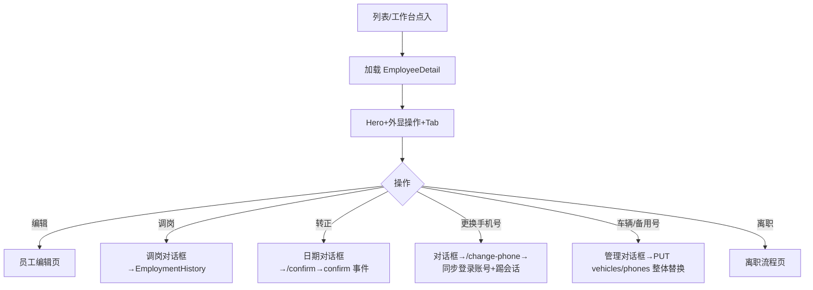

# 员工详情页

> 路由：`/employee/:id` · 实现：`lib/features/employee/pages/employee_detail_page.dart` · Phase 2
> 上层：[页面总览](页面总览.md) · 前置：[员工列表页](员工列表页.md)
> 最后更新：2026-08-27 · **v3 权限入口对齐**：保留 v2 常用操作与 Tab 分组；区分业务页
> “本页权限”入口和超管中央员工权限深链，未开户目标按 `account:support` 条件引导开户。

## 一、定位

持相应权限的用户查看员工档案；有动作权限者可发起编辑、调岗、转正、离职等操作。
v2 对齐大厂 People 详情范式（飞书/钉钉人事档案）：**操作外显、信息按 Tab 分组**，
解决 v1「按钮全埋 ⋯ 菜单、信息一长串找不到」的问题。

## 二、入口与导航

- 进入：员工列表点行；HR 工作台子页点行；入职/调岗完成后跳入。
- 位置：业务详情子页。
- 离开：编辑 → [员工编辑页](员工编辑页.md)；发起离职 → [离职流程页](离职流程页.md)。

## 三、响应式布局

全断点 `UtenContentContainer.narrow`（1120dp）居中收敛；结构为
**头部身份卡 + 预警区 + TabBar + TabBarView（每 Tab 独立滚动 + 下拉刷新）**：

```
┌────────────────────────────┐
│ ← 员工详情 [本页权限][中央权限][↻] │
├────────────────────────────┤
│ 👤 [负责人] 张三 [在职]       │  ← Hero：头像/徽章/姓名/状态/工号部门岗位/入职工龄
│ E001 · 生产部 · 操作工        │
│ 入职 2023-03-01 · 工龄 3 年 5 个月│
│ ────────────────────────── │
│ [编辑] [调岗] [办理转正] [办理离职]│  ← 常用操作外显（按权限+状态渲染）
├────────────────────────────┤
│ ⚠ 待我审的修改申请 (N)        │  ← 条件区块（profile:review）
│ ⚠ 试用期/合同到期预警          │  ← 条件横幅
├────────────────────────────┤
│ 概览│组织与合同│联系与车辆│薪酬│任职记录│  ← TabBar
├────────────────────────────┤
│ （当前 Tab 内容，独立滚动）     │
└────────────────────────────┘
```

| Tab | 内容 |
|---|---|
| 概览 | 基本信息（工号/姓名/性别/证件/出生/民族/政治面貌/婚姻）+ 户籍与住址 |
| 组织与合同 | 部门/岗位/直属主管/入职/工龄/**转正日期**/状态/账号状态/用工性质/工作地点/工位 + 当前合同与续签。状态/账号状态徽章 `Align(centerRight)` 包裹：按内容宽靠右、不被 `UtenInfoRow` 的 `Expanded` 紧约束拉满整行（2026-09-10） |
| 联系与车辆 | 主手机（+「更换手机号」`employee:pii:edit`）/办公电话/邮箱/**备用手机号**（+管理）/**车辆信息**（+管理 `employee:edit`）/紧急联系人 |
| 薪酬 | 基本/绩效工资、社保公积金基数（`employee:compensation:view`）+ 银行（`employee:pii:view`）；无可见字段时显锁占位 |
| 任职记录 | 入职/调岗/**转正（confirm）**/离职/复职时间线（按事件类型区分图标） |

## 四、涉及的 Uten 组件

`UtenAppBar` / `UtenCard` / `UtenInfoRow`（valueWidget 承载状态徽章与「更换手机号」按钮）/
`UtenStatusBadge` / `EmployeeLeadershipBadge` / `UtenContentContainer` / `UtenEmpty` /
`TabBar+TabBarView` / `FilledButton(.tonal)`。
新增：`employee_contact_edit_dialog.dart`（更换手机号 / 车辆管理 / 备用手机号管理对话框）。

## 五、功能点（v2 差异）

1. **操作外显**：编辑/调岗/办理转正（仅试用，可选日期默认今天）/办理离职（在职）或复职（离职）
   以按钮排在 Hero 卡内；开通账号按 `account:support` 显示。UtenAppBar 的“本页权限”由页面权限
   capability 决定（超管或合法组织负责人）；页面自有的“中央员工权限”图标仅
   `superAdmin + authorization:manage` 显示，用于跳全局个人覆盖/数据范围，两者不是同一入口。
   > 2026-08-06 调整（ADR-026）：**开通账号**从 ⋯ 菜单迁入 Hero 顶卡（`account:support`，未开通且非离职时显示）；新增**锁定账号 / 解锁账号**（active→锁定、locked→解锁，二次确认；`POST /org/employees/{id}/account/lock|unlock`，`account:support`，复用 `UserAccountAdminService`）。后续归档删除入口也已下线；员工离职保留历史，纠错走复职。
   > 2026-08-17 补充（V297）：同一 `account:support` 能力在[权限管理页](权限管理页.md)同样可用——列表上方「开通账号」入口（候选人走 `/api/admin/users/provision-candidates` 最小信息集接口），账号安全分区支持「设置临时密码」（系统生成/自定义、72h 有效、强制改密）。
   > 2026-08-27 补充：中央权限入口遇到未开户员工时不再只报错。页面明确显示“该员工还未开通账号”；若当前操作者同时持 `account:support`，询问是否先开户，必须确认保存并关闭一次性凭据后才刷新并进入权限页；无 `account:support` 时只说明联系账号支持人员。`authorization:manage` 与负责人身份都不能替代开户权限。
2. **转正可选日期**：`POST /{id}/confirm` body `{confirmedDate?}`，默认今天，
   不得晚于今天/早于入职日期；服务端写 `employment_history(confirm)`，任职记录 Tab 可见。
3. **更换手机号**：`POST /{id}/change-phone`（`employee:pii:edit`）——手机号=登录账号，
   单事务同步 `users.login_account` 并吊销全部会话；前端对话框明示该后果。
4. **车辆信息**：车牌 chip + 车型/品牌/颜色/备注；「管理车辆」整体替换（`vehicles` 字段，
   `employee:edit`）；车牌支持员工列表搜索（按车牌找人）。
5. **备用手机号**：明文按 `employee:pii:view`，否则掩码；「管理备用手机号」需 `employee:pii:edit`
   （与主手机同口径，后端 `EmployeeSensitiveWritePolicy` fail closed）。
6. **档案文件 Tab**（2026-08-16 更新）：接通用附件系统（ownerType=`EMPLOYEE`），复用共享
   `AttachmentSection`——分类筛选芯片（合同/身份证件/学历证书/照片/其他，带计数）、多文件批量上传
   带进度、文件类型彩色图标、图片 `InteractiveViewer` 预览（附「保存到本机」）、删除二次确认、
   图片可「设为头像」（`POST /{id}/avatar`，仅 image/*）。无 `attachment:view` 时显示无权提示
   （后端详情接口同步降级为空附件列表，不整页失败）。
7. **合同附件**（2026-08-16 新增）：组织与合同 Tab 合同时间线每份合同卡提供「合同附件」入口
   （ownerType=`EMPLOYEE_CONTRACT`），弹窗内独立上传/查看/删除该份合同扫描件；
   `EmployeeContractAttachmentAccessPolicy` 反查员工同口径鉴权。
8. 其余沿用 v1：敏感字段服务端脱敏、待我审区块、到期预警、乐观锁 version、
   在册不可归档、调岗/离职日期守卫、负责人联动清空。

## 六、功能链路图



## 七、涉及的数据实体

`Employee` / `Department` / `Position` / `EmploymentHistory`（含 confirm 事件）/
`employee_vehicles` / `employee_phones`（V211）；敏感可见性由权限点控制。

## 八、权限要求

- 读取：`employee:view`；PII/薪酬分别 `employee:pii:view` / `employee:compensation:view`。
- 附件（与后端双层校验对齐，可在权限管理页「人事行政 → 附件」配置）：查看/下载/预览需
  `attachment:view` **且** `employee:pii:view`（档案文件=身份证件/合同扫描件级 PII，对象层
  限本人或 pii:view 持有者——2026-08-16 收紧，此前误用全部门普遍持有的 employee:view）；
  上传/删除/设头像需 `attachment:manage` **且** `employee:edit`（对象层
  `EmployeeAttachmentAccessPolicy`）；合同附件同口径。图片上传保留原件；内部无损存储与下载还原见
  [ADR-074](../99-决策记录-ADR/ADR-074-公司内部附件存储与原件保留.md)。
- 操作按动作拆分：`employee:edit`（普通编辑/车辆管理）、`employee:transfer`（调岗）、
  `employee:confirm`（转正）、`employee:offboard`（离职）、`employee:rehire`（复职）、
  `employee:contract_renew`（续签/补录合同）、`employee:pii:edit`（更换手机号/备用手机号管理）、
  `account:support`（开通/锁定/解锁账号）、`profile:review`（待我审区块）。
- “中央员工权限”深链要求 `authorization:manage + superAdmin`；“本页权限”入口由服务端页面能力
  决定，负责人只管理本页和负责人根/子树范围，不能据此获得中央授权或账号支持。

## 九、边界情况

- 无数据/加载失败：`UtenEmpty` + 重试。
- 薪酬 Tab 无任何可见字段时显示锁占位（不暴露是否有薪资）。
- 更换手机号：员工无登录账号时仅改档案；新号被其他员工/账号占用 409。
- 车辆/备用号整体替换：前端校验格式与去重，后端独立复核（车牌 7–8 位、11 位手机号）。
- 附件：无 `attachment:view` 时档案文件 Tab 显示无权提示（不显示附件列表）；上传总开关
  `UTEN_ATTACHMENT_UPLOADS_ENABLED` 默认关闭（fail-closed），未开启时上传报 503。
- 性能档 lite：Hero 去阴影；离线缓存/排队仍是全局机制目标能力，未实现。

---

**最后更新**：2026-08-27（双权限入口、未开户引导与细分员工动作权限同步）/
2026-08-16（档案文件 Tab 权限双层门控与 AttachmentSection 重构、合同附件入口、
无 attachment:view 降级）/ 2026-08-05 · **状态**：v2 已接入源码并通过后端编译；目标库 V210/V211 与 E2E 待验收。

## 附录：「待我审的修改申请」区块

**位置**：Hero 卡后、TabBar 前。
**实现源**：[lib/features/employee/widgets/profile_change_pending_section.dart](../../lib/features/employee/widgets/profile_change_pending_section.dart)
**显示条件**（必须全部满足）：
1. 当前用户有 `profile:review` 权限
2. 该员工有至少 1 条 `pending` 状态的 `profile_change_request`

**布局**：
- 顶栏：⚠ 红图标 + 「待我审核的修改申请」标题 + 右上角红色徽章「N 项待审」
- 主体：最多展示 3 条 pending（提交时间 + 字段数 + 员工姓名 + 跳详情）
- 超出 3 条：底部「全部 →（N）」按钮跳 `/hr/profile-changes?employeeId=...`

**点击行**：跳 `/hr/profile-changes/:batchId`（HR 审批详情）
