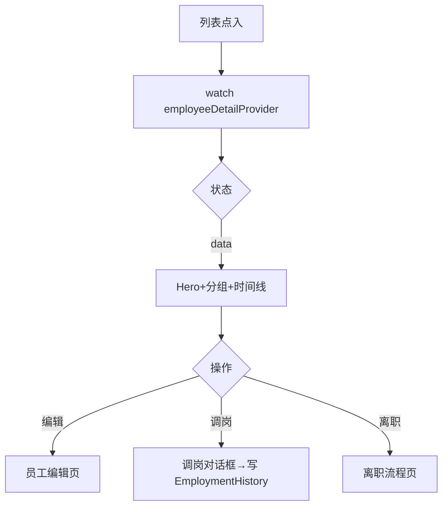

# 员工详情页

> 路由：`/employee/:id` · 实现：`lib/features/employee/pages/employee_detail_page.dart` · Phase 2
> 上层：[Phase2-人事端总览](Phase2-人事端总览.md) · 前置：[员工列表页](员工列表页.md)
> 最后更新：2026-08-01 · 已校准个人权限入口、领导标识与任职生命周期边界

## 一、定位

持相应权限的用户查看员工档案；有动作权限者可发起编辑、调岗、离职等操作。

## 二、入口与导航

- 进入：员工列表点行；入职/调岗完成后跳入。
- 位置：业务详情子页。
- 离开：编辑 → [员工编辑页](员工编辑页.md)；发起离职 → [离职流程页](离职流程页.md)。

## 三、响应式布局

- compact（手机）：单列滚动，Hero 卡 + 信息分组卡 + 任职时间线 + 底部操作栏。
- medium / expanded：仍为独立单列滚动页，使用 `UtenContentContainer.narrow` 居中收敛，最大宽度 1120dp，不嵌入员工列表 master-detail。

```
┌────────────────────────┐
│ ← 员工详情 [权限][编辑][⋯]│  ← 按权限显示动作
├────────────────────────┤
│ ┌────────────────────┐ │
│ │  👤 [负责人] 张三 [在职]│ │  ← Hero（领导标识/姓名/工号/部门岗位/状态）
│ │  E001 · 生产部 · 操作工│ │
│ │  入职 2023-03-01     │ │
│ └────────────────────┘ │
│ ┌────────────────────┐ │
│ │ ⚠ 待我审的修改申请 (N)│ │  ← 新增区块：仅有 `profile:review` 权限者可见，
│ │  ├ 提交人 时间 字段数  │ │     员工有 pending 申请时展示
│ │  ├ … (最多 3 条)       │ │
│ │  └ 全部 →             │ │
│ └────────────────────┘ │
│ 基本信息               │
│  性别 男  出生 1990-01  │
│  民族 汉  籍贯 江苏     │
│ 联系信息               │
│  手机 138****1234      │
│  邮箱 zhang@uten.com   │
│ 组织信息               │
│  部门 生产部  岗位 操作工│
│  直属主管 李主管        │
│  用工性质 正式          │
│  合同 2023-03~2026-03   │
│ 薪资信息  🔒            │  ← employee:compensation:view
│  基本工资 ¥8000         │
│  银行账号 ****1234      │
│ 任职记录               │
│  ◷ 2023-03 入职 生产部   │  ← UtenCard 内 ListTile
│  ● 2024-06 调岗 班长     │
├────────────────────────┤
│ [调岗]      [发起离职]   │  ← 按权限点/状态条件渲染
└────────────────────────┘
```

## 四、涉及的 Uten 组件

`UtenAppBar`（操作菜单）/ `UtenCard` / `UtenInfoRow`（isImportant 高亮关键字段）/
`UtenStatusBadge`（状态）/ `EmployeeLeadershipBadge`（姓名前领导标识）/ `ListTile`（任职记录）/ `UtenSectionHeader` /
`UtenEmpty` / `UtenSkeleton`。当前没有通用 `UtenTimeline` 组件。

## 五、功能点

1. **Hero 卡**：头像（无图用 `Icons.person`）+ 领导标识 + 姓名 + 状态徽章 + 工号/部门/岗位 + 入职日期。
2. **信息分组**（`UtenSectionHeader` + `UtenInfoRow`）：基本信息 / 联系信息 / 组织信息 / 薪资信息。
3. **敏感字段脱敏 + 可见性**：后端 DTO 按 `employee:pii:view` 与
   `employee:compensation:view` 决定返回明文、掩码或空字段；前端不根据角色名自行解密/猜权限。
4. **任职记录**：`UtenCard` 内的 `ListTile` 展示 `EmploymentHistory`
   （入职/调岗/离职/复职），包含日期与备注。
5. **操作菜单**（AppBar ⋯，按权限点+状态条件显隐）：
   - `employee:edit`：编辑、调岗（对话框：调入部门/岗位+生效日期+备注）、转正（仅试用）、办理离职（非离职）、复职（仅离职）。
   - `employee:delete`：仅已离职员工可归档（二次确认，软删+停用账号+吊销令牌）；在册员工必须先办理离职。
   - 无权限：只读，无操作。
6. **账号状态行**：组织信息区显示登录账号状态（正常/锁定/停用/未开通），离职冻结后可直接确认。
7. **到期预警横幅**：试用期/劳动合同 30 天内到期或已过期时顶部橙色醒目提示（离职员工不提示）。
8. **任职备注与排序**：离职原因、调岗说明和复职备注随事件展示，按时间倒序。
9. **领导标识**：Hero 姓名前展示部门负责人、领导层或班组管理标识，负责人优先。
10. **个人权限设置**：仅 `superAdmin + authorization:manage` 显示。详情先检查 `accountStatus`；
    未开通账号时原地提示，已开通才深链 `/admin/permissions?employeeId=...`，进入权限页后再由
    `GET /api/admin/users/by-employee/{employeeId}` 精确解析账号。
11. `AsyncValue.when` 三态。

普通编辑页中的部门为只读；跨部门变化必须使用“调岗”，确保写入 `employment_history`。

## 六、功能链路图



## 七、涉及的数据实体
`Employee` / `Department` / `Position` / `EmploymentHistory`；敏感字段可见性由权限点控制，不依赖 `Role`。

## 八、权限要求
- 路由/读取需要员工查看权限；编辑、删除分别由 `employee:edit`、`employee:delete` 控制。
- PII 与薪酬分别由 `employee:pii:view`、`employee:compensation:view` 在服务端控制。
- 员工列表/详情当前以 `employee:view` 作为档案级入口；没有独立的 employee self/department
  对象范围权限。被授予该权限者可读取全员基础档案，敏感字段仍由独立读取权限脱敏。
- 操作权限点：`employee:edit`（普通编辑、调岗、离职、复职）、`employee:delete`（仅归档已离职员工）、
  `profile:review`（查看该员工的待审修改申请）、`authorization:manage + superAdmin`（个人权限设置）。

## 八·附录：「待我审的修改申请」区块

**位置**：Hero 卡后、基本信息前。
**实现源**：[lib/features/employee/widgets/profile_change_pending_section.dart](../../lib/features/employee/widgets/profile_change_pending_section.dart)
**显示条件**（必须全部满足）：
1. 当前用户有 `profile:review` 权限
2. 该员工有至少 1 条 `pending` 状态的 `profile_change_request`

**布局**：
- 顶栏：⚠ 红图标 + 「待我审核的修改申请」标题 + 右上角红色徽章「N 项待审」
- 主体：最多展示 3 条 pending（提交时间 + 字段数 + 员工姓名 + 跳详情）
- 超出 3 条：底部「全部 →（N）」按钮跳 `/hr/profile-changes?employeeId=...`

**点击行**：跳 `/hr/profile-changes/:batchId`（HR 审批详情）

## 九、边界情况
- 无数据：`UtenEmpty`「员工不存在」。
- 加载失败：`UtenEmpty.error` + 重试。
- 性能档 lite：Hero 去 boxShadow，时间线去连线动画。
- 离职员工：状态徽章灰色；可见动作按权限分别包括编辑、复职、权限设置和归档，不固定为单一入口。
- 在册员工不能直接归档，必须先办理离职；前端隐藏入口，后端再次校验。
- 网络现状：详情、调岗和离职均必须在线；断网时明确报错并允许用户重试。缓存上次详情及离线排队仅是全局机制 §4 的目标能力，当前尚未实现。
- 未来入职、未来生效、早于入职日或早于最新任职事件的调岗/离职由后端拒绝。
- 负责人调离、离职或归档时，原部门负责人引用在同一事务中自动清空。

---

**最后更新**：2026-08-01 · **状态**：真实后端、个人权限入口、领导标识和任职生命周期守卫已实现；离线缓存/排队待实现。
