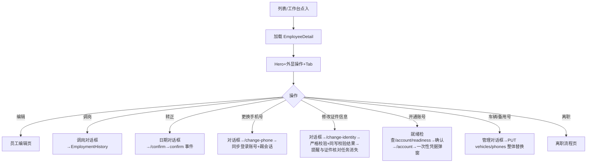

# 员工详情页

> 路由：`/employee/:id` · 实现：`lib/features/employee/pages/employee_detail_page.dart` · Phase 2
> 上层：[页面总览](页面总览.md) · 前置：[员工列表页](员工列表页.md)
> 最后更新：2026-10-05 · **证件问题提醒**：证件号码有问题时头部常驻红/黄提醒、证件号码行带「待核对」，
> 持 `employee:pii:edit` 可「修改证件信息」；补开账号不再因证件号拦下(见 §五 第 9 条、§十，
> [ADR-154](../99-决策记录-ADR/ADR-154-证件号问题不阻塞开号与证件核对任务.md))。
> 2026-08-27 · **v3 权限入口对齐**：保留 v2 常用操作与 Tab 分组；区分业务页
> “本页权限”入口和超管中央员工权限深链，未开户目标按 `account:support` 条件引导开户。

## 一、定位

持相应权限的用户查看员工档案；有动作权限者可发起编辑、调岗、转正、离职等操作。
v2 对齐大厂 People 详情范式（飞书/钉钉人事档案）：**操作外显、信息按 Tab 分组**，
解决 v1「按钮全埋 ⋯ 菜单、信息一长串找不到」的问题。

## 二、入口与导航

- 进入：员工列表点行；HR 工作台子页点行；入职/调岗完成后跳入。
- 位置：业务详情子页。
- 离开：编辑 → [员工编辑页](员工编辑页.md)；发起离职 → [离职流程页](离职流程页.md)。

## 三、响应式布局

全断点使用默认 `UtenContentContainer`，正文和薪酬 / 任职记录表格随父容器可用宽度铺满，
保留响应式 gutter，不设置固定最大宽度；结构为**顶部折叠 + Tab 吸顶 + Tab 内滚**
（`UtenCollapsingHeaderScrollView`：头部身份卡、待审/预警区块与到期横幅随上滑收起，
TabBar 滚到视口上沿后钉住，此后仅当前 Tab 正文（ListView 拾取注入的
PrimaryScrollController）内滚；每 Tab 独立下拉刷新）：

```
┌────────────────────────────┐
│ ← 员工详情 [本页权限][中央权限][↻] │
├────────────────────────────┤
│ 👤 [负责人] 张三 [在职]       │  ← Hero：头像/徽章/姓名/状态/工号部门岗位/入职工龄
│ E001 · 生产部 · 操作工        │
│ 入职 2023-03-01 · 工龄 3 年 5 个月│
│ ────────────────────────── │
│ [编辑] [调岗] [办理转正] [办理离职]│  ← 常用操作外显（按权限+状态渲染）
├────────────────────────────┤
│ ⚠ 待我审的修改申请 (N)        │  ← 条件区块（profile:review）
│ ⚠ 证件号码校验未通过 [修改证件信息]│  ← 条件提醒(idNumberIssue 不为空，红/黄)
│ ⚠ 试用期/合同到期预警          │  ← 条件横幅
├────────────────────────────┤
│ 概览│组织与合同│联系与车辆│薪酬│任职记录│  ← TabBar
├────────────────────────────┤
│ （当前 Tab 内容，独立滚动）     │
└────────────────────────────┘
```

| Tab | 内容 |
|---|---|
| 概览 | 基本信息（工号/姓名/性别/证件/出生/民族/政治面貌/婚姻）+ 户籍与住址。证件号码一行：号码(按权限脱敏) + 有问题时「待核对」徽标(校验未通过红，其余黄) + 「修改证件信息」(`employee:pii:edit`) |
| 组织与合同 | 部门/岗位/直属主管/入职/工龄/**转正日期**/状态/账号状态/用工性质/工作地点/工位 + 当前合同与续签。状态/账号状态徽章 `Align(centerRight)` 包裹：按内容宽靠右、不被 `UtenInfoRow` 的 `Expanded` 紧约束拉满整行（2026-09-10） |
| 联系与车辆 | 主手机（+「更换手机号」`employee:pii:edit`）/办公电话/邮箱/**备用手机号**（+管理）/**车辆信息**（+管理 `employee:edit`）/紧急联系人 |
| 薪酬 | 基本/绩效工资、社保公积金基数（`employee:compensation:view`）+ 银行（`employee:pii:view`）；无可见字段时显锁占位 |
| 任职记录 | 入职/调岗/**转正（confirm）**/离职/复职时间线（按事件类型区分图标） |

## 四、涉及的 Uten 组件

`UtenAppBar` / `UtenCard` / `UtenInfoRow`（valueWidget 承载状态徽章与「更换手机号」按钮）/
`UtenStatusBadge` / `EmployeeLeadershipBadge` / `UtenContentContainer` / `UtenEmpty` /
`TabBar+TabBarView` / `FilledButton(.tonal)`。
新增：`employee_contact_edit_dialog.dart`（更换手机号 / 车辆管理 / 备用手机号管理对话框）。
2026-10-05 新增：`EmployeeIdentityIssueNotice`(`employee_identity_issue_notice.dart`，证件问题红/黄提醒，
详情页、开号确认弹窗、一次性凭据弹窗三处共用，内部是 `UtenInlineNotice`)、
`employee_identity_correction_dialog.dart`(修改证件信息弹窗，详情页与 HR 任务中心共用)、
`employee_dialog_error_text.dart`(弹窗内失败原因优先显示服务端原话)。

## 五、功能点（v2 差异）

1. **操作外显**：编辑/调岗/办理转正（仅试用，可选日期默认今天）/办理离职（在职）或复职（离职）
   以按钮排在 Hero 卡内；开通账号按 `account:support` 显示。UtenAppBar 的“本页权限”由页面权限
   capability 决定（超管或合法组织负责人）；页面自有的“中央员工权限”图标仅
   `superAdmin + authorization:manage` 显示，用于跳全局个人覆盖/数据范围，两者不是同一入口。
   > 2026-08-06 调整（ADR-026）：**开通账号**从 ⋯ 菜单迁入 Hero 顶卡（`account:support`，未开通且非离职时显示）；新增**锁定账号 / 解锁账号**（active→锁定、locked→解锁，二次确认；`POST /org/employees/{id}/account/lock|unlock`，`account:support`，复用 `UserAccountAdminService`）。后续归档删除入口也已下线；员工离职保留历史，纠错走复职。
   > 2026-08-17 补充（V297，密码规则以后续 ADR-110 为准）：同一 `account:support` 能力在[权限管理页](权限管理页.md)同样可用——列表上方「开通账号」入口（候选人走 `/api/admin/users/provision-candidates` 最小信息集接口），账号安全分区支持「设置临时密码」（系统随机生成、默认 72h 有效且可配置、强制改密）。
   > 2026-10-07 新增：**修改密码**紧邻「锁定账号 / 解锁账号」，仅持 `account:support` 且员工非离职、账号为 active/locked 时显示。人事确认后经统一本人密码再认证，调用 `POST /api/org/employees/{id}/account/reset-password`（员工 ID），后端映射账号并复用 `UserAccountAdminService` 的重置流程。系统生成临时密码，旧密码及已登录会话立即失效；锁定账号会解锁（确认框明示）。新密码在同一弹窗中只显示一次，支持复制，必须点击「我已安全保存」后关闭并刷新详情；员工首次登录必须修改。提交期间防重复、禁止关闭，失败显示服务端具体原因。弹窗绑定打开时的登录身份与会话纪元：退出、换人、重新登录或撤销 `account:support` 时立即清除密码并关闭，仅移除自身弹窗；迟到响应不再展示，也不会自动重新重置。复制前再次校验，仍有权限的同身份正常令牌/资料刷新不打断操作。保留本人/超管目标保护、高危权限目标仅超管可重置、临时密码有效期、安全通知与审计，不因人事页面入口新增授权。
   > 2026-08-27 补充：中央权限入口遇到未开户员工时不再只报错。页面明确显示“该员工还未开通账号”；若当前操作者同时持 `account:support`，询问是否先开户，必须确认保存并关闭一次性凭据后才刷新并进入权限页；无 `account:support` 时只说明联系账号支持人员。`authorization:manage` 与负责人身份都不能替代开户权限。
   > 2026-10-05 修订(ADR-154)：**证件号有问题不再阻塞开号**。初始密码 = 规范化后的档案证件号后六位(身份证号
   > 校验不通过也一样)，档案没有证件号或不足六位时由系统随机生成 20 位，只显示一次、限时有效、首登必改。
   > 开号只拦员工不存在或已离职、已有账号、没有手机号、手机号已被其他账号用作登录名、高危开号闸(ADR-110)。
   > 开号确认弹窗一打开先读 `GET /api/org/employees/{id}/account/readiness`(`account:support`，不解密)：
   > 没有手机号显示红色提醒「该员工档案没有手机号，无法开通账号。请先在员工档案中补录手机号。」并置灰确认；
   > 证件有问题显示红/黄提醒(具体原因 +「可以继续开通，不受影响。人事任务中心会提醒人事核对修改。」)，确认照常可点；
   > 就绪检查读失败不额外提醒、照常可确认。开号成功后一次性凭据弹窗在临时密码上方加同色提醒(说明密码怎么来的，
   > 请把弹窗显示的密码告诉员工)。开号失败时弹窗内显示服务端原话(如「该手机号已被用作其他账号的登录名，请先修改员工手机号」)，
   > 不再只显示笼统的「开通账号失败」。三个开号入口(本页、权限管理页「开通账号」、页面权限工作台)走同一个流程。
2. **转正可选日期**：`POST /{id}/confirm` body `{confirmedDate?}`，默认今天，
   不得晚于今天/早于入职日期；服务端写 `employment_history(confirm)`，任职记录 Tab 可见。
3. **更换手机号**：`POST /{id}/change-phone`（`employee:pii:edit`）——手机号=登录账号，
   单事务同步 `users.login_account` 并吊销全部会话；前端对话框明示该后果。
4. **车辆信息**：车牌 chip + 车型/品牌/颜色/备注；「管理车辆」整体替换（`vehicles` 字段，
   `employee:edit`）；车牌支持员工列表搜索（按车牌找人）。
5. **备用手机号**：明文按 `employee:pii:view`，否则掩码；「管理备用手机号」需 `employee:pii:edit`
   （与主手机同口径，后端 `EmployeeSensitiveWritePolicy` fail closed）。
6. **档案文件 Tab**（2026-08-16 更新）：接通用附件系统（ownerType=`EMPLOYEE`），复用共享
   `AttachmentSection`——分类筛选芯片（合同/身份证件/学历证书/照片/其他，带计数）、多文件批量上传
   带进度、文件类型彩色图标、图片 `InteractiveViewer` 预览（附「保存到本机」）、删除二次确认、
   图片可「设为头像」（`POST /{id}/avatar`，仅 image/*）。无 `attachment:view` 时显示无权提示
   （后端详情接口同步降级为空附件列表，不整页失败）。
7. **合同附件**（2026-08-16 新增）：组织与合同 Tab 合同时间线每份合同卡提供「合同附件」入口
   （ownerType=`EMPLOYEE_CONTRACT`），弹窗内独立上传/查看/删除该份合同扫描件；
   `EmployeeContractAttachmentAccessPolicy` 反查员工同口径鉴权。
8. 其余沿用 v1：敏感字段服务端脱敏、待我审区块、到期预警、乐观锁 version、
   在册不可归档、调岗/离职日期守卫、负责人联动清空。
9. **证件问题提醒**(2026-10-05，ADR-154)：`EmployeeDetail.idNumberIssue` 为 null 或
   `{kind, reason}`，只由服务端 `EmployeeIdentityCheck.issueOf` 按已存的校验结果给出，对所有能看详情的人返回
   (它是数据质量提示，不是 PII；`reason` 只含位置和长度，不含号码)。超管账号的员工不报。

   | kind | 颜色 | 标题 | `reason`(服务端原文) |
   |---|---|---|---|
   | `invalid` | 红 | 证件号码校验未通过 | 具体问题，见 §十，如「身份证号应为18位，当前为17位」 |
   | `missing` | 黄 | 未登记证件号码 | 档案里没有证件号码 |
   | `unchecked` | 黄 | 证件号码尚未校验 | 证件号码来自历史资料导入，系统还没有完成校验 |
   | `unchecked` | 黄 | 证件号码尚未校验 | 存的是 `unreadable`(启动回填解不开)，或详情读取时解不开：档案里的证件号码读取不出来，系统无法校验，请人事对照证件重新登记 |

   有问题时，头部(待我审区块之后、到期预警之前)常驻 `EmployeeIdentityIssueNotice`，每个 Tab 都看得到，修好之前一直显示；
   正文第一句「具体问题：<reason>」，第二句说明「请人事对照员工证件核对后修改 / 请人事补录证件号码 / 请人事对照员工证件核对，
   必要时修改」+「不影响开通和使用登录账号。」。持 `employee:pii:edit` 时提醒右侧带「修改证件信息」按钮。
   概览 Tab 证件号码一行同时显示「待核对」徽标。
10. **修改证件信息**(2026-10-05)：证件类型和号码**唯一**的修改入口(编辑页和 `PUT /{id}` 都不再改证件)。
   `POST /api/org/employees/{id}/change-identity`，body `{idType, idNumber}`，`employee:pii:edit`，成功 200 空正文。
   - 弹窗：证件类型下拉(身份证 / 护照 / 港澳台通行证 / 其他，默认当前类型)，可同时改类型和号码，老库把护照、港澳证件错标成身份证的也能改过来；
     弹窗顶部显示当前问题原因。
   - 预填：只预填服务端给的明文号码(当前用户持 `employee:pii:view`、是超管或本人时才是明文)；服务端给的是脱敏值(含 `*`)时绝不预填，
     提示「你没有查看证件号码明文的权限，请直接输入完整的新号码。」。
   - 校验：身份证边输边校验，直接显示 §十 的具体说明，不合格不发请求，提交时号码按大写 X 规范化；其他证件只要求不为空、不超过 64 个字符。
   - 服务端：超管账号的员工 403「禁止通过员工管理修改超级管理员的证件信息」；类型不对 422「证件类型不正确」；身份证不合格 422 + §十 的具体说明，
     什么都不写；号码被其他员工占用 409「该证件号码已被其他员工使用，请核对是否录错或与其他员工档案重复」(各类证件同一句话，不点名占用者)。成功时密文、后四位、HMAC、校验结果同写，身份证顺带重算出生日期、
     生日月日和性别；没有敏感行时新建；员工 version+1。
   - 失败时弹窗不关，红字显示服务端原话；成功先清忙标志再关弹窗，提示「证件信息已更新」并重新加载档案，提醒与徽标随之消失；
     HR 任务中心「证件核对」同步少一条、徽标减一。

## 六、功能链路图


```mermaid
flowchart TD
    A[列表/工作台点入] --> W[加载 EmployeeDetail]
    W --> R[Hero+外显操作+Tab]
    R --> OP{操作}
    OP -->|编辑| E[员工编辑页]
    OP -->|调岗| TG[调岗对话框→EmploymentHistory]
    OP -->|转正| CF[日期对话框→/confirm→confirm 事件]
    OP -->|更换手机号| CP[对话框→/change-phone→同步登录账号+踢会话]
    OP -->|修改证件信息| CI[对话框→/change-identity→严格校验+同写校验结果→提醒与证件核对任务消失]
    OP -->|开通账号| PA[就绪检查/account/readiness→确认→/account→一次性凭据弹窗]
    OP -->|车辆/备用号| VP[管理对话框→PUT vehicles/phones 整体替换]
    OP -->|离职| OB[离职流程页]
```

## 七、涉及的数据实体

`Employee` / `Department` / `Position` / `EmploymentHistory`（含 confirm 事件）/
`employee_vehicles` / `employee_phones`（V211）；敏感可见性由权限点控制。
`employee_sensitive.id_card_check`(V807 临时号)：证件号校验结果，取值 `valid` / `unchecked` / `unreadable` / §十 的问题码，
有证件号密文必有结果；详情页的 `idNumberIssue` 由它和「有没有密文」算出。

## 八、权限要求

- 读取：`employee:view`；PII/薪酬分别 `employee:pii:view` / `employee:compensation:view`。
- 附件（与后端双层校验对齐，可在权限管理页「人事行政 → 附件」配置）：查看/下载/预览需
  `attachment:view` **且** `employee:pii:view`（档案文件=身份证件/合同扫描件级 PII，对象层
  限本人或 pii:view 持有者——2026-08-16 收紧，此前误用全部门普遍持有的 employee:view）；
  上传/删除/设头像需 `attachment:manage` **且** `employee:edit`（对象层
  `EmployeeAttachmentAccessPolicy`）；合同附件同口径。图片上传保留原件；内部无损存储与下载还原见
  [ADR-074](../99-决策记录-ADR/ADR-074-公司内部附件存储与原件保留.md)。
- 操作按动作拆分：`employee:edit`（普通编辑/车辆管理）、`employee:transfer`（调岗）、
  `employee:confirm`（转正）、`employee:offboard`（离职）、`employee:rehire`（复职）、
  `employee:contract_renew`（续签/补录合同）、`employee:pii:edit`(更换手机号/备用手机号管理/**修改证件信息**
  `POST /{id}/change-identity`，2026-10-05)、`account:support`(开通/锁定/解锁账号，以及开号前就绪检查
  `GET /{id}/account/readiness`)、`profile:review`（待我审区块）。
- 证件问题提醒(`idNumberIssue`)对所有能看详情的人显示，不需要 PII 查看权限；「修改证件信息」按钮只给 `employee:pii:edit`。
- “中央员工权限”深链要求 `authorization:manage + superAdmin`；“本页权限”入口由服务端页面能力
  决定，负责人只管理本页和负责人根/子树范围，不能据此获得中央授权或账号支持。

## 九、边界情况

- 无数据/加载失败：`UtenEmpty` + 重试。
- 薪酬 Tab 无任何可见字段时显示锁占位（不暴露是否有薪资）。
- 更换手机号：员工无登录账号时仅改档案；新号被其他员工/账号占用 409。
- 车辆/备用号整体替换：前端校验格式与去重，后端独立复核（车牌 7–8 位、11 位手机号）。
- 附件：无 `attachment:view` 时档案文件 Tab 显示无权提示（不显示附件列表）；上传总开关
  `UTEN_ATTACHMENT_UPLOADS_ENABLED` 默认关闭（fail-closed），未开启时上传报 503。
- 性能档 lite：Hero 去阴影；离线缓存/排队仍是全局机制目标能力，未实现。
- 证件问题：离职员工的详情页同样显示提醒(人事任务只列在职和试用期)；超管账号的员工不显示。老库导入后还没校验的号码
  显示黄色「尚未校验」，服务端下次启动自动判定；启动回填解不开的密文存成 `unreadable`(以后启动不再重试)，人事任务、开号就绪检查、详情和开号结果都显示同一句「档案里的证件号码读取不出来，系统无法校验，请人事对照证件重新登记」，人事对照证件重新登记一次号码即可结案。详情页读到解不开的密文时不报错，证件号码一行留空，不管存的是什么，提醒原因都是这句话；给这名员工补开账号也不拦，初始密码由系统随机生成。
- 修改证件弹窗读不到员工当前资料时，提示「没能读取员工当前的证件信息，可以直接填写新的证件信息。」，仍可提交。

## 十、身份证号具体问题(2026-10-05，ADR-154)

服务端 `IdCardUtil.check` 是唯一的判定规则，Flutter `IdCardUtils.problemOf` 按同一顺序返回逐字相同的说明
(`test/core/utils/id_card_utils_test.dart` 读服务端源码核对)。先规范化(全角转半角、去首尾空白、转大写)，
长度和位置按字符计数，**只报第一处问题**；说明只写位置和长度，绝不带号码本身。入职表单、修改证件弹窗、
访客预约页、员工详情提醒和 HR 任务「原因」列显示的都是这句话。

| 顺序 | 问题码(存于 `id_card_check`) | 说明 |
|---|---|---|
| 1 | `empty` | 身份证号不能为空 |
| 2 | `length:<n>` | 身份证号应为18位，当前为<n>位 |
| 3 | `character:<位置>`(第1-17位) | 身份证号第<位置>位不是数字(只有第18位可以是X) |
| 4 | `character:18` | 身份证号第18位只能是数字或X |
| 5 | `birth_date` | 身份证号第7-14位不是有效的出生日期 |
| 6 | `birth_too_early` | 身份证号第7-14位的出生日期早于1800年 |
| 7 | `birth_future` | 身份证号第7-14位的出生日期晚于今天 |
| 8 | `region_code` | 身份证号前6位地区码不能全为0 |
| 9 | `sequence_code` | 身份证号第15-17位顺序码不能全为0 |
| 10 | `check_digit` | 身份证号第18位校验码与前17位不符，通常是某一位数字录错或相邻两位颠倒，请对照证件逐位核对 |

- 第7-14位按 yyyyMMdd 严格解析(不存在的日期算第 5 项)；「今天」按业务时区。校验码按 GB 11643-1999(ISO 7064 MOD 11-2)。
- 库里只存问题码，界面文字由 `IdCardProblem.fromCode` 还原，和录入时当场看到的一致；存储的长度码最多 3 位(超长按 `length:999` 存)。
- 非身份证类证件不做号码规则校验，号码不为空即视为 `valid`。
- 这类问题可以逐个改，也可以批量改：人事任务「证件核对」页多选后点「批量核对(N)」，进入[人事花名册核对与员工资料更正页](人事花名册核对与员工资料更正页.md)，服务端给出修复建议(旧值划线、新值高亮、依据与把握)，确认后逐人更正([ADR-160](../99-决策记录-ADR/ADR-160-员工证件批量核对更正.md))；本页概览的「修改证件信息」弹窗保留，仍是单人修改入口。

---

**最后更新**：2026-10-06(§十补批量核对入口指向，ADR-160) / 2026-10-05(证件问题提醒、修改证件信息、开号不再因证件号拦下、身份证具体问题表；临时迁移号 V807，
克隆库真实页面验收待做) / 2026-08-27（双权限入口、未开户引导与细分员工动作权限同步）/
2026-08-16（档案文件 Tab 权限双层门控与 AttachmentSection 重构、合同附件入口、
无 attachment:view 降级）/ 2026-08-05 · **状态**：v2 已接入源码并通过后端编译；目标库 V210/V211 与 E2E 待验收。

## 附录：「待我审的修改申请」区块

**位置**：Hero 卡后、TabBar 前。
**实现源**：[lib/features/employee/widgets/profile_change_pending_section.dart](../../lib/features/employee/widgets/profile_change_pending_section.dart)
**显示条件**（必须全部满足）：
1. 当前用户有 `profile:review` 权限
2. 该员工有至少 1 条 `pending` 状态的 `profile_change_request`

**布局**：
- 顶栏：⚠ 红图标 + 「待我审核的修改申请」标题 + 右上角红色徽章「N 项待审」
- 主体：最多展示 3 条 pending（提交时间 + 字段数 + 员工姓名 + 跳详情）
- 超出 3 条：底部「全部 →（N）」按钮跳 `/hr/profile-changes?employeeId=...`

**点击行**：跳 `/hr/profile-changes/:batchId`（HR 审批详情）
