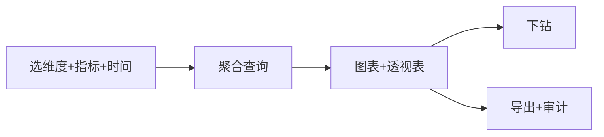

# 多维分析页

> 路由：`/analytics/explore`（计划：`lib/features/analytics/pages/analytics_explore_page.dart`）· Phase 5
> 上层：[Phase5-管理层总览](Phase5-管理层总览.md)

## 一、定位

管理层自助分析：选维度（时间/部门/产品/产线/班次）+ 指标（产量/合格率/成本/库存），动态出图表 + 透视表，支持下钻。

## 二、入口与导航
- 进入：manager 主导航「多维分析」；经营 Dashboard 指标下钻。
- 离开：导出。

## 三、响应式布局

- expanded：
```
┌──────────────────────────────────────────────┐
│ 多维分析                                      │
│ 维度[部门▼] 指标[产量▼][合格率▼] 时间[本月▼]   │
│ 范围[全公司▼]                  [应用] [导出]   │
├──────────────────────────────────────────────┤
│ 图表(按维度×指标)                             │  ← UtenChartPlaceholder
│ 透视表(UtenDataTable，行=维度，列=指标)        │
└──────────────────────────────────────────────┘
```
- compact：筛选折叠 + 表格优先。

## 四、涉及的 Uten 组件
`UtenAppBar` / `UtenDropdown`（维度/指标多选）/ `UtenDatePicker`(范围) / `UtenViewContextSelector` / `UtenChartPlaceholder` / `UtenDataTable`（透视表，可下钻）/ `UtenButton` / `UtenEmpty`。

## 五、功能点
1. **维度选择**：时间（日/周/月）、部门、产品、产线、班次（可多维度交叉）。
2. **指标选择**：产量、合格率、不良率、成本、库存、人数。
3. **图表 + 透视表**：动态按维度×指标渲染。
4. **下钻**：点表中某行 → 按子维度再展开（如部门→该部门产品）。
5. **保存视角**：常用分析组合可存为「我的看板」（Phase 5+）。
6. 导出。

## 六、功能链路图


## 七、涉及的数据实体
跨模块聚合（同经营 Dashboard）+ 查询维度对应的 `Department`/`Product`/`ProductionLine`/`ProductionShift`。

## 八、权限要求
- manager / admin。只读 + 导出审计。

## 九、边界情况
- 无数据：`UtenEmpty`「该维度组合暂无数据」。
- 性能档 lite：图表降级为表格。
- 大数据量：后端预聚合 + 分页，前端不拉全量。
- 网络：缓存上次查询。

---

**最后更新**：2026-07-22 · **状态**：需求定稿
