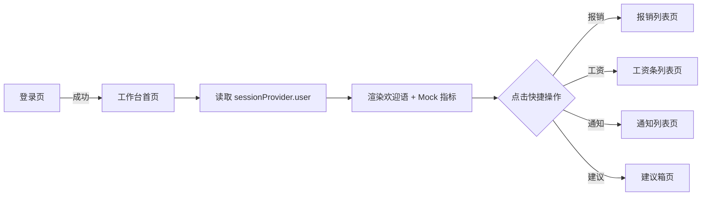

# 工作台首页

> 路由：`/dashboard` · 实现源：`lib/features/dashboard/pages/dashboard_page.dart`

## 一、定位

给所有员工（全员可见）使用的登录后默认落地页，是 App 的"门面"。

- 解决的问题：一眼看到今日关键指标、快速跳转到常用业务、传递欢迎感。
- 产品位置：主导航第一项，[登录页](登录页.md) 成功后默认重定向到此页。

## 二、入口与导航

- 进入路径：
  - [登录页](登录页.md) 登录成功后默认跳转
  - 底部/侧边导航第一项"工作台"
  - 任何子页面通过导航切回
- 在导航中的位置：**主导航第一项**，所有角色可见。
- 离开去向：通过快捷操作跳到 [报销列表页](报销列表页.md)、[工资条列表页](工资条列表页.md)、[通知列表页](通知列表页.md)、[建议箱页](建议箱页.md)。

## 三、响应式布局

- compact（手机，< 600dp）：
  ```
  ┌────────────────────────┐
  │ UtenAppBar 你好，张三   │
  │  欢迎回到优腾...        │
  ├────────────────────────┤
  │ ┌──────────────────┐   │
  │ │ 👋 你好，张三      │   │  ← 欢迎横幅（渐变）
  │ │ 欢迎回到 IMP       │   │
  │ │ [2026年7月21日·周二]│   │
  │ └──────────────────┘   │
  │ 今日概览                │
  │ ┌──────┐ ┌──────┐      │  ← StatCard 2 列
  │ │今日产量│ │当前库存│      │
  │ │ 1234 ↑│ │ 8945 ↓│      │
  │ └──────┘ └──────┘      │
  │ ┌──────┐ ┌──────┐      │
  │ │在线员工│ │待办事项│      │
  │ │  286 ↑│ │   18 ↓│      │
  │ └──────┘ └──────┘      │
  │ 快捷操作                │
  │ ┌────┬────┬────┬────┐  │  ← 4 个等宽按钮一行
  │ │报销 │工资 │通知 │建议 │  │
  │ └────┴────┴────┴────┘  │
  └────────────────────────┘
  ```
  说明：StatCard 2 列，快捷操作 4 个一行。

- medium（平板，600-840dp）：StatCard 3 列，快捷操作仍 4 列（宽度变大）。

- expanded（桌面，> 840dp）：StatCard 4 列横向铺开，快捷操作 4 列，左右留白通过 `context.breakpoint.gridColumns` 自适应列数。

## 四、涉及的 Uten 组件

- `UtenAppBar`（带 title + subtitle）
- `UtenStatCard`（数值卡，含图标 / 趋势箭头 / 百分比）
- `UtenColors`、`UtenAnim`
- `context.breakpoint`（响应式断点工具，提供 `gridColumns`）

## 五、功能点

1. AppBar 显示"你好，{用户姓名}" + 欢迎副标题，从 `sessionProvider` 读取当前用户。
2. 顶部欢迎横幅：渐变背景（深绿 → 深绿 → 青绿），含挥手图标、欢迎语、当前日期（"2026年7月21日 · 周二"格式）。
3. "今日概览"区：4 个 `UtenStatCard`（今日产量 / 当前库存 / 在线员工 / 待办事项），含趋势上升/下降百分比。
4. StatCard 响应式列数：`context.breakpoint.gridColumns` 自动适配 2/3/4 列。
5. StatCard stagger 进场动画：每项延迟 80ms 的 fade + 上滑（受性能档控制）。
6. "快捷操作"区：4 个等宽按钮一行 → 报销 / 工资条 / 通知 / 建议箱，点击 `context.go` 跳转。
7. 多语言：所有标题与单位通过 `AppLocalizations` 注入。
8. 数据全部为前端 Mock（Phase 1），后续接入后端 Dashboard 聚合接口。

## 六、功能链路图



## 七、涉及的数据实体

→ 见 [04-数据模型/实体字典.md](../04-数据模型/实体字典.md)
- `User`：读取姓名用于欢迎语
- `ProductionOutput`（Phase 4 接入，今日产量）
- `InventoryStock`（Phase 4 接入，当前库存）
- `Employee`（Phase 2 接入，在线员工）
- 待办事项数量（Phase 2+ 由各业务模块聚合）

## 八、权限要求

- **全员可见**（`employee / hr / finance / lab / production / manager / admin` 均可）。
- 数据范围：Phase 1 阶段均为 Mock；后端接入后，4 个指标根据角色显示不同范围（如 `manager` 看全公司，`employee` 看部门/个人）。
- 关键操作权限点：本页无写操作，仅展示与跳转。

## 九、边界情况

- 无数据时：Phase 1 Mock 永远有值；后端接入后若指标接口返回空，StatCard 显示 `0` + "暂无数据" 提示。
- 加载失败时：Phase 1 不存在失败场景；后端阶段需要给 StatCard 单独的 loading/error 状态（避免一个指标失败导致整页白屏）。
- 性能档 = lite 下：关闭 stagger 进场动画，StatCard 直接渲染；趋势百分比去掉过渡动画。
- 网络断开时：Phase 1 无依赖；后端接入后需缓存上次成功的指标数据 + 显示"数据可能不是最新"提示。
