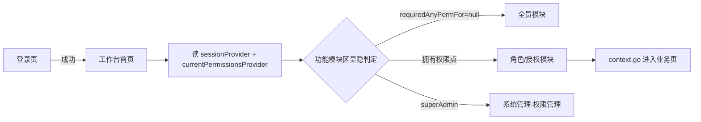

# 工作台首页

> 路由：`/dashboard` · 实现源：`lib/features/dashboard/pages/dashboard_page.dart` + `lib/features/dashboard/widgets/dashboard_overview_sections.dart` + `lib/features/dashboard/widgets/workbench_module_area.dart` + `server/.../features/dashboard/DashboardOverviewController.java`
> 最近重构：2026-07-23（UI v4 · 全屏宽 + 功能集散中心 + 分区可折叠）

## 一、定位

给所有员工（全员可见）使用的登录后默认落地页，是 App 的"门面"，也是**全部业务功能的集散中心**。

- 解决的问题：一眼看到今日关键指标与待办；按权限聚合展示当前用户可用的全部业务模块入口。
- 产品位置：底部悬浮胶囊导航第一项，[登录页](登录页.md) 成功后默认重定向到此页。
- UI v4 变化：原「左侧边栏（expanded）/ 折叠 Rail（medium）」承载的角色分组导航全部迁入本页「功能模块区」，侧边栏取消，内容全屏宽。

## 二、入口与导航

- 进入路径：
  - [登录页](登录页.md) 登录成功后默认跳转
  - 底部胶囊导航第一项「工作台」（四页可左右滑动切换，见 [App外壳.md](App外壳.md)）
  - 无权限访问受保护路由时被路由守卫重定向到此页
- 离开去向：功能模块区点击进入各业务页（工资条 / 报销 / 人事 / 财务 / 生产 / 决策 / 权限管理等）。

## 三、响应式布局

**全断点统一全屏宽**（取消 v3 的 `maxWidth: 1280` 收束），列数按容器实际宽度自适应：

```
┌──────────────────────────────────────────────┐
│ 👤 你好，张三            2026年7月23日 · 🔔(n) │  ← 页面头（头像+问候+通知入口）
│ ▾ 今日概览                                    │  ← 可折叠
│ ┌──── 按本人权限加载的指标卡片 ─────┐ │  ← 来自 Dashboard 聚合接口
│ ▾ 待办事项                                    │  ← 可折叠，位于功能模块区之前
│ ┌──────────────────────────────────────────┐ │
│ ▎常用功能        工资条 我的报销 建议箱 我的访客 │  ← 各分组可折叠（色条+标题+chevron）
│ ▎人事管理        员工档案 部门管理 …（按权限显隐） │
│ ▎财务管理        …                              │
│ ▎生产管理 / 安全核验 / 系统管理                  │
└──────────────────────────────────────────────┘
        （底部悬浮胶囊导航 overlay，不占布局）
```

- 页面底部留白 96px：胶囊导航 overlay 悬浮，滚动到底时最后内容可完全越过胶囊。
- StatCard / 模块卡片均用 `UtenResponsiveGrid`（按父容器宽度 1–5 列，模块区 compact 2 列 / medium 3 列 / expanded 4 列）。

## 四、涉及的 Uten 组件

- `UtenUserAvatar`（页头头像）· `UtenSectionHeader`（今日概览/待办事项分区标题）
- `UtenCollapsibleSection`（可折叠分区，v4 新增组件）
- `HrPendingBadge`（HR 待审红色数字徽章，访客审批/修改审批模块角标）

## 五、功能点

1. 页面头：头像 + 「你好，{姓名}」+ 日期，右侧通知铃铛带未读数 Badge（`unreadNoticeCountProvider`）。
2. **今日概览**：首帧后请求 `GET /api/dashboard/overview`，按本人权限和所属部门返回通知、生产、销售与财务等真实指标；财务敏感卡片还必须命中 `dashboard:finance-sensitive:view`，由服务端裁剪。
3. **待办任务**：同一聚合接口返回通知待办、生产待排产、仓库/采购/委外履约、访客审批和资料变更审核等可操作卡片；通知打开明细，其他卡片跳转真实处理页。
4. **功能模块区**（核心）：原侧边栏全部分组迁入——
   - 常用功能（全员）：工资条 / 我的报销 / 建议箱 / 我的访客
   - 人事管理 / 财务管理 / 生产管理 / 工程研发部（物料反查产成品）/ 安全核验（按权限显隐）
   - 系统管理：账号支持或授权管理入口（账号支持区与超管授权区在页面内继续分权，见 [权限管理页.md](权限管理页.md)）
   - 仓库、采购、委外模块进入各自 Hub 后，可从“任务中心”卡片打开 `/operations/workbench/warehouse`、`/operations/workbench/purchase`、`/operations/workbench/subcontract`；状态、批量动作和异常筛选见[生产履约任务工作台](生产履约任务工作台.md)
5. **按权限点显隐**：每个模块的可见性 = 用户是否拥有 `requiredAnyPermFor(location)` 返回列表中的任一权限点（`core/router/permission_by_path.dart`，与路由守卫同一份映射，单一数据源）；映射为 null = 登录即可见；超管全量放行；整组不可见时组标题不渲染。
6. **全部分区可折叠**：今日概览 / 待办事项 / 每个功能分组，点标题行收起/展开（`AnimatedCrossFade` + chevron 旋转），折叠状态在页面存活期间保留。

## 六、功能链路图



## 七、涉及的数据实体

→ 见 [04-数据模型/实体字典.md](../04-数据模型/实体字典.md)
- `User`：姓名、兼容 roles claim、后端合成的权限点集合（模块显隐只使用 permissions）
- `DashboardOverview`：服务端按权限/部门聚合 `metrics`、`todos` 和 `intelligence`，前端通过 `dashboardOverviewProvider` 加载；加载失败显示可重试错态，不使用 Mock 数据兜底。

## 八、权限要求

- **全员可见**；功能模块区按权限点精确显隐（见第五节第 5 点）。
- 权限来源（详见 [全局机制.md §一](../05-架构/全局机制.md)）：全员基础 ∪ 部门直配权限（含上级部门）± 个人覆盖；超管全量。角色体系不再参与合成。V135 授权版本变化会让旧 access token 立即 401，刷新/重登后工作台按新权限重建。

## 十、2026-07-31 今日概览与政策动态：一行展示 + 受众收敛

- **一行展示**：「今日概览」指标卡与「政策与监管动态」都最多显示一行（指标卡按宽度 1–4 列、政策卡按宽度 1–2 列，列数由 `LayoutBuilder` 按容器宽度实时计算，拉宽/拉窄窗口即时变化）；超出一行的内容折叠在末尾「加载更多」按钮后，点开全量展示并可再「收起」。
- **受众收敛**（服务端 `PolicyAudiences` 按 category 权威映射，不信任库存 `audience_tags` 与 AI 输出）：
  - 财税类（TAX / SUBSIDY / EXPORT）→ 财税部（FINANCE）+ 总经办直属（GM）；
  - 检查类（INSPECTION / SAFETY / QUALITY）与其他 → 仅总经办直属（GM）。
  - GM 标签只授予「直接在总经办」的人员（部门链 depth=0），不沿祖先链继承；V175 拍平后总经办为独立叶子部门（无下级），该判定即等于「总经办直属员工」。无任何可见条目时整个分区不渲染。
- 存量数据由 V174 迁移归一化；DeepSeek 摘要器不再输出 audienceTags，落库受众由分类映射生成。

## 九、边界情况

- 用户除全员基础外没有部门/个人权限：功能模块区只显示登录即可见的常用功能。
- 性能档 = lite：关闭 stagger 进场动画；折叠动画仍可用（开销极小）。
- 未读通知接口失败：Badge 不显示（`valueOrNull ?? 0`），页面其余部分不受影响。
