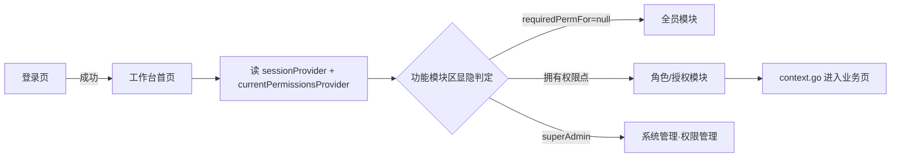

# 工作台首页

> 路由：`/dashboard` · 实现源：`lib/features/dashboard/pages/dashboard_page.dart` + `lib/features/dashboard/widgets/workbench_module_area.dart`
> 最近重构：2026-07-23（UI v4 · 全屏宽 + 功能集散中心 + 分区可折叠）

## 一、定位

给所有员工（全员可见）使用的登录后默认落地页，是 App 的"门面"，也是**全部业务功能的集散中心**。

- 解决的问题：一眼看到今日关键指标与待办；按权限聚合展示当前用户可用的全部业务模块入口。
- 产品位置：底部悬浮胶囊导航第一项，[登录页](登录页.md) 成功后默认重定向到此页。
- UI v4 变化：原「左侧边栏（expanded）/ 折叠 Rail（medium）」承载的角色分组导航全部迁入本页「功能模块区」，侧边栏取消，内容全屏宽。

## 二、入口与导航

- 进入路径：
  - [登录页](登录页.md) 登录成功后默认跳转
  - 底部胶囊导航第一项「工作台」（四页可左右滑动切换，见 [App外壳.md](App外壳.md)）
  - 无权限访问受保护路由时被路由守卫重定向到此页
- 离开去向：功能模块区点击进入各业务页（工资条 / 报销 / 人事 / 财务 / 生产 / 决策 / 权限管理等）。

## 三、响应式布局

**全断点统一全屏宽**（取消 v3 的 `maxWidth: 1280` 收束），列数按容器实际宽度自适应：

```
┌──────────────────────────────────────────────┐
│ 👤 你好，张三            2026年7月23日 · 🔔(n) │  ← 页面头（头像+问候+通知入口）
│ ▾ 今日概览                                    │  ← 可折叠
│ ┌───────────── 功能规划接入中 ──────────────┐ │  ← 占位（KPI 聚合未接后端）
│ ▾ 待办事项                                    │  ← 可折叠，位于功能模块区之前
│ ┌──────────────────────────────────────────┐ │
│ ▎常用功能        工资条 我的报销 建议箱 我的访客 │  ← 各分组可折叠（色条+标题+chevron）
│ ▎人事管理        员工档案 部门管理 …（按权限显隐） │
│ ▎财务管理        …                              │
│ ▎生产管理 / 安全核验 / 系统管理                  │
└──────────────────────────────────────────────┘
        （底部悬浮胶囊导航 overlay，不占布局）
```

- 页面底部留白 96px：胶囊导航 overlay 悬浮，滚动到底时最后内容可完全越过胶囊。
- StatCard / 模块卡片均用 `UtenResponsiveGrid`（按父容器宽度 1–5 列，模块区 compact 2 列 / medium 3 列 / expanded 4 列）。

## 四、涉及的 Uten 组件

- `UtenUserAvatar`（页头头像）· `UtenSectionHeader`（今日概览/待办事项分区标题）
- `UtenCollapsibleSection`（可折叠分区，v4 新增组件）
- `HrPendingBadge`（HR 待审红色数字徽章，访客审批/修改审批模块角标）

## 五、功能点

1. 页面头：头像 + 「你好，{姓名}」+ 日期，右侧通知铃铛带未读数 Badge（`unreadNoticeCountProvider`）。
2. **今日概览**：KPI 聚合暂未接后端（原 4 个 StatCard 为前端 Mock），暂以「功能规划接入中」占位承接。
3. **待办事项**：待办聚合暂未接后端（原为 Mock 清单），同样以占位承接，位于功能模块区之前。
4. **功能模块区**（核心）：原侧边栏全部分组迁入——
   - 常用功能（全员）：工资条 / 我的报销 / 建议箱 / 我的访客
   - 人事管理 / 财务管理 / 生产管理 / 工程研发部（物料反查产成品）/ 安全核验（按权限显隐）
   - 系统管理：权限管理（仅超管，见 [权限管理页.md](权限管理页.md)）
5. **按权限点显隐**：每个模块的可见性 = 用户是否拥有 `requiredPermFor(location)` 返回的权限点（`core/router/permission_by_path.dart`，与路由守卫同一份映射，单一数据源）；映射为 null = 登录即可见；超管全量放行；整组不可见时组标题不渲染。
6. **全部分区可折叠**：今日概览 / 待办事项 / 每个功能分组，点标题行收起/展开（`AnimatedCrossFade` + chevron 旋转），折叠状态在页面存活期间保留。

## 六、功能链路图



## 七、涉及的数据实体

→ 见 [04-数据模型/实体字典.md](../04-数据模型/实体字典.md)
- `User`：姓名、角色、权限点集合（模块显隐判定）
- 待办/指标仍为前端 Mock，后续接入后端 Dashboard 聚合接口

## 八、权限要求

- **全员可见**；功能模块区按权限点精确显隐（见第五节第 5 点）。
- 权限来源三层（详见 [全局机制.md §一](../05-架构/全局机制.md)）：直接角色 ∪ 直属部门角色 → 权限并集 → ± 个人权限点覆盖。超管调整权限后，工作台模块随之增减（下次登录/令牌刷新生效）。

## 九、边界情况

- 用户无任何角色权限：功能模块区只剩「常用功能」组（登录即可见的模块）。
- 性能档 = lite：关闭 stagger 进场动画；折叠动画仍可用（开销极小）。
- 未读通知接口失败：Badge 不显示（`valueOrNull ?? 0`），页面其余部分不受影响。
