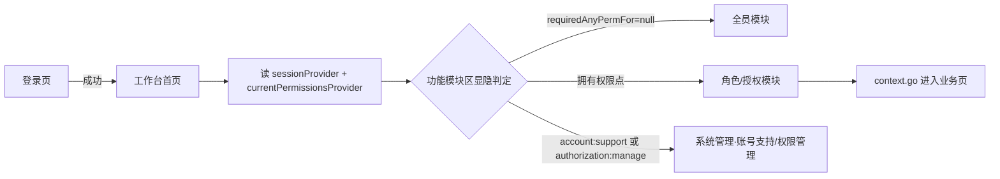

# 工作台首页

> **2026-09-23(ADR-108)**：工作台全部卡片红黄徽章、分组合计、导航「工作台」「通知」两个 Tab 的数字，
> 由 `GET /api/workbench/badges` 一次带回(服务端 `WorkbenchBadgeCatalog` 唯一口径)；前端只有一个 60s 轮询
> (页面隐藏暂停、登出即停)。返回工作台时徽章汇总单飞重拉一次 + 概览重取, 不再逐个失效十几个计数源。
> 用户自定义分组卡片的合计仍在前端按卡片相加(那是用户自己摆的卡, 不是业务口径)。

> **2026-09-12 部门概览修订**：今日概览与待办按本人主职、兼职部门及职责权限共同筛选；超管与个人点名授权也不跨部门展示。目标业务页面的跨部门授权仍有效。销售概览还复用单据负责人数据范围，不能汇总本人无权查看的订单。个人未读通知仍按通知收件人范围显示。
>
> 视觉统一为连续指标带与横向待办网格，按可用宽度和字号换行，保留紧急提示、截止时间、空态和详情跳转。去掉数字水印、扫描背景和纵向节点轴。

> 2026-09-07：常用功能中的待审收件台已删除，旧 `/reviews/inbox` 只回本页，各真实任务入口
> 继续显示服务端任务徽章。财务初审与销售订单修改分别进入对应队列，顶层财务徽章只计算一次总量。
> 卡片和页面仍使用同一路由权限规则；弹窗按主职/兼职部门、页面查看及职责动作再次筛选，
> 工作台卡片可见不代表应收到该部门的居中弹窗。参见[权限体系总设计](../05-架构/权限体系总设计.md)。

当前实现入口：

| 职责 | 代码入口 |
|---|---|
| 页面、概览与系统测试区 | [DashboardPage](../../lib/features/dashboard/pages/dashboard_page.dart)、[DashboardOverviewSections](../../lib/features/dashboard/widgets/dashboard_overview_sections.dart)、[SystemTestArea](../../lib/features/dashboard/widgets/system_test_area.dart) |
| 模块可见性、排序、折叠与徽标 | [WorkbenchModuleArea](../../lib/features/dashboard/widgets/workbench_module_area.dart) 的 `_buildSection`、[WorkbenchLayout](../../lib/features/dashboard/providers/workbench_layout_provider.dart)（分组排序/折叠 + 组内卡片排序 `itemOrders`）、`_ReorderableModuleGrid`（组内卡片长按拖动换位）；[路由权限映射](../../lib/core/router/permission_by_path.dart) |
| 聚合接口 | [DashboardOverviewController](../../server/src/main/java/com/uten/imp/features/dashboard/DashboardOverviewController.java)；`GET /api/dashboard/overview` |
| 清空业务数据 | [BusinessDataResetService](../../server/src/main/java/com/uten/imp/features/admin/systemtest/BusinessDataResetService.java)、[停机psql脚本](../../server/ops/reset_business_data.sql)；[迁移入口](../数据迁移/README.md) |

各功能按下文现行规则维护；旧改版日期和阶段“源码候选”记录不再作为操作指南。

## 一、定位

给所有员工（全员可见）使用的登录后默认落地页，是 App 的"门面"，也是**全部业务功能的集散中心**。

- 解决的问题：一眼看到今日关键指标与待办；按权限聚合展示当前用户可用的全部业务模块入口。
- 产品位置：底部悬浮胶囊导航第一项，[登录页](登录页.md) 成功后默认重定向到此页。
- UI v4 变化：原「左侧边栏（expanded）/ 折叠 Rail（medium）」承载的角色分组导航全部迁入本页「功能模块区」，侧边栏取消，内容全屏宽。

## 二、入口与导航

- 进入路径：
  - [登录页](登录页.md) 登录成功后默认跳转
  - 底部胶囊导航第一项「工作台」（四页可左右滑动切换，见 [App外壳.md](App外壳.md)）
  - 无权限访问受保护路由时被路由守卫重定向到此页
- 离开去向：功能模块区点击进入各业务页（工资条 / 报销 / 人事 / 财务 / 生产 / 决策 / 权限管理等）。

## 三、响应式布局

**全断点统一全屏宽**（取消 v3 的 `maxWidth: 1280` 收束），列数按容器实际宽度自适应：

```
┌──────────────────────────────────────────────┐
│ 👤 你好，张三            2026年7月23日 · 🔔(n) │  ← 页面头（头像+问候+通知入口）
│ ▾ 今日概览                                    │  ← 可折叠
│ ┌──── 按本人权限加载的指标卡片 ─────┐ │  ← 来自 Dashboard 聚合接口
│ ▾ 待办事项                                    │  ← 可折叠，位于功能模块区之前
│ ▎常用功能        工资条 我的报销 建议箱 我的访客 │  ← 各分组可折叠（色条+标题+chevron）
│ ▎人事管理        员工档案 部门管理 …（按权限显隐） │
│ ▎财务管理        …                              │
│ ▎生产管理 / 安全核验 / 系统管理                  │
└──────────────────────────────────────────────┘
        （底部悬浮胶囊导航 overlay，不占布局）
```

- 页面底部留白 96px：胶囊导航 overlay 悬浮，滚动到底时最后内容可完全越过胶囊。
- StatCard / 模块卡片均用 `UtenResponsiveGrid`（按父容器宽度 1–5 列，模块区 compact 2 列 / medium 3 列 / expanded 4 列）。

## 四、涉及的 Uten 组件

- `UtenUserAvatar`（页头头像）· `UtenSectionHeader`（今日概览/待办事项分区标题）
- `UtenCollapsibleSection`（可折叠分区，v4 新增组件）
- `WorkbenchCardBadge` / `WorkbenchGroupBadge`（工作台模块与分组统一数字角标）

## 五、功能点

1. 页面头：头像 + 「你好，{姓名}」+ 日期，右侧通知铃铛带未读数 Badge（`unreadNoticeCountProvider`）。**超级管理员**额外显示「切换人」chip（`isSuperAdminProvider` 且非模拟中）—— 进入限时模拟窗口后以任意员工真实视角核验权限配置；模拟中入口隐藏，改由顶部常驻横幅接管「切换/退出」。详见 [模拟身份(切换人).md](模拟身份(切换人).md)。
2. **今日概览**：首帧后请求 `GET /api/dashboard/overview`，按本人权限和所属部门返回通知、生产、销售等真实非金额指标。服务端不再查询或返回账户余额、未结应收、未结应付金额卡；财务金额分别在账户资料和钱流台账按各自权限查看。`dashboard:finance-sensitive:view` 仍可用于财税政策受众等既有边界，但不恢复上述三张卡。
3. **待办任务**：同一聚合接口返回通知待办与本部门计数卡(生产待排产、仓库领料与退料、采购任务、委外任务、访客审批、资料变更审核、报销待审批 / 待付款)；通知打开明细，其他卡片跳转真实处理页。**计数卡的数字就是对应模块卡的红徽章数**(permissions-08, ADR-108)：服务端经徽章只读端口 `WorkbenchBadgeReadPort` 只算本部门要的几个入口，入口目录、来源与资格判定(各来源原计数端点的 `@PreAuthorize`)都与 `GET /api/workbench/badges` 同一套；部门只决定「该不该出现在你的工作台上」。此前概览按「部门 + 权限码」另写一套计数，与红徽章是两套规则、两个数。某个来源出错时该卡本次不出(徽章侧保留上一次的数)，不丢弃其他首页内容，也不把加载失败伪装成零待办。工资批次待复核不再单列计数卡：提交时已给复核人推「待复核」行动通知，出现在通知待办里。分区用 `UtenCollapsibleSection` 承载，标题旁的红色数字徽章显示各待办 `count` 之和(= 待处理件数总和)；收起后徽章仍可见，便于一眼掌握待办规模。
4. **功能模块区**（核心）：原侧边栏全部分组迁入——
   - 常用功能（全员）：工资条 / 我的报销 / 建议箱 / 我的访客
   - 人事管理 / 财务管理 / 生产管理 / 工程研发部（物料反查产成品 + 任务中心）/ 安全核验（按权限显隐）
   - 系统管理：账号支持或授权管理入口（账号支持区与超管授权区在页面内继续分权；未开户候选明确标识，
     只有 `account:support` 可补开，`authorization:manage` 不替代，见 [权限管理页.md](权限管理页.md)）
   - 仓库、采购、委外模块进入各自 Hub 后，可从“任务中心”卡片打开 `/operations/workbench/warehouse`、`/operations/workbench/purchase`、`/operations/workbench/subcontract`；钱流 Hub 打开 `/finance/procurement-approvals`、`/finance/procurement-arrival-exceptions`。共享任务、批准、驳回分别授权 `finance_order_approval:view/approve/reject` 并叠加实时审核资格（V328/ADR-027，不再单点配置负责人）。现行申请只读、订货分解、财务审批、预计到货和超量退回规则见[生产履约任务工作台](生产履约任务工作台.md)。
   - 工程研发部分区「任务中心」卡（`/rd/tasks`，权限点 `rd_task:view`）接收设计、打样、试产、ECN 等独立工程任务；V423 后不再接收新的生产 BOM 缺失转发，历史存量 BOM 任务只读保留并继续流转。共享角标读取 `/api/rd-tasks/count` 展示未完成数，详见 [工程研发部任务中心](工程研发部任务中心.md)。
   - 品质管理部分区顶层只保留「品质任务中心」卡（`/quality/task-center`）；持
     `procurement_inspection:view` 或 `production_quality_inspection:view` 任一权限可见。工作台角标
     合计当前账号有权的 IQC 待检收货单与 FQC 待处理 inspection；任一有权来源仍在加载或失败时，
     不得把未知值当 0 后显示一个看似完整的合计。中心内「任务中心」进入 IQC/FQC 办理页，
     「查询与记录 → 检测记录」进入真实只读 `/quality/inspection-records`。主工作台不再单列
     `/lab/test`；旧 `lab:test:*` 实验室能力仍未实现。详见 [品质任务中心](品质任务中心.md) 与
     [品质检测记录页](品质检测记录页.md)。
   - 销售管理卡的 `WorkbenchBadgeKind.sales` 不再只读完工通知。计数同时读取订单进度
     `stage-counts.REJECTED` 与完工来源事件未读数；前者是未解决业务状态，后者是进度消息。
     财务驳回、销售受控修订、重新审核三步会让任务在销售与财务模块之间转移，两个模块不得同时
     把同一订单显示为各自可办件。
5. **按权限点显隐**：每个模块的可见性 = 用户是否拥有 `requiredAnyPermFor(location)` 返回列表中的任一权限点（`core/router/permission_by_path.dart`，与路由守卫同一份映射，单一数据源）；映射为 null = 登录即可见；超管全量放行；整组不可见时组标题不渲染。
6. **全部分区可折叠**：今日概览 / 待办事项 / 每个功能分组，点标题行收起/展开（`AnimatedCrossFade` + chevron 旋转），功能模块的排序和折叠状态由 `workbenchLayoutProvider` 持久化到服务端；部门分组展开时隐藏分组徽章、收起时显示，卡片徽章继续展示各任务实时数量。**2026-09-10**：组内卡片支持长按拖到另一张卡片上换位（`_ReorderableModuleGrid`，悬停即换位 + 原位半透明残影），顺序以 `itemOrders`（分组 key → 卡片 location 序列）同一 Provider 持久化；不可见卡片（权限过滤）保持原位不丢排，新卡片按代码默认顺序补尾。
7. **我的部门**：入口位于“我的”页，点进 `/profile/me/department` 查看架构树、花名册和负责人说明。该页不再配置成员权限；合法负责人到对应业务页右上角“权限设置”维护本页权限。详见 [我的页.md](我的页.md) 与 [ADR-045](../99-决策记录-ADR/ADR-045-页面内权限委派与授权来源隔离.md)。

本人生日、入职周年、新婚或新生儿庆典由 `CelebrationTodayCard` 展示，`CelebrationPopupGate` 控制每日一次的庆典弹窗；它与有部门及职责权限限制的业务审批弹窗分别处理。人力资源“任务中心”汇总转正、生日、入职周年等提醒，详见[HR任务中心](HR任务中心.md)。

## 六、功能链路图



## 七、涉及的数据实体

→ 见 [04-数据模型/实体字典.md](../04-数据模型/实体字典.md)
- `User`：姓名、兼容 roles claim、后端合成的权限点集合（模块显隐只使用 permissions）
- `DashboardOverview`：服务端按权限/部门聚合 `metrics`、`todos` 和 `intelligence`，前端通过 `dashboardOverviewProvider` 加载(按需一次、不轮询)；本部门计数卡取自徽章只读端口(见第五节第 3 点)，聚合失败显示可重试错态，不使用 Mock 数据兜底。

## 八、权限要求

- **全员可见**；功能模块区按权限点精确显隐（见第五节第 5 点）。
- 权限来源（详见 [全局机制.md §一](../05-架构/全局机制.md)）：全员基础 ∪ 部门直配权限（含上级部门）± 个人覆盖；超管全量。角色体系不再参与合成。V135 授权版本变化会让旧 access token 立即 401，刷新/重登后工作台按新权限重建。

## 十、2026-07-31 今日概览与政策动态：一行展示 + 受众收敛

- **一行展示**：「今日概览」指标卡与「政策与监管动态」都最多显示一行（指标卡按宽度 1–4 列、政策卡按宽度 1–2 列，列数由 `LayoutBuilder` 按容器宽度实时计算，拉宽/拉窄窗口即时变化）；超出一行的内容折叠在末尾「加载更多」按钮后，点开全量展示并可再「收起」。
- **受众收敛**（服务端 `PolicyAudiences` 按 category 权威映射，不信任库存 `audience_tags` 与 AI 输出）：
  - 财税类（TAX / SUBSIDY / EXPORT）→ 财税部（FINANCE）+ 总经办直属（GM）；
  - 检查类（INSPECTION / SAFETY / QUALITY）与其他 → 仅总经办直属（GM）。
  - GM 标签只授予「直接在总经办」的人员（部门链 depth=0），不沿祖先链继承；V175 拍平后总经办为独立叶子部门（无下级），该判定即等于「总经办直属员工」。无任何可见条目时整个分区不渲染。
- 存量数据由 V174 迁移归一化；DeepSeek 摘要器不再输出 audienceTags，落库受众由分类映射生成。

## 九、边界情况

- 用户除全员基础外没有部门/个人权限：功能模块区只显示登录即可见的常用功能。
- 性能档 = lite：关闭 stagger 进场动画；折叠动画仍可用（开销极小）。
- 未读通知接口失败：Badge 不显示（`valueOrNull ?? 0`），页面其余部分不受影响。
- IQC 待检通知和品质角标彼此独立：通知用于提醒并触发 `pending-count` 重拉；Outbox 送达前若
  收货单已无 `PENDING/PARTIAL` 明细则跳过过期通知，而工作台角标始终读取实时待检聚合。
- `/api/dashboard/overview` 的本部门计数卡某个来源出错(非认证/授权异常)：徽章服务按 JDBC 保存点隔离该来源，
  入口标为本次没算出，概览**本次不出这张卡**，其他指标、待办与政策动态照常；同一入口的模块卡红徽章保留上一次的数。
  下一次进工作台(或返回即刷新)自然重算，前端不再为此单独轮询。(2026-09-23 前的「正在自动恢复」占位卡、
  `dashboard_fulfillment_partition_degraded` 审计与 15 秒重试已随 permissions-08 删除。)
- 某来源对当前主体无权(其原计数端点的 `@PreAuthorize` 拒绝)：入口不出现、不出卡；与模块卡是否显示红徽章同一判定。
- 权限解析依赖故障返回的结构化 `503 SERVICE_UNAVAILABLE` 不能伪装成零待办；前端只对该安全读做有限重试，
  保留会话并显示明确的可重试错态，不显示“无权限”。
- 首页聚合故意不包裹一个共享数据库事务：徽章端口自己开只读事务，其余分区各自读取，避免已捕获的子事务异常把外层标记为 `rollback-only`。全库不可用仍走整体可重试错态；该边界不提供 Mock/旧数据兜底。

## 十、系统测试区 (ADR-067，仅超管)

页面最底部、功能模块区之后，`SystemTestArea`（`lib/features/dashboard/widgets/system_test_area.dart`）：

- **可见性**：仅超级管理员渲染（`isSuperAdminProvider`，非超管整区不出现）；默认收起，点标题展开。**不设独立权限码**——超管专属测试工具，不进权限目录/部门授权体系（与权限总设计「工作台无泛化 workbench:* 码」一致）。
- **首张卡「清空数据」**：与功能模块区卡片同款样式（图标块 + 标题，同一响应式网格），仅图标块/图标改用红色警示配色；**整卡可点、卡上无按钮**，点击直接弹确认框，**逐字输入「清空业务数据」** 口令后才能提交（后端同款校验，双保险），完整说明全部收进弹窗。
- **清空口径**(当前迁移维护的 `business_data_reset()` 与停机psql脚本使用同一份 CLEAR/PRESERVE 清单，`BusinessDataResetSqlContractTest` 锁定同步；具体版本和验证结果见迁移索引)：
  - 保留：基础资料（货品/客户/供应商/账户/仓库…）、人事、账号权限、审计日志与治理证据；保留表行数不变校验；
  - 清空：销售/采购/委外/生产/仓库/财务全部业务单据、明细、流水、预留、核销及派生数据，`TRUNCATE RESTART IDENTITY`，自增 ID 从 1 重新开始；
  - 归零：库存、库存流水/预留/金额（清空）、账户期初/累计收款/累计付款/累计调整/当前余额、客户供应商期初往来、货品期初库存/安全库存/20 项成本金额费率、结算类别期初金额；六物化视图刷新并校验为零；
  - 下线：全部校验通过后 `authorization_state.epoch + 1` + 清空 `refresh_tokens`——**所有人（含当前账号）立即退出，需重新登录**；前端成功后主动本地登出并跳登录页。
- **安全门禁**（后端四重）：`uten.features.business-data-reset-enabled` 运行开关（仅 dev / internal-test profile 开启，生产与云端默认 403 拒绝）→ 数据库确认的超管（`@PreAuthorize("principal.superAdmin")`）→ 请求体口令逐字匹配 → 排水闸（清空期间其它 `/api` 请求 503，等在途请求清零再执行；替代 psql 版「停应用」静默前提）。单事务执行，任一校验失败整体回滚；该按钮不会自动备份，清空前须按部署流程完成备份，已提交的清空只能通过外部备份恢复。
- **业务附件自动清理**（ADR-067 §7，2026-09-10）：清空前服务端在排水内循环「预览→标删/入队→同步排水删除队列（物理删除+完成证明）」直到阻塞归零（5 分钟预算）；人事与货品主档附件（V549 保护集 EMPLOYEE/EMPLOYEE_CONTRACT/GOODS）随主档保留。确认按钮只看口令；「先分批清理附件」弹窗为可选入口。附件预览被运行开关拒绝（FORBIDDEN）时显示后端原话并保持禁用，其它预览失败不影响清空。
- **拒绝语义**：自动清理消化不了的阻塞（原件/会话在 oss/legacy_unknown、状态非 CLEAN、上传凭证未到期、删除失败达告警阈值）在排水之前按原因分组返回 409（计数 + 前 5 个文件名 + 处置指引）；outbox 待处理/失败事件、出现未分类新表等仍由 `business_data_reset()` 以 SQLSTATE UT900 拒绝为 409。
- **超时与结果回显**：清空是同步长请求，网关对该路径放宽到 600s、前端接收超时 10 分钟；仍超时则提示「请求已超时，清空可能仍在后台执行；稍后若被强制下线即表示已完成」。成功提示含物理删除附件文件数；重登后展开本区回显「上次清空」（`GET /api/system-test/business-data/last-result`，audit_log 最近一条）。
- **待确认记录的收尾**（[ADR-067 §9](../99-决策记录-ADR/ADR-067-工作台系统测试区与业务数据一键清空.md)，2026-09-20）：服务端收到清空请求的第一步就独立写「受理回执」，受理后明确失败再写「失败回执」。核对结果时按回执确定地处理本地待确认记录：服务器从未受理（提交时连接中断，超过 30 秒余量）→ 撤销并提示「没有收到本次清空请求…现在可以重新提交」；受理后明确失败 → 撤销并显示服务端原因；受理它的进程已重启 → 清空已随进程回滚，撤销；已受理、仍是当前进程、未失败 → 继续等待，不允许再次提交。撤销后弹窗内等待态解除，口令仍在即可直接重提。
- **登录会话重建门**：`SessionRehydrateGate` 在未登录→已登录时推进 `sessionEpochProvider`，全局角标 Notifier 从零重建并立即重拉，工作台概览/通知列表缓存失效——清空后重登无需再手动刷新。
