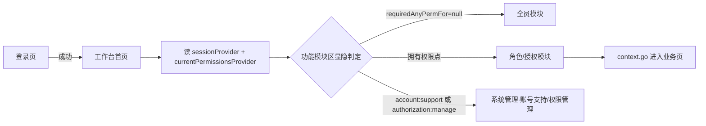

# 工作台首页

> 路由：`/dashboard` · 实现源：`lib/features/dashboard/pages/dashboard_page.dart` + `lib/features/dashboard/widgets/dashboard_overview_sections.dart` + `lib/features/dashboard/widgets/workbench_module_area.dart` + `server/.../features/dashboard/DashboardOverviewController.java`
> 最近重构：2026-07-23（UI v4 · 全屏宽 + 功能集散中心 + 分区可折叠）
> 最近核对：2026-08-02（履约工作台分区故障隔离、15 秒降级恢复轮询与审计）
> 「我的部门」已迁入“我的”页，保留全员只读组织树、安全花名册和负责人说明；权限转授已迁到各业务页右上角“权限设置”。工程研发部任务中心仍在；所有模块待办角标由 `WorkbenchCardBadge` 统一渲染。
> 2026-08-03 调整：「我的部门」**由本页移植到「我的」页**（`/profile`，快捷卡位于「我的修改申请」之上，点进 `/profile/me/department` 全页面查看），工作台不再展示该卡片；功能与后端接口不变，详见 [我的页.md](我的页.md)。
> 2026-08-04 调整：「待办任务」分区改为 `UtenCollapsibleSection`（点标题可收起/展开），标题旁加总数徽章（`UtenNotificationBadge`，= 各待办 `count` 之和，无待办时不显）。
> 2026-08-05 新增：「行政与人力资源部」分区置顶**「任务中心」**卡（`/hr/tasks`，权限 `employee:view`，`WorkbenchBadgeKind.hrTask` 60s 轮询徽标 = 今日转正 + 逾期转正 + 今日生日 + 今日周年），集中提醒转正/生日/入职周年/新入职，详见 [HR任务中心](HR任务中心.md)。
> 2026-08-06 升级（ADR-026）：①部门分区徽标**展开隐 / 收起显**（`WorkbenchModuleArea._buildSection` 的 `titleTrailing` 加 `expanded` 守卫；今日概览/待办任务/常用功能不变）；②今日概览置顶**庆典卡片** `CelebrationTodayCard`（当前用户本人生日/周年/新婚/新生儿，常驻轻量动画，当日结束消失）；③登录后落地本页触发**庆典弹窗**（每日一次，`CelebrationPopupGate`）。
> 2026-08-22 源码候选：品质管理部「品质任务中心」角标接入 IQC 实时待检数，并补齐返回工作台/新通知检测后的即时重拉；部署与多账号 UAT 待验收。
> 2026-08-27 源码候选：今日概览停止返回人民币账户余额、未结应收和未结应付三张金额卡；账户余额回到账户资料按币种展示，AR/AP 回到钱流台账，工作台只保留入口、非金额指标和可执行待办。
> 2026-08-27 ADR-052 源码候选：销售管理角标改为“本人范围内未解决的财务驳回订单 + 未读完工进度消息”，与 Sales Hub“订单进度查询”同源。打开进度页只清进度未读，不能清返工状态；订单受控修订并重新审核后，驳回角标才转回财务待确认角标。

## 一、定位

给所有员工（全员可见）使用的登录后默认落地页，是 App 的"门面"，也是**全部业务功能的集散中心**。

- 解决的问题：一眼看到今日关键指标与待办；按权限聚合展示当前用户可用的全部业务模块入口。
- 产品位置：底部悬浮胶囊导航第一项，[登录页](登录页.md) 成功后默认重定向到此页。
- UI v4 变化：原「左侧边栏（expanded）/ 折叠 Rail（medium）」承载的角色分组导航全部迁入本页「功能模块区」，侧边栏取消，内容全屏宽。

## 二、入口与导航

- 进入路径：
  - [登录页](登录页.md) 登录成功后默认跳转
  - 底部胶囊导航第一项「工作台」（四页可左右滑动切换，见 [App外壳.md](App外壳.md)）
  - 无权限访问受保护路由时被路由守卫重定向到此页
- 离开去向：功能模块区点击进入各业务页（工资条 / 报销 / 人事 / 财务 / 生产 / 决策 / 权限管理等）。

## 三、响应式布局

**全断点统一全屏宽**（取消 v3 的 `maxWidth: 1280` 收束），列数按容器实际宽度自适应：

```
┌──────────────────────────────────────────────┐
│ 👤 你好，张三            2026年7月23日 · 🔔(n) │  ← 页面头（头像+问候+通知入口）
│ ▾ 今日概览                                    │  ← 可折叠
│ ┌──── 按本人权限加载的指标卡片 ─────┐ │  ← 来自 Dashboard 聚合接口
│ ▾ 待办事项                                    │  ← 可折叠，位于功能模块区之前
│ ▎常用功能        工资条 我的报销 建议箱 我的访客 │  ← 各分组可折叠（色条+标题+chevron）
│ ▎人事管理        员工档案 部门管理 …（按权限显隐） │
│ ▎财务管理        …                              │
│ ▎生产管理 / 安全核验 / 系统管理                  │
└──────────────────────────────────────────────┘
        （底部悬浮胶囊导航 overlay，不占布局）
```

- 页面底部留白 96px：胶囊导航 overlay 悬浮，滚动到底时最后内容可完全越过胶囊。
- StatCard / 模块卡片均用 `UtenResponsiveGrid`（按父容器宽度 1–5 列，模块区 compact 2 列 / medium 3 列 / expanded 4 列）。

## 四、涉及的 Uten 组件

- `UtenUserAvatar`（页头头像）· `UtenSectionHeader`（今日概览/待办事项分区标题）
- `UtenCollapsibleSection`（可折叠分区，v4 新增组件）
- `WorkbenchCardBadge` / `WorkbenchGroupBadge`（工作台模块与分组统一数字角标）

## 五、功能点

1. 页面头：头像 + 「你好，{姓名}」+ 日期，右侧通知铃铛带未读数 Badge（`unreadNoticeCountProvider`）。**超级管理员**额外显示「切换人」chip（`isSuperAdminProvider` 且非模拟中）—— 进入限时模拟窗口后以任意员工真实视角核验权限配置；模拟中入口隐藏，改由顶部常驻横幅接管「切换/退出」。详见 [模拟身份(切换人).md](模拟身份(切换人).md)。
2. **今日概览**：首帧后请求 `GET /api/dashboard/overview`，按本人权限和所属部门返回通知、生产、销售等真实非金额指标。服务端不再查询或返回账户余额、未结应收、未结应付金额卡；财务金额分别在账户资料和钱流台账按各自权限查看。`dashboard:finance-sensitive:view` 仍可用于财税政策受众等既有边界，但不恢复上述三张卡。
3. **待办任务**：同一聚合接口返回通知待办、生产待排产、仓库/采购/委外履约、财务订货/超量审批、访客审批和资料变更审核等可操作卡片；通知打开明细，其他卡片跳转真实处理页。财务任务为共享队列，对所有持 `finance_order_approval:view` 的财务人员可见（不再按个人 `assignee` 过滤）；通知和超级管理员标记不替代服务端资格判定。仓库、采购、委外按分区独立查询，某一履约分区发生非安全异常时以明确的“正在自动恢复”卡替代该分区，不丢弃其他首页内容，也不把加载失败伪装成零待办。分区用 `UtenCollapsibleSection` 承载，标题旁的红色数字徽章显示各待办 `count` 之和（= 待处理件数总和）；收起后徽章仍可见，便于一眼掌握待办规模。
4. **功能模块区**（核心）：原侧边栏全部分组迁入——
   - 常用功能（全员）：工资条 / 我的报销 / 建议箱 / 我的访客
   - 人事管理 / 财务管理 / 生产管理 / 工程研发部（物料反查产成品 + 任务中心）/ 安全核验（按权限显隐）
   - 系统管理：账号支持或授权管理入口（账号支持区与超管授权区在页面内继续分权；未开户候选明确标识，
     只有 `account:support` 可补开，`authorization:manage` 不替代，见 [权限管理页.md](权限管理页.md)）
   - 仓库、采购、委外模块进入各自 Hub 后，可从“任务中心”卡片打开 `/operations/workbench/warehouse`、`/operations/workbench/purchase`、`/operations/workbench/subcontract`；钱流 Hub 打开 `/finance/procurement-approvals`、`/finance/procurement-arrival-exceptions`，审批权在权限管理授权 `finance_order_approval:review`（V229/ADR-027，不再单点配置负责人）。现行申请只读、订货分解、财务审批、预计到货和超量退回规则见[生产履约任务工作台](生产履约任务工作台.md)。
   - 工程研发部分区「任务中心」卡（`/rd/tasks`，权限点 `rd_task:view`）接收设计、打样、试产、ECN 等独立工程任务；V423 后不再接收新的生产 BOM 缺失转发，历史存量 BOM 任务只读保留并继续流转。共享角标读取 `/api/rd-tasks/count` 展示未完成数，详见 [工程研发部任务中心](工程研发部任务中心.md)。
   - 品质管理部分区「品质任务中心」卡（`/quality/task-center`，权限点
     `procurement_inspection:view`）的角标读取 `GET /api/procurement/inspection/pending-count`，
     只表示仍有 `PENDING/PARTIAL` 明细的收货单张数。`refreshGlobalBadges` 已包含该 provider：
     返回工作台或客户端检测到新通知使未读数上升时立即重拉，不把 IQC 通知条数当成待检角标。
     详见 [品质任务中心](品质任务中心.md)。
   - 销售管理卡的 `WorkbenchBadgeKind.sales` 不再只读完工通知。计数同时读取订单进度
     `stage-counts.REJECTED` 与完工来源事件未读数；前者是未解决业务状态，后者是进度消息。
     财务驳回、销售受控修订、重新审核三步会让任务在销售与财务模块之间转移，两个模块不得同时
     把同一订单显示为各自可办件。
5. **按权限点显隐**：每个模块的可见性 = 用户是否拥有 `requiredAnyPermFor(location)` 返回列表中的任一权限点（`core/router/permission_by_path.dart`，与路由守卫同一份映射，单一数据源）；映射为 null = 登录即可见；超管全量放行；整组不可见时组标题不渲染。
6. **全部分区可折叠**：今日概览 / 待办事项 / 每个功能分组，点标题行收起/展开（`AnimatedCrossFade` + chevron 旋转），折叠状态在页面存活期间保留。
7. ~~「我的部门」卡片~~（**2026-08-03 已移植到「我的」页**）：点进 `/profile/me/department` 查看架构树、花名册和负责人说明。该页不再配置成员权限；合法负责人到对应业务页右上角“权限设置”维护本页权限。详见 [我的页.md](我的页.md) 与 [ADR-045](../99-决策记录-ADR/ADR-045-页面内权限委派与授权来源隔离.md)。

## 六、功能链路图



## 七、涉及的数据实体

→ 见 [04-数据模型/实体字典.md](../04-数据模型/实体字典.md)
- `User`：姓名、兼容 roles claim、后端合成的权限点集合（模块显隐只使用 permissions）
- `DashboardOverview`：服务端按权限/部门聚合 `metrics`、`todos` 和 `intelligence`，前端通过 `dashboardOverviewProvider` 加载；履约分区按本节故障边界局部降级，其他聚合失败仍显示可重试错态，不使用 Mock 数据兜底。

## 八、权限要求

- **全员可见**；功能模块区按权限点精确显隐（见第五节第 5 点）。
- 权限来源（详见 [全局机制.md §一](../05-架构/全局机制.md)）：全员基础 ∪ 部门直配权限（含上级部门）± 个人覆盖；超管全量。角色体系不再参与合成。V135 授权版本变化会让旧 access token 立即 401，刷新/重登后工作台按新权限重建。

## 十、2026-07-31 今日概览与政策动态：一行展示 + 受众收敛

- **一行展示**：「今日概览」指标卡与「政策与监管动态」都最多显示一行（指标卡按宽度 1–4 列、政策卡按宽度 1–2 列，列数由 `LayoutBuilder` 按容器宽度实时计算，拉宽/拉窄窗口即时变化）；超出一行的内容折叠在末尾「加载更多」按钮后，点开全量展示并可再「收起」。
- **受众收敛**（服务端 `PolicyAudiences` 按 category 权威映射，不信任库存 `audience_tags` 与 AI 输出）：
  - 财税类（TAX / SUBSIDY / EXPORT）→ 财税部（FINANCE）+ 总经办直属（GM）；
  - 检查类（INSPECTION / SAFETY / QUALITY）与其他 → 仅总经办直属（GM）。
  - GM 标签只授予「直接在总经办」的人员（部门链 depth=0），不沿祖先链继承；V175 拍平后总经办为独立叶子部门（无下级），该判定即等于「总经办直属员工」。无任何可见条目时整个分区不渲染。
- 存量数据由 V174 迁移归一化；DeepSeek 摘要器不再输出 audienceTags，落库受众由分类映射生成。

## 九、边界情况

- 用户除全员基础外没有部门/个人权限：功能模块区只显示登录即可见的常用功能。
- 性能档 = lite：关闭 stagger 进场动画；折叠动画仍可用（开销极小）。
- 未读通知接口失败：Badge 不显示（`valueOrNull ?? 0`），页面其余部分不受影响。
- IQC 待检通知和品质角标彼此独立：通知用于提醒并触发 `pending-count` 重拉；Outbox 送达前若
  收货单已无 `PENDING/PARTIAL` 明细则跳过过期通知，而工作台角标始终读取实时待检聚合。
- `/api/dashboard/overview` 中仓库、采购或委外任一履约分区发生非认证/授权运行时异常：服务端保留其他指标、待办与政策动态，并用 `sourceType=FULFILLMENT_UNAVAILABLE`、`tone=warning` 的“正在自动恢复”卡替代失败分区；卡片仍指向对应工作台，摘要提示其它功能可继续使用。卡片的 `count=0` 只是不可用态协议占位，绝不代表权威待办数为零。服务端同时写 `dashboard_fulfillment_partition_degraded` 显式审计（目标为部门代码、结果为归一化错误码）；审计写入自身失败时保留服务端错误日志，不能反向把首页变成全量失败。
- 前端只有在本次响应实际包含 `FULFILLMENT_UNAVAILABLE` 时才启动一个 15 秒 Timer 并重新读取
  `dashboardOverviewProvider`；下一次仍降级才继续下一轮。恢复为正常响应后立即停止，离开页面时
  `autoDispose` 取消 Timer。正常首页不做后台轮询，避免老人客户端长期无意义请求或集中刷新。
- Spring Security 认证/授权异常和业务 `401/403` 不允许局部降级或吞掉，必须原样交给统一安全错误链处理。
- 权限解析依赖故障返回的结构化 `503 SERVICE_UNAVAILABLE` 同样不能伪装成零待办或
  `FULFILLMENT_UNAVAILABLE`；前端只对该安全读做有限重试，保留会话并显示明确的可重试错态，
  不显示“无权限”。
- 首页聚合故意不包裹一个共享数据库事务，各履约查询保留自己的只读事务，避免已捕获的子事务异常把外层标记为 `rollback-only`。全库不可用或其他非履约分区失败仍走整体可重试错态；该边界不提供 Mock/旧数据兜底。
