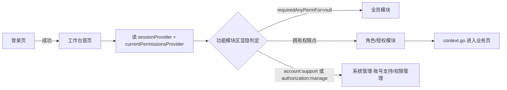

# 工作台首页

> 路由：`/dashboard`

> **2026-09-27 政策与监管动态(AI)已下线, 见 ADR-133**: 服务端删除官方政策抓取、AI 摘要与定时刷新, `official_policy_briefs` 表由 V741 删除;
> `GET /api/dashboard/overview` 不再返回 `intelligence` 字段, 工作台不再渲染「政策与监管动态」分区; 该分区唯一用到的权限码
> `dashboard:finance_sensitive:view` 同步退役。新的公共 AI 平台(ADR-133)不在工作台读路径上。

> **2026-09-23(ADR-108)**：工作台全部卡片红黄徽章、分组合计、导航「工作台」「通知」两个 Tab 的数字，
> 由 `GET /api/workbench/badges` 一次带回(服务端 `WorkbenchBadgeCatalog` 唯一口径)；前端只有一个 60s 轮询
> (页面隐藏暂停、登出即停)。返回工作台时徽章汇总单飞重拉一次 + 概览重取, 不再逐个失效十几个计数源。
> 用户自定义分组卡片的合计仍在前端按卡片相加(那是用户自己摆的卡, 不是业务口径)。

> **2026-09-12 部门概览修订**：今日概览与待办按本人主职、兼职部门及职责权限共同筛选；超管与个人点名授权也不跨部门展示。目标业务页面的跨部门授权仍有效。销售概览还复用单据负责人数据范围，不能汇总本人无权查看的订单。个人未读通知仍按通知收件人范围显示。
>
> 视觉统一为连续指标带与单行待办卡片。指标按可用宽度换行；待办始终只显示一行，保留紧急提示、截止时间、空态和详情跳转。去掉数字水印、扫描背景和纵向节点轴。
> **2026-09-28 合并改版，2026-10-07 单行概览调整**：原「今日概览」「待办任务」两段独立区块并入同一块控制台面板 `DashboardOverviewPanel`。标题栏展示今日概览、部门范围及采样时刻；面板体为「左侧横向指标带 │ 竖线 │ 右侧待办区」。指标按服务端顺序从左向右排列，新增指标出现在未读通知右侧，宽度不足自动换行；宽屏指标最多占半幅、实际宽度随内容收缩，窄屏使用全宽且待办移到下方。加载占位使用相同排布。待办始终只显示一行，按可用宽度和字号展示一至两张卡；行末「还有 XX 项任务」按隐藏卡片的 `count` 累计。点击后在独立面板查看剩余待办，桌面右侧滑入、手机底部弹出，工作台不向下展开；点击具体任务关闭面板并进入对应办理页。`UtenConsoleHeader`、`DashboardMetricStrip`、`DashboardTodoLane` 随合并退役删除。**重要通知**口径：人事序列部门发布且未读 = 重要，指标卡有未读才出，直达 `/notice?filter=important`，见[通知列表页](通知列表页.md)。

> 2026-09-07：常用功能中的待审收件台已删除，旧 `/reviews/inbox` 只回本页，各真实任务入口
> 继续显示服务端任务徽章。财务初审与销售订单修改分别进入对应队列，顶层财务徽章只计算一次总量。
> 卡片和页面仍使用同一路由权限规则；弹窗按主职/兼职部门、页面查看及职责动作再次筛选，
> 工作台卡片可见不代表应收到该部门的居中弹窗。参见[权限体系总设计](../05-架构/权限体系总设计.md)。

当前实现入口：

| 职责 | 代码入口 |
|---|---|
| 页面、概览与系统测试区 | [DashboardPage](../../lib/features/dashboard/pages/dashboard_page.dart)、[DashboardOverviewSections](../../lib/features/dashboard/widgets/dashboard_overview_sections.dart)、[SystemTestArea](../../lib/features/dashboard/widgets/system_test_area.dart) |
| 模块可见性、排序、折叠与徽标 | [WorkbenchModuleArea](../../lib/features/dashboard/widgets/workbench_module_area.dart) 的 `_buildSection`、[WorkbenchLayout](../../lib/features/dashboard/providers/workbench_layout_provider.dart)（分组排序/折叠 + 组内卡片排序 `itemOrders`）、`_ReorderableModuleGrid`（组内卡片长按拖动换位）；[路由权限映射](../../lib/core/router/permission_by_path.dart) |
| 聚合接口 | [DashboardOverviewController](../../server/src/main/java/com/uten/imp/features/dashboard/DashboardOverviewController.java)；`GET /api/dashboard/overview` |
| 清空业务数据 | [BusinessDataResetService](../../server/src/main/java/com/uten/imp/features/admin/systemtest/BusinessDataResetService.java)、[BusinessTestResetFiles](../../server/src/main/java/com/uten/imp/features/attachment/BusinessTestResetFiles.java)(测试文件检查与删除)；[ADR-155](../99-决策记录-ADR/ADR-155-清空业务数据测试文件单一规则与幂等删除.md)；[迁移入口](../数据迁移/README.md) |

各功能按下文现行规则维护；旧改版日期和阶段“源码候选”记录不再作为操作指南。

## 一、定位

给所有员工（全员可见）使用的登录后默认落地页，是 App 的"门面"，也是**全部业务功能的集散中心**。

- 解决的问题：一眼看到今日关键指标与待办；按权限聚合展示当前用户可用的全部业务模块入口。
- 产品位置：底部悬浮胶囊导航第一项，[登录页](登录页.md) 成功后默认重定向到此页。
- UI v4 变化：原「左侧边栏（expanded）/ 折叠 Rail（medium）」承载的角色分组导航全部迁入本页「功能模块区」，侧边栏取消，内容全屏宽。

### 工作台上的卡片和待办怎么筛选

工作台下面的功能卡片按部门分组摆放(行政与人力资源部、财税部、生产部、PMC运营部等)，但一张卡片显示不显示，不看你在哪个部门，只看你能不能打开它对应的页面：

- 能打开的卡片才显示；一个分组里一张你能打开的卡片都没有，整个分组就不显示。
- 你的权限由几部分合起来：人人都有的基础权限，你所在部门和兼职部门(连同它们的上级部门)配置的权限，再加上单独给你开通的权限，减去单独给你收回的权限。所以一般只看得到本部门的卡片；别的部门的卡片，你有对应权限也会出现在那个部门的分组里；本部门的卡片，权限被收回后也不显示。
- 超级管理员看得到全部分组；还没接入功能的空分组只对超级管理员显示「功能规划接入中」。

页面上方「今日概览」里的指标和待办还要再按部门筛一次：除了要有权限，只显示你的主部门、兼职部门(连同它们的上级部门)要办的事，单独开通的权限和超级管理员身份都不会把别的部门的待办带到这里；未读通知按发给你本人的显示。

需要某个功能却没有卡片时，见[我的权限与申请开通](我的权限与申请开通.md)。

## 二、入口与导航

- 进入路径：
  - [登录页](登录页.md) 登录成功后默认跳转
  - 底部胶囊导航第一项「工作台」（四页可左右滑动切换，见 [App外壳.md](App外壳.md)）
  - 无权限访问受保护路由时被路由守卫重定向到此页
- 离开去向：功能模块区点击进入各业务页（工资条 / 报销 / 人事 / 财务 / 生产 / 决策 / 权限管理等）。

## 三、响应式布局

**全断点统一全屏宽**（取消 v3 的 `maxWidth: 1280` 收束），列数按容器实际宽度自适应：

```
┌──────────────────────────────────────────────┐
│ 👤 你好，张三            2026年7月23日 · 🔔(n) │  ← 页面头（头像+问候+通知入口）
│ ┌ DashboardOverviewPanel（今日概览合并面板）────┐ │
│ │ ▎今日概览  综合营销部·按本部门范围展示  12:30采样│ │  ← 标题栏（浅底色带）
│ │ （今日庆典卡，若有）                             │ │
│ │ 未读通知  重要通知  执行中订单 │ ✓ 待办任务 [总数] │ │  ← 指标从左向右排列
│ │    3         1         24     │ ╭待办卡╮ ╭待办卡╮ 还有X项任务│ │
│ │                              │ ╰──────╯ ╰──────╯         │ │  ← 待办只占一行
│ └─────────────────────────────────────────────┘ │
│ ▎常用功能   我的访客 基础资料 工资条 我的报销 意见箱 │  ← 各分组可折叠（色条+标题+chevron）
│ ▎人事管理        员工档案 部门管理 …（按权限显隐） │
│ ▎财务管理        …                              │
│ ▎生产管理 / 安全核验 / 系统管理                  │
└──────────────────────────────────────────────┘
        （底部悬浮胶囊导航 overlay，不占布局）
```

- 页面底部留白 96px：胶囊导航 overlay 悬浮，滚动到底时最后内容可完全越过胶囊。
- StatCard / 模块卡片均用 `UtenResponsiveGrid`（按父容器宽度 1–5 列，模块区 compact 2 列 / medium 3 列 / expanded 4 列）。

## 四、涉及的 Uten 组件

- `UtenUserAvatar`（页头头像）· `UtenConsolePanel`（今日概览合并面板容器）
- `DashboardOverviewPanel`（今日概览 + 待办任务合并面板，2026-09-28 起取代原两段分区标题 + 独立面板）
- `UtenCollapsibleSection`（可折叠分区，v4 新增组件）
- `WorkbenchCardBadge` / `WorkbenchGroupBadge`（工作台模块与分组统一数字角标）

## 五、功能点

1. 页面头：头像 + 「你好，{姓名}」+ 日期，右侧通知铃铛带未读数 Badge（`unreadNoticeCountProvider`）。**超级管理员**额外显示「切换人」chip（`isSuperAdminProvider` 且非模拟中）—— 进入限时模拟窗口后以任意员工真实视角核验权限配置；模拟中入口隐藏，改由顶部常驻横幅接管「切换/退出」。详见 [模拟身份(切换人).md](模拟身份(切换人).md)。
2. **今日概览**：首帧后请求 `GET /api/dashboard/overview`，按本人权限和所属部门返回通知、生产、销售等真实非金额指标。服务端不再查询或返回账户余额、未结应收、未结应付金额卡；财务金额分别在账户资料和钱流台账按各自权限查看。原 `dashboard:finance_sensitive:view` 已于 2026-09-27 退役(V741), 不恢复上述三张卡。指标从左向右横排展示，未读通知在最左，重要通知、执行中订单等依次排在右侧，空间不足自动换行；**重要通知**(人事序列部门发布且未读，有才出卡)点击直达 `/notice?filter=important`。
3. **待办任务**：同一聚合接口返回通知待办与本部门计数卡(生产待排产、仓库领料与退料、采购任务、委外任务、访客审批、资料变更审核、报销待审批 / 待付款)；通知打开明细，其他卡片跳转真实处理页。**计数卡的数字就是对应模块卡的红徽章数**(permissions-08, ADR-108)：服务端经徽章只读端口 `WorkbenchBadgeReadPort` 只算本部门要的几个入口，入口目录、来源与资格判定(各来源计数端点的 `@PreAuthorize`)都与 `GET /api/workbench/badges` 同一套；部门只决定「该不该出现在你的工作台上」。此前概览按「部门 + 权限码」另写一套计数，与红徽章是两套规则、两个数。某个来源出错时该卡本次不出(徽章侧保留上一次的数)，不丢弃其他首页内容，也不把加载失败伪装成零待办。工资批次待复核不再单列计数卡：提交时已给复核人推「待复核」行动通知，出现在通知待办里。待办区位于同一块合并面板内（小节头 + 总数徽章 + 浅底瓦片），红色数字徽章显示各待办 `count` 之和(= 待处理件数总和)。
4. **功能模块区**（核心）：原侧边栏全部分组迁入——
   - 常用功能：我的访客 / 基础资料 / 工资条 / 我的报销 / 意见箱。除基础资料（卡片与 hub 显隐由
     「基础资料」模块各主档查看码的并集控制）外，其余四张自助卡的权限码在权限管理页归
     「常用模块」分组（V831 起排目录最前，子类与卡片同名，见 [权限管理页.md](权限管理页.md) 与
     [ADR-168](../99-决策记录-ADR/ADR-168-常用模块权限分组.md)）：工资条 / 我的报销 / 意见箱
     默认随全员基础包发放（可在「全员基础包」页整体移出、或在「按员工」页逐人收回），
     我的访客 =「接待访客」码（V679 起部门白名单 + NON_DELEGABLE，只由超管按部门或逐人授予）。
     无对应权限的卡片不渲染、直达路由也被守卫拦下。
   - 人事管理 / 财务管理 / 生产管理 / 工程研发部（物料反查产成品 + 任务中心）/ 安全核验（按权限显隐）
   - 系统管理：账号支持或授权管理入口（账号支持区与超管授权区在页面内继续分权；未开户候选明确标识，
     只有 `account:support` 可补开，`authorization:manage` 不替代，见 [权限管理页.md](权限管理页.md)）
     ；「AI 服务」卡 2026-09-28 从本组退役, 入口只在系统设置页内(见 [AI服务设置页.md](AI服务设置页.md)，ADR-133)
   - 钱流 Hub「任务中心」分组 2026-09-27 新增「报价核价」卡(`/finance/quote-review`，`sales_quote_finance:view`，红徽章入口 `financeQuoteReview` = 待核价张数，见 [销售报价财务核价页](销售报价财务核价页.md)，ADR-134)
   - 仓库、采购、委外模块进入各自 Hub 后，可从“任务中心”卡片打开 `/operations/workbench/warehouse`、`/operations/workbench/purchase`、`/operations/workbench/subcontract`；钱流 Hub 打开 `/finance/procurement-approvals`、`/finance/procurement-arrival-exceptions`。共享任务、批准、驳回分别授权 `finance_order_approval:view/approve/reject` 并叠加实时审核资格（V328/ADR-027，不再单点配置负责人）。现行申请只读、订货分解、财务审批、预计到货和超量退回规则见[生产履约任务工作台](生产履约任务工作台.md)。
   - 生产部分区紧挨「车间生产任务」新增「车间内料仓」卡 (`/workshop-material/bin`, 2026-09-28 [ADR-131](../99-决策记录-ADR/ADR-131-车间整批领料与盘点计耗.md)): 车间看内料仓里每种料的现存与估计还剩, 办申请领料、退回、试模清机等用料和盘点; 有内料仓查看权限可见, 不挂数。详见[车间内料仓页](车间内料仓页.md)。
   - 工程研发部分区「任务中心」卡（`/rd/tasks`，权限点 `rd_task:view`）接收设计、打样、试产、ECN 等独立工程任务；V423 后不再接收新的生产 BOM 缺失转发，历史存量 BOM 任务只读保留并继续流转。共享角标读取 `/api/rd-tasks/count` 展示未完成数，详见 [工程研发部任务中心](工程研发部任务中心.md)。
   - 品质管理部分区顶层只保留「品质任务中心」卡（`/quality/task-center`）；持
     `procurement_inspection:view` 或 `production_quality_inspection:view` 任一权限可见。工作台角标
     合计当前账号有权的 IQC 待检收货单与 FQC 待处理 inspection；任一有权来源仍在加载或失败时，
     不得把未知值当 0 后显示一个看似完整的合计。中心内「任务中心」进入 IQC/FQC 办理页，
     「查询与记录 → 检测记录」进入真实只读 `/quality/inspection-records`。主工作台不再单列
     `/lab/test`；旧 `lab:test:*` 实验室能力仍未实现。详见 [品质任务中心](品质任务中心.md) 与
     [品质检测记录页](品质检测记录页.md)。
   - 销售管理卡的 `WorkbenchBadgeKind.sales` 不再只读完工通知。计数同时读取订单进度
     `stage-counts.REJECTED` 与完工来源事件未读数；前者是未解决业务状态，后者是进度消息。
     财务驳回、销售受控修订、重新审核三步会让任务在销售与财务模块之间转移，两个模块不得同时
     把同一订单显示为各自可办件。
5. **按权限点显隐**：每个模块的可见性 = 用户是否拥有 `requiredAnyPermFor(location)` 返回列表中的任一权限点（`core/router/permission_by_path.dart`，与路由守卫同一份映射，单一数据源）；映射为 null = 登录即可见；超管全量放行；整组不可见时组标题不渲染。
6. **功能分组可折叠**：每个功能分组点标题行收起/展开（`AnimatedCrossFade` + chevron 旋转），功能模块的排序和折叠状态由 `workbenchLayoutProvider` 持久化到服务端；部门分组展开时隐藏分组徽章、收起时显示，卡片徽章继续展示各任务实时数量（今日概览合并面板不参与折叠）。**2026-09-10**：组内卡片支持长按拖到另一张卡片上换位（`_ReorderableModuleGrid`，悬停即换位 + 原位半透明残影），顺序以 `itemOrders`（分组 key → 卡片 location 序列）同一 Provider 持久化；不可见卡片（权限过滤）保持原位不丢排，新卡片按代码默认顺序补尾。
7. **我的部门**：入口位于“我的”页，点进 `/profile/me/department` 查看架构树、花名册和负责人说明。该页不再配置成员权限；合法负责人到对应业务页右上角“权限设置”维护本页权限。详见 [我的页.md](我的页.md) 与 [ADR-045](../99-决策记录-ADR/ADR-045-页面内权限委派与授权来源隔离.md)。

本人生日、入职周年、新婚或新生儿庆典由 `CelebrationTodayCard` 展示，`CelebrationPopupGate` 控制每日一次的庆典弹窗；它与有部门及职责权限限制的业务审批弹窗分别处理。人力资源“任务中心”汇总转正、生日、入职周年等提醒，详见[HR任务中心](HR任务中心.md)。

## 六、功能链路图


```mermaid
flowchart LR
    L[登录页] -->|成功| D[工作台首页]
    D --> P[读 sessionProvider + currentPermissionsProvider]
    P --> F{功能模块区显隐判定}
    F -->|requiredAnyPermFor=null| ALL[全员模块]
    F -->|拥有权限点| ROLE[角色/授权模块]
    F -->|account:support 或 authorization:manage| ADMIN[系统管理·账号支持/权限管理]
    ROLE --> GO[context.go 进入业务页]
```

## 七、涉及的数据实体

→ 见 [04-数据模型/实体字典.md](../04-数据模型/实体字典.md)
- `User`：姓名、兼容 roles claim、后端合成的权限点集合（模块显隐只使用 permissions）
- `DashboardOverview`: 服务端按权限/部门聚合 `metrics` 与 `todos`(2026-09-27 起不再有 `intelligence`), 前端通过 `dashboardOverviewProvider` 加载(按需一次、不轮询)；本部门计数卡取自徽章只读端口(见第五节第 3 点)，聚合失败显示可重试错态，不使用 Mock 数据兜底。

## 八、权限要求

- **全员可见**；功能模块区按权限点精确显隐（见第五节第 5 点）。
- 权限来源（详见 [全局机制.md §一](../05-架构/全局机制.md)）：全员基础 ∪ 部门直配权限（含上级部门）± 个人覆盖；超管全量。角色体系不再参与合成。V135 授权版本变化会让旧 access token 立即 401，刷新/重登后工作台按新权限重建。

## 九、边界情况

- 用户除全员基础外没有部门/个人权限：功能模块区只剩基础包覆盖的常用功能卡（工资条 / 我的报销 / 意见箱；基础包被整体移出时连这三张也不显示）。
- 性能档 = lite：关闭 stagger 进场动画；折叠动画仍可用（开销极小）。
- 未读通知接口失败：Badge 不显示（`valueOrNull ?? 0`），页面其余部分不受影响。
- IQC 待检通知和品质角标彼此独立：通知用于提醒并触发 `pending-count` 重拉；Outbox 送达前若
  收货单已无 `PENDING/PARTIAL` 明细则跳过过期通知，而工作台角标始终读取实时待检聚合。
- `/api/dashboard/overview` 的本部门计数卡某个来源出错(非认证/授权异常)：徽章服务按 JDBC 保存点隔离该来源，
  入口标为本次没算出，概览**本次不出这张卡**, 其他指标与待办照常; 同一入口的模块卡红徽章保留上一次的数。
  下一次进工作台(或返回即刷新)自然重算，前端不再为此单独轮询。(2026-09-23 前的「正在自动恢复」占位卡、
  `dashboard_fulfillment_partition_degraded` 审计与 15 秒重试已随 permissions-08 删除。)
- 某来源对当前主体无权(其原计数端点的 `@PreAuthorize` 拒绝)：入口不出现、不出卡；与模块卡是否显示红徽章同一判定。
- 权限解析依赖故障返回的结构化 `503 SERVICE_UNAVAILABLE` 不能伪装成零待办；前端只对该安全读做有限重试，
  保留会话并显示明确的可重试错态，不显示“无权限”。
- 首页聚合故意不包裹一个共享数据库事务：徽章端口自己开只读事务，其余分区各自读取，避免已捕获的子事务异常把外层标记为 `rollback-only`。全库不可用仍走整体可重试错态；该边界不提供 Mock/旧数据兜底。

## 十、系统测试区 (ADR-067，仅超管)

正式 prod 默认关闭, 生产环境校验要求 `UTEN_BUSINESS_DATA_RESET_ENABLED=false`, 生产 Nginx 拒绝测试入口。
开发/受控内测保留原授权与再认证; cloud 始终关闭。V829 保留四类安全审计证据。

页面最底部、功能模块区之后，`SystemTestArea`（`lib/features/dashboard/widgets/system_test_area.dart`）：

- **可见性**：仅超级管理员渲染（`isSuperAdminProvider`，非超管整区不出现）；默认收起，点标题展开。**不设独立权限码**——超管专属测试工具，不进权限目录/部门授权体系（与权限总设计「工作台无泛化 workbench:* 码」一致）。
- **首张卡「清空数据」**：与功能模块区卡片同款样式（图标块 + 标题，同一响应式网格），仅图标块/图标改用红色警示配色；**整卡可点、卡上无按钮**，点击直接弹确认框，**逐字输入「清空业务数据」** 口令后才能提交（后端同款校验，双保险），完整说明全部收进弹窗。
- **清空口径**(工作台是唯一的清空入口；每张表清除还是保留只写在迁移维护的 `business_data_reset()` 里，具体版本和验证结果见迁移索引)：
  - 保留：基础资料(货品/客户/供应商/账户/仓库…)、人事、账号权限与配置、清空操作的受理/失败/完成回执；保留表行数不变校验；
  - 清空：销售/采购/委外/生产/仓库/财务全部测试业务数据、删除历史、字段版本与业务审计；V829 保留登录认证、授权、安全、系统审计及清空核对凭据。业务表 `TRUNCATE RESTART IDENTITY`，自增 ID 从 1 重新开始；
  - 归零：库存、账户期初/累计收款/累计付款/累计调整/当前余额、客户供应商期初往来、货品期初数量/件数/重量、结算类别期初金额；货品安全库存与成本、费率参数保留原值(V784)；六个物化视图刷新并校验为零；
  - 下线：全部校验通过后 `authorization_state.epoch + 1` + 清空 `refresh_tokens`——**所有人（含当前账号）立即退出，需重新登录**；前端成功后主动本地登出并跳登录页。
- **测试文件**([ADR-155](../99-决策记录-ADR/ADR-155-清空业务数据测试文件单一规则与幂等删除.md))：哪些文件属于测试数据只由服务端一条规则 `fn_business_test_reset_objects()` 决定，包括业务附件、上传会话(暂存副本和正式文件)、AI 识别原件、报价模板候选及其历史、不受保护的删除任务。人事档案/合同、货品图片/图纸、成本导入原件和已采用的报价模板永不删除。清空时，服务端在同一个事务里先锁住这些登记、全量核对，再逐个删除并确认文件已不在，最后清库。文件本来就不在算成功；中途失败可以直接重试，已删的不会重复处理。
- **弹窗里的检查**：弹窗一打开就调用 `GET /api/system-test/business-data/preview`。它和清空排水前用的是同一个检查，只读，不删除任何文件。
  - 核对中：进度条加「正在核对测试文件…」。
  - 有拒绝原因：红色区块「现在不能清空，原因如下：」，逐条显示服务器原文(可选中复制)，确认按钮禁用。处理后点「重新检查」。
  - 文件计数：「将一并物理删除测试文件：业务附件 a 份、…(共 n 个存储位置：p 个文件还在存储里，将被删除；q 个已经不在)」，并说明哪些不删；没有文件时显示「没有需要删除的测试文件。」。
  - 死信：有处理失败、已停止重试的后台事件时，按类别报条数，说明会随清空一并清除。含「货品单重重算」时，提示每晚 2 点 13 分会自动补算。
  - 核对不完：预览最多核对 20 秒，文件多时显示「预先只核对了 c / n 个」，其余在清空时、删除任何文件之前核对。
  - 没有核对：服务端这次根本没有核对存储时(例如清空分类有问题，原因已列在红色区块里；预览结果 `inspectionSkipped=true`)，不显示「预先只核对了」那一行，文件计数也不报还在/不在的个数，改为「这次没有核对它们是否还在存储里，先处理上面的问题，再点「重新检查」核对」。
  - 全部不在：登记的文件在存储里一个都没找到时，黄色醒目提醒先检查服务器存储盘有没有挂载好(不禁用)。
  - 预览被 FORBIDDEN 拒绝(运行开关未开启、模拟他人身份、不是在职超管本人)，或服务端说服务器配置有误(`RESET_SERVER_MISCONFIGURED`，数据库账号或清空程序配置不对，要开发人员处理)：显示后端原话并禁用，因为清空注定会以同样原因失败。其它预览失败(网络、超时、服务器错误)显示「无法预先核对测试文件(…)。清空时服务器会再次核对，仍可提交。」。
  - 每次核对结束都有「重新检查」按钮，清空进行中不可点；连点时，先发出的慢请求不会覆盖后来的结果。
- **拒绝语义**：拒绝原因在三个时点检查：
  - 服务端在排水之前用同一个检查再查一次，有任何原因就返回 409，不进排水，全站不会为注定失败的清空白白 503；
  - 清空事务里加锁后、删除任何文件之前，再全量核对一次；
  - `business_data_reset()` 第一步再跑一次数据库拒绝检查。

  会挡住清空的情况：后台事件还在排队(等几分钟后点「重新检查」；多次重新检查仍在排队就联系开发人员)；要保留的文件(货品成本导入原件、已采用的报价模板、货品或员工档案附件)还有删除任务没完成(见下一段)；文件在系统删不了的存储；附件存储是阿里云直传；本服务器没配置文件所在的存储；存储目录无法访问；文件被替换过；存储位置上不是系统文件；本地旧版平铺文件；读文件失败；登记的存储编号格式不对(要开发人员核对登记)；附件数据被其他程序占用；另一位超管正在清空；清空分类有问题(程序版本问题)；全员登录状态记录不是正好 1 条(程序缺陷)。文案点名文件(每类最多 5 个)和下一步。

  要保留的文件还有删除任务没完成时(用户 2026-10-05 决定继续挡住，清空会保留这些任务)，文案写明任务数和最多 5 个文件名(员工档案文件只显示存储编号)，并按情况给下一步：后台还在处理(排队中、处理中或等待重试)的，说「预计约 m 分钟内处理完，请 m 分钟后点「重新检查」；如果到时仍没有完成，请联系开发人员」；连续失败至少 5 次或处理记录不完整的，说明后台不会自己恢复，请联系开发人员查日志处理后再点「重新检查」。

  不挡清空的情况(用户 2026-10-05 确认)：处理失败、已停止重试的后台事件(死信)随清空清除，预览和结果按类别报条数；未到期的上传凭证不挡(附件存储是阿里云直传时整个清空直接拒绝，见上)。

  提交被明确拒绝后，会弹「清空失败」提示；服务器原文留在弹窗里(「本次清空没有完成，服务器的说明：」，可复制)，弹窗随后自动重新检查。

  哪些失败算「明确」、哪些算「结果待确认」(`isBusinessDataResetOutcomeUncertain`)：服务端带统一错误码说明的失败都是明确的失败，包括 500(例如删了部分文件后数据库执行失败、服务器配置有误)，原文照登，不留待确认记录，用户可以再点一次。只有下面几种说不清服务端有没有执行完，按「结果待确认」处理、不允许再次提交：连接中断或超时；没有统一错误码的 5xx(网关 502/503/504 错误页、框架默认错误页)；本端登录状态切换(`SESSION_*`)；本地已有待确认记录；服务端明说结果未确认(`RESET_OUTCOME_UNCERTAIN`，提交事务或写完成回执时出错)。
- **删掉文件之后的失败**：如果已经物理删除了文件、之后清空仍然失败(删除报错、时间用完、数据表被占用等)，文案开头写「本次已经物理删除了 d 个测试文件(无法恢复)，但业务数据没有清空……」。重新点「确认清空」会接着删剩下的再清库。
- **安全门禁**(后端，按顺序)：
  1. 运行开关 `uten.features.business-data-reset-enabled`：dev / internal-test 开启，公司内网服务器测试期开启，云端一律拒绝。
  2. 数据库确认在职超管本人；预览和清空都查，模拟他人身份时预览和清空都拒绝。
  3. 超管专属码 `system:business_data_reset` 加本次重新输入密码(再认证，ADR-110)。
  4. 请求体口令逐字匹配。
  5. 排水闸：清空期间其它 `/api` 请求(含预览)回 503，等在途请求清零再执行。

  清库单事务执行，任一校验失败整体回滚。该按钮不会自动备份，清空前须按部署流程完成备份；已提交的清空只能通过外部备份恢复。
- **超时与结果回显**：清空是同步长请求，受理后 5 分钟内完成检查(≤60 秒)、排水(≤45 秒)和加锁删除测试文件，之后清库。网关对该路径放宽到 600 秒，前端接收超时 10 分钟；仍超时就提示结果待确认、请勿再次提交、重新登录后核对。成功提示「已清空 X 张业务表(Y 行)，保留 Z 张主档，物理删除测试文件 N 个，清除失败的后台事件 K 条；请重新登录」，没有死信时不提最后一项。重登后展开本区回显「上次清空」(`GET /api/system-test/business-data/last-result`)。本次请求明确失败时显示「上次清空没有完成：{原因摘要}」；已删过文件时追加「(已物理删除 d 个测试文件，数据没有清空)」，再提示本地待确认记录已撤销、可以重新提交。摘要不含文件名：一般失败只列原因类别和数量，提示到清空弹窗点「重新检查」看完整原因；数据库执行失败、文件清单不一致、服务器配置有误这几类「重新检查」看不到，摘要直接写服务器给出的原因和下一步(例如「请稍后重新点「确认清空」；如果再次出现，请联系开发人员。」)。
- **待确认记录的收尾**（[ADR-067 §9](../99-决策记录-ADR/ADR-067-工作台系统测试区与业务数据一键清空.md)，2026-09-20）：服务端收到清空请求的第一步就独立写「受理回执」，受理后明确失败再写「失败回执」。核对结果时按回执确定地处理本地待确认记录：服务器从未受理（提交时连接中断，超过 30 秒余量）→ 撤销并提示「没有收到本次清空请求…现在可以重新提交」；受理后明确失败 → 撤销并显示服务端原因；受理它的进程已重启 → 清空已随进程回滚，撤销；已受理、仍是当前进程、未失败 → 继续等待，不允许再次提交。撤销后弹窗内等待态解除，口令仍在即可直接重提。
- **登录会话重建门**：`SessionRehydrateGate` 在未登录→已登录时推进 `sessionEpochProvider`，全局角标 Notifier 从零重建并立即重拉，工作台概览/通知列表缓存失效——清空后重登无需再手动刷新。
