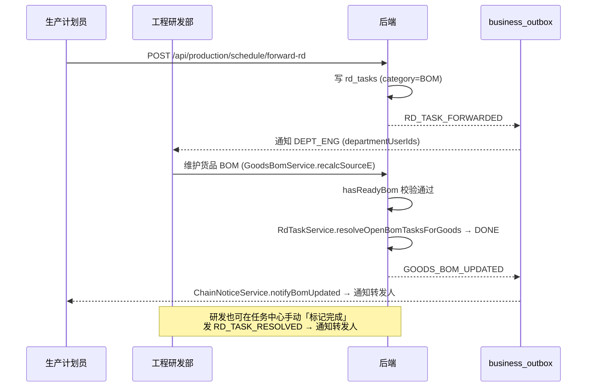

# 工程研发部任务中心

> 路由：`/rd/tasks`（`RouteName.rdTaskCenter`）· 实现源：`lib/features/rd_task/`（model/repository/`rd_task_count_provider`/`RdTaskBadge`/page）
> 上层：[工作台首页.md](工作台首页.md) 的「工程研发部」分区「任务中心」卡片
> 数据源：`rd_tasks`（V204 迁移，Pattern B 纯 JdbcTemplate + `fn_audit` 审计触发器）
> 最近更新：2026-08-02（首版，与生产「BOM 缺失转发工程研发部」联动）

## 一、定位

工程研发部接收其它部门（当前主要是生产计划）转交的工程类任务的统一收口，按状态分为「待完成 / 已完成」两个 Tab。设计上镜像 [生产履约任务工作台.md](生产履约任务工作台.md) 的双 Tab + 计数徽标 + 服务端权威投影范式，避免通知丢失或延迟导致任务被遗忘。

- 解决的问题：生产计划评审中发现「自制件缺 BOM」时，原先只能在排产页 fail-closed 阻断；现在可一键转发工程研发部，研发在自己工作台看到任务并维护 BOM，系统在 BOM 有效后自动完成并通知转发人。
- 产品位置：工程研发部工作台分区「任务中心」卡片（带 `RdTaskBadge` 60s 轮询徽标）。
- 与物料反查（`production_where_used:view`，与生产部共用入口）解耦——后者是只读历史快照，本页是可编辑任务流。

## 二、入口与导航

- 进入路径：工作台「工程研发部」分区 → 「任务中心」卡片 → `/rd/tasks`。
- 路由权限点：`rd_task:view`（V204 种子，仅授 `DEPT_ENG`；超管经 `PermissionResolver` 全集自然可见）。
- 离开去向：任务详情可下钻到关联货品 / 来源单据；研发可在保存 BOM 后由系统自动完成对应任务。

## 三、数据源与权威投影

页面读模型 = `rd_tasks` 表。任务由后端 `RdTaskService` 创建/分配/完成，前端不重算状态、不构造来源字段。所有任务字段以服务端返回为准，前端筛选仅改变查询条件，不能扩大可见对象集合。

### 3.1 字段

| 字段 | 说明 |
|---|---|
| `task_no` | 系统生成单号 `[RD][YYMM][4位]`（`DocNumberPrefix.RD_TASK`，如 `RD26080001`） |
| `title` | 任务标题 |
| `category` | `BOM` / `DESIGN` / `SAMPLE` / `TRIAL` / `ECN` / `OTHER` |
| `status` | `OPEN` / `IN_PROGRESS` / `DONE` / `CANCELED` |
| `priority` | 优先级 |
| `goods_id` | 关联货品（BOM 类必填，驱动自动完成） |
| `order_item_id` / `source_doc_*` | 来源单据与明细（生产转发时回填，便于研发下钻） |
| `assignee_employee_id` | 责任工程师 |
| `reporter_employee_id` | 转发/报告人（完成时回执通知对象） |
| `due_date` / `completed_at` | 截止与完成时间 |
| `close_note` | 完成/取消备注 |
| `row_version` | 乐观锁（resolve 必须携带） |

### 3.2 幂等与审计

- 部分唯一索引 `uq_rd_tasks_open_bom (order_item_id, goods_id) WHERE category='BOM' AND status IN (OPEN, IN_PROGRESS)`：同一来源行 + 货品在未完成态下不重复建任务；重复转发由数据库 fail-closed。
- V204 为 `rd_tasks` 挂接 `fn_audit()` 触发器（`AFTER INSERT/UPDATE/DELETE`），任务创建、分配、完成、取消均写入 `audit_log`。

## 四、统一页面结构（双 Tab + 徽标）

页面克隆 `operations_workbench` + `production_board` 范式：

1. 顶部状态统计 + 「待完成 / 已完成」双 Tab，徽标显示未完成任务数；
2. 关键词、`category`、`assignee` 筛选；
3. 任务表格：单号 / 标题 / 类别 / 货品 / 来源单据 / 责任人 / 截止 / 状态；
4. 行操作：分配（`rd_task:edit`）、标记完成（`rd_task:resolve`，携带 `row_version` 乐观锁）。

`rd_task_count_provider` 60 秒轮询 `/api/rd-tasks/count`，徽标只反映服务端权威未完成数；轮询失败时徽标保持上一次成功值，不冒充零任务。

## 五、状态字典

| 状态 | 页面含义 | 允许动作 |
|---|---|---|
| `OPEN` | 新建/待分配 | 分配工程师、标记完成 |
| `IN_PROGRESS` | 已分配处理中 | 标记完成 |
| `DONE` | 已完成（自动或手动） | 仅查看（位于「已完成」Tab） |
| `CANCELED` | 已取消 | 仅查看 |

## 六、转发与自动完成链路

生产 → 研发 → 生产的闭环全部走 `business_outbox` 可靠旁路，通知可以失败或延迟，但任务发现仍以服务端表为准。

关键约束：

- **自动完成必须校验 `hasReadyBom`**：避免研发误删空 BOM 时把任务错误标完成。`GoodsBomService.recalcSourceE` 在 create / update / delete 三处共用同一入口，均触发同一链路。
- **转发幂等**：生产待排产行已转发时显示「已转发·等待研发」chip（`PendingPlanRow.rdForwarded`），`pending()` SQL 以 `LEFT JOIN rd_tasks` 探测未完成 BOM 任务，重复点击由 `uq_rd_tasks_open_bom` fail-closed。
- **完成回执**：自动完成与手动完成都通过 `ChainNoticeService` 通知 `reporter_employee_id`（转发人）；转发时按 `departmentUserIds(DEPT_ENG)` 投递，不是角色广播。

## 七、端点与权限

| 端点 | 权限点 | 说明 |
|---|---|---|
| `GET /api/rd-tasks?status=&category=&keyword=&assignee=&page=&size=` | `rd_task:view` | 列表查询（双 Tab 通过 `status=open|done` 切换） |
| `GET /api/rd-tasks/count` | `rd_task:view` | 未完成计数（徽标 60s 轮询） |
| `POST /api/rd-tasks` | `rd_task:edit` | 新建任务（一般由转发链路调用，也可手工录入） |
| `POST /api/rd-tasks/{id}/resolve` | `rd_task:resolve` | 标记完成（携带 `row_version` 乐观锁） |
| `POST /api/rd-tasks/{id}/assign` | `rd_task:edit` | 分配责任工程师 |
| `POST /api/production/schedule/forward-rd` | `production_plan:forward_rd` | 生产转发工程研发部（授 `DEPT_PROD` / `SUB_PLAN`） |

权限种子（V204）：`rd_task:view/edit/resolve` 授 `DEPT_ENG`；`production_plan:forward_rd` 授 `DEPT_PROD` / `SUB_PLAN`。超管经 `PermissionResolver` 全集自然可见，无需单独点授权。

## 八、涉及的 Uten 组件

- `RdTaskBadge`（工作台卡片角标，60s 轮询计数）
- `UtenResponsiveGrid` / `MasterDataTableView`（任务表格，对齐其它工作台）
- `UtenSectionHeader` / `UtenEmpty` / `UtenSearchBar`（统一头部与空/错态）

## 九、关联文档

- [工作台首页.md](工作台首页.md)（工程研发部分区入口）
- [生产订单排产页.md](生产订单排产页.md)（BOM 缺失转发按钮）
- [生产履约任务工作台.md](生产履约任务工作台.md)（结构镜像源）
- [实体字典.md](../04-数据模型/实体字典.md)（`rd_tasks` 实体）
- [安全策略.md](../05-架构/安全策略.md)（权限点与 fail-closed 边界）

---

**最后更新**：2026-08-02 · **状态**：V204 迁移、后端服务、前端页面与工作台徽标已实现；目标库迁移、真实多账号 UAT 与跨部门通知回执验收待闭环。
