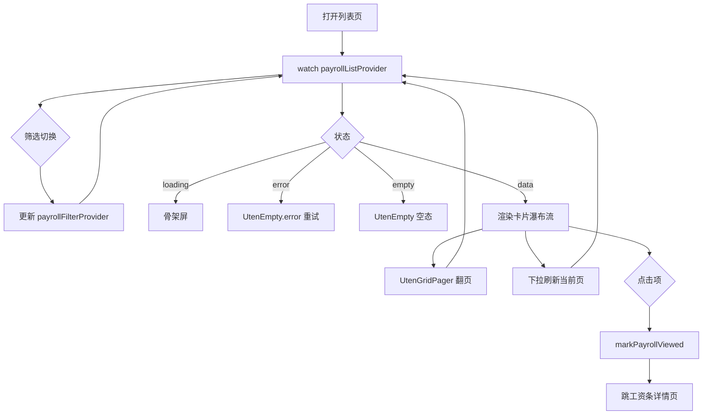

# 工资条列表页

> 路由：`/payroll/slip` · 实现源：`lib/features/payroll/pages/payroll_slip_list_page.dart`

## 一、定位

给员工查看自己每个月工资条的列表入口。

- 解决的问题：按月聚合所有工资条，快速看到实发金额、状态（已发布/已查看/已下载），筛选并进入详情。
- 产品位置：员工主导航"我的工资条"项，是 [工资条详情页](工资条详情页.md) 的前置列表。

## 二、入口与导航

- 进入路径：
  - [工作台首页](工作台首页.md) → "工资条"快捷操作
  - [我的页](我的页.md) → "工资条"快捷入口
  - 主导航"我的工资条"
- 在导航中的位置：**员工主导航**项；本人视角与全员视角只由
  `payroll:view:self` / `payroll:view:all` 权限决定，不依赖固定 HR 角色名。
- 离开去向：点击列表项 → [工资条详情页](工资条详情页.md)。

## 三、响应式布局

卡片瀑布流布局：列表容器改用 `UtenResponsiveGrid`，每条工资条渲染为竖版 `UtenCard`，**列数按父容器实际宽度自适应**（非屏幕宽度）。

| 容器宽度 | 列数 | 典型设备 |
|---|---|---|
| `< 500px` | 1 列 | 手机 |
| `500-800px` | 2 列 | 大屏手机 / 小平板 |
| `800-1100px` | 3 列 | 平板 |
| `1100-1500px` | 4 列 | 桌面 |
| `> 1500px` | 5 列 | 宽屏桌面 |

> 概括：**手机 1 列 / 平板 2-3 列 / 桌面 3-5 列**。在抽屉/分栏展开导致内容区收窄时，列数会随之减少。

- compact（手机，1 列）：
  ```
  ┌────────────────────────┐
  │ ← 工资条                │
  ├────────────────────────┤
  │ [全部][已发布][已查看]  │  ← UtenSegmentedFilter
  │ [已下载]                │
  ├────────────────────────┤
  │ ┌────────────────────┐ │
  │ │ 💼           已发布  │ │  ← 图标 + UtenStatusBadge
  │ │ 2026年7月           │ │  ← 期间标题
  │ │ 实发 ¥ 8,234.50     │ │  ← 实发金额大字
  │ │ ┌────────┬────────┐ │ │  ← 应发·扣除双栏
  │ │ │应发     │扣除    │ │ │
  │ │ │¥10,000 │¥1,765  │ │ │
  │ │ └────────┴────────┘ │ │
  │ └────────────────────┘ │  ← UtenCard（竖版）
  │ ┌────────────────────┐ │
  │ │ 📄           已查看  │ │
  │ │ 2026年6月           │ │
  │ │ 实发 ¥ 8,180.00     │ │
  │ │ ...                 │ │
  │ └────────────────────┘ │
  │   (下拉刷新 / 空态)     │
  └────────────────────────┘
  ```
  说明：AppBar + 4 段 SegmentedFilter + `UtenResponsiveGrid` 单列卡片瀑布。

- medium（平板，2-3 列）：同结构，卡片按容器宽度自动排成 2 或 3 列瀑布。

- expanded（桌面，3-5 列）：卡片密度更高，列数随容器宽度自适应；左右分栏（左列表右详情）Phase 2+ 考虑。

## 四、涉及的 Uten 组件

- `UtenAppBar`（带返回按钮）
- `UtenSegmentedFilter` + `UtenSegment`（4 段状态筛选）
- `UtenResponsiveGrid`（卡片瀑布流容器，按父容器宽度自适应列数）
- `UtenCard`（竖版工资条卡片）
- `UtenStatusBadge`（状态徽章：pending/published/viewed/downloaded）
- `UtenEmpty`（空态：无工资条 / error）
- `UtenSkeletonList`（加载骨架屏，8 项）
- `UtenGridPager`（服务端分页、总数与上一页/下一页）
- `UtenColors`

## 五、功能点

1. 顶部 `UtenSegmentedFilter` 4 段：全部 / 未查看 / 已查看 / 已下载，切换后把状态筛选下推后端并回到第 1 页。
2. `RefreshIndicator` 下拉刷新 `payrollListProvider.refresh()`。
3. `AsyncValue.when` 三态：
   - loading → `UtenSkeletonList(itemCount: 8)`
   - error → `UtenEmpty.error`（带重试按钮 → `ref.invalidate`）
   - data → 卡片瀑布流或空态
4. 空态：`UtenEmpty` 显示 `account_balance_wallet_outlined` 图标 + "此状态下暂无工资条"。
5. 工资条卡片 `UtenCard`（在 `UtenResponsiveGrid` 内渲染）：
   - 顶部行：左侧图标（已发布用 `mark_email_unread` warning 色，其他用 `receipt_long` teal600 色）+ 右侧 `UtenStatusBadge` 显示状态中文 label。
   - 期间标题：`periodLabelZh`（如 "2026年7月"）。
   - 实发金额：大字突出显示 "实发 ¥ x.xx"（≥1万显示"X.XX万"，主色加粗）。
   - 应发·扣除双栏：底部并排显示应发合计与扣除合计。
6. 点击卡片：先调 `markPayrollViewed(ref, slip.id)` 把状态推到 viewed，再 `context.go` 到详情。
7. 数据来源 `payrollListProvider` → `DioPayrollRepository` →
   `GET /payroll/slips?status=&page=&size=`；响应为 `{items,page,size,total,totalPages}`，页面显示
   上一页/下一页和总数。旧 Mock Repository 已删除。

## 六、功能链路图



## 七、涉及的数据实体

→ 见 [04-数据模型/实体字典.md](../04-数据模型/实体字典.md)
- `PayrollSlip`：列表项主实体（id / periodLabelZh / netIncome / status）
- `PayrollSlipStatus`：枚举（pending / published / viewed / downloaded）
- `PayrollBatch`：有 `payroll:generate` 权限的用户创建；只有批次发布后员工才可见对应 PayrollSlip

## 八、权限要求

- `payroll:view:self` 只返回当前员工已经发布的工资条；`payroll:view:all` 才能查看全员，并可用部门筛选。
- 标记查看必须是本人的已发布工资条；`payroll:export` 可下载授权范围内的工资 PDF。
- 权限由权限点决定，不依据固定 employee/hr/finance/manager 角色名。

## 九、边界情况

- 无数据时：筛选切换后无匹配项 → 显示 `UtenEmpty`"此状态下暂无工资条"。
- 加载失败时：`UtenEmpty.error` 显示错误信息 + "重试"按钮，点击 `ref.invalidate(payrollListProvider)`。
- 性能档 = lite 下：禁用卡片进场动画与阴影，`UtenResponsiveGrid` 退化为固定单列、卡片间距压缩，骨架屏退化为纯灰色占位。
- 当前没有工资条离线缓存或写队列；断网时列表和查看标记明确报错。敏感工资数据不得在未设计
  加密、过期与账号隔离前写本地缓存。
