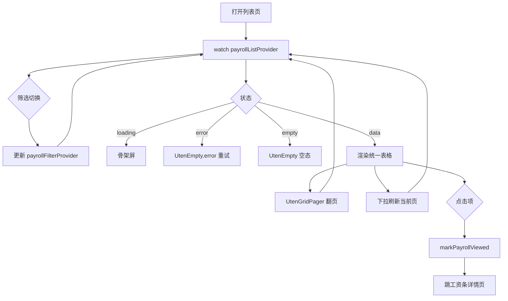

# 工资条列表页

> 路由：`/payroll/slip` · 实现源：`lib/features/payroll/pages/payroll_slip_list_page.dart`

## 一、定位

给员工查看自己每个月工资条的列表入口。

- 解决的问题：按月聚合所有工资条，快速看到实发金额、状态（已发布/已查看/已下载），筛选并进入详情。
- 产品位置：工作台“常用功能 → 工资条”，是 [工资条详情页](工资条详情页.md) 的前置列表。

## 二、入口与导航

- 进入路径：
  - [工作台首页](工作台首页.md) → "工资条"快捷操作
- 在导航中的位置：**工作台常用功能**；本人视角与全员视角只由
  `payroll:view:self` / `payroll:view:all` 权限决定，不依赖固定 HR 角色名。
- 离开去向：点击列表项 → [工资条详情页](工资条详情页.md)。

## 三、列表形态：统一表格（2026-09-09 表格化，2026-09-10 表头筛选）

列表主体是 `MasterDataTableView<PayrollSlip>`（`Key('payroll-slip-table')`），不再是卡片瀑布流：

| 列 key | 列名 | 说明 |
|---|---|---|
| `period` | 期间 | `periodLabelZh`，如「2026年7月」 |
| `grossIncome` | 应发合计 | money |
| `totalDeduction` | 扣除合计 | money |
| `netIncome` | 实发合计 | money |
| `status` | 状态 | 中文 label；**本列带表头筛选** |
| `publishedAt` | 发布时间 | date，未发布显示「—」 |

- **表头筛选**：`facets['status']` = 员工可见三态（已发布未查看 / 已查看 / 已下载；「待发布」
  对员工不可见，不进桶），选中即切到对应分段（`payrollFilterProvider`）→ 下推后端
  `status=UNVIEWED|VIEWED|DOWNLOADED` 并回第 1 页；选「所有」= 回「全部」段。
  表头筛选与顶部分段是同一口径的两个入口，不会出现两套筛选。
- **分页**：表格内置翻页条（含跳页），走 `payrollListProvider.goToPage`。
- **无多选批量**：本人视角只有「看 / 下载」，没有可批量的状态动作。
- 行双击进 [工资条详情页](工资条详情页.md)（详情页进入即 `markPayrollViewed`，列表不再预标记）。
- compact 自套 `UtenContentContainer`；窄屏表格横向滚动。

### 表格下方合计条：刻意不接（2026-09-11）

全站报表/列表在推「服务端合计条」（[UtenTotalsSummaryBar](../02-组件库/UtenTotalsSummaryBar.md)），
本页**刻意不接**：

- 一行 = 本人某个月的工资条，顶部分段筛的是**查看状态**（未查看/已查看/已下载）而不是期间，
  所以「未查看的这几个月的应发合计」不是任何人要的数，只会被当成「我今年一共发了多少」误读；
- 工资是强 PII，页面没被要求给聚合值时不主动造一个出来。

真正需要「一批工资多少钱」的场景在[工资条审核页](工资条审核页.md)：那里本来就有服务端批次
应发/扣除/实发合计。

## 四、涉及的 Uten 组件

- `UtenAppBar`（带返回按钮，标题区嵌 `UtenSegmentedFilter`）
- `UtenSegmentedFilter` + `UtenSegment`（4 段状态筛选）
- `MasterDataTableView`（统一表格：列对齐 + 表头筛选 + 翻页条）
- `UtenContentContainer`（compact 宽度收敛）
- `UtenEmpty`（空态 / error）
- `UtenSkeletonList`（加载骨架屏，8 项）

## 五、功能点

1. 顶部 `UtenSegmentedFilter` 4 段：全部 / 未查看 / 已查看 / 已下载，切换后把状态筛选下推后端并回到第 1 页。
2. 「状态」列表头筛选：与分段同一口径，选中状态即切段并回第 1 页（见 §三）。
3. `RefreshIndicator` 下拉刷新 `payrollListProvider.refresh()`。
4. `AsyncValue.when` 三态：
   - loading → `UtenSkeletonList(itemCount: 8)`
   - error → `UtenEmpty.error`（带重试按钮 → `ref.invalidate`）
   - data → 统一表格或空态
5. 空态：`UtenEmpty` 显示"此状态下暂无工资条"。
6. 行双击 → `context.push(RoutePath.payrollSlipDetail(slip.id))`；查看标记在详情页落。
7. 数据来源 `payrollListProvider` → `DioPayrollRepository` →
   `GET /payroll/slips?status=&page=&size=`；响应为 `{items,page,size,total,totalPages}`，
   翻页条显示页码/总页数与跳页输入。旧 Mock Repository 已删除。

## 六、功能链路图

## 七、涉及的数据实体

→ 见 [04-数据模型/实体字典.md](../04-数据模型/实体字典.md)
- `PayrollSlip`：列表项主实体（id / periodLabelZh / netIncome / status）
- `PayrollSlipStatus`：枚举（pending / published / viewed / downloaded）
- `PayrollBatch`：有 `payroll:generate` 权限的用户创建；只有批次发布后员工才可见对应 PayrollSlip

## 八、权限要求

- `payroll:view:self` 只返回当前员工已经发布的工资条；`payroll:view:all` 才能查看全员，并可用部门筛选。
- 标记查看必须是本人的已发布工资条；`payroll:export` 可下载授权范围内的工资 PDF。
- 权限由权限点决定，不依据固定 employee/hr/finance/manager 角色名。

## 九、边界情况

- 无数据时：筛选切换后无匹配项 → 显示 `UtenEmpty`"此状态下暂无工资条"。
- 加载失败时：`UtenEmpty.error` 显示错误信息 + "重试"按钮，点击 `ref.invalidate(payrollListProvider)`。
- 性能档 = lite 下：禁用卡片进场动画与阴影，`UtenResponsiveGrid` 退化为固定单列、卡片间距压缩，骨架屏退化为纯灰色占位。
- 当前没有工资条离线缓存或写队列；断网时列表和查看标记明确报错。敏感工资数据不得在未设计
  加密、过期与账号隔离前写本地缓存。

## 2026-09-07 会话与请求代际

工资条列表与详情绑定当前账号/权限快照。模拟身份A切换到B时立即清除旧列表数据并从第一页读取，
旧身份未完成请求不能回写。筛选、刷新和翻页全部经AsyncNotifier的build重新读取，由框架丢弃
已被替换的Future，避免迟到翻页覆盖新筛选。本次不改变工资查看、下载、审核或发布的服务端授权。
