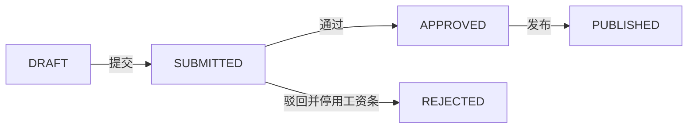

# 工资条审核页

> 路由：`/payroll/review` · 实现：`lib/features/payroll/pages/payroll_review_page.dart` · Phase 3
> 上层：[页面总览](页面总览.md) · 状态机见 [全局机制 §3.4](../05-架构/全局机制.md#34-工资条审批流payrollslip--payrollbatch)

## 一、当前定位

该页是工资批次的统一处理台：按权限显示草稿提交、财务审核、驳回和发布动作，并展示服务器返回的批次汇总与逐人工资明细。页面已接 Dio；后端接口位于 `/api/payroll/batches`。

## 二、当前布局

- 顶部横向批次卡片：月份、范围、状态、人数（批次是横向 Chip 列表，不是表格）。
- 批次摘要卡：应发、扣除、实发合计，以及原批次卡的人数、驳回原因。
- **员工工资明细表（2026-09-09 表格化）**：`MasterDataTableView<PayrollSlip>`
  （`Key('payroll-review-slip-table')`），列：工号 / 姓名 / 应发 / 扣减 / 实发
  （`PayrollSlip` 无部门字段，故不设部门列）；定高内滚（`240–480` 钳制），窄屏横向滚动。
- **明细表只读、不开多选（2026-09-10 下线）**：此前明细表开了多选并给「批量通过(N)」，
  但后端只有整批 `POST /api/payroll/batches/{id}/approve`，勾选 1 条点「批量通过」实际
  **整批通过** —— 语义误导，已删除 `selectable` / `batchActionsBuilder`。
  工资审核只有整批语义，审核入口唯一：底部 `UtenBottomActionBar`。
- 底部操作条按状态与权限动态呈现（提交审核 / 审核通过 / 驳回 / 发布工资条），
  compact 模式使用统一底部操作条；「审核通过」与「驳回」两个确认弹窗均带
  `UtenReviewerResponsibilityNotice`（actionLabel「工资审核」「工资审核驳回」）。
- 当前实现没有 `UtenTimeline`、视角选择器、明细表头筛选或通用 `ApprovalRecord` 轨迹。

### 表格下方合计条：不接，批次摘要卡已经是服务端合计（2026-09-11）

明细表正上方的批次摘要卡已经给出**服务端算好的**员工人数 / 应发合计 / 扣除合计 / 实发合计
（口径 = 整批，不是当页），且本页明细不分页（整批一次下发）。再在表下挂一条
[UtenTotalsSummaryBar](../02-组件库/UtenTotalsSummaryBar.md) 只是把同样三个数重复一遍，
两行之内出现两处「实发合计」反而让人怀疑口径不一致，故不接。

## 三、实际功能与状态机

| 当前状态 | 所需权限 | 可执行动作 | 结果 |
|---|---|---|---|
| `DRAFT` | `payroll:generate` | 提交审核 | `SUBMITTED` |
| `SUBMITTED` | `payroll:review` | 审核通过 | `APPROVED` |
| `SUBMITTED` | `payroll:review` | 填写原因后驳回 | `REJECTED`，批次工资条停用 |
| `APPROVED` | `payroll:publish` | 二次确认后发布 | `PUBLISHED`，员工才可查看 |

`REJECTED` 是终态，不会回到草稿修改；修正时应重新生成新批次。工资条在创建草稿批次时已经生成，发布只改变其状态和可见性。

**待办弹卡（2026-09-09 接入，2026-09-10 补齐；`HrNoticeService`，ADR-063 附录）**：

| 动作 | 行动卡 / 通知 | 接收池（不限部门） | 办结 |
|---|---|---|---|
| 提交审核 | `PAYROLL_BATCH_SUBMITTED`「工资批次待审核」，聚合 PAYROLL_BATCH=batchId，落点本页 | `payroll:review`，制单人除外 | 审核通过 / 驳回 |
| 审核通过 | 先办结上卡（APPROVED），再发 `PAYROLL_BATCH_PENDING_PUBLISH`「工资批次待发布」（同聚合，顺序不能反） | `payroll:publish`，审核人除外 | 发布（PUBLISHED） |
| 驳回 | 办结审核卡 + 制单人普通回执（含原因） | 制单人账号 | — |
| 发布 | 办结待发布卡 + 持条员工逐人「工资条已发布」普通通知（不弹卡，不广播） | 各员工本人 | — |

通知与业务同事务，失败随业务回滚。

## 四、数据与并发

- 实体：`PayrollBatch`、`PayrollSlip`、`PayrollItem`，审批人/驳回人/发布人及时间直接保存在批次字段中。
- 后端状态变更使用悲观行锁；空批次不能提交，发布时还会核对发布条数与批次人数。
- 没有独立的工资 `ApprovalRecord` 表；当前页面也不展示逐节点审批意见。

## 五、边界和待验收项

- 批次列表已使用服务端分页，支持年份、月份、状态、部门筛选和稳定排序；前端显示页码/总页数并按页加载。
- 当前未阻止同一账号同时拥有生成、审核、发布三项权限；是否强制四眼原则需由业务定稿并落库校验。
- 页面可展示服务器结果，但不提供异常金额规则、高亮或单笔修正能力。
- 所有操作必须在线；当前没有离线缓存或离线操作队列。
- 仍需完成 10–20 年数据量下的查询计划/P95、真实 PostgreSQL 全链路、权限矩阵、并发冲突和端到端验收。

---

**最后更新**：2026-09-10（明细表多选下线，整批审核为唯一入口）· **状态**：前后端源码已接通；生产验收未完成
