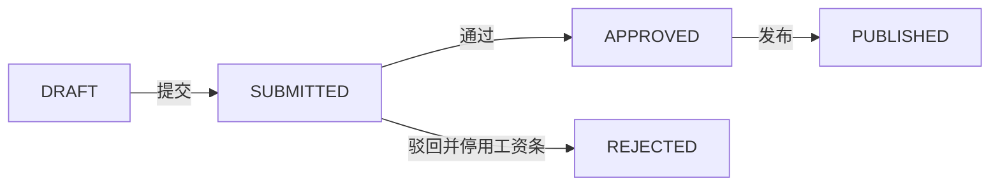

# 工资条审核页

> 路由：`/payroll/review` · 实现：`lib/features/payroll/pages/payroll_review_page.dart` · Phase 3
> 上层：[页面总览](页面总览.md) · 状态机见 [全局机制 §3.4](../05-架构/全局机制.md#34-工资条审批流payrollslip--payrollbatch)

## 一、当前定位

该页是工资批次的统一处理台：按权限显示草稿提交、财务审核、驳回和发布动作，并展示服务器返回的批次汇总与逐人工资明细。页面已接 Dio；后端接口位于 `/api/payroll/batches`。

## 二、当前布局

- 顶部横向批次卡片：月份、范围、状态、人数。
- 详情区：应发、扣除、实发合计，驳回原因和逐人工资明细。
- 底部动作栏按状态和权限动态出现；compact 模式使用统一内容容器。
- 当前实现没有 `UtenTimeline`、视角选择器、列表筛选或通用 `ApprovalRecord` 轨迹。

## 三、实际功能与状态机

| 当前状态 | 所需权限 | 可执行动作 | 结果 |
|---|---|---|---|
| `DRAFT` | `payroll:generate` | 提交审核 | `SUBMITTED` |
| `SUBMITTED` | `payroll:review` | 审核通过 | `APPROVED` |
| `SUBMITTED` | `payroll:review` | 填写原因后驳回 | `REJECTED`，批次工资条停用 |
| `APPROVED` | `payroll:publish` | 二次确认后发布 | `PUBLISHED`，员工才可查看 |

`REJECTED` 是终态，不会回到草稿修改；修正时应重新生成新批次。工资条在创建草稿批次时已经生成，发布只改变其状态和可见性。

## 四、数据与并发

- 实体：`PayrollBatch`、`PayrollSlip`、`PayrollItem`，审批人/驳回人/发布人及时间直接保存在批次字段中。
- 后端状态变更使用悲观行锁；空批次不能提交，发布时还会核对发布条数与批次人数。
- 没有独立的工资 `ApprovalRecord` 表；当前页面也不展示逐节点审批意见。

## 五、边界和待验收项

- 批次列表已使用服务端分页，支持年份、月份、状态、部门筛选和稳定排序；前端显示页码/总页数并按页加载。
- 当前未阻止同一账号同时拥有生成、审核、发布三项权限；是否强制四眼原则需由业务定稿并落库校验。
- 页面可展示服务器结果，但不提供异常金额规则、高亮或单笔修正能力。
- 所有操作必须在线；当前没有离线缓存或离线操作队列。
- 仍需完成 10–20 年数据量下的查询计划/P95、真实 PostgreSQL 全链路、权限矩阵、并发冲突和端到端验收。

---

**最后更新**：2026-07-30 · **状态**：前后端源码已接通；生产验收未完成
