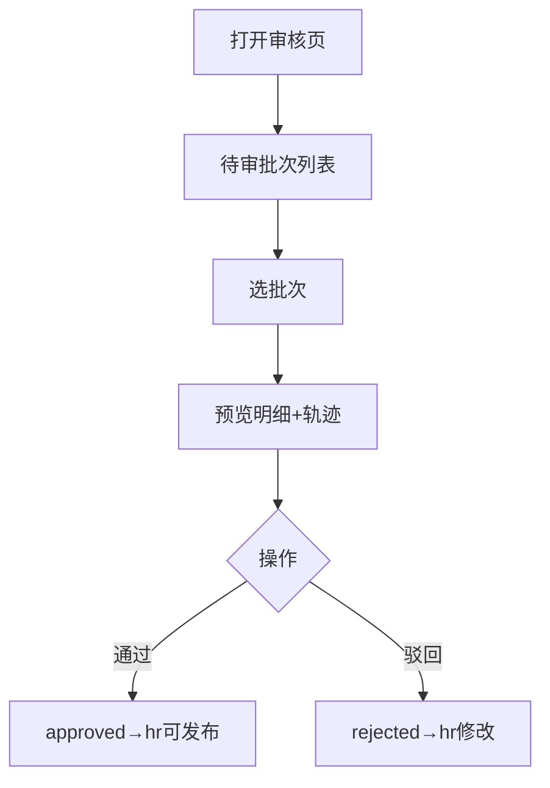

# 工资条审核页

> 路由：`/payroll/review`（计划：`lib/features/payroll/pages/payroll_review_page.dart`）· Phase 3
> 上层：[Phase3-财务端总览](Phase3-财务端总览.md) · 审批流见 [全局机制 §3.4](../05-架构/全局机制.md#34-工资条审批流payrollslip--payrollbatch)

## 一、定位

finance 审核 hr 提交的工资批次：查看明细、核对计算、通过则交回 hr 发布 / 驳回回退。是 [工资条生成页](工资条生成页.md) 的下游审核端。

## 二、入口与导航
- 进入：finance 主导航「工资条审核」；工资条生成提交后通知 finance。
- 离开：通过/驳回后回列表。

## 三、响应式布局

master-detail：左待审批次列表，右选中批次预览 + 轨迹 + 审核栏。

- expanded：
```
┌──────────────┬───────────────────────────────┐
│ 待审批次      │ 2026-07 生产部（选中）         │
│ ●07月 生产部 │ 合计 ¥234,000  48人           │
│ ○07月 质量部 │ 工号 姓名 … 实发（UtenDataTable）│
│ …           │ E001 张三 … 7800              │
│              │ 审核轨迹(UtenTimeline)         │
│              │ ● hr提交 ●财务审核中          │
│              │ 意见[___] [驳回][通过]         │
└──────────────┴───────────────────────────────┘
```
- compact：批次列表 → push 详情。

## 四、涉及的 Uten 组件
`UtenAppBar`（视角选择器）/ `UtenMasterDetail` / `UtenDataTable`（明细预览，锁定工号姓名列）/ `UtenTimeline`（轨迹）/ `UtenInput`（意见）/ `UtenButton` / `UtenBottomActionBar` / `UtenEmpty` / `UtenSkeleton` / `UtenToast`。

## 五、功能点
1. **批次列表**：待我审 / 全部 / 已审；显示月份+部门+人数+合计+状态(submitted/reviewing)。
2. **预览**：`UtenDataTable` 列该批次逐员工明细 + 合计行。
3. **轨迹**：`UtenTimeline`（hr 提交 → 财务审核 → hr 发布）。
4. **审核操作**：
   - 通过：写 ApprovalRecord(approved) → 批次状态→ hr 可发布；员工工资条待发布后可见。
   - 驳回：必填意见 → rejected → 回 hr 修改。
5. **异常项标记**：计算异常/负实发的员工行红色高亮，提示 hr 核对。

## 六、功能链路图


## 七、涉及的数据实体
`PayrollBatch`（批次）/ `PayrollSlip`（明细）/ `PayrollItem` / `ApprovalRecord`(payroll) / `Employee`+`Department`。

## 八、权限要求
- finance（`payroll:review`）/ manager 只读 / admin。
- 数据范围：跟随视角。

## 九、边界情况
- 无待审：`UtenEmpty`「暂无待审核工资批次」。
- 异常项：高亮 + 阻断通过（需 hr 先修正）或允许带说明通过。
- 并发：审核带版本号。
- 网络：预览缓存；审核须在线。
- 性能档 lite：表格去合计动画。

---

**最后更新**：2026-07-22 · **状态**：需求定稿
