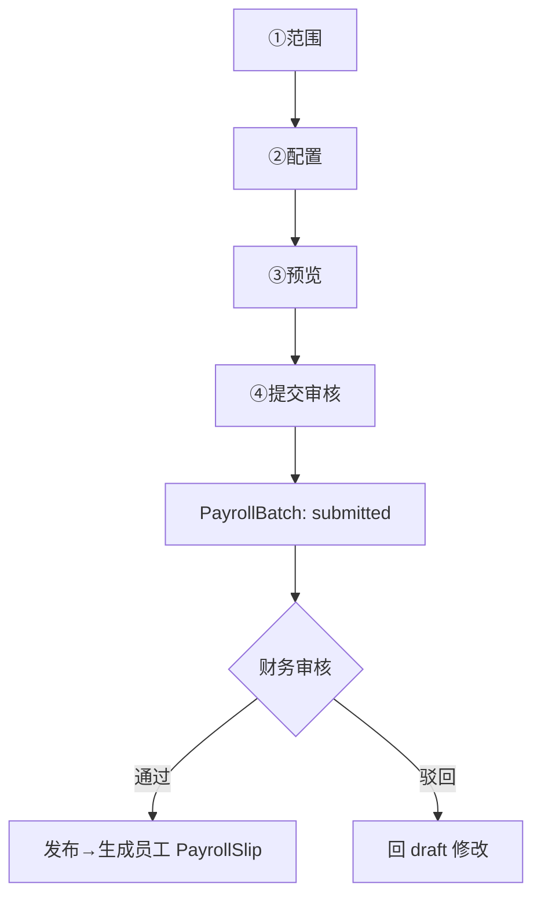

# 工资条生成页

> 路由：`/payroll/generate`（计划：`lib/features/payroll/pages/payroll_generate_page.dart`）· Phase 2
> 上层：[Phase2-人事端总览](Phase2-人事端总览.md) · 审批流见 [全局机制 §3.4](../05-架构/全局机制.md#34-工资条审批流payrollslip--payrollbatch)

## 一、定位

hr 按月生成工资条批次，配置薪酬项后预览计算，提交进入**财务审核**审批流。是工资模块 hr 端的核心。

## 二、入口与导航
- 进入：hr 主导航「工资条生成」；[员工档案](员工列表页.md)（hr 视角）入口。
- 离开：提交审核 → 留本页（状态 submitted）；发布后员工侧出现工资条。

## 三、响应式布局
`UtenWizard` 4 步；预览步骤用 `UtenDataTable`（桌面）/ 卡片（手机）。

- expanded（桌面）：
```
┌──────────────────────────────────────────────┐
│ 工资条生成                [生产部 ▼]          │  ← 视角选择器
│ ①范围 ─ ②配置 ─ ③预览 ─ ④提交                 │
├──────────────────────────────────────────────┤
│ 步骤③预览：                                   │
│ 工号 姓名  基本工资 加班 补贴 扣除 实发         │
│ E001 张三  8000   500  200  900  7800         │  ← UtenDataTable
│ E002 李四  7500   …                           │
│ 合计                     …          ¥234,000  │
├──────────────────────────────────────────────┤
│ [上一步]              [提交审核]               │
└──────────────────────────────────────────────┘
```

## 四、涉及的 Uten 组件
`UtenAppBar` / `UtenViewContextSelector`（选生成范围）/ `UtenWizard` / `UtenDropdown`（月份/部门）/ `UtenSwitch`（启用薪酬项）/ `UtenInput`（金额调整）/ `UtenDataTable`（预览）/ `UtenTimeline`（审批轨迹，提交后）/ `UtenButton` / `UtenConfirmDialog` / `UtenToast`。

## 五、功能点（4 步）

| 步骤 | 内容 |
|---|---|
| ① 范围 | 工资月份（如 2026-07）、生成范围（部门/全员，跟随视角）|
| ② 配置 | 勾选启用薪酬项（基本/加班/绩效/补贴/社保/公积金/个税）、单项全局调整系数 |
| ③ 预览 | `UtenDataTable` 逐员工列明细 + 实发 + 合计行；可微调单格 |
| ④ 提交 | 生成 `PayrollBatch`（draft）→ 提交审核 → 进入财务审核审批流 |

1. **审批流**（见全局机制 §3.4）：`draft → submitted → reviewing(财务) → published / rejected`。
2. **财务审核中**：hr 可看 `UtenTimeline` 轨迹；被驳回 → 回 draft 修改重提。
3. **发布后**：自动给范围内员工生成各自 `PayrollSlip`（员工侧可见，见 [工资条列表页](工资条列表页.md)）。
4. **重复生成防护**：同月同范围已有批次 → 提示覆盖/新建。
5. **导出**：发布后可导出（权限 `payroll:export`）。

## 六、功能链路图


## 七、涉及的数据实体
`PayrollBatch`（批次：月份/范围/状态）/ `PayrollSlip`（发布后生成）/ `PayrollItem`（明细项）/ `ApprovalRecord`（审核轨迹，entityType=payroll）/ `Employee`+`Department`（范围）。

## 八、权限要求
- 生成/提交：`hr` / `admin`（`payroll:generate`）。
- 审核：`finance`（`payroll:review`）—— 在 [工资条审核页](工资条审核页.md)。
- 发布：`hr`（审核通过后 `payroll:publish`）。
- manager 只读。

## 九、边界情况
- 无员工（范围空）：阻断提交，提示「该范围无员工」。
- 薪酬项配置异常（负值）：预览时报错。
- 重复月份：提示选择覆盖（会作废旧批次）或新建。
- 网络：预览数据缓存；提交/发布须在线。
- 性能档 lite：预览表格去合计行动画、去排序。

---

**最后更新**：2026-07-22 · **状态**：需求定稿
