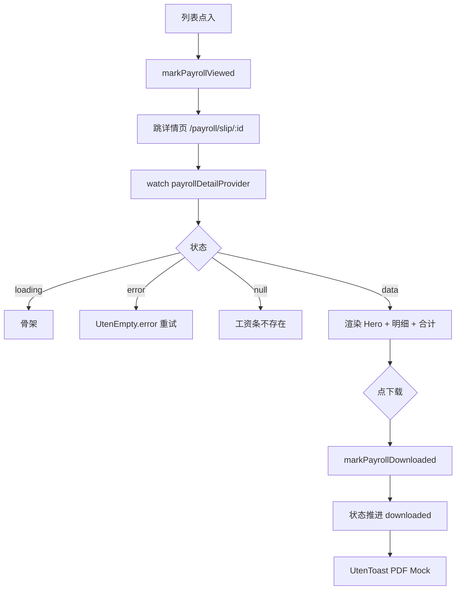

# 工资条详情页

> 路由：`/payroll/slip/:id` · 实现源：`lib/features/payroll/pages/payroll_slip_detail_page.dart`

## 一、定位

员工查看某月工资条的明细页，是工资模块的核心交付物。

- 解决的问题：透明展示应发、扣除、实发明细 + 隐私提醒 + 下载存档。
- 产品位置：从 [工资条列表页](工资条列表页.md) 点入，单向只读页。

## 二、入口与导航

- 进入路径：[工资条列表页](工资条列表页.md) → 点击列表项（同时触发标记已查看）。
- 在导航中的位置：业务详情子页，不在主导航。
- 离开去向：返回 [工资条列表页](工资条列表页.md)；下载按钮触发"已下载"状态。

## 三、响应式布局

- compact（手机，< 600dp）：
  ```
  ┌────────────────────────┐
  │ ← 工资条详情             │
  ├────────────────────────┤
  │ ┌────────────────────┐ │
  │ │   (深绿→青绿渐变)    │ │  ← Hero 卡（实发大金额）
  │ │ 2026年7月    [已查看]│ │
  │ │     实发金额          │ │
  │ │   ¥ 8,234.50         │ │
  │ │ 应发 ¥9k · 扣除 ¥700  │ │
  │ └────────────────────┘ │
  │ ┌────────────────────┐ │
  │ │所属期间   2026年7月  │ │  ← UtenInfoRow
  │ │员工工号   E001       │ │
  │ │发布日期   2026-08-05 │ │
  │ │查看时间   —          │ │
  │ └────────────────────┘ │
  │ ⊕ 应发明细              │
  │ ┌────────────────────┐ │
  │ │基本工资  + ¥ 7000   │ │
  │ │岗位津贴  + ¥ 1500   │ │
  │ └────────────────────┘ │
  │ ⊖ 扣除明细              │
  │ ┌────────────────────┐ │
  │ │社保公积金  - ¥ 500  │ │
  │ │个人所得税 - ¥ 200   │ │
  │ └────────────────────┘ │
  │ = 合计                  │
  │ ┌────────────────────┐ │
  │ │应发 ¥9000/扣除 ¥700 │ │
  │ │实发 ¥8234.50 ★      │ │
  │ └────────────────────┘ │
  │ 🔒 工资信息属于个人隐私 │
  ├────────────────────────┤
  │ [   ⬇ 下载工资条    ]  │  ← 底部固定按钮
  └────────────────────────┘
  ```
  说明：单列滚动，Hero 卡 + 多个 UtenCard 分组 + 底部固定下载按钮。

- medium（平板，600-840dp）：内容居中 600dp 宽，Hero 卡放大。

- expanded（桌面，> 840dp）：可左右分栏，左侧 Hero+概览，右侧明细表格（Phase 2+ 考虑）。

## 四、涉及的 Uten 组件

- `UtenAppBar`（带返回按钮）
- `UtenCard`（多处使用）
- `UtenInfoRow`（标签值行，支持 `isImportant` 高亮、`showDivider` 控制分隔线）
- `UtenStatusBadge`（Hero 状态徽章）
- `UtenButton`（type = primary，isExpanded，带下载图标）
- `UtenEmpty`（数据为空 / error）
- `UtenSkeleton`（加载占位）
- `UtenToast`（成功提示"已生成工资条 PDF"）
- `UtenColors`

## 五、功能点

1. **Hero 大金额卡**：深绿青绿渐变背景 + 阴影，展示所属期间、状态徽章、实发金额（40px 粗体）、应发/扣除摘要。
2. **状态信息卡**：4 个 `UtenInfoRow` 展示所属期间、员工工号、发布日期、查看时间（未查看显示 "—"）。
3. **应发明细**：过滤 `items` 中 `type == earning` 的项，逐项用 `UtenInfoRow` 显示"+ ¥ x.xx"。
4. **扣除明细**：过滤 `type == deduction` 的项，逐项显示"- ¥ x.xx"。
5. **合计卡**：应发合计、扣除合计、实发金额（`isImportant` 高亮）。
6. **备注卡**：若 `slip.remark != null`，渲染 info 图标 + 文本。
7. **隐私声明**：底部 lock 图标 + "工资信息属于个人隐私，请妥善保管，请勿截图外传"。
8. **底部下载按钮**：固定 SafeArea，点击调 `markPayrollDownloaded(ref, slip.id)` → 状态推进到 downloaded → `UtenToast.success`"已生成工资条 PDF（Mock）"。
9. **下拉刷新**：`RefreshIndicator` 重新拉取详情。
10. `AsyncValue.when` 三态：loading 用 `UtenSkeleton`、error 用 `UtenEmpty.error`、null 数据用 `UtenEmpty`"工资条不存在"。

## 六、功能链路图



## 七、涉及的数据实体

→ 见 [04-数据模型/实体字典.md](../04-数据模型/实体字典.md)
- `PayrollSlip`：详情主实体（items / grossIncome / totalDeduction / netIncome / status / publishedAt / viewedAt / downloadedAt / remark）
- `PayrollItem`：每条工资项（type=earning/deduction，name，amount）

## 八、权限要求

- **全员可见**，但只能查看**自己的**工资条（按当前 user 的 employeeId 过滤）。
- 后端必须校验：员工 A 不能通过改 URL 访问员工 B 的工资条 ID。
- 关键操作权限点：标记本人 viewed/downloaded；hr/manager 在 Phase 2 有"重新发布"等管理操作。

## 九、边界情况

- 无数据时：`slip == null` 显示 `UtenEmpty`"工资条不存在"。
- 加载失败时：`UtenEmpty.error` + 重试按钮（`ref.invalidate(payrollDetailProvider(slipId))`）。
- 性能档 = lite 下：Hero 渐变保留但禁用 `boxShadow`，下载按钮去掉 loading 动画。
- 网络断开时：Phase 1 Mock 无影响；后端接入后：
  - 详情页可缓存上次成功结果离线查看。
  - `markPayrollDownloaded` 需支持离线排队，避免状态丢失。
  - PDF 生成必须在线，断网时下载按钮应 Toast 提示"请检查网络后重试"。
