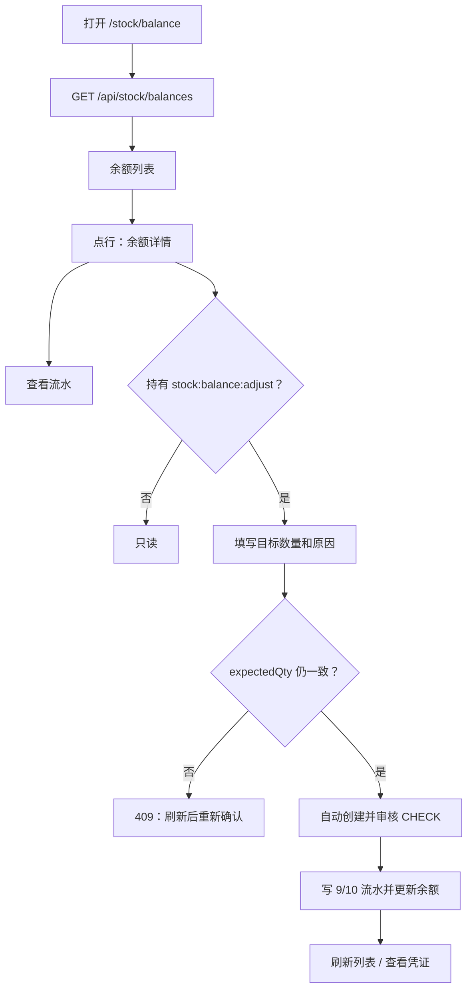

# 库存余额页（库存查询）

> 路由：`/stock/balance`（`lib/features/stock/pages/stock_balance_page.dart`）
> 查看权限：`stock:view` · 高风险调整权限：`stock:balance:adjust`
> 上层：工作台 → PMC 运营部 → 库存查询 · 业务规则：[仓库盘点修正与历史单据处理](../数据迁移/50-仓库盘点修正与历史单据处理.md)

## 一、定位

按“仓库 + 货品 + 颜色”查询当前库存余额，供仓管和 PMC 对账。普通查看人员只能读取余额和流水；
经过明确授权的人员可以在余额详情中填写调整后的最终数量和原因。

页面上的“直接调整”不等于数据库裸改余额。服务端会在同一事务内自动生成并审核一张一行
`CHECK` 盘点单，再写盘盈或盘亏流水，使调整前数量、调整后数量、差额、原因、修改人和时间均可追溯。

## 二、入口与导航

- 进入：工作台 PMC 运营部「库存查询」，或仓库管理相关入口。
- 点击余额行：先打开余额详情，不直接跳离当前列表。
- 详情「查看流水」：`/stock/movement?goodsId=<goodsId>&warehouseId=<warehouseId>`。
- 调整成功后：列表刷新当前页；同时持有 `stock_doc:view` 时，可由成功提示进入
  `/warehouse/CHECK/<documentId>` 记录详情。

## 三、响应式布局

- **compact**：筛选和表格纵向排列；余额详情使用可避开键盘的 90% 高度底部面板。
- **medium / expanded**：左侧仓库筛选、右侧表格；余额详情使用 460px 宽右侧抽屉。
- 列表列为货品、仓库、颜色、数量、库存重量；数量和重量支持服务端排序，且都进入
  「表头设置」可独立显示/隐藏。列表使用服务端分页。

余额详情显示货品、仓库、颜色、当前数量和最后变动时间。无调整权限时仅显示只读说明和
「查看流水」；有权限时额外显示高风险「调整余额」。

## 四、涉及的 Uten 组件

`UtenAppBar` / `UtenBackButton` / `UtenContentContainer.wide` / `UtenListTwoPane` /
`MasterDataTableView` / `UtenButton` / `UtenDialog`。

详情组件：`lib/features/stock/widgets/stock_balance_detail_sheet.dart`。

## 五、查询功能

1. 仓库下拉筛选，未选择时查看全部仓库。
2. 数量/库存重量列升序或降序；取消排序后恢复后端默认的最后变动时间倒序。
3. 后端分页加载，翻页和重试都保留当前仓库与排序条件。
4. 点行打开单一余额维度详情，再按货品和仓库查看对应库存流水。

查询接口：

```http
GET /api/stock/balances?warehouseId=&goodsId=&page=&size=&sort=&order=
Authorization: stock:view
```

`stock_balances.amount_local` 是成本相关事实，不属于 `stock:view`。服务端仅在当前账号同时
持有 `goods:cost:view` 时返回；无权时置 `null + costMasked=true`。流水接口
`/api/stock/movements` 的 `amountLocal` 使用同一口径，即使当前页面没有金额列也不能从 JSON 读取。

## 六、授权余额调整

### 6.1 表单与提交

- 只有 `stock:balance:adjust` 权限持有人看到「调整余额」；前端隐藏之外，控制器和服务层都会再次鉴权。
- 输入的是**调整后的最终库存数量**，不是增减量；必须大于等于 0，最多 4 位小数。
- 目标数量不能与当前数量相同；调整原因必填，最长 500 字。
- 页面实时展示“目标数量 - 当前数量”的本次差额。
- 提交期间禁止关闭、返回和重复提交。

### 6.2 并发与结果

- 请求携带打开详情时看到的 `expectedQty`。服务端取得库存锁后重新读取余额；
  如正常出入库已改变余额，返回 409，拒绝用旧页面覆盖新流水。
- 每次用户操作生成幂等键；网络超时后用同一键重试只返回原结果，不重复生成单据或流水。
- 成功后显示单号、前后数量、差额和修改人；具备凭证查看权限时可进入 `CHECK` 详情。
- 失败时保留目标数量与原因；关闭详情后列表会重新读取当前余额。

调整接口：

```http
POST /api/stock/balances/adjust
Authorization: stock:balance:adjust
Content-Type: application/json

{
  "idempotencyKey": "stock-balance-adjust:...",
  "warehouseId": "<uuid>",
  "goodsId": "<uuid>",
  "colorId": "<uuid-or-null>",
  "expectedQty": 10,
  "targetQty": 7,
  "reason": "周期抽盘，实物少 3 件"
}
```

成功响应包含 `documentId`、`billNo`、`beforeQty`、`afterQty`、`deltaQty`、
`adjustedByEmployeeId`、`adjustedByName`、`adjustedAt`。

错误语义：

- 422：数量、原因或幂等键不合法，或目标数量与当前数量相同；
- 403：未持有独立调整权限；
- 409：余额已变化，或同一幂等键被用于另一笔请求。

## 七、库存与历史边界

- 自动凭证使用 `CHECK`；差额大于 0 写类型 9 盘盈，差额小于 0 写类型 10 盘亏。
- 修改人取服务端当前登录人员，客户端不能传入或覆盖。
- 快捷调整的制单人和审核人都是本次登录操作者；这是“预先授予调整能力”，不是逐笔双人审批。
- 不改货品单位成本，不给盘点单补写金额，也不回算历史成本；数量派生的即时库存展示金额会随数量变化。
- 不修改库存重量、历史订单和有效预占；后续存取货从修正后的余额继续增减。
- 授权调整记录不能编辑或删除；红冲同时要求 `stock_doc:edit` 与 `stock:balance:adjust`。

## 八、功能链路图



## 九、边界情况

- 无余额：显示「暂无库存」；页面不伪造缓存余额。
- 当前入口只挂在已有 `stock_balances` 行上；尚不存在的“仓库 + 货品 + 颜色”组合应走普通 `CHECK` 新建盘点明细。
- 货品 ID 缺失的异常行不开放详情操作。
- 数量为 0 可以作为合法目标；负数、空值、超 4 位小数会被拒绝。
- 相同幂等键同请求可安全回放；相同幂等键不同请求会冲突。
- 前端按钮显隐不是安全边界，直接调用接口仍由后端返回 403。

---

**最后更新**：2026-08-27 · **状态**：重量列与成本字段服务端脱敏已形成工作树源码候选；授权调整、并发保护、幂等与 CHECK 审计闭环保持不变。该状态不等同于目标环境部署或真实岗位 UAT。
