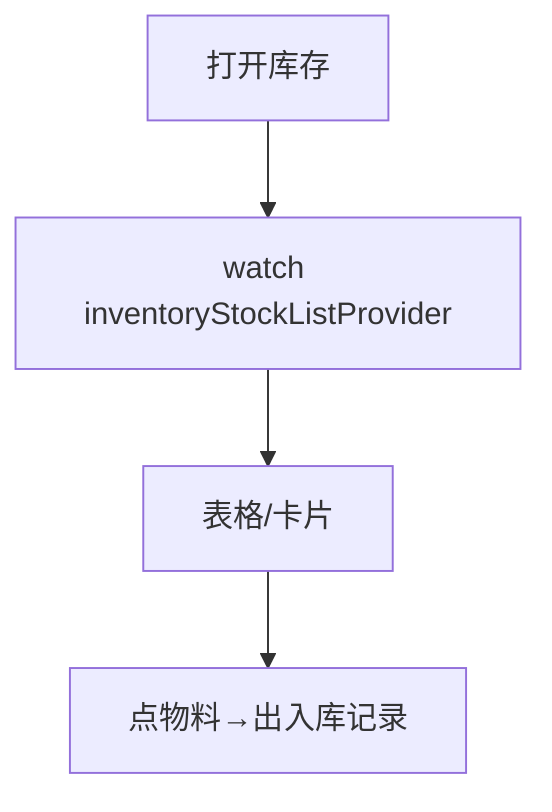

# 库存查询页

> 路由：`/inventory`（计划：`lib/features/inventory/pages/inventory_list_page.dart`）· Phase 4
> 上层：[Phase4-生产实验室总览](Phase4-生产实验室总览.md)

## 一、定位

仓管/生产查询物料（原料/成品）库存余量与预警，是 [出入库记录页](出入库记录页.md) 的入口。

## 二、入口与导航
- 进入：production 主导航「库存查询」。
- 离开：点物料 → 出入库记录（该物料）；低预警 → 采购提示。

## 三、响应式布局
卡片瀑布流（手机）/ DataTable（桌面）。

- expanded：
```
┌──────────────────────────────────────────────┐
│ 库存查询  类型[全部▼] 仓库[全部▼] 🔍  [低预警●] │
├──────────────────────────────────────────────┤
│ 物料编码 名称    类型  仓库  余量   状态        │
│ M001    钢材A   原料 1号库 5.2吨  ✅充足        │  ← UtenDataTable
│ M002    螺丝B   原料 1号库 120   ⚠低位         │
│ M003    成品X   成品 2号库 0     🔴缺货        │
└──────────────────────────────────────────────┘
```

## 四、涉及的 Uten 组件
`UtenAppBar`（类型/仓库筛选+搜索+预警开关）/ `UtenDataTable`（桌面）/ `UtenResponsiveGrid`+`UtenCard`（手机）/ `UtenStatusBadge`（充足 success/低位 warning/缺货 error）/ `UtenSegmentedFilter`（全部/低位/缺货）/ `UtenEmpty` / `UtenSkeletonList`。

## 五、功能点
1. **搜索**：物料编码/名称。
2. **筛选**：类型（原料/成品）、仓库、状态（充足/低位/缺货）。
3. **预警**：低于安全库存 → warning 低位、0 → error 缺货；顶部「低预警」开关只看异常项。
4. 点行 → 该物料出入库记录。

## 六、功能链路图


## 七、涉及的数据实体
`Material`（物料：编码/名称/类型/单位/安全库存）/ `InventoryStock`（余量：物料+仓库+数量）/ `Warehouse`。

## 八、权限要求
- production / manager 只读 / admin。`inventory:view`。

## 九、边界情况
- 无物料：`UtenEmpty`「暂无库存」。
- 性能档 lite：表格去动画。
- 网络：缓存上次余量。

---

**最后更新**：2026-07-22 · **状态**：需求定稿
