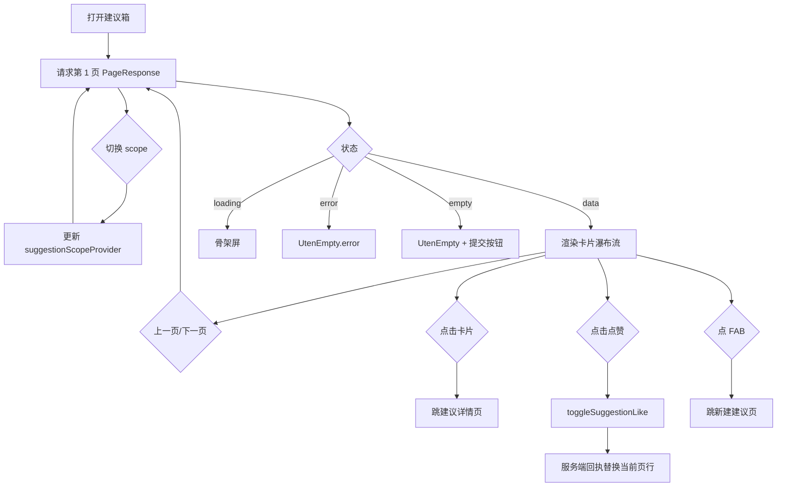

# 建议箱页

> 路由：`/suggestion` · 实现源：`lib/features/suggestion/pages/suggestion_list_page.dart`
> 后端：`server .../features/suggestion/SuggestionController`（`/api/suggestions`，V96 建表）
>
> 本页同时承载"建议广场 + 我的建议"两个视图，新建入口在右下角 FAB。

## 一、定位

员工提建议、看同事建议、点赞互动、跟踪处理结果的统一入口。

- 解决的问题：
  - **建议广场**：浏览全员建议、点赞表态、查看官方回复。
  - **我的建议**：跟踪自己提交的建议处理状态。
  - **提交建议**：通过 FAB 进入 [新建建议页](#与新建建议页的关系)。
- 产品位置：工作台“常用功能 → 建议箱”，是企业文化与员工参与的核心场景。

## 二、入口与导航

- 进入路径：
  - [工作台首页](工作台首页.md) → "建议箱"快捷操作
- 在导航中的位置：工作台功能区（参见[页面总览](页面总览.md#workbench-sections)）。
- 离开去向：
  - 点击列表项 → [建议详情页](#与建议详情页的关系)
  - 右下角 FAB → 新建建议页

## 三、响应式布局

卡片瀑布流布局：列表容器改用 `UtenResponsiveGrid`，每条建议渲染为竖版 `UtenCard`，**列数按父容器实际宽度自适应**（非屏幕宽度）。

| 容器宽度 | 列数 | 典型设备 |
|---|---|---|
| `< 500px` | 1 列 | 手机 |
| `500-800px` | 2 列 | 大屏手机 / 小平板 |
| `800-1100px` | 3 列 | 平板 |
| `1100-1500px` | 4 列 | 桌面 |
| `> 1500px` | 5 列 | 宽屏桌面 |

> 概括：**手机 1 列 / 平板 2-3 列 / 桌面 3-5 列**。在抽屉/分栏展开导致内容区收窄时，列数会随之减少。

- compact（手机，1 列）：
  ```
  ┌────────────────────────┐
  │ ← 建议箱                │
  ├────────────────────────┤
  │ [建议广场][我的建议]     │  ← SegmentedFilter 2 段
  ├────────────────────────┤
  │ ┌────────────────────┐ │
  │ │[产品改进]      [已采纳]│ │  ← 类别 chip + 状态徽章
  │ │ 增加加班申请移动端入口 │ │  ← 标题（最多 2 行）
  │ │ 现在加班只能在 PC...  │ │  ← 正文摘要（2 行）
  │ │ 👤 张**  · 3 天前      │ │  ← 提交人 + 时间
  │ │         💬2  ❤️12      │ │  ← 回复数 + 点赞
  │ └────────────────────┘ │  ← UtenCard（竖版）
  │ ┌────────────────────┐ │
  │ │[流程优化]     [处理中] │ │
  │ │ ...                  │ │
  │ └────────────────────┘ │
  │                ┌──────┐│
  │                │✏提建议││  ← FAB
  │                └──────┘│
  └────────────────────────┘
  ```
  说明：AppBar + 2 段 SegmentedFilter + `UtenResponsiveGrid` 单列卡片瀑布 + 右下角扩展 FAB。

- medium（平板，2-3 列）：同结构，卡片按容器宽度自动排成 2 或 3 列瀑布。

- expanded（桌面，3-5 列）：卡片密度更高，列数随容器宽度自适应；左右分栏（左列表右详情）Phase 2+ 考虑。

## 四、涉及的 Uten 组件

- `UtenAppBar`（带返回按钮）
- `UtenSegmentedFilter` + `UtenSegment`（2 段：建议广场 / 我的建议）
- `UtenResponsiveGrid`（卡片瀑布流容器，按父容器宽度自适应列数）
- `UtenGridPager`（上一页/下一页、当前页、总页数与总条数）
- `UtenCard`（竖版建议卡片）
- `UtenStatusBadge`（submitted/reviewing/resolved/rejected 4 状态徽章，size=small）
- `UtenEmpty`（空态：无建议 / error）
- `UtenSkeletonList`（加载骨架，6 项）
- `UtenButton`（空态下"提交建议"按钮）
- `UtenColors`（点赞激活用 error 色）
- Flutter 原生：`InkWell` + `Material`（卡片内可点击区域）

## 五、功能点

### 5.1 通用
1. `UtenSegmentedFilter` 2 段：建议广场 / 我的建议，切换 `suggestionScopeProvider`；scope
   变化重新请求第 1 页。
2. `FloatingActionButton.extended`（"提建议"）固定右下角，点击跳新建建议页。
3. `RefreshIndicator` 下拉刷新当前页；翻页通过 `UtenGridPager`，Flutter 只保留当前页。
4. `AsyncValue.when` 三态：loading / error（重试）/ data。

### 5.2 空态
- "我的建议"空：`UtenEmpty`（lightbulb + "您还没有提交过建议"）。
- "建议广场"空：`UtenEmpty`（lightbulb + "暂无建议"）。
- 都带居中 `UtenButton`"提交建议"。

### 5.3 建议卡片 `_SuggestionCard`（在 `UtenResponsiveGrid` 内以 `UtenCard` 渲染）
5. **头部**：左侧类别 chip（类别 icon + 类别名 + 类别色背景）、右侧状态徽章。
6. **标题**：粗体，最多 2 行 + ellipsis。
7. **正文摘要**：`bodySmall` 灰色，最多 2 行 + ellipsis。
8. **底部行**：
   - 左：account_circle 图标 + 提交人 `displayName`（匿名时显示 `张**`）+ 相对时间。
   - 右：若 `replyCount>0` 显示 `chat_bubble_outline + N`；点赞区显示
     `favorite/favorite_border + 点赞数`，已点赞变红。列表响应不携带全部回复正文。
9. **点击交互**：
   - 卡片整体点击 → 跳详情。
   - 点赞区点击 → `toggleSuggestionLike(ref, s.id)`；同一建议请求期间防重入，成功后用服务端回执
     原位替换当前页行，不跳回第 1 页。

### 5.4 视图差异
- **建议广场**：返回全员公开建议（匿名建议显示 `displayName`）。
- **我的建议**：仅返回当前用户提交的（含未公开草稿/匿名，自己可见真名）。

## 六、功能链路图



## 七、涉及的数据实体

→ 见 [04-数据模型/实体字典.md](../04-数据模型/实体字典.md)
- `Suggestion`：列表项主实体（category / title / content / status / submitterName / isAnonymous /
  displayName / likes / likedByMe / replyCount；后端表 `suggestions` + `suggestion_likes`）
- `SuggestionCategory`：6 种类别枚举（product / process / welfare / environment / equipment / other）
- `SuggestionStatus`：4 种状态枚举（submitted / reviewing / resolved / rejected）
- `SuggestionReply`：回复数与详情页回复展示（后端表 `suggestion_replies`）

## 八、权限要求

- **suggestion:submit**（employee 全员基础权限包）：广场 / 我的 / 提交 / 点赞。
- **suggestion:reply**：详情页仅对持权用户显示官方回复表单，可选同步推进到
  `reviewing/resolved/rejected`；调用 `POST /api/suggestions/{id}/replies`，`newStatus` 可空。
  `UtenActionButton` 统一防重复提交并展示 loading，失败保留输入。
- 数据范围：
  - 广场：全部建议（时间倒序）。
  - 我的建议：仅当前用户提交的（无论匿名与否，自己看到真名）。
  - **匿名脱敏在服务端统一处理**：匿名建议对「非本人且无 suggestion:reply 权限」的查看者返回 `张**`，且连 submitterId 都不下发（防遍历反查）；前端拿到的已是脱敏结果。

## 九、列表与状态契约

- `GET /api/suggestions?scope=square|mine&category=&page=&size=` 返回
  `PageResponse{items,page,size,total,totalPages}`；页码从 1 开始，`size` 只能为 1–100。
- `scope` 与 `category` 可组合，非法范围/类别直接 422。后端支持 6 类 category 筛选；当前列表 UI
  只暴露“广场/我的” scope，尚未提供类别筛选控件。
- 排序固定为 `submittedAt DESC,id DESC`，避免相同提交时间跨页重复或遗漏。
- 当前页的本人点赞态、点赞数和回复数按页内 ID 批量查询；列表不逐条查聚合，也不加载历史全部回复。
- 状态只能 `submitted → reviewing → resolved/rejected`。省略 `newStatus` 或显式传当前状态表示
  仅补充回复；终态仍可补回复，但不能回退或在 `resolved/rejected` 之间互切。
- 点赞和官方回复都先悲观锁定 `suggestions` 主行。同一建议的并发切换/状态推进按数据库锁顺序串行，
  避免点赞 exists-then-insert 竞态和状态倒退。真实 PostgreSQL 双连接测试已证明第二事务会在
  `suggestions FOR UPDATE` 上等待，释放后两次 toggle 都成功且最终点赞数回到 0。
- V143 为广场、提交人、类别的 `submitted_at DESC,id DESC` 稳定分页和
  `(user_id,suggestion_id)` 点赞页内查询建立 4 个索引，并删除 3 个已被覆盖的旧单列索引。

## 十、边界情况

- 无数据时：`UtenEmpty` + 居中"提交建议"按钮，区分广场和我的两种文案。
- 加载失败时：`UtenEmpty.error` + 重试（`ref.invalidate(suggestionListProvider)`）。
- 点赞幂等：复合主键 (suggestion_id, user_id)，每人每建议最多 1 票，再点取消。
- 分页边界：`page<1`、`size<1` 或 `size>100` 由服务端拒绝；空页仍返回准确 total/totalPages。
- 非法类别/状态、内容不足 10 字：服务端 422 拒绝。
- 性能档 = lite 下：禁用卡片阴影与进场动画，类别 chip 用纯色边框替代。
- 网络断开时（已接真后端，2026-07-29）：
  - 点赞需支持"乐观更新"（先本地 +1，后台异步同步，失败回滚）（待实现）。
  - 提交建议支持离线草稿，恢复网络后自动重试（待实现）。

---

## 与新建建议页的关系

本页 FAB 跳转的目标页是 `lib/features/suggestion/pages/suggestion_new_page.dart`（路由 `/suggestion/new`），文档独立维护时可在 [页面总览](页面总览.md) 中扩展"新建建议"为单独条目。新建页关键点：

- 类别 `ChoiceChip`（6 种）+ 标题（必填）+ 正文（≥10 字）+ 匿名开关。
- 提交按钮调 `submitSuggestion`，成功后 Toast + 跳[建议详情页](#与建议详情页的关系)。

## 与建议详情页的关系

详情页路由 `/suggestion/:id`（`lib/features/suggestion/pages/suggestion_detail_page.dart`），展示完整正文、官方回复列表、点赞按钮，与本页通过卡片点击和返回形成闭环。

## 当前交付边界

- 已实现：广场、我的、提交、详情、点赞、匿名脱敏、回复展示，以及持
  `suggestion:reply` 权限的回复与状态推进 UI；广场/我的已改真实服务端分页，列表使用
  `replyCount`，点赞/回复回执保持当前页。
- 后端请求 DTO 校验标题、正文、回复长度和状态白名单；Java 建议分页/完整性、请求校验和
  权限迁移定向测试共 13/13，含真实 PostgreSQL 双连接并发点赞；Flutter 分页 Provider 与回复仓储
  共 4/4，定向 `flutter analyze` 0 issue。全项目最新空 PostgreSQL 16.14 已完整执行 128 个迁移
  到 V147；建议索引自身位于 V143。
- 待完成：无权限/有权限、分页边界、scope+category、非法状态、超长回复、失败保留输入和
  重复点击的真实 HTTP/E2E；真实高并发回复仍须容量压测，类别筛选 UI 是否属于首发由产品确认。

---

**最后更新**：2026-07-30 · **状态**：定向后端/Flutter/真实 PostgreSQL 并发已通过；真实 HTTP
权限/E2E 与类别筛选产品决策待完成
