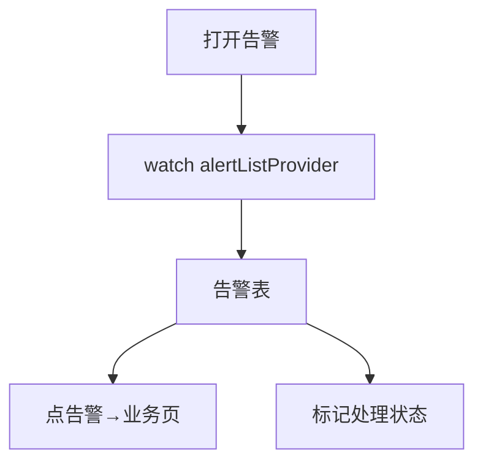

# 异常告警页

> 路由：`/analytics/alerts`（计划：`lib/features/analytics/pages/alerts_page.dart`）· Phase 5
> 上层：[Phase5-管理层总览](Phase5-管理层总览.md)

## 一、定位

管理层跟踪全公司异常告警（产量不达标/库存低位/缺货/设备故障/质量不合格/审批超时），分级处理。

## 二、入口与导航
- 进入：manager 主导航「异常告警」；经营 Dashboard 异常角标。
- 离开：点告警 → 跳对应业务页处理。

## 三、响应式布局
卡片瀑布流（手机）/ DataTable（桌面）。

- expanded：
```
┌──────────────────────────────────────────────┐
│ 异常告警  等级[全部▼] 状态[未处理▼] 类型[▼]    │
├──────────────────────────────────────────────┤
│ 等级 类型     内容            时间      状态    │
│ 🔴高 库存缺货 螺丝B 0件      07-22 09:00 未处理│  ← UtenDataTable
│ 🟡中 质量异常 S002 不合格    07-22 08:30 处理中│
│ 🟢低 审批超时 报销 E003      07-21       已解决│
└──────────────────────────────────────────────┘
```

## 四、涉及的 Uten 组件
`UtenAppBar`（等级/状态/类型筛选）/ `UtenDataTable` / `UtenResponsiveGrid`+`UtenCard` / `UtenStatusBadge`（等级 error/warning/info；状态 pending/processing/resolved）/ `UtenSegmentedFilter`（未处理/处理中/已解决）/ `UtenEmpty` / `UtenSkeletonList`。

## 五、功能点
1. **告警类型**：库存缺货/低位、设备故障/离线、质量不合格、产量不达标、审批超时、合同到期。
2. **分级**：高/中/低，颜色区分。
3. **状态**：未处理 / 处理中 / 已解决。
4. **筛选**：等级、状态、类型、时间。
5. **跳转处理**：点告警 → 对应业务页（库存/检测/设备/审批）。
6. **标记处理**：可标记「处理中/已解决」+ 备注（manager 协调，非直接改业务数据）。
7. **推送**：高级告警后端接入后推送（FCM/极光）。

## 六、功能链路图


## 七、涉及的数据实体
`Alert`（告警：类型/等级/内容/来源实体/状态/处理人/处理时间/备注，新增实体，后续补实体字典）。

## 八、权限要求
- manager / admin。只读 + 标记处理。

## 九、边界情况
- 无告警：`UtenEmpty`「暂无异常告警」🎉。
- 性能档 lite：表格去动画。
- 网络：缓存；高级告警推送不依赖页面打开。

---

**最后更新**：2026-07-22 · **状态**：需求定稿
