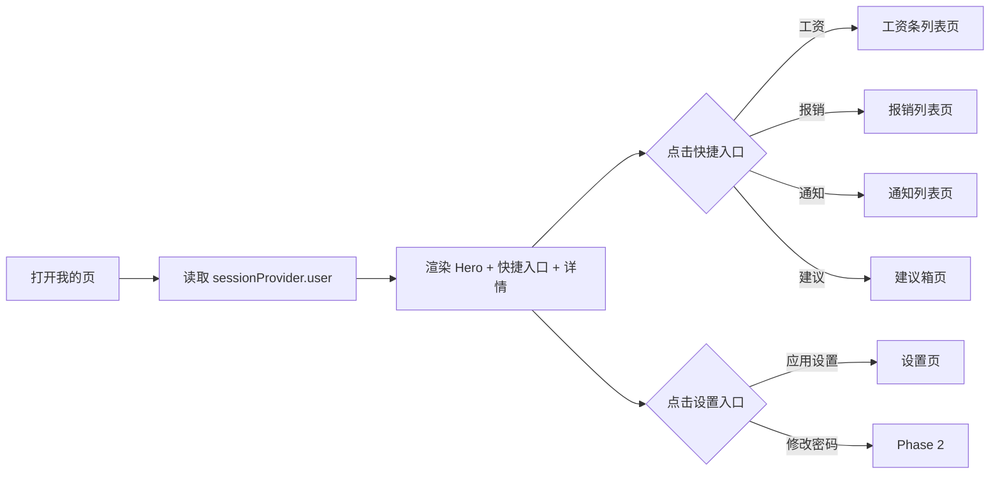

# 我的页

> 路由：`/profile` · 实现源：`lib/features/profile/pages/profile_page.dart`

## 一、定位

给所有员工使用的个人资料中心 + 业务快捷入口。

- 解决的问题：查看自己的姓名/工号/部门/岗位/角色，快速跳到本人相关业务（工资/报销/通知/建议），入口聚合到设置/改密/帮助。
- 产品位置：次导航项，与 [工作台首页](工作台首页.md) 形成"业务入口 ↔ 个人中心"对照。

## 二、入口与导航

- 进入路径：
  - 底部/侧边导航"我的"项
  - [工作台首页](工作台首页.md)（部分场景通过其他入口跳入）
- 在导航中的位置：**次导航项**（参见 [页面总览](页面总览.md#32-导航分组按角色)）。
- 离开去向：
  - 快捷入口 → [工资条列表页](工资条列表页.md) / [报销列表页](报销列表页.md) / [通知列表页](通知列表页.md) / [建议箱页](建议箱页.md)
  - "应用设置" → [设置页](设置页.md)
  - "修改密码 / 帮助与反馈"（Phase 2+ 实现）

## 三、响应式布局

- compact（手机，< 600dp）：
  ```
  ┌────────────────────────┐
  │ UtenAppBar 我的         │
  ├────────────────────────┤
  │ ┌────────────────────┐ │
  │ │    👤 (头像)        │ │  ← 渐变 Hero 卡
  │ │    张三             │ │
  │ │ 生产部 · 一线操作工  │ │
  │ │ 工号 E001 | 角色 员工│ │
  │ └────────────────────┘ │
  │ ┌────────────────────┐ │
  │ │💰工资 🧾报销 📢通知 💡│ │  ← 4 等宽快捷入口
  │ └────────────────────┘ │
  │ ┌────────────────────┐ │
  │ │工号         E001   │ │
  │ │部门         生产部  │ │
  │ │岗位         操作工  │ │
  │ │联系电话  138****1234│ │
  │ └────────────────────┘ │
  │ ┌────────────────────┐ │
  │ │应用设置    >        │ │
  │ │修改密码    >        │ │
  │ │帮助与反馈  >        │ │
  │ └────────────────────┘ │
  │ Uten IMP v0.1.0       │
  └────────────────────────┘
  ```
  说明：单列纵向卡片，Hero 卡 + 4 列快捷入口 + 信息详情 + 设置入口。

- medium（平板，600-840dp）：内容居中约 600dp 宽，Hero 卡片可适当放大。

- expanded（桌面，> 840dp）：内容居中最大 720dp，Hero 卡可考虑双栏（头像左、统计右）。

## 四、涉及的 Uten 组件

- `UtenAppBar`
- `UtenCard`（Hero 用户卡 + 快捷入口卡 + 信息详情卡 + 设置入口卡）
- `UtenColors`（深绿/青绿 Hero 渐变）
- `AppLocalizations`（profile 标题/字段标签）

## 五、功能点

1. **Hero 用户卡**：深绿青绿渐变背景 + 头像（默认 `Icons.person_rounded`）+ 姓名 + "部门 · 岗位" + 工号 + 角色统计行（多个角色用 `/` 拼接 displayNameZh）。
2. **快捷入口网格**：4 个等宽瓦片（工资条 / 我的报销 / 公司通知 / 建议箱），每个带圆形彩色图标背景 + 文字，点击 `context.go` 跳转。
3. **信息详情卡**：ListTile 列出工号、部门、岗位、联系电话（脱敏显示 `138****1234`）。
   - 联系电话 ListTile 带 `onTap`，预留 Phase 2 编辑入口。
4. **设置入口卡**：3 个 ListTile：
   - 应用设置（副标题"主题、语言、字号、性能档"）→ [设置页](设置页.md)
   - 修改密码（Phase 2 占位）
   - 帮助与反馈（占位）
5. **页脚**：显示 "Uten IMP v0.1.0 (Phase 1)"。
6. 数据从 `sessionProvider.user` 读取，所有字段 null 安全降级显示 "—"。

## 六、功能链路图



## 七、涉及的数据实体

→ 见 [04-数据模型/实体字典.md](../04-数据模型/实体字典.md)
- `User`：姓名、工号、部门、岗位、联系电话
- `Role`：用户角色列表，渲染为中文显示名

## 八、权限要求

- **全员可见**。
- 数据范围：仅当前登录用户自己的资料（不可见他人）。
- 关键操作权限点：本页只读 + 跳转，无写操作。

## 九、边界情况

- 无数据时：`sessionProvider.user` 为 null 时所有字段降级显示 "—"，不崩。
- 加载失败时：session 异常情况下应已被路由守卫踢回 [登录页](登录页.md)；本页假设 user 已存在。
- 性能档 = lite 下：Hero 卡的 `boxShadow` 关闭，渐变仍保留但禁用模糊滤镜。
- 网络断开时：本页只读 session 内存数据，无网络依赖。后端接入"修改密码/编辑联系电话"时需在线失败 Toast 提示。
