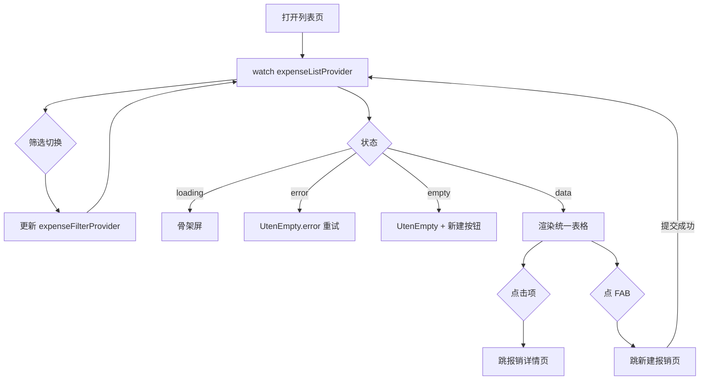

# 报销列表页

> 路由：`/expense` · 实现源：`lib/features/expense/pages/expense_list_page.dart`

## 一、定位

员工管理自己报销单的列表入口。

- 解决的问题：按状态查看所有报销单（草稿/处理中/已完成），快速跳到详情或新建。
- 产品位置：工作台“常用功能 → 我的报销”，是 [新建报销页](新建报销页.md) 和 [报销详情页](报销详情页.md) 的枢纽。

## 二、入口与导航

- 进入路径：
  - [工作台首页](工作台首页.md) → "我的报销"快捷操作
  - [新建报销页](新建报销页.md) 提交成功后回跳
- 在导航中的位置：**工作台常用功能**。
- 离开去向：
  - 点击列表项 → [报销详情页](报销详情页.md)
  - 右下角 FAB → [新建报销页](新建报销页.md)

## 三、列表形态：统一表格（2026-09-09 表格化，2026-09-10 表头筛选）

列表主体是全站统一的 `MasterDataTableView<ExpenseClaim>`（`Key('expense-list-table')`），
不再是卡片瀑布流：

| 列 key | 列名 | 说明 |
|---|---|---|
| `title` | 标题 | 报销单标题 |
| `category` | 类别 | 本单全部明细项类别去重、顿号连接 |
| `itemCount` | 明细项数 | number |
| `totalAmount` | 金额 | money，两位小数 |
| `status` | 状态 | 中文 label；**本列带表头筛选** |
| `submittedAt` | 提交时间 | date，无提交时间取创建时间 |
| `progress` | 审批/打款信息 | 驳回原因 / 审批时间 / 打款时间；无进展留空 |

- **表头筛选**：`facets['status']` = 当前分段的状态集（「全部」段 = 六态），
  `onFilterChanged` 把精确状态写入 `expenseStatusFilterProvider` **下推后端 `status` 参数**
  并把顶部分段切到该状态所属段（provider 重建即回第 1 页）；选「所有」清筛选。
  换分段时页面清空状态筛选，两层口径不打架。
- **分页**：表格内置翻页条（含跳页输入），走 `expenseListProvider.goToPage`；
  数据仍是 `/expense-claims/mine?page=&size=&status=` 的服务端分页。
- **无多选批量**：本页是本人视角，写动作只有「提交/撤回/删除草稿」等逐单语义，
  不提供批量（批量审批在 [报销审批列表页](报销审批列表页.md)）。
- 行双击进 [报销详情页](报销详情页.md)；空态仍是「唯一新建入口」口径（空态内按钮，不出 FAB）。
- compact 由页面自套 `UtenContentContainer` 收敛，medium+ 由外壳收敛；窄屏表格横向滚动。

## 四、涉及的 Uten 组件

- `UtenAppBar`（带返回按钮，标题区嵌 `UtenSegmentedFilter`）
- `UtenSegmentedFilter` + `UtenSegment`（4 段：全部 / 草稿 / 处理中 / 已完成）
- `MasterDataTableView`（统一表格：列对齐 + 表头筛选 + 翻页条 + 列显隐/全屏）
- `UtenContentContainer`（compact 宽度收敛）
- `UtenEmpty`（空态：无报销单 / error）
- `UtenSkeletonList`（加载骨架屏，6 项）
- `UtenListCreateAction`（空态按钮 + FAB 唯一新建入口）

## 五、功能点

1. `UtenSegmentedFilter` 4 段状态筛选：全部 / 草稿 / 处理中 / 已完成，切换后把对应状态集合
   下推后端并回到第 1 页，同时清空表头状态筛选。
2. 「状态」列表头筛选：精确到单一状态下推后端，并同步切换顶部分段（见 §三）。
3. `FloatingActionButton.extended`（"新建报销"）固定在右下角，点击 `context.go(RouteName.expenseNew)`。
4. `RefreshIndicator` 下拉刷新 `expenseListProvider.refresh()`。
5. `AsyncValue.when` 三态：loading（骨架）/ error（含重试）/ data。
6. **空态**：`UtenListCreateAction.emptyState`（receipt_long_outlined + "暂无报销单" + 新建按钮），此时不出 FAB。
7. 行双击 → `context.push(RoutePath.expenseDetail(claim.id))`。
8. 列表使用 `/expense-claims/mine?page=&size=&status=` 的服务端分页响应，翻页条显示页码/总页数。

## 六、功能链路图

## 七、涉及的数据实体

→ 见 [04-数据模型/实体字典.md](../04-数据模型/实体字典.md)
- `ExpenseClaim`：列表项主实体（id / title / status / items.length / totalAmount / createdAt）
- `ExpenseClaimStatus`：枚举（draft / submitted / reviewing / approved / rejected / paid）
- 当前没有独立 `ExpenseApproval`/`ApprovalRecord`；审批人、付款人和各时间直接保存在 `ExpenseClaim`

## 八、权限要求

- `expense:apply` 可创建并查看自己的报销，后端按当前员工 `applicantId` 强制过滤。
- `expense:approve` / `expense:pay` 分别进入 [报销审批列表页](报销审批列表页.md) 的待审批/待打款公司队列。
- 权限由权限点决定，不依据固定员工/财务角色名。

## 九、边界情况

- 无数据时：`UtenEmpty` + 居中"新建报销"按钮，引导首次使用。
- 加载失败时：`UtenEmpty.error` 显示错误 + 重试（`ref.invalidate(expenseListProvider)`）。
- 性能档 = lite 下：禁用进场动画，骨架屏简化为纯灰块；表格列宽自适应逻辑不变。
- 当前通过 `DioExpenseRepository` 分页请求 `/expense-claims/mine`，没有离线列表缓存；
  断网时展示统一错误。若后续增加离线草稿，必须加密、按账号隔离并处理提交幂等。

## 2026-09-07 会话与请求代际

我的报销列表和详情绑定当前账号/权限快照；账号或模拟身份切换时清除旧列表并重新读取第一页。
刷新、翻页和筛选统一通过AsyncNotifier的build发起请求，旧响应即使更晚返回也不会覆盖新身份
或新筛选。保存、提交、撤回、审批和付款操作的业务语义与服务端门禁不变。
