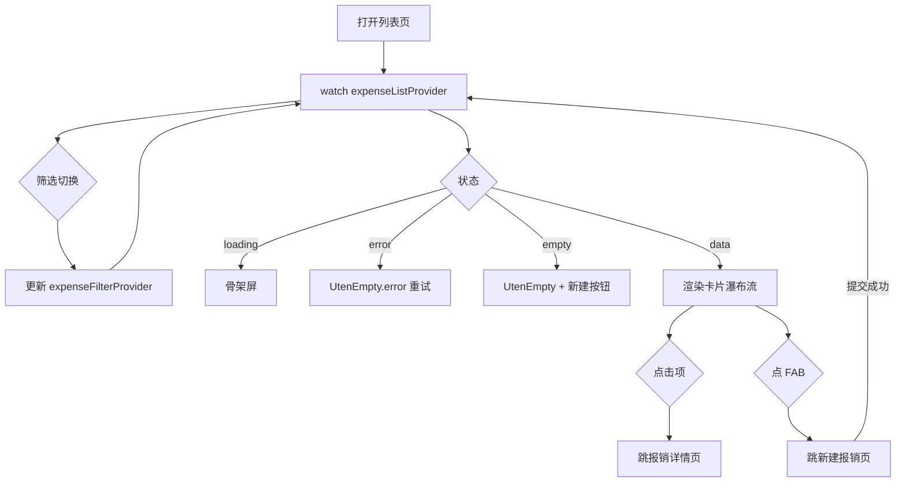

# 报销列表页

> 路由：`/expense` · 实现源：`lib/features/expense/pages/expense_list_page.dart`

## 一、定位

员工管理自己报销单的列表入口。

- 解决的问题：按状态查看所有报销单（草稿/处理中/已完成），快速跳到详情或新建。
- 产品位置：员工主导航"我的报销"项，是 [新建报销页](新建报销页.md) 和 [报销详情页](报销详情页.md) 的枢纽。

## 二、入口与导航

- 进入路径：
  - [工作台首页](工作台首页.md) → "我的报销"快捷操作
  - [我的页](我的页.md) → "我的报销"快捷入口
  - 主导航"我的报销"
  - [新建报销页](新建报销页.md) 提交成功后回跳
- 在导航中的位置：**员工主导航**项。
- 离开去向：
  - 点击列表项 → [报销详情页](报销详情页.md)
  - 右下角 FAB → [新建报销页](新建报销页.md)

## 三、响应式布局

卡片瀑布流布局：列表容器改用 `UtenResponsiveGrid`，每条报销单渲染为竖版 `UtenCard`，**列数按父容器实际宽度自适应**（非屏幕宽度）。

| 容器宽度 | 列数 | 典型设备 |
|---|---|---|
| `< 500px` | 1 列 | 手机 |
| `500-800px` | 2 列 | 大屏手机 / 小平板 |
| `800-1100px` | 3 列 | 平板 |
| `1100-1500px` | 4 列 | 桌面 |
| `> 1500px` | 5 列 | 宽屏桌面 |

> 概括：**手机 1 列 / 平板 2-3 列 / 桌面 3-5 列**。在抽屉/分栏展开导致内容区收窄时，列数会随之减少。

- compact（手机，1 列）：
  ```
  ┌────────────────────────┐
  │ ← 我的报销              │
  ├────────────────────────┤
  │ [全部][草稿][处理中][已完成]│  ← SegmentedFilter
  ├────────────────────────┤
  │ ┌────────────────────┐ │
  │ │ 📝          草稿     │ │  ← 图标 + UtenStatusBadge
  │ │ 上海差旅             │ │  ← 标题
  │ │ 2026-07-15 · 3 项    │ │  ← 副信息
  │ │ ¥ 1,234.50           │ │  ← 总额突出（大字）
  │ └────────────────────┘ │  ← UtenCard（竖版）
  │ ┌────────────────────┐ │
  │ │ 📤         待审批    │ │
  │ │ 办公用品             │ │
  │ │ 2026-07-10 · 2 项    │ │
  │ │ ¥ 560.00             │ │
  │ └────────────────────┘ │
  │                ┌──────┐│
  │                │+新建 ││  ← FloatingActionButton
  │                └──────┘│
  └────────────────────────┘
  ```
  说明：AppBar + 4 段 SegmentedFilter + `UtenResponsiveGrid` 单列卡片瀑布 + 右下角扩展 FAB。

- medium（平板，2-3 列）：同结构，卡片按容器宽度自动排成 2 或 3 列瀑布。

- expanded（桌面，3-5 列）：卡片密度更高，列数随容器宽度自适应；左右分栏（左列表右详情）Phase 2+ 考虑。

## 四、涉及的 Uten 组件

- `UtenAppBar`（带返回按钮）
- `UtenSegmentedFilter` + `UtenSegment`（4 段：全部 / 草稿 / 处理中 / 已完成）
- `UtenResponsiveGrid`（卡片瀑布流容器，按父容器宽度自适应列数）
- `UtenCard`（竖版报销卡片）
- `UtenStatusBadge`（draft/submitted/reviewing/approved/rejected/paid 6 状态徽章）
- `UtenEmpty`（空态：无报销单 / error）
- `UtenSkeletonList`（加载骨架屏，6 项）
- `UtenButton`（空态下的"新建报销"按钮）
- `UtenColors`

## 五、功能点

1. `UtenSegmentedFilter` 4 段状态筛选：全部 / 草稿 / 处理中 / 已完成，切换实时更新 `expenseFilterProvider`。
2. `FloatingActionButton.extended`（"新建报销"）固定在右下角，点击 `context.go(RouteName.expenseNew)`。
3. `RefreshIndicator` 下拉刷新 `expenseListProvider.refresh()`。
4. `AsyncValue.when` 三态：loading / error（含重试）/ data。
5. **空态**：`UtenEmpty`（receipt_long_outlined + "暂无报销单" + 描述"点右下角按钮新建一笔"）+ 居中的 `UtenButton`"新建报销"。
6. 报销卡片 `UtenCard`（在 `UtenResponsiveGrid` 内渲染）：
   - 顶部行：左侧图标（6 状态对应 6 个图标：edit_note / send / pending_actions / check_circle / cancel / account_balance_wallet）+ 右侧 `UtenStatusBadge` 显示状态中文 label。
   - leadingColor：6 状态对应 6 个颜色（slate / info / warning / teal600 / error / success）。
   - 标题：报销单标题。
   - 副信息："创建日期 · N 项"。
   - 总额突出：金额大字显示（primary 色加粗）。
7. 点击卡片 → `context.go(RoutePath.expenseDetail(claim.id))`。

## 六、功能链路图



## 七、涉及的数据实体

→ 见 [04-数据模型/实体字典.md](../04-数据模型/实体字典.md)
- `ExpenseClaim`：列表项主实体（id / title / status / items.length / totalAmount / createdAt）
- `ExpenseClaimStatus`：枚举（draft / submitted / reviewing / approved / rejected / paid）
- `ExpenseApproval`：Phase 3 财务审批后状态才会从 submitted/reviewing 推进

## 八、权限要求

- **全员可见**（所有角色都可提交自己的报销）。
- 数据范围：仅当前登录用户的报销单（按 applicantId 过滤）。财务角色在 Phase 3 的 [报销审批列表页](报销审批列表页.md) 看全员。
- 关键操作权限点：本页只读 + 跳转新建/详情。

## 九、边界情况

- 无数据时：`UtenEmpty` + 居中"新建报销"按钮，引导首次使用。
- 加载失败时：`UtenEmpty.error` 显示错误 + 重试（`ref.invalidate(expenseListProvider)`）。
- 性能档 = lite 下：禁用卡片进场动画，`UtenResponsiveGrid` 退化为固定单列、卡片间距压缩，骨架屏简化为纯灰块。
- 网络断开时：Phase 1 Mock 无影响；后端接入后：
  - 列表缓存上次成功结果，顶部提示"离线缓存"。
  - 新建报销支持离线草稿（详见 [新建报销页](新建报销页.md)）。
