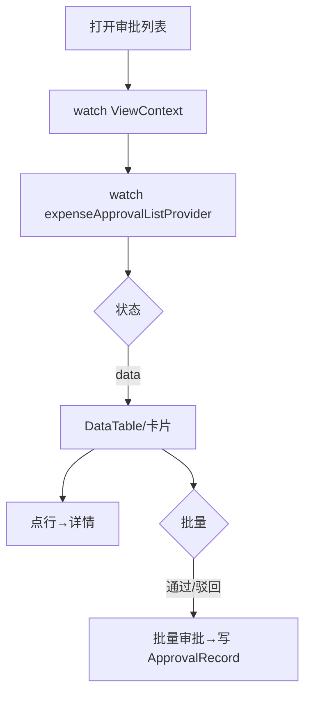

# 报销审批列表页

> 路由：`/expense/approval`（计划：`lib/features/expense/pages/expense_approval_list_page.dart`）· Phase 3
> 上层：[Phase3-财务端总览](Phase3-财务端总览.md) · 审批流见 [全局机制 §3.3](../05-架构/全局机制.md#33-报销审批流expenseclaim)

## 一、定位

finance 处理待审批报销单的入口，支持单条/批量审批，是 [报销审批详情页](报销审批详情页.md) 的枢纽。区别于员工端 [报销列表页](报销列表页.md)（看自己的）。

## 二、入口与导航
- 进入：finance 主导航「报销审批」。
- 离开：点单 → 审批详情；批量审批就地完成。

## 三、响应式布局

跟随视角选择器；卡片瀑布流（手机）+ DataTable（桌面）。

- expanded：
```
┌──────────────────────────────────────────────┐
│ 报销审批                  [全公司▼] 🔍        │
│ [待我审][全部][已审]      [批量通过] [批量驳回]│
├──────────────────────────────────────────────┤
│ ☐ 申请人 标题      金额     提交时间   状态    │  ← UtenDataTable
│ ☐ 张三   上海差旅  ¥1,234  07-15     待审批 ●│
│ ☐ 李四   办公用品  ¥560    07-10     审批中  │
└──────────────────────────────────────────────┘
```
- compact：卡片瀑布（每卡带勾选框 + 金额 + 申请人 + 快捷通过/驳回）。

## 四、涉及的 Uten 组件
`UtenAppBar`（视角选择器+搜索）/ `UtenViewContextSelector` / `UtenSegmentedFilter`（待我审/全部/已审）/ `UtenDataTable`（桌面，可勾选）/ `UtenResponsiveGrid`（手机卡片）/ `UtenCard` / `UtenStatusBadge` / `UtenButton`（批量）/ `UtenEmpty` / `UtenSkeletonList`。

## 五、功能点
1. **视角跟随**：按部门/员工/全公司列出报销。
2. **筛选**：「待我审」（当前节点审批人=我）/ 全部 / 已审。
3. **批量**：勾选多条 → 批量通过/批量驳回（驳回需填统一意见）。
4. **排序**：按金额/提交时间。
5. 点行 → 审批详情。
6. `AsyncValue.when` 三态。

## 六、功能链路图


## 七、涉及的数据实体
`ExpenseClaim`（报销单）/ `ExpenseApproval`→`ApprovalRecord`（审批记录）/ `Employee`（申请人）。

## 八、权限要求
- finance（审批）/ manager（只读）/ admin。权限点 `expense:approve`。
- 数据范围：跟随视角；后端校验审批人身份。

## 九、边界情况
- 无待审：`UtenEmpty`「暂无待审批报销」。
- 批量驳回无意见：阻断，要求填意见。
- 并发：审批带版本号（全局机制 §3.6）。
- 性能档 lite：表格去勾选动画，改逐条审批。
- 网络：列表缓存；审批须在线（不排队，见全局机制 §4）。

---

**最后更新**：2026-07-22 · **状态**：需求定稿
