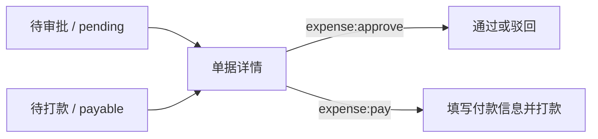

# 报销审批列表页

> 路由：`/expense/approval` · 实现：`lib/features/expense/pages/expense_approval_list_page.dart` · Phase 3
> 上层：[页面总览](页面总览.md) · 状态机见 [全局机制 §3.3](../05-架构/全局机制.md#33-报销审批流expenseclaim)

## 一、当前定位

该页是员工报销的两类工作队列入口：审批人员查看待审批单，付款人员查看已批准待打款单。点击卡片进入 [报销审批详情页](报销审批详情页.md)；员工自己的申请位于 [报销列表页](报销列表页.md)。

## 二、当前实现

- `expense:approve` 显示“待审批”队列，数据来自 `GET /api/expense-claims/pending`。
- `expense:pay` 显示“待打款”队列，数据来自 `GET /api/expense-claims/payable`。
- 同时拥有两项权限时可用分段控件切换；只有一项权限时默认进入对应队列。
- 列表使用服务端分页响应 `{items,page,size,total,totalPages}`；`UtenPagedGrid` 展示当前页，页码控件负责上一页/下一页。卡片展示申请人、标题、状态、项目数、提交时间和金额。
- 当前没有视角选择器、搜索、排序、批量审批、快捷审批或“全部/已审”队列。

## 三、数据与权限

- 核心实体是 `ExpenseClaim` 和 `ExpenseClaimItem`；申请人姓名与部门在创建时保存快照。
- 审批队列只包含 `SUBMITTED/REVIEWING`，付款队列只包含 `APPROVED`。
- 权限由 `expense:approve`、`expense:pay` 决定，不再依据固定角色名称。
- 后端禁止申请人审批自己的申请，也禁止申请人给自己打款。

## 四、边界和待验收项

- 后端分页单页最多 100 条，并支持年月、部门筛选与稳定排序；前端仓储解析总数/总页数，不再用固定 500 条静默截断。
- 当前没有部门/个人数据范围过滤；这是公司级工作队列，是否符合财务职责分工需业务确认。
- 没有批量动作；所有审批与付款逐单处理。
- 列表不做离线缓存或离线队列，网络错误显示重试入口。
- 仍需完成深页/大数据查询计划与 P95、真实 PostgreSQL 并发、权限矩阵与端到端验收。

---

**最后更新**：2026-07-30 · **状态**：前后端源码已接通；生产验收未完成
