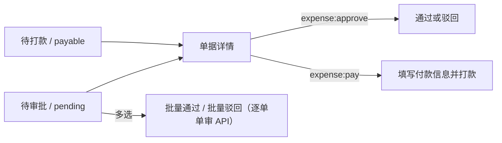

# 报销审批列表页

> 路由：`/expense/approval` · 实现：`lib/features/expense/pages/expense_approval_list_page.dart` · Phase 3
> 上层：[页面总览](页面总览.md) · 状态机见 [全局机制 §3.3](../05-架构/全局机制.md#33-报销审批流expenseclaim)

## 一、当前定位

该页是员工报销的两类工作队列入口：审批人员查看待审批单，付款人员查看已批准待打款单。点击卡片进入 [报销审批详情页](报销审批详情页.md)；员工自己的申请位于 [报销列表页](报销列表页.md)。

## 二、当前实现

- `expense:approve` 显示“待审批”队列，数据来自 `GET /api/expense-claims/pending`。
- `expense:pay` 显示“待打款”队列，数据来自 `GET /api/expense-claims/payable`。
- 同时拥有两项权限时可用 `UtenSegmentedFilter` 切换；只有一项权限时默认进入对应队列。
- **统一表格（2026-09-09 表格化）**：主体是 `MasterDataTableView<ExpenseClaim>`
  （`Key('expense-approval-table')`），列：

  | 列 key | 列名 | 说明 |
  |---|---|---|
  | `applicantName` | 申请人 | |
  | `departmentName` | 部门 | 提交时部门快照；**带表头筛选** |
  | `title` | 标题 | |
  | `totalAmount` | 金额 | money |
  | `yearMonth` | 年月 | 创建月份 yyyy-MM；**带表头筛选** |
  | `status` | 状态 | |
  | `submittedAt` | 提交时间 | date |

- **表头筛选接后端（2026-09-10）**：两列筛选桶来自 `GET /api/expense-claims/facets?queue=pending|payable`
  （按分段状态集全量聚合，**不是当前页聚合**），选中后下推 `departmentId` / `year` / `month`
  并回第 1 页；部门与年月正交，可叠加。
- **多选批量（待审批段）**：`selectable` + `idOf=claim.id`，右下角悬浮
  「批量通过(N)」「批量驳回(N)」；「已选 N 项」只由 `UtenSelectionSummaryPill` 呈现。
  - 批量通过：确认弹窗带 `UtenReviewerResponsibilityNotice`（actionLabel「报销审批」），
    逐单调用 `POST /expense-claims/{id}/approve`（服务端逐单事务 + 悲观锁 + 认领守卫 + 自审拦截）。
  - 批量驳回：公共 `UtenBatchRejectDialog` 一次填原因（内置责任提示、原因必填），
    逐单调用 `/reject` 应用同一原因。
  - 单次上限 50 单（`kExpenseBatchLimit`），超限提示分批；单条失败不中断整批，失败聚合提示。
- **待打款段只读**：打款参数（账户/方式/日期）逐单不同，不支持批量，打款仍在详情页完成。
- 行双击进 [报销审批详情页](报销审批详情页.md)；分页走表格内置翻页条（含跳页）。

## 三、数据与权限

- 核心实体是 `ExpenseClaim` 和 `ExpenseClaimItem`；申请人姓名与部门在创建时保存快照。
- 审批队列只包含 `SUBMITTED/REVIEWING`，付款队列只包含 `APPROVED`。
- 权限由 `expense:approve`、`expense:pay` 决定，不再依据固定角色名称。
- 后端禁止申请人审批自己的申请，也禁止申请人给自己打款。
- **待办弹卡（2026-09-09 接入，2026-09-10 补齐；`HrNoticeService`，ADR-063 附录）**：
  - 提交 → 全体持 `expense:approve` 者（**申请人本人除外**）收 `EXPENSE_CLAIM_SUBMITTED` 行动卡
    （聚合 EXPENSE_CLAIM=claimId，落点本页）；该卡登记 `EXPENSE_APPROVE` 认领类型
    （targetKey=claimId，与 `ExpenseClaimService.approve` 的 `taskClaim` 守卫同键），
    他人正在详情页认领时弹窗显示「XX 正在审核」。
  - 审批通过 → **先办结审批卡（APPROVED_TO_PAY）再**给全体持 `expense:pay` 者（申请人除外）发
    `EXPENSE_CLAIM_PENDING_PAYMENT` 待打款卡（两卡同聚合，顺序反了新卡会被一起撤掉）；申请人收
    普通回执。驳回/撤回办结审批卡并回执申请人；打款办结全部报销卡并回执申请人。
  - 接收池按职能权限判定、不限部门；通知与业务同事务，失败随业务回滚。

## 四、边界和待验收项

- 后端分页单页最多 100 条，并支持年月、部门筛选与稳定排序；前端仓储解析总数/总页数，不再用固定 500 条静默截断。
- 表头筛选桶来自 `/expense-claims/facets`（部门 + 年月，按队列状态集聚合），不是当前页裁剪。
- 当前没有部门/个人数据范围过滤；这是公司级工作队列，是否符合财务职责分工需业务确认。
- 批量动作 = 前端循环单审 API（无后端批量端点），服务端逐单独立事务把关；单次上限 50 单。
  付款仍逐单处理（参数不同）。
- 列表不做离线缓存或离线队列，网络错误显示重试入口。
- 仍需完成深页/大数据查询计划与 P95、真实 PostgreSQL 并发、权限矩阵与端到端验收。

---

**最后更新**：2026-09-10（统一表格 + 表头筛选接后端 + 批量通过/驳回与审核责任提示）· **状态**：前后端源码已接通；生产验收未完成
