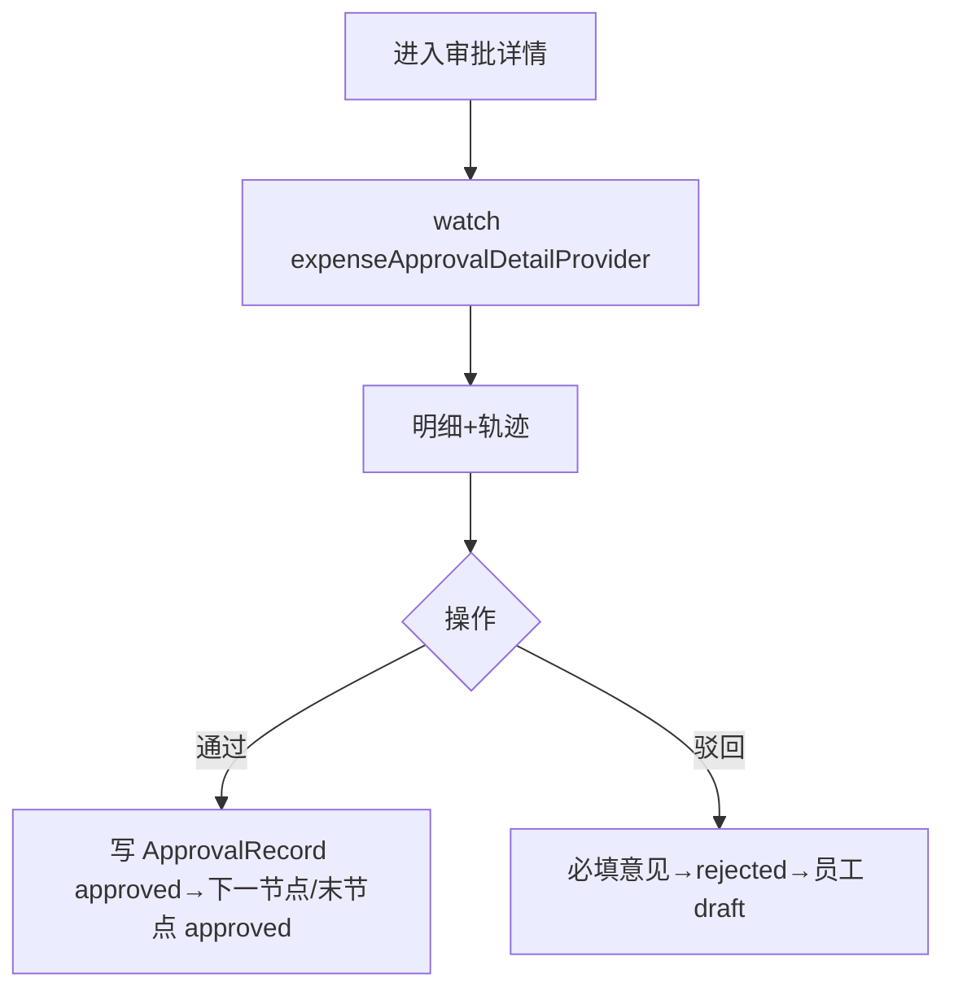

# 报销审批详情页

> 路由：`/expense/approval/:id`（计划：`lib/features/expense/pages/expense_approval_detail_page.dart`）· Phase 3
> 上层：[Phase3-财务端总览](Phase3-财务端总览.md)

## 一、定位

finance 审阅单笔报销明细 + 审批轨迹，做出通过/驳回决定。员工端只读版见 [报销详情页](报销详情页.md)。

## 二、入口与导航
- 进入：[报销审批列表页](报销审批列表页.md) 点行。
- 离开：通过/驳回后回列表。

## 三、响应式布局
- compact：单列滚动，Hero 总额 + 申请人信息 + 明细 + 轨迹 + 底部审批栏。
- expanded：可分栏，左明细右审批轨迹。

```
┌────────────────────────┐
│ ← 审批详情              │
├────────────────────────┤
│ ┌────────────────────┐ │
│ │ 报销总额 ¥1,234.50  │ │  ← Hero
│ │ [待我审批]           │ │
│ └────────────────────┘ │
│ 申请人 张三(E001) 生产部 │
│ 提交 2026-07-15         │
│ 报销明细               │
│  🚗交通 ¥150 07-15      │
│  🍽餐饮 ¥300 07-15      │
│ 审批轨迹               │
│  ● 提交 张三 07-15      │  ← UtenTimeline
│  ● 主管 李主管 ✅ 同意   │
│  ◉ 财务 ⏳待审批（我）   │
├────────────────────────┤
│ 意见 [______________]   │
│ [驳回]        [通过]     │  ← 底部审批栏
└────────────────────────┘
```

## 四、涉及的 Uten 组件
`UtenAppBar` / `UtenCard` / `UtenInfoRow` / `UtenStatusBadge` / `UtenTimeline`（轨迹）/ `UtenInput`（审批意见，多行）/ `UtenButton`（驳回 ghost/通过 primary）/ `UtenBottomActionBar` / `UtenConfirmDialog` / `UtenToast` / `UtenEmpty`。

## 五、功能点
1. **Hero**：总额 + 当前审批状态徽章。
2. **申请人信息**：姓名/工号/部门/提交时间。
3. **明细**：逐项（类别/金额/日期/说明）。
4. **审批轨迹**：`UtenTimeline` 展示 `ApprovalRecord`，当前 pending 节点高亮（我）。
5. **审批操作**（仅当前节点审批人=我 时启用）：
   - 通过：可选填意见 → 写 ApprovalRecord(decision=approved) → 推进下一节点或末节点→approved。
   - 驳回：必填意见 → decision=rejected → 报销回退员工 draft。
6. 非我的待审节点：审批栏禁用 + 提示「当前由 XX 审批中」。

## 六、功能链路图


## 七、涉及的数据实体
`ExpenseClaim` / `ExpenseItem` / `ApprovalRecord`（expense）/ `Employee`（申请人/审批人）。

## 八、权限要求
- finance（`expense:approve`）/ manager（只读无审批栏）/ admin。
- 仅当前节点审批人可操作。

## 九、边界情况
- 非我待审：审批栏禁用。
- 已审批完：只读 + 轨迹完整。
- 并发：审批带版本号，冲突提示刷新。
- 网络：审批须在线，失败 Toast 重试。
- 性能档 lite：轨迹去连线动画。

---

**最后更新**：2026-07-22 · **状态**：需求定稿
