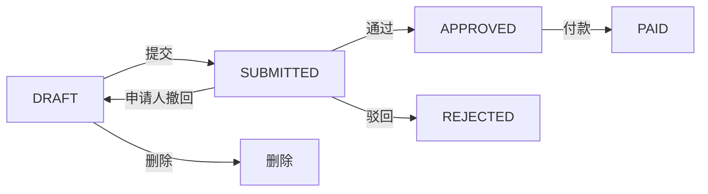

# 报销审批详情页

> 路由：`/expense/approval/:id` · 实现：`lib/features/expense/pages/expense_approval_detail_page.dart` · Phase 3
> 上层：[Phase3-财务端总览](Phase3-财务端总览.md)

## 一、当前定位

页面展示员工报销申请、明细、状态时间线，并按权限和状态提供通过、驳回或打款。员工自己的只读/撤回页面见 [报销详情页](报销详情页.md)。

## 二、当前布局与组件

- `UtenContentContainer.narrow` 单列布局：金额 Hero、申请信息、明细、审批时间线、操作区。
- `SUBMITTED/REVIEWING` 且有 `expense:approve` 时显示通过/驳回；驳回原因必填，通过时输入框内容不会提交。
- `APPROVED` 且有 `expense:pay` 时显示不可点击遮罩外关闭的付款对话框，必须选择有效账户、`EXPENSE` 费用类别和不晚于当天的付款日期。
- 当前“审批轨迹”是 Flutter 根据 `createdAt/submittedAt/approvedAt/rejectedAt/paidAt` 与驳回原因合成的 `_ApprovalTimeline`，不是持久化的通用 `ApprovalRecord`，也不记录多级节点意见。

## 三、实际状态与会计副作用

- 审批目前是单阶段：`SUBMITTED/REVIEWING → APPROVED` 或 `REJECTED`；`REVIEWING` 已预留，但没有推进多级审批节点的接口。
- 驳回不会自动回到草稿；它是 `REJECTED` 终态。
- 付款服务锁定报销单和付款账户；验证账户启用、费用类别属于 `EXPENSE`，在同一事务中扣减余额、生成一般费用单、对账记录和总账凭证，然后标记 `PAID`。
- 重复提交相同付款参数返回已有结果；已付款后改用不同参数会冲突，事务任一步失败则整体回滚。

## 四、数据与权限

- 实体：`ExpenseClaim`、`ExpenseClaimItem`；审批人、付款人、时间、付款账户、费用类别、总账凭证等直接保存在报销单字段。
- `expense:approve`、`expense:pay` 分别控制审批和付款；后端还禁止申请人自审、自付。
- 状态变更使用悲观行锁，并由状态机阻断非法重复动作。

## 五、边界和待验收项

- 当前没有发票或附件上传、预览、防病毒扫描及对象存储能力；若报销制度要求票据留档，必须先补齐。
- 当前没有多级审批、代理审批、审批意见留存或独立审批记录；需由业务确认单阶段是否足够。
- 页面申请信息只显示姓名快照、标题和提交时间，没有展示工号/部门。
- 所有动作必须在线；失败保留页面并提示重试。
- 仍需完成会计口径、权限矩阵、幂等与并发、真实 PostgreSQL 和端到端验收。

---

**最后更新**：2026-07-30 · **状态**：前后端源码已接通；会计与生产验收未完成
