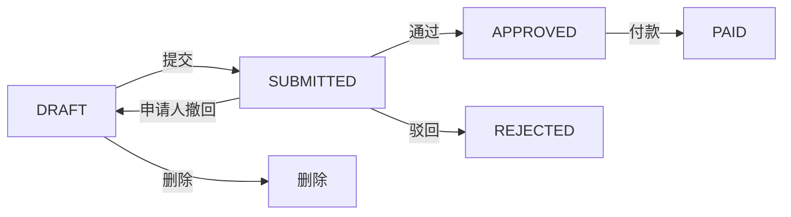

# 报销审批详情页

> 路由：`/expense/approval/:id` · 实现：`lib/features/expense/pages/expense_approval_detail_page.dart` · Phase 3
> 上层：[页面总览](页面总览.md)

## 一、当前定位

页面展示员工报销申请、明细、状态时间线，并按权限和状态提供通过、驳回或打款。员工自己的只读/撤回页面见 [报销详情页](报销详情页.md)。

## 二、当前布局与组件

- `UtenContentContainer.narrow` 单列布局：金额 Hero、申请信息、明细、审批时间线、操作区。
- `SUBMITTED/REVIEWING` 且有 `expense:approve` 时显示通过/驳回；驳回原因必填，通过时输入框内容不会提交。
- `APPROVED` 且有 `expense:pay` 时显示不可点击遮罩外关闭的付款对话框，必须选择有效账户、`EXPENSE` 费用类别和不晚于当天的付款日期。
- 当前“审批轨迹”是 Flutter 根据 `createdAt/submittedAt/approvedAt/rejectedAt/paidAt` 与驳回原因合成的 `_ApprovalTimeline`，不是持久化的通用 `ApprovalRecord`，也不记录多级节点意见。

## 三、实际状态与会计副作用

- 审批目前是单阶段：`SUBMITTED/REVIEWING → APPROVED` 或 `REJECTED`；`REVIEWING` 已预留，但没有推进多级审批节点的接口。
- 驳回不会自动回到草稿；它是 `REJECTED` 终态。
- 付款服务锁定报销单和付款账户；验证账户启用、费用类别属于 `EXPENSE`，在同一事务中扣减余额、生成一般费用单、对账记录和总账凭证，然后标记 `PAID`。
- 重复提交相同付款参数返回已有结果；已付款后改用不同参数会冲突，事务任一步失败则整体回滚。

## 四、数据与权限

- 实体：`ExpenseClaim`、`ExpenseClaimItem`；审批人、付款人、时间、付款账户、费用类别、总账凭证等直接保存在报销单字段。
- `expense:approve`、`expense:pay` 分别控制审批和付款；后端还禁止申请人自审、自付。
- 状态变更使用悲观行锁，并由状态机阻断非法重复动作。

### 4.1 报销附件源码链路（2026-08-09）

- 报销详情已接通附件上传、列表、预览/下载和删除；后端按报销单对象再次校验查看/管理权限，不能只凭 `attachment:view`、附件 ID 或对象 key 越权读取他人票据。
- 短期上传授权绑定当前用户、报销单、对象 key、文件名、声明类型和大小；确认时服务端读取实际对象，校验类型/文件头并计算可信 SHA-256，不能接受客户端自报哈希。
- OSS 模式会把确认时实际校验的 `versionId`/ETag 写入附件元数据；后续内容校验、下载和删除均固定该 `versionId`。生产 `prod`/`cloud` profile 会对非 OSS、未要求版本控制或非 HTTPS endpoint 启动失败。
- 下载不是把长期 OSS URL 存入单据；用户点击时服务端重新做对象级授权，签发短时下载授权并记录审计。

## 五、边界和待验收项

- 上述是源码候选，不等于生产附件基础设施已验收。上线前仍须补 OSS PostPolicy（或等价机制）的服务端 `content-length-range` 硬门禁、staging→扫描→final/隔离状态机、真实 AV/恶意文件隔离、删除 outbox/重试、未确认孤儿对象的配额/清理/对账，以及真实 OSS/CORS/RAM/恢复演练。
- OSS/云端切换前，目标库 `SELECT count(*) FROM attachments WHERE storage_version IS NULL;` 必须为 `0`；否则须隔离或人工核验并回填精确版本，禁止回退到 latest。
- 当前没有多级审批、代理审批、审批意见留存或独立审批记录；需由业务确认单阶段是否足够。
- 页面申请信息只显示姓名快照、标题和提交时间，没有展示工号/部门。
- 所有动作必须在线；失败保留页面并提示重试。
- 仍需完成会计口径、权限矩阵、幂等与并发、真实 PostgreSQL 和端到端验收。

---

**最后更新**：2026-08-09 · **状态**：报销与附件前后端源码候选已接通；会计、真实 OSS/安全门禁与生产验收未完成（NO-GO）
