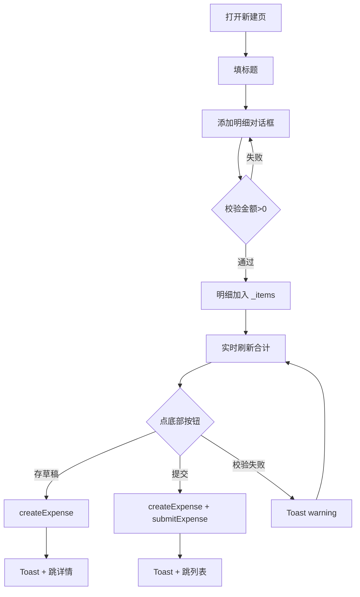

# 新建报销页

> 路由：`/expense/new` · 实现源：`lib/features/expense/pages/expense_new_page.dart`

## 一、定位

员工填写并提交报销单的表单页。

- 解决的问题：录入标题、多项明细（类别/金额/日期/说明）、备注，支持存草稿或直接提交。
- 产品位置：从 [报销列表页](报销列表页.md) 的 FAB 进入，是报销流程的起点。

## 二、入口与导航

- 进入路径：
  - [报销列表页](报销列表页.md) 右下角"新建报销" FAB
  - [报销列表页](报销列表页.md) 空态下的"新建报销"按钮
- 在导航中的位置：业务子页，不在主导航。
- 离开去向：
  - "存草稿" → 创建 draft 单据 → 跳 [报销详情页](报销详情页.md)
  - "提交" → 创建并提交 → 跳回 [报销列表页](报销列表页.md)
  - 返回 → 回 [报销列表页](报销列表页.md)

## 三、响应式布局

- compact（手机，< 600dp）：
  ```
  ┌────────────────────────┐
  │ ← 新建报销              │
  ├────────────────────────┤
  │ ┌────────────────────┐ │
  │ │ 报销标题            │ │  ← UtenInput
  │ │ 如：上海客户拜访差旅 │ │
  │ └────────────────────┘ │
  │ 报销明细 (2)      + 添加│
  │ ┌────────────────────┐ │
  │ │🚗 交通  ¥150.00  ✕  │ │  ← 明细项卡
  │ │   2026-07-15 · 客户A│ │
  │ └────────────────────┘ │
  │ ┌────────────────────┐ │
  │ │🍽 餐饮  ¥300.00  ✕  │ │
  │ └────────────────────┘ │
  │ ┌────────────────────┐ │
  │ │ 备注（可选）         │ │  ← UtenInput 多行
  │ │ 补充说明...          │ │
  │ └────────────────────┘ │
  ├────────────────────────┤
  │ 合计        [存草稿][提交]│  ← 底部固定栏
  │ ¥ 450.00              │
  └────────────────────────┘
  ```
  说明：AppBar + 单列滚动表单 + 底部固定"合计 + 双按钮"。

- medium（平板，600-840dp）：表单居中约 600dp 宽，明细卡可双列。

- expanded（桌面，> 840dp）：表单居中最大 720dp，明细添加用对话框/侧抽屉替代。

## 四、涉及的 Uten 组件

- `UtenAppBar`（带返回按钮）
- `UtenCard`（标题卡、备注卡）
- `UtenInput`（标题单行 / 备注多行 `maxLines: 3`）
- `UtenButton`（type=ghost "存草稿"、type=primary "提交"，支持 `isLoading`）
- `UtenToast`（warning/success/error 提示）
- `UtenColors`
- Flutter 原生：`AlertDialog`（添加明细）、`ChoiceChip`（类别选择）、`TextFormField`、`showDatePicker`

## 五、功能点

1. **标题输入**：`UtenInput` 单行，placeholder "如：上海客户拜访差旅"。
2. **明细列表**：
   - 标题行显示"报销明细 (N)" + 右侧"添加" TextButton。
   - 空态：虚线占位卡 + "点击右上角添加创建报销项"。
   - 每项卡片：左侧类别彩色图标，中部类别名 + 日期 + 说明，右侧金额 + 删除 IconButton。
3. **添加明细对话框** `_AddItemDialog`：
   - 类别 `ChoiceChip`（交通/住宿/餐饮/办公/通讯/其他），每个带 icon + color。
   - 金额 `TextFormField`（数字键盘 + validator > 0）。
   - 日期 `showDatePicker`（默认今天，限制最近一年）。
   - 说明 `TextFormField`（可选）。
4. **备注**：`UtenInput` 多行，可选。
5. **底部合计栏**：实时计算 `_items` 累加金额，主色加粗显示。
6. **双操作按钮**：
   - "存草稿"（type=ghost）：调 `createExpense` 后跳详情页，Toast "已保存草稿"。
   - "提交"（type=primary，isExpanded）：调 `createExpense` + `submitExpense`，Toast "已提交，等待审批"，跳列表页。
7. **表单校验**：
   - 标题空 → Toast warning"请填写报销标题"。
   - 明细为空 → Toast warning"请至少添加一项报销明细"。
8. **提交中状态**：`_isSubmitting=true` 禁用按钮，避免重复提交。
9. 控制器在 `dispose` 时释放，无内存泄漏。

## 六、功能链路图



## 七、涉及的数据实体

→ 见 [04-数据模型/实体字典.md](../04-数据模型/实体字典.md)
- `ExpenseClaim`：新建后生成（applicantId 取当前 user、status=draft/submitted、totalAmount 由 items 累加）
- `ExpenseItem`：每项明细（category / amount / date / description）
- `ExpenseCategory`：报销类别枚举（交通 / 住宿 / 餐饮 / 办公 / 通讯 / 其他）

## 八、权限要求

- **全员可见**（所有角色都可为自己提交报销）。
- 数据范围：申请人自动绑定为当前登录用户，前端不可改；后端必须再次校验 applicantId 与 token 一致。
- 关键操作权限点：
  - 创建报销（self）
  - 提交报销（self，状态从 draft → submitted）

## 九、边界情况

- 无数据时：明细为空显示占位卡，提示用户添加。
- 加载失败时：`createExpense` / `submitExpense` 失败 → Toast error"提交失败：xxx"，按钮恢复可点，已填表单不丢。
- 性能档 = lite 下：去掉按钮 loading 动画，对话框进场用直切。
- 当前通过 `POST /expense-claims` 创建服务端草稿，再按用户选择调用
  `POST /expense-claims/{id}/submit`；没有离线草稿。创建成功、提交失败时服务端草稿会保留，
  UI 必须提示用户到“我的报销”继续处理，不能自动重复创建。
  - 金额输入需前端校验小数位与上限（如 5 万以上需要拆单或额外审批）。
