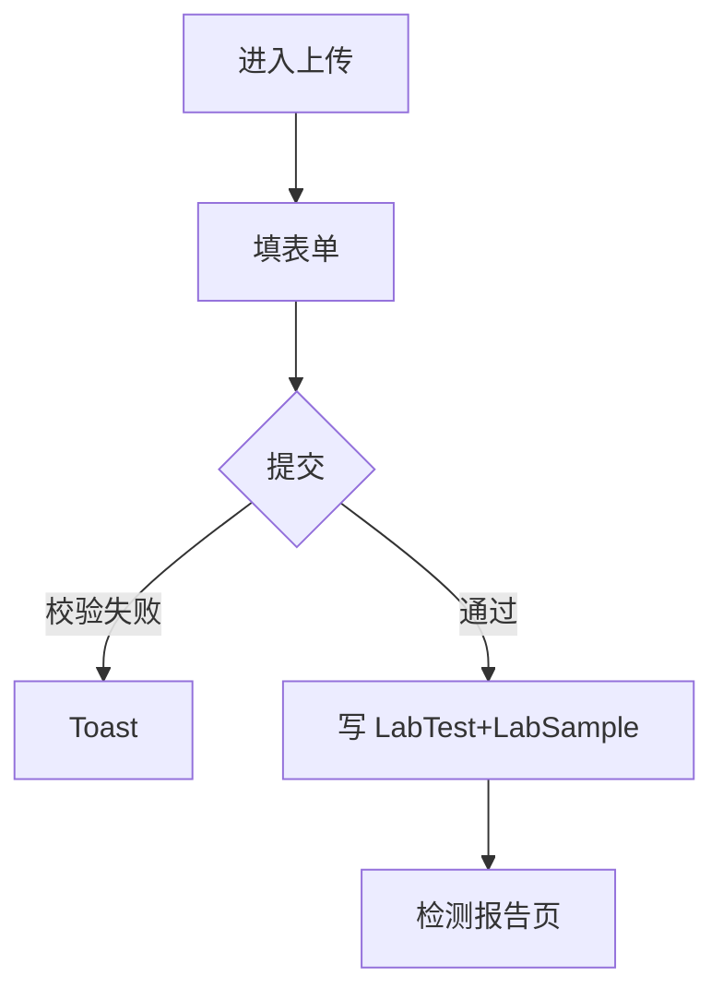

# 检测上传页

> 路由：`/lab/test/upload`（计划：`lib/features/lab/pages/lab_test_upload_page.dart`）· Phase 4
> 上层：[Phase4-生产实验室总览](Phase4-生产实验室总览.md)

## 一、定位

实验室技术员录入/上传一条检测数据（样品+检测项+结果+判定），生成检测记录，可后续出报告。

## 二、入口与导航
- 进入：[检测列表页](检测列表页.md) FAB「+上传」。
- 离开：提交 → 跳检测报告；存草稿 → 留本页。

## 三、响应式布局
- compact：单列表单 + 底部提交栏。
- expanded：内容居中 ≤720dp；expanded 检测项可双列。

```
┌────────────────────────┐
│ ← 上传检测数据          │
├────────────────────────┤
│ 样品信息               │
│  样品编号* [____]       │
│  样品名称* [____] 来源[__]│
│  批次 [____] 送检人 [▼] │
│ 检测项                 │
│  检测项目* [▼多选]      │
│  检测设备 [▼] 检测日期[📅]│
│  检测结果* [____]       │
│  □ 合格                 │
│ 检测员 [____] 备注 [____]│
│ 附件 [📎 上传]          │
├────────────────────────┤
│ [存草稿]      [提交]     │
└────────────────────────┘
```

## 四、涉及的 Uten 组件
当前前端使用 `UtenAppBar`、`UtenContentContainer`、`UtenSectionHeader`、`UtenCard`、
`UtenInput`、`UtenButton` 和 `UtenBottomActionBar`。提交仍写 `MockLabRepository`，不存在
检测后端、附件存储、正式设备字典或生产审计。

## 五、功能点
1. **样品信息**：编号（唯一）/名称/来源/批次/送检人。
2. **检测项**：多选检测项目、设备、日期、结果值、合格判定。
3. **附件**：原始数据/图片上传。
4. **校验**：样品编号+项目必填；同样品同项目同批次查重。
5. 提交 → 生成 `LabTest`+`LabSample` → 跳报告页。

## 六、功能链路图


## 七、涉及的数据实体
`LabTest`（检测记录）/ `LabSample`（样品）/ `LabEquipment`（设备）/ `Employee`（检测员/送检人）。

## 八、权限要求
- lab / admin（`lab:test:upload`）。manager 只读无上传。

## 九、边界情况
- 编号重复：就地报错。
- 网络：草稿本地暂存；提交须在线。
- 性能档 lite：表单去动画。
- 批量导入：Phase 4+ 支持 Excel 批量上传（预留入口）。

---

**最后更新**：2026-07-22 · **状态**：需求定稿
