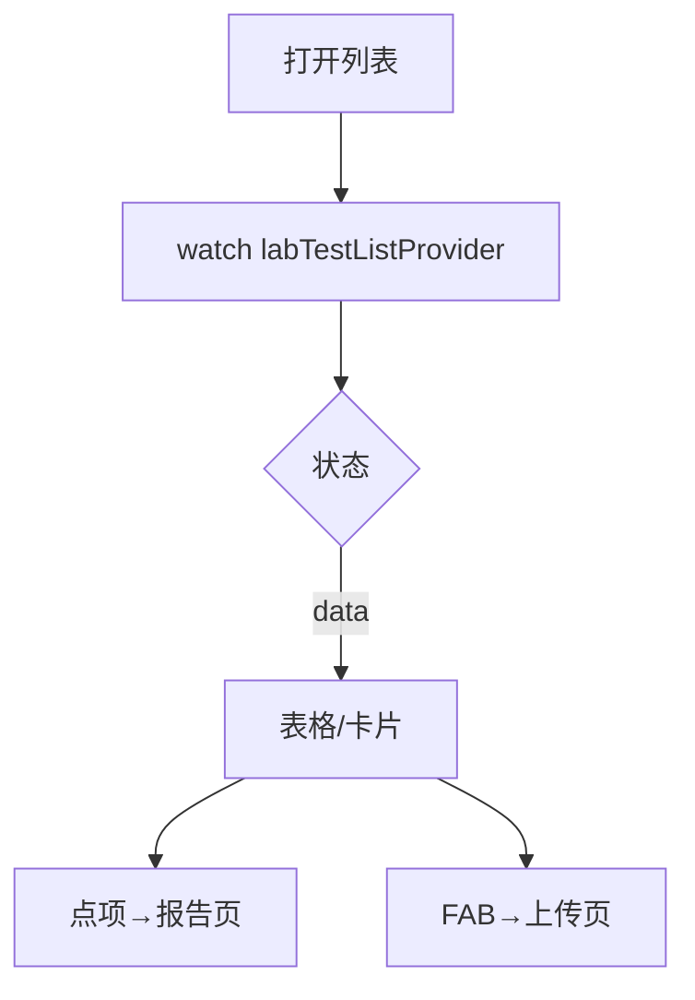

# 检测列表页

> 路由：`/lab/test`（计划：`lib/features/lab/pages/lab_test_list_page.dart`）· Phase 4
> 上层：[Phase4-生产实验室总览](Phase4-生产实验室总览.md)

## 一、定位

实验室浏览所有检测记录，按样品/项目/结果（合格/不合格）筛选，进入报告或上传。

## 二、入口与导航
- 进入：lab 主导航「实验室检测」。
- 离开：点项 → [检测报告页](检测报告页.md)；FAB → [检测上传页](检测上传页.md)。

## 三、响应式布局
卡片瀑布流（手机）/ DataTable（桌面）。

- expanded：
```
┌──────────────────────────────────────────────┐
│ 检测记录     [全部▼][合格][不合格] 🔍   +上传 │
├──────────────────────────────────────────────┤
│ 样品编号  项目    结果   判定   日期          │
│ S001     拉伸强度 320MPa ✅合格 07-15        │  ← UtenPagedGrid 卡片
│ S002     含水率   8.2%   ❌不合格 07-15      │
└──────────────────────────────────────────────┘
```

## 四、涉及的 Uten 组件
当前前端使用 `UtenAppBar`、`UtenSearchBar`、`UtenSegmentedFilter`、`UtenPagedGrid`、
`UtenCard`、`UtenStatusBadge`、`UtenEmpty` 和 `UtenSkeletonList`。数据仍来自
`MockLabRepository`，没有生产后端，分页只作用于演示数据。

## 五、功能点
1. 搜索：样品编号/名称。
2. 筛选：检测项目（下拉）、判定（合格/不合格/待测）。
3. 排序：按日期。
4. 点行 → 报告页。
5. FAB → 上传。

## 六、功能链路图


## 七、涉及的数据实体
`LabTest`（记录）/ `LabSample` / 检测项目枚举。

## 八、权限要求
- lab / manager（只读）/ admin。`lab:test:view`。

## 九、边界情况
- 无数据：`UtenEmpty`「暂无检测记录」+上传按钮。
- 性能档 lite：表格去动画。
- 网络：缓存上次结果。

---

**最后更新**：2026-07-22 · **状态**：需求定稿
